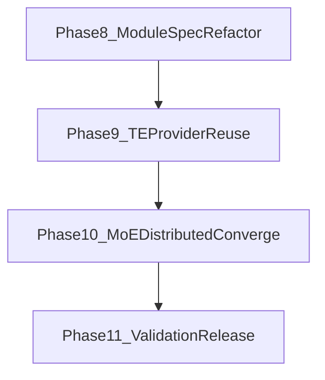

# 00 — DeepSeek-V4 Phase 8+ Roadmap (v2)

> This roadmap starts after the first bring-up line (Phase 1-7).
> It targets architecture convergence (`ModuleSpec`) and runtime performance
> convergence (`TESpecProvider` reuse) without changing `third_party/`.

## Objectives

| Objective | What success looks like |
|---|---|
| Restore spec-driven architecture | V4 decoder is built from V4 `ModuleSpec` chain, not from post-init decoder swap |
| Reuse TE runtime path where applicable | Norm/linear/MoE expert path can select TE-backed modules by provider |
| Align with Megatron MoE parallel patterns | Dispatcher/EP integration replaces temporary routed-output all-reduce pattern |
| Raise release confidence | Functional, numerical, distributed, and performance gates are explicitly tracked |

## Phase Overview

| # | Phase | Type | Key Deliverables | Exit Criteria |
|---|---|---|---|---|
| **8** | ModuleSpec main-path refactor | architecture | V4 layer/block/mtp spec topology; model init no longer depends on decoder swap for runtime | `transformer_layer_spec` directly builds and runs V4 decoder path |
| **9** | TE provider reuse integration | performance architecture | `DeepSeekV4SpecProvider` (inherits `PrimusTurboSpecProvider`) + V4 spec wiring for norm/linear/MoE expert paths | V4 runtime specs are provider-driven through a single provider class with executable TE/local A/B path |
| **10** | MoE + distributed convergence | distributed integration | Hash/learned router dispatch integration with Megatron dispatcher + EP semantics | 1x8 and PP/EP smoke run with no autograd warning regressions in MoE path |
| **11** | Validation + release gates | quality / release | Regression matrix, convergence checks, throughput comparison, release checklist | All mandatory gates pass and blockers are documented |

## Dependency Graph

## Milestones

| Milestone | Scope | Phases |
|---|---|---|
| **R0: Replan locked** | `plan-1` documents + `status.md` Phase 8+ tracking section in place | bootstrap |
| **R1: Spec architecture aligned** | V4 runtime decoder path is spec-driven | P8 |
| **R2: TE baseline aligned** | TE-backed modules integrated with controlled fallback | P9 |
| **R3: Distributed MoE aligned** | EP/dispatcher path converged and stable in smoke | P10 |
| **R4: Release ready** | Regression + convergence + perf gates pass | P11 |

## Constraints

- Primus extension rule remains unchanged: all implementation under `primus/`, no
  direct modifications in `third_party/`.
- Existing `develop/progress/status.md` history is append-only.
- Any temporary compatibility path added during P8-P10 must include a retirement
  condition and owner in documentation.

## Top Risks

| Risk | Impact | Mitigation |
|---|---|---|
| Spec refactor intersects PP/VP behavior | Runtime mismatch and hard-to-debug stage failures | Define shape and ownership contract first; land with targeted integration checks |
| TE integration changes numerics/perf unexpectedly | Regression in convergence or stability | Keep per-module fallback toggles and perform A/B validation by test matrix |
| MoE dispatcher migration breaks hash-router assumptions | Incorrect routing or silent accuracy drift | Freeze deterministic routing test vectors and compare before/after outputs |
| Multiple backends (Megatron-LM vs Bridge compatibility) | Signature/runtime drift | Document supported runtime baseline and add import-path sanity checks |

## Phase 9 Change Plan Snapshot (2026-04-30, provider-inheritance revision)

### Integration Surfaces

- `primus/backends/megatron/core/extensions/transformer_engine_spec_provider.py`
  - Add `DeepSeekV4SpecProvider(PrimusTurboSpecProvider)` as V4-specific provider entry.
- `primus/backends/megatron/core/models/deepseek_v4/deepseek_v4_layer_specs.py`
  - Resolve provider once and build V4 submodule specs via provider methods.
- `primus/backends/megatron/core/models/deepseek_v4/deepseek_v4_block.py`
  - Consume provider-selected submodules while preserving PP/VP ownership logic and custom V4 attention boundaries.
- `primus/backends/megatron/core/models/deepseek_v4/deepseek_v4_model.py`
  - Keep `LanguageModule` runtime path stable; expose selected provider-mode observability.
- `primus/backends/megatron/core/transformer/moe/v4_moe.py`
  - Introduce grouped-GEMM-capable expert compute path with local fallback.

### Component Ownership Matrix (Target)

| Component | Target owner | Notes |
|---|---|---|
| Hybrid attention algorithm (`Dense`/`CSA`/`HCA`) | custom V4 modules | Keep V4-specific compressor/indexer/mask semantics |
| Norm modules | `DeepSeekV4SpecProvider`-selected (`TE` first, local fallback) | reduce `_RMSNorm` footprint where feasible |
| Projection linears | `DeepSeekV4SpecProvider`-selected (`TE`/`Turbo`/local) | preserve TP/shape contracts |
| MoE expert kernel path | `DeepSeekV4SpecProvider` grouped-GEMM path + fallback | retain clamped-SwiGLU semantics |
| Router logic (`Hash`/`V4TopK`) | custom V4 modules | no behavior drift allowed |
