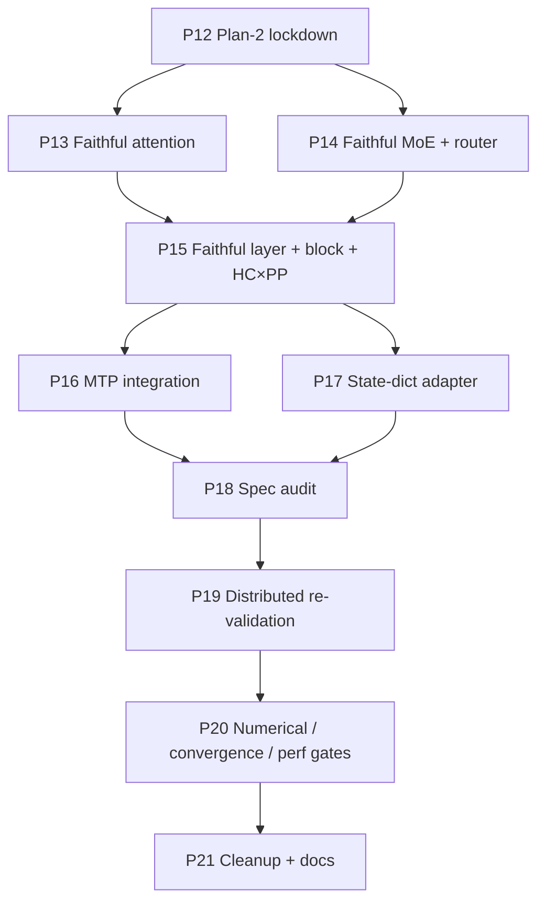

# 01 — Plan-2 Roadmap

> Plan-2 is the **architecture-faithful rewrite**. We keep what plan-0/1
> got right (yaml configs, trainer dispatch, provider class, dispatcher
> integration) and rewrite the modules where the implementation diverged
> from real DeepSeek-V4 or from Megatron's `spec + config + provider +
> submodule + build_module` convention.

## Guiding Principles

| Principle | What it means in practice |
|---|---|
| **MLA-rooted attention** | V4 attention extends `MLASelfAttention` with V4-specific extras (single-latent KV, q_norm, kv_norm, grouped O, sink, optional compressor). |
| **MoELayer-rooted MoE** | V4 MoE extends `MoELayer`; V4Router extends `TopKRouter`; HashRouter is a separate Router that **adds** a learnable gate weight. |
| **TransformerLayer-rooted layer** | V4 hybrid layer extends `TransformerLayer` and replaces only the residual (HC mixing) and attention/FFN selection. |
| **TransformerBlock-rooted block** | V4 block extends `TransformerBlock`. PP, recompute, sequence-parallel, and final-norm placement come for free. |
| **MultiTokenPredictionBlock for MTP** | reuse Megatron's MTP plumbing; retire the standalone V4 MTP block. |
| **Spec is the API** | Every replaceable component (norm, linear, attention impl, expert backend, router, dispatcher, mtp layer) is a `ModuleSpec` submodule. |
| **Checkpoint compatibility is a release gate** | If we cannot load `DeepSeek-V4-Flash` weights, we do not ship. |
| **Numerical alignment is a release gate** | Token-0 logits must match the HF reference within 1e-2 on a 4-layer toy model. |

## Phase Overview

| # | Phase | Type | Key Deliverables | Exit Criteria |
|---|---|---|---|---|
| **P12** | **Architecture review and lockdown** | bootstrap | This plan; archived plan-1; review notes | plan-2 docs landed; status.md tracking section open |
| **P13** | **Faithful attention** | core | V4Attention rooted on `MLASelfAttention`; q_norm + kv_norm; single-latent KV; grouped low-rank O; sink as a submodule; compressor / indexer expressed via spec | Forward output matches HF reference within 1e-3 on a 1L toy model; TP shards Q/O properly |
| **P14** | **Faithful MoE + activation + router** | core | V4Router (learnable gate, sqrtsoftplus / sigmoid / softmax + bias); V4HashRouter (learnable gate × static `tid2eid`); pre-mul clamped SwiGLU with separate `w1`/`w3`; `DeepseekV4MoE` rooted on `MoELayer` | Routing weights gradient-checked; HF reference token-0 logits within 1e-3 on 1L toy after MoE swap |
| **P15** | **Faithful layer + block + HC × PP** | core | `DeepseekV4HybridLayer` extends `TransformerLayer` with HC residuals; `DeepseekV4TransformerBlock` extends `TransformerBlock`; HC `[B,S,K,D]` carried across PP via lift/lower helpers; `HyperHead` only on last PP stage | PP=1, PP=2, PP=4 all produce identical token-0 hidden state on a 4L toy; loss curve matches PP=1 within 1e-4 for 50 iters |
| **P16** | **MTP integration** | core | Wire `MultiTokenPredictionBlock` for `mtp_num_layers > 0`; retire `DeepseekV4MTPBlock` (or move under research/) | `mtp_num_layers=1` runs end-to-end; MTP loss appears in train log |
| **P17** | **State-dict adapter + checkpoint load** | quality | Adapter mapping HF / inference checkpoint keys → Primus tensor names; load script for V4-Flash; CPU forward parity check | Loading `DeepSeek-V4-Flash/main_model.safetensors` into the Primus model produces logits matching HF reference within 1e-2 on token-0 |
| **P18** | **Spec-system audit** | hygiene | All replaceable modules expressed as `ModuleSpec`; provider singleton threaded; activation_func returns callable; YAML schema fields normalized | `pytest tests/configs/test_deepseek_v4_yaml.py` green; no eager construction inside `__init__` for spec-replaceable components |
| **P19** | **Distributed re-validation** | distributed | Re-run 1×8 (TP=2 PP=2 EP=2), 1×8 (PP=4 EP=2), 2×8 (DP=2 PP=2 EP=2 TP=2) smokes with the rewritten stack | All combinations reach `iteration 50` without hang; loss decreases monotonically; deterministic routing snapshots match plan-1 |
| **P20** | **Numerical / convergence / perf gates** | quality | (a) HF token-0 logits ≤ 1e-2; (b) 200-step short-run convergence vs HF on the same data slice; (c) TE on/off perf comparison; (d) FP8 follow-up plan | Release-ready; gates documented; risks owned |
| **P21** | **Cleanup + docs + handover** | release | Remove dead code (`_RMSNorm` duplicates, custom YaRN, optional MTP block, EP all_reduce fallback); update tech-blog with as-built notes; refresh roadmap timeline | All deprecated paths removed; status.md and progress html refreshed |

## Dependency Graph

P13 and P14 can run in parallel (different modules). P17 depends on P13 +
P14 (since checkpoint shapes depend on the parameter layout we land in
those phases). P15 depends on both because the spec submodules reference
the new attention / MoE classes.

## Milestones (external comms cadence)

| Milestone | Scope | Phases |
|---|---|---|
| **M0: Plan-2 locked** | Plan docs + status.md tracking | P12 |
| **M1: Faithful core modules** | Attention + MoE + Activation match HF reference forward to 1e-3 on 1L toy | P13 + P14 |
| **M2: Faithful layer / block / PP** | TransformerLayer / TransformerBlock subclassing live; HC across PP correct | P15 |
| **M3: MTP + checkpoint** | MTP integrated; V4-Flash safetensors load and forward matches | P16 + P17 |
| **M4: Spec + distributed** | Spec audit clean; multi-axis distributed runs green | P18 + P19 |
| **M5: Release gates** | Numerical + convergence + perf gates pass | P20 |
| **M6: Cleanup** | Dead-code retired; docs current | P21 |

## Top Risks

| Risk | Impact | Mitigation |
|---|---|---|
| `MLASelfAttention` upstream signature drifts between Megatron-LM and Megatron-Bridge | Subclass breaks | Pin a single `MLATransformerConfig`-compatible upstream; add an import-path sanity check; cover both via CI smokes |
| HC × PP redesign requires changes to PP send/recv shape | PP serialization may need a 4D path | Land a `lift_streams_to_seq` / `lower_streams_to_seq` helper that flattens K into the sequence axis at the stage boundary; revisit with a proper 4D PP path in P21 |
| Loading HF safetensors needs FP4 / FP8 weight handling | Adapter is harder than just renaming | Phase the work: (a) BF16 reference checkpoint → BF16 Primus; (b) FP4 / FP8 deferred to a follow-up |
| TP/EP interaction with HC streams is untested | EP reshapes assume `[N, D]` not `[N, K, D]` | Constrain HC math to live inside the layer (collapse before MoE, expand after); never let the dispatcher see K streams |
| Numerical-alignment gate is expensive | Slows down release | Provide a CPU-only 4L config so alignment can be checked without GPU each PR |

## Out of Scope (plan-2)

- **FP4 / FP8 / UE8M0 quantized expert path** — separate plan after release.
- **Long-context (1M tokens) bring-up** — separate plan; needs sequence-parallel + context-parallel co-validation.
- **Inference-only optimizations** (KV cache, dynamic batching) — out of training scope.
- **Distillation / SFT recipes** — handled by a separate plan once training is solid.
