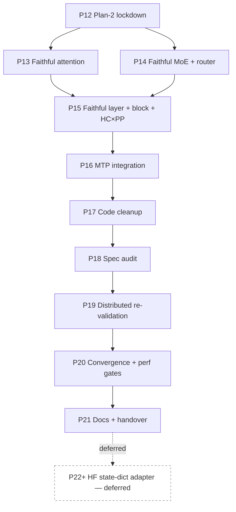

# 01 — Plan-2 Roadmap

> Plan-2 is the **architecture-faithful rewrite**. We keep what plan-0/1
> got right (yaml configs, trainer dispatch, provider class, dispatcher
> integration) and rewrite the modules where the implementation diverged
> from real DeepSeek-V4 or from Megatron's `spec + config + provider +
> submodule + build_module` convention.

## Guiding Principles

| Principle | What it means in practice |
|---|---|
| **MLA-rooted attention** | V4 attention extends `MLASelfAttention` with V4-specific extras (single-latent KV, q_norm, kv_norm, grouped O, sink, optional compressor). |
| **MoELayer-rooted MoE** | V4 MoE extends `MoELayer`; V4Router extends `TopKRouter`; HashRouter is a separate Router that **adds** a learnable gate weight. |
| **TransformerLayer-rooted layer** | V4 hybrid layer extends `TransformerLayer` and replaces only the residual (HC mixing) and attention/FFN selection. |
| **TransformerBlock-rooted block** | V4 block extends `TransformerBlock`. PP, recompute, sequence-parallel, and final-norm placement come for free. |
| **MultiTokenPredictionBlock for MTP** | reuse Megatron's MTP plumbing; retire the standalone V4 MTP block. |
| **Spec is the API** | Every replaceable component (norm, linear, attention impl, expert backend, router, dispatcher, mtp layer) is a `ModuleSpec` submodule. |
| **Pre-training first** | Plan-2 ships a from-scratch pre-training stack. HF-checkpoint load (state-dict adapter + numerical alignment to V4-Flash) is **deferred** to a follow-up plan when SFT / evaluation needs it. |
| **Numerical alignment is a release gate (within Primus)** | Per-module forward agreement with inline HF references (G2 / G3 / G4 / G5) is mandatory; full V4-Flash safetensors round-trip is not blocking for the pre-training release. |

## Phase Overview

| # | Phase | Type | Key Deliverables | Exit Criteria |
|---|---|---|---|---|
| **P12** | **Architecture review and lockdown** | bootstrap | This plan; archived plan-1; review notes | plan-2 docs landed; status.md tracking section open |
| **P13** | **Faithful attention** | core | V4Attention rooted on `MLASelfAttention`; q_norm + kv_norm; single-latent KV; grouped low-rank O; sink as a submodule; compressor / indexer expressed via spec | Forward output matches HF reference within 1e-3 on a 1L toy model; TP shards Q/O properly |
| **P14** | **Faithful MoE + activation + router** | core | V4Router (learnable gate, sqrtsoftplus / sigmoid / softmax + bias); V4HashRouter (learnable gate × static `tid2eid`); pre-mul clamped SwiGLU with separate `w1`/`w3`; `DeepseekV4MoE` rooted on `MoELayer` | Routing weights gradient-checked; HF reference token-0 logits within 1e-3 on 1L toy after MoE swap |
| **P15** | **Faithful layer + block + HC × PP** | core | `DeepseekV4HybridLayer` extends `TransformerLayer` with HC residuals; `DeepseekV4TransformerBlock` extends `TransformerBlock`; HC `[B,S,K,D]` carried across PP via lift/lower helpers; `HyperHead` only on last PP stage | PP=1, PP=2, PP=4 all produce identical token-0 hidden state on a 4L toy; loss curve matches PP=1 within 1e-4 for 50 iters |
| **P16** | **MTP integration** | core | Wire `MultiTokenPredictionBlock` for `mtp_num_layers > 0`; retire `DeepseekV4MTPBlock` (or move under research/) | `mtp_num_layers=1` runs end-to-end; MTP loss appears in train log |
| **P17** | **Code cleanup (dead-code retirement)** | hygiene | Remove `_RMSNorm` duplicates (`block.py`, `compressor.py`); retire standalone `dual_rope.py` (replaced by Megatron's rotary); fold `csa_attention.py` / `hca_attention.py` retirement (logic already in `DeepseekV4Attention`); delete (or move under `research/`) the legacy `DeepseekV4MTPBlock`; drop the EP `all_reduce` fallback gate; drop the `_v4_token_ids` references everywhere; fix yaml comments (4 = CSA, 128 = HCA) | No dead-code warnings on a fresh import audit; legacy modules removed from `__all__`; AST audit confirms `_v4_token_ids` is gone tree-wide |
| **P18** | **Spec-system audit** | hygiene | All replaceable modules expressed as `ModuleSpec`; provider singleton threaded; activation_func returns callable; YAML schema fields normalized | `pytest tests/configs/test_deepseek_v4_yaml.py` green; no eager construction inside `__init__` for spec-replaceable components |
| **P19** | **Distributed re-validation** | distributed | Re-run 1×8 (TP=2 PP=2 EP=2), 1×8 (PP=4 EP=2), 2×8 (DP=2 PP=2 EP=2 TP=2) smokes with the rewritten stack; PP=1/2/4 equivalence (G6); MTP loss-curve ablation `mtp_num_layers=0` vs `1` (G7) | All combinations reach `iteration 50` without hang; loss decreases monotonically; deterministic routing snapshots match plan-1 |
| **P20** | **Convergence / perf gates** | quality | (a) 200-step short-run convergence vs Megatron-bridge baseline (no HF reference required); (b) TE on/off perf comparison; (c) FP8 follow-up plan | Release-ready; gates documented; risks owned |
| **P21** | **Docs + handover** | release | Update tech-blog with as-built notes; refresh `develop/progress/` HTML timeline + `ppt-template-amd.pptx` slide deck; refresh `develop_deepseek-v4-in-primus.md` with the final convention | Tech blog reflects what shipped; progress HTML + PPT updated to plan-2 final state |
| **P22+** *(deferred)* | **HF state-dict adapter + V4-Flash checkpoint load** | follow-up | `DeepSeekV4StateDictAdapter`; `scripts/load_v4_flash_check.py`; round-trip + token-0 logits ≤ 1e-2 vs HF reference (G8 / G9) | Not on the pre-training release path; activate when SFT / evaluation needs HF weights. Design notes preserved in `02-target-architecture.md` §7 |

## Dependency Graph

P13 and P14 can run in parallel (different modules). P15 depends on both
because the spec submodules reference the new attention / MoE classes.
P17 (code cleanup) replaces the old P17 state-dict adapter — the latter
is now P22+ and gated on a future SFT / evaluation need; pre-training
runs do not require HF-weight loading.

## Milestones (external comms cadence)

| Milestone | Scope | Phases |
|---|---|---|
| **M0: Plan-2 locked** | Plan docs + status.md tracking | P12 |
| **M1: Faithful core modules** | Attention + MoE + Activation match HF reference forward to 1e-3 on 1L toy | P13 + P14 |
| **M2: Faithful layer / block / PP** | TransformerLayer / TransformerBlock subclassing live; HC across PP correct | P15 |
| **M3: MTP integrated** | MTP loss flows via upstream `MultiTokenPredictionBlock` + `process_mtp_loss`; legacy primus MTP block retired | P16 |
| **M4: Code + spec hygiene** | Dead-code retired; spec audit clean | P17 + P18 |
| **M5: Distributed validation** | Multi-axis distributed smokes green; routing-determinism clean | P19 |
| **M6: Release gates** | Convergence + perf gates pass | P20 |
| **M7: Handover** | Tech-blog + progress timeline + PPT refreshed | P21 |
| **M-deferred: HF checkpoint** | `DeepSeekV4StateDictAdapter` + V4-Flash safetensors load + token-0 alignment | P22+ (when SFT / eval need it) |

## Top Risks

| Risk | Impact | Mitigation |
|---|---|---|
| `MLASelfAttention` upstream signature drifts between Megatron-LM and Megatron-Bridge | Subclass breaks | Pin a single `MLATransformerConfig`-compatible upstream; add an import-path sanity check; cover both via CI smokes |
| HC × PP redesign requires changes to PP send/recv shape | PP serialization may need a 4D path | Land a `lift_streams_to_seq` / `lower_streams_to_seq` helper that flattens K into the sequence axis at the stage boundary; revisit with a proper 4D PP path post-release |
| TP/EP interaction with HC streams is untested | EP reshapes assume `[N, D]` not `[N, K, D]` | Constrain HC math to live inside the layer (collapse before MoE, expand after); never let the dispatcher see K streams |
| Numerical-alignment gate is expensive | Slows down release | Provide a CPU-only 4L config so per-module alignment (G2 / G3 / G4 / G5) can be checked without GPU each PR; full HF-checkpoint round-trip is deferred to P22+ |
| HF-checkpoint adapter (deferred) drifts from the released V4 weights as Primus parameter layouts evolve | Future SFT / eval needs more rebase work | Keep the adapter design notes (`02-target-architecture.md` §7) up-to-date with each parameter-layout change in P13 / P14 / P15 / P17 |

## Out of Scope (plan-2)

- **HF state-dict adapter + V4-Flash checkpoint load** — deferred to **P22+** (a follow-up plan). Plan-2 is pre-training-only; no HF weights need to be loaded for the release. See `02-target-architecture.md` §7 for the design that the deferred phase will pick up.
- **FP4 / FP8 / UE8M0 quantized expert path** — separate plan after release.
- **Long-context (1M tokens) bring-up** — separate plan; needs sequence-parallel + context-parallel co-validation.
- **Inference-only optimizations** (KV cache, dynamic batching) — out of training scope.
- **Distillation / SFT recipes** — handled by a separate plan once training is solid; this is the natural trigger for promoting **P22+** (HF-checkpoint adapter) onto an active backlog.
