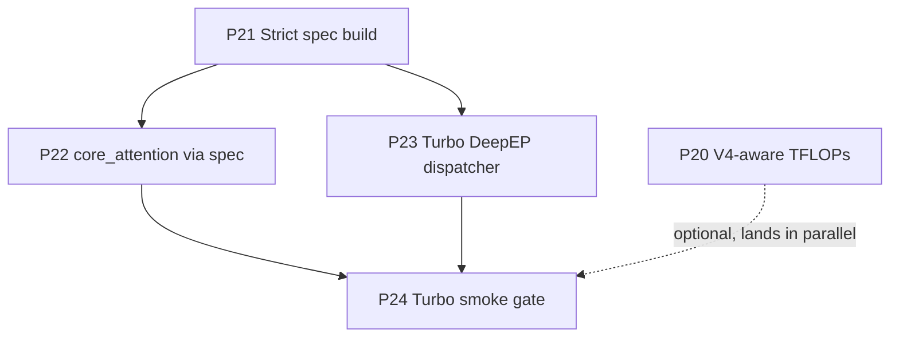

# 01 — Plan-3 Roadmap

> Plan-3 is **strictly bounded** to the five tasks the user asked for in
> the plan-3 kick-off message. No additional cleanup, refactor, or
> roadmap items get added here — those belong to a future plan.

## Phase Overview

| # | Phase | Type | Key Deliverables | Exit Criteria |
|---|---|---|---|---|
| **P20** | **V4-aware TFLOPs reporting** | observability | Primus patch wrapping `megatron.training.training.num_floating_point_operations`; V4 closed-form FLOPs covering Q-LoRA + single-latent KV + grouped low-rank O + per-layer compress-ratio (CSA / HCA / dense), Compressor + Indexer side-paths, hash + learned routers, `hc_mult` stream packing, MTP head, mock-data ignored. | Smoke + EP8 + PP2EP4 logs from P19 re-run with the new patch report a V4 TFLOPs that matches a hand-computed reference (per-layer breakdown logged once at rank-0 startup) within 1%. Non-V4 model types still get the upstream number byte-for-byte. |
| **P21** | **Strict spec build (no nn-fallback)** | hygiene | Remove `try / logger.warning / fall back to nn.Linear` from `_build_projection` in `deepseek_v4_attention.py` and `_build_projection` in `deepseek_v4_block.py`; remove the analogous `try / except` in `_build_compressor` / `_build_indexer` / `attn_sink_module`; root-cause the `gather_output=True` / `input_is_parallel=False` failures (the spec passes flags that TE rejects) and fix the spec so the standard provider path always succeeds; tree-wide audit gate (G15) ensures no other V4 backend file silently falls back to `nn.Linear` on `build_module` failure. | `build_module` failures raise; smoke logs no longer contain `"submodule init failed"` or `"fallback to nn.Linear"`; G15 (AST audit) green. |
| **P22** | **`core_attention` submodule for V4** | core | New `core_attention` field on `DeepseekV4AttentionSubmodules`; spec built via `provider.core_attention()` (returns `PrimusTurboAttention` when `args.use_turbo_attention=True`, else `TEDotProductAttention`); used inside `DeepseekV4Attention.forward` for `compress_ratio == 0` (dense + SWA); `compress_ratio == 128` (HCA) keeps the eager-Python joint-softmax path with a code comment explaining why (joint softmax across local SWA + compressed pool with shared per-head sink — current TE / Turbo flash-attn don't return LSE so we can't combine two attention calls); `compress_ratio == 4` (CSA) keeps the eager-Python top-K-gather path with a code comment explaining why (per-query sparse keys aren't a flash-attn pattern). When the V4 yaml sets `attn_sink: true`, the dense path forwards `use_sink_attention=True` to the Turbo class and reuses the existing per-head learnable `attn_sink` parameter (state-dict-compatible with the released V4-Flash checkpoint). | Dense (`compress_ratio=0`) attention runs through `core_attention` on a CPU 1L toy and still matches the eager-Python output within 1e-3; HCA + CSA continue on the eager path; `attn_sink` parameter still loads from V4-Flash checkpoints. |
| **P23** | **Turbo DeepEP dispatcher in V4 specs** | enablement | `_build_ffn_spec` in `deepseek_v4_layer_specs.py` probes `args.use_turbo_deepep` (gated by `args.enable_primus_turbo` + `args.tensor_model_parallel_size == 1`, mirroring `primus/backends/megatron/patches/turbo/moe_dispatcher_patches.py:_is_turbo_deepep_enabled`); when active, imports `PrimusTurboDeepEPTokenDispatcher` directly and uses it as `dispatcher_cls`; `_resolve_dispatcher_type_from_spec` in `v4_moe.py` recognises the turbo class as `flex` instead of falling back to `alltoall`. The pre-existing `megatron.turbo.moe_dispatcher` patch keeps its monkey-patch role for non-V4 callers; V4 specs no longer rely on the patch landing before spec build. | Turbo deepep smoke (P24) reports `MoE layer=N dispatcher active via PrimusTurboDeepEPTokenDispatcher` instead of `MoEFlexTokenDispatcher` for every routed-MoE layer. |
| **P24** | **Turbo attention + DeepEP smoke** | release gate | `run_deepseek_v4.sh` runs to completion (10 iters, mock data, BF16, MBS=1 GBS=16) on `mi355-gpu-12` with `enable_primus_turbo=true`, `use_turbo_attention=true`, `use_turbo_deepep=true`, `attn_sink=true`, `use_sink_attention=true`. Smoke matrix repeats the four P19 configurations (PP=1 EP=8, PP=2 EP=4, PP=4 EP=2, PP=2 EP=4 VPP=2) so the V4-specific PP / VPP patches keep working under the turbo path. Index_topk + seq_length stay at smoke values for the CSA Python fallback (full-Flash CSA kernel is out of scope). | All four configs reach iter 10 with no warnings about `"submodule init failed"`, `"fallback to nn.Linear"`, `"c10d::allreduce_"`, or `"unsupported dispatcher module"`; per-iter TFLOPs matches the V4-aware reference from P20. |

## Dependency Graph

P20 is independent and can land in parallel with everything else. P22
and P23 both depend on P21 because the strict-build contract is what
lets the new submodules surface real spec errors instead of being
masked. P24 is the gate that proves all four phases compose.

## Milestones

| Milestone | Scope | Phases |
|---|---|---|
| **M0: Plan-3 locked** | Plan docs + status.md tracking opened (Phase 20–24) | (this commit) |
| **M1: Reporting + hygiene** | V4 TFLOPs match the V4 closed form within 1%; no projection / sink / compressor / indexer warning-fallback paths in tree | P20 + P21 |
| **M2: Turbo wiring** | `core_attention` reaches dense V4 layers; `PrimusTurboDeepEPTokenDispatcher` reaches every routed V4 MoE layer | P22 + P23 |
| **M3: Turbo smoke green** | `run_deepseek_v4.sh` with full Turbo flags passes the four P19 configs | P24 |

## Top Risks

| Risk | Impact | Mitigation |
|---|---|---|
| `build_module(spec)` for V4's column / row parallel projections fails on `gather_output=True` / `input_is_parallel=False` because TE wrappers reject those flags | P21 cannot just delete the fallback — it must also fix the spec | Audit each V4 projection (`linear_q_down_proj`, `linear_q_up_proj`, `linear_kv`, `linear_o_a`, `linear_o_b`, `linear_proj`) and pick the correct provider class + flags; for projections that need post-hoc all-gather, use the upstream `ColumnParallelLinear` / `RowParallelLinear` (non-TE) when TE rejects the flag. Document the choice on the spec helper. |
| Turbo flash-attn's sink-attention path uses sliding-window via `args.sink_sliding_window` and only on even layers (`sink_window_even_layers_only=True`), per gpt-oss convention; V4's SWA window is on every layer | Wrong attention pattern under turbo | Set `sink_window_even_layers_only=False` from V4 yaml + thread V4's `attn_sliding_window` into Turbo's `sink_sliding_window` |
| Turbo DeepEP dispatcher requires `tp_size == 1` (per `_is_turbo_deepep_enabled`); if a V4 user runs with TP>1 the spec must skip turbo silently | Confusing fallback | `_build_ffn_spec` checks `tp_size == 1` and falls back to the standard `MoEFlexTokenDispatcher` (with a one-time rank-0 log line) when TP>1 |
| HCA (`compress_ratio=128`) joint-softmax path cannot be expressed as a single TE / Turbo flash-attn call (different mask shapes for local vs compressed branch, shared sink), and current kernels do not return `lse` | core_attention promotion blocked for HCA / CSA | Out of scope for P22 — code comment explicitly defers to the next plan once a flash-attn variant returning `lse` is available; V4 HCA / CSA stay on eager-Python until then. |
| The `gather_output=True` warning currently masks a real bug — when fixed, the actual TP sharding may differ from what unit tests covered | Numerical regression on TP>1 | P21 adds a TP=2 vs TP=1 forward-equivalence smoke (G15b, CPU-toy 1L) to catch sharding mismatches |

## Out of Scope (plan-3)

- HCA / CSA promotion to `core_attention` — needs LSE-returning flash-attn + multi-mask kernel support; tracked into a future perf plan.
- Replacing V4's CSA dense Python fallback (the `gathered_h` 256 GiB OOM path at full Flash dims) — needs a fused indexer-attention kernel. Out of scope.
- FP8 / FP4 / Muon / activation-clamp recipe convergence — separate plan, gated on plan-2 P20 baseline numbers.
- HF state-dict adapter (plan-2 P22+) — still deferred.
- Long-context (1M tokens) bring-up — deferred.
- TFLOPs accounting for non-V4 model types — the patch is V4-only by `args.model_type=="deepseek_v4"`.
