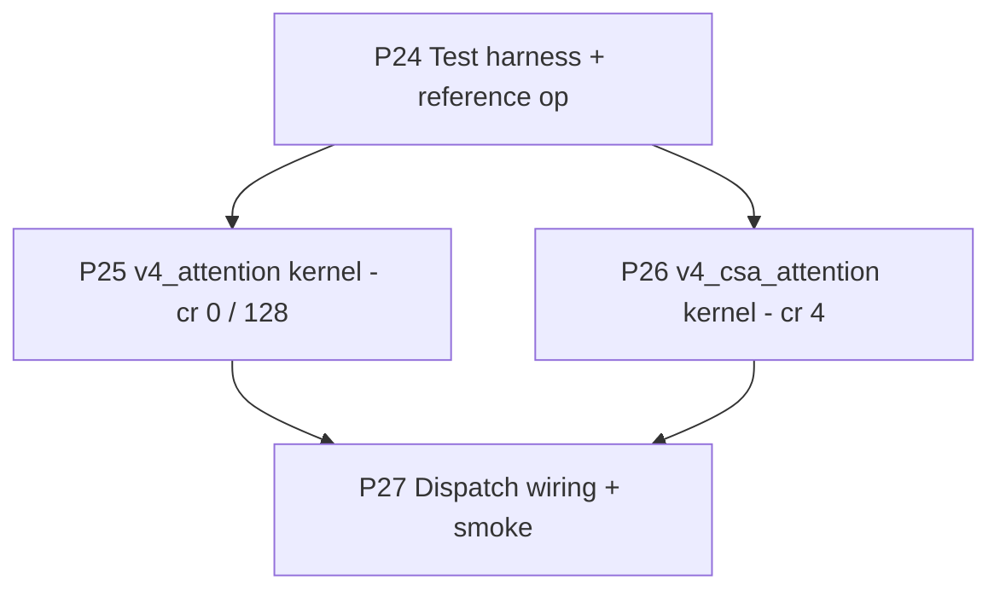

# 01 — Plan-4 Roadmap

> Plan-4 is **strictly bounded** to four phases that deliver the two
> in-tree Triton-fused V4 attention kernels (one for dense / HCA, one for
> CSA), their forward + backward unit tests, and the boolean switches
> that route V4 dispatch onto them. No additional cleanup, refactor, or
> roadmap items get added here — those belong to a future plan.

## Phase Overview

| # | Phase | Type | Key Deliverables | Exit Criteria | Status |
|---|---|---|---|---|---|
| **P24** | **Test harness + V4 shape fixtures + reference-Python op** | enablement | `tests/unit_tests/megatron/transformer/deepseek_v4/v4_attention_shapes.py` — single source-of-truth for V4-Flash + V4-Pro attention shape parametrisations consumed by every plan-4 test (S, H, head_dim, q_pe_dim, attn_sliding_window, num_sinks, compress_ratio, P, K, batch). `primus/backends/megatron/core/transformer/v4_attention_kernels/__init__.py` placeholder + `reference.py` exposing `eager_v4_attention(q, k, v, *, sink, swa_window, additive_mask)` and `eager_v4_csa_attention(q, k_local, v_local, gathered, *, sink, swa_window, sparse_mask)` — these are extracted, side-effect-free wrappers around the math currently inlined in `DeepseekV4Attention._attention_forward` and `_csa_forward`. The extraction MUST not change any tensor / dtype / numerical contract on the existing eager path; G22 enforces this by re-running the extracted wrappers inside `DeepseekV4Attention` and asserting bit-equality (or fp32-tolerance equality if a `.float()` cast is unavoidable) against the pre-extraction baseline at small CPU shape. | G22 (eager-extraction equivalence) green at small CPU shape; shape fixtures available to every plan-4 phase | not started |
| **P25** | **`v4_attention` Triton kernel (cr=0 + cr=128)** | core | `primus/backends/megatron/core/transformer/v4_attention_kernels/v4_attention.py` exposing `v4_attention(q, k, v, *, sink, swa_window, additive_mask, attn_dropout, training, scale)` as a `torch.autograd.Function` whose forward / backward are Triton kernels. Forward implements flash-attn-style block-wise softmax with optional `[H]` learned per-head sink (joined into the LSE before the V-weighted sum and dropped from the output), optional sliding window (`swa_window > 0`), and optional `[Sq, Sk]` additive bias (NaN-safe `-inf` mask). Backward implements the matching `dq, dk, dv, dsink` (HCA mask path: `dmask` is `None` because the additive bias is constant per call). `use_v4_triton_attention` arg (config + CLI). | G23 (forward equivalence), G24 (backward equivalence), G25 (dropout-off determinism) green at every V4-Flash + V4-Pro `compress_ratio ∈ {0, 128}` shape; `use_v4_triton_attention=True` with `use_v4_triton_csa_attention=False` runs a TP=1 PP=1 1L CUDA toy forward + backward with no NaN / Inf | not started |
| **P26** | **`v4_csa_attention` Triton kernel (cr=4)** | core | `v4_attention_kernels/v4_csa_attention.py` exposing `v4_csa_attention(q, k_local, v_local, gathered, *, sink, swa_window, sparse_mask, attn_dropout, training, scale)` as a `torch.autograd.Function`. Forward fuses (i) local SWA branch over `[B, H, Sq, head_dim]` x `[B, H, Sq, head_dim]` and (ii) per-query top-K sparse branch over `[B, H, Sq, head_dim]` x `[B, H, Sq, K, head_dim]` (gathered up front by the wrapper; the kernel takes the gathered tensor directly so it can KV-stream-load per query). Joint softmax across `[local_keys (Sq) ++ sparse_keys (K)]` with shared `[H]` per-head learned sink. Backward: `dq, dk_local, dv_local, dgathered, dsink`. `use_v4_triton_csa_attention` arg (config + CLI). | G26 (forward equivalence), G27 (backward equivalence) green at every V4-Flash + V4-Pro `compress_ratio == 4` shape; `use_v4_triton_csa_attention=True` runs a 1L CUDA toy forward + backward with no NaN / Inf | not started |
| **P27** | **Release-tier shape gate + dispatch wiring + smoke** | enablement | **(1) Release-tier shape gate (G28)** — extend the V4-Flash + V4-Pro `_BASE_SHAPES` parametrisations in `test_v4_p25_v4_attention_fwd.py` / `test_v4_p25_v4_attention_bwd.py` / `test_v4_p26_v4_csa_attention_fwd.py` / `test_v4_p26_v4_csa_attention_bwd.py` with **production-dim** entries (real `H ∈ {64, 128}`, real `head_dim=512`, real `swa_window=128`, real `K_topk` from the V4-Flash / V4-Pro yamls; `S` calibrated so the eager fp32 reference fits MI355X memory — see P27 design notes for the exact tier). Guarded with `pytest.mark.slow` so default CI runs the fast tier only; `pytest -m slow` runs the release-tier matrix. This task lands BEFORE the dispatch wiring + smoke so the kernels' real-shape correctness is locked in independently of the end-to-end pipeline. **(2) Dispatch wiring** — `DeepseekV4Attention.__init__` + `forward` plumb `args.use_v4_triton_attention` (cr ∈ {0, 128}) and `args.use_v4_triton_csa_attention` (cr == 4) onto each layer; precedence is `use_turbo_attention > use_v4_triton_attention > eager` for the dense path and `use_v4_triton_csa_attention > eager` for CSA (HCA's joint-softmax can also opt into `use_v4_triton_attention` because it routes through the same kernel). `run_deepseek_v4.sh` exposes `USE_V4_TRITON_ATTENTION` / `USE_V4_TRITON_CSA_ATTENTION` env vars and CLI flags, both default `False`. **(3) Smoke** — `mi355-gpu-14` (or any free MI355X) at TP=1 PP=1 EP=8 (10 iters) with `USE_V4_TRITON_ATTENTION=True USE_V4_TRITON_CSA_ATTENTION=True USE_TURBO_ATTENTION=False USE_TURBO_DEEPEP=True`. | G28 (release-tier shape forward + backward equivalence on real V4-Flash / V4-Pro dims) green; smoke logs report the new kernels engaged (one rank-0 startup line per kernel kind) and the run completes 10 iters with stable loss curve and no NaN / Inf; smoke logs **NOT** uploaded to GitHub (`.gitignore` per progress/p27) | not started |

## Dependency Graph

P24 is the harness everyone reuses. P25 and P26 are independent kernels
and can land in any order (but plan-4 lands them in the listed order so
that the simpler of the two — the dense / HCA kernel — gets the
test-harness rough edges first). P27 depends on both kernels because the
smoke runs every layer kind in a single forward pass.

## Milestones

| Milestone | Scope | Phases | Status |
|---|---|---|---|
| **M0: Plan-4 locked** | Plan docs + status.md tracking opened (Phase 24–27) | (kick-off, no commit) | in progress |
| **M1: Reference + harness** | Eager-Python ops extracted; CPU-toy fwd / bwd reproducible inside the test harness | P24 | not started |
| **M2: Dense / HCA kernel green** | `v4_attention` Triton kernel passes G23 + G24 + G25 at all V4-Flash + V4-Pro shapes for `cr ∈ {0, 128}` | P25 | not started |
| **M3: CSA kernel green** | `v4_csa_attention` Triton kernel passes G26 + G27 at all V4-Flash + V4-Pro shapes for `cr == 4` | P26 | not started |
| **M4a: Release-tier shape correctness** | `v4_attention` + `v4_csa_attention` G28 (real V4-Flash + V4-Pro shape forward + backward equivalence) green at `head_dim=512`, real `H`, real `swa_window`, real `K_topk` | P27 (task 1) | not started |
| **M4b: V4 smoke on Triton kernels** | TP=1 PP=1 EP=8 10-iter smoke runs end-to-end with both kernels engaged; loss stable, no NaN / Inf | P27 (tasks 2–4) | not started |

## Top Risks

| Risk | Impact | Mitigation |
|---|---|---|
| `head_dim=512` is unusually large for a Triton flash-attn kernel; the aiter Triton backward kernel for this shape needs 256 KiB SMEM (vs. MI355's 160 KiB hardware limit), which is why Turbo's path is blocked today | Naïvely porting aiter's tile choice would hit the same SMEM wall on the backward pass | The plan-4 kernel splits the head dimension into NOPE (`head_dim - rotary_dim = 448`) and POPE (`rotary_dim = 64`) tiles in the BWD analogously to the FWD, but the BWD is implemented as a streaming K / V tile-loop in fp32 with re-materialisation of the softmax (no materialised `[Sq, Sk]` LSE matrix), so peak SMEM is bounded by `(BLOCK_M + BLOCK_N) * (BLOCK_DMODEL_POW2 + BLOCK_DMODEL_PE_POW2) * 4 bytes` and stays comfortably under 160 KiB at the chosen `BLOCK_M=64, BLOCK_N=64`. Tile choice ratchets via the existing aiter `_get_config` table only for FWD; BWD owns its own table because of the SMEM constraint. |
| MQA single-latent KV (`num_query_groups_per_partition == 1`) means K and V each have only **1** "head" but Q has H heads (64 / 128); naïve broadcast in Triton would multiply the K / V global loads by H | Memory-bound BWD on V4-Flash | Kernel handles the MQA broadcast inside the tile loop (load K / V once per tile, reuse across all H Q-heads); `dk` and `dv` accumulate via atomic-add into the single-head buffer so the wrapper does not need to reduce a `[H]`-sized buffer. |
| The V4 sink is a `[H]` learned parameter joined into the softmax as a "virtual key" with zero value — straightforward in eager-Python but on a flash kernel the sink contributes only to LSE, not to the V-weighted sum, and has its own gradient | Forgetting the sink in BWD silently drops `dsink` | The kernel computes `dsink_h = -sum_q (sink_prob_h_q * sum_q_logsumexp_grad_h_q)` from first principles inside the BWD; G24 + G27 explicitly assert `attn_sink.grad` matches the eager-Python autograd `dsink` within `5e-2` (bf16) / `1e-5` (fp32). |
| HCA's `[Sq, Sk]` additive bias is only structurally `Sk = S + S/128`, so the bias tensor is small (≤ 17M entries at S=4096, P=32) but `dbias` must NOT be returned because the bias is computed deterministically from positions / compress_ratio at every step — accidentally wiring it as a leaf would inflate optimizer state | Optimizer state bloat | The kernel takes `additive_mask` as a non-leaf, non-grad input (no `dmask` output); the wrapper docstring states this contract and the autograd Function's `ctx.save_for_backward` does NOT save `additive_mask` for backward (it re-derives the mask on each call from the position grid in fp32 — same path as the eager `_local_mask` + `_hca_extra_kv` helpers). |
| CSA's per-query top-K gather means the K / V tensor input to the CSA kernel is `[B, S, K, head_dim]` (already-gathered by the wrapper) — that is `B * S * K * head_dim * 2 bytes` at V4-Flash dims (`B=1, S=4096, K=512, head_dim=512` → 2 GiB / microbatch in bf16), and at V4-Pro dims (`K=1024 → 4 GiB / microbatch`). Materialising this is a real cost. | Memory pressure at full V4-Flash / V4-Pro dims | Plan-4 keeps the wrapper-side gather (so the kernel is a pure dense GEMM over the gathered `[B, H, S, K, D]`); the alternative — pulling the gather inside the kernel via `topk_idxs`-driven `tl.load` of the compressed pool — is left for a future perf plan. P26 documents this as a known limitation in the kernel docstring. The unit tests run at small `S` so this does not block the plan; the smoke (P27) runs at the training seq length (`PRIMUS_SEQ_LENGTH=128` by default — full S=4096 needs more memory than mi355-gpu-12 has free under EP=8 today). |
| dropout in attention complicates equivalence tests (eager and Triton must use the same dropout mask) | False-positive numerical mismatches | All G22 / G23 / G24 / G25 / G26 / G27 tests run with `attn_dropout=0.0` (the V4 yaml default). G25 separately asserts the kernel is deterministic when `dropout=0.0` (back-to-back forward calls with same inputs produce bit-identical outputs). |

## Out of Scope (plan-4)

- Replacing the wrapper-side gather in CSA with an in-kernel
  `topk_idxs`-driven load (perf optimisation; tracked into a future
  perf plan).
- LSE-returning split-K decomposition for HCA (run two flash kernels —
  one local SWA, one over the compressed pool — and merge via online
  softmax). The current single-kernel-with-additive-bias approach is
  simpler and good enough for plan-4; the LSE-merge variant is a future
  perf optimisation.
- FP8 / FP4 / mxfp4 quantised forward (separate plan, deferred until
  the bf16 kernels land and the smoke evidence confirms numerics).
- Default-on switch flip — plan-4 ships both switches default `False`
  and gathers the plan-4 P27 smoke evidence; flipping the default to
  `True` is a release-tagging step that lives in the plan-4 hand-off
  notes for whoever cuts the next plan-N.
- Convergence run, long-context (1M-token) bring-up, HF state-dict
  adapter — all owned by a future plan.
