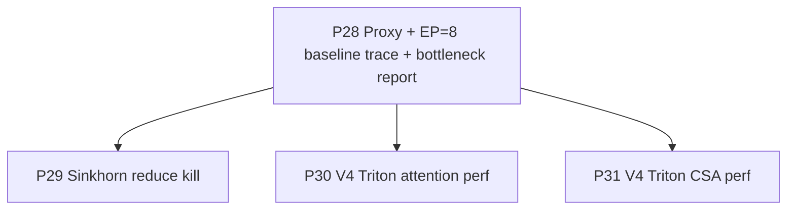

# 01 — Plan-5 Roadmap

> Plan-5 is **strictly bounded** to four phases that take the V4-Flash
> single-node EP=8 training step from its current 17 TFLOP/s/GPU
> steady-state (plan-4 P27 G30 smoke at `seq_length=128`) to a
> measurable improvement at production-shape sequence length, by
> attacking the bottlenecks visible in a real torch.profiler trace.
> No additional cleanup, refactor, model-arch change, or convergence
> run gets added here — those belong to a future plan.

## Per-phase deliverable convention

The eight-section per-phase summary file
(`progress/p<id>/p<id>-summary.md`) is now a **project-wide standing
rule**, not a plan-5-specific one. The format spec lives in
[`../rules/rule.md` §R2.1](../rules/rule.md). `p29-summary.md` is the
canonical example.

## Phase Overview

| # | Phase | Type | Key Deliverables | Exit Criteria | Status |
| --- | --- | --- | --- | --- | --- |
| **P28** | **V4-Flash proxy + EP=8 baseline trace + bottleneck report** | enablement | (1) `run_deepseek_v4_flash_proxy.sh` — wraps `run_deepseek_v4.sh` with a V4-Flash-shape proxy (8 layers, full V4-Flash widths: `hidden_size=4096, H=64, head_dim=512, num_experts=256, moe_router_topk=6, moe_ffn_hidden_size=2048, index_topk=512`, all four perf knobs on: `USE_V4_TRITON_ATTENTION=True`, `USE_V4_TRITON_CSA_ATTENTION=True`, `USE_TURBO_DEEPEP=True`, `TURBO_USE_GROUPED_MLP=True`); `seq_length` calibrated so MI355X HBM survives EP=8 (target `4096`; downscale if OOM with the chosen value documented in the report). (2) Chrome-trace capture for one active iteration (`PROFILE=True --profile_step_start 6 --profile_step_end 7`) under the proxy config. Raw trace JSON gitignored under `progress/p28/`; the proxy script + the report are committed. (3) Bottleneck analysis report at `develop/profile/profile-baseline-ep8-<date>.md` + `.html` covering: cold-iter vs steady-iter ms-per-iter, GPU vs CPU active / idle %, top-N kernels by total time, kernel launch count + average launch interval, attention-kernel time vs MoE time vs comm time, the small-op chain breakdown (which Python-side modules account for the kernel-launch tail), and a ranked bottleneck list. | Proxy script runs 10 iters EP=8 single-node with no NaN / Inf and no banned warnings (G31 smoke); trace JSON captured for iter 6→7; report committed; the report's bottleneck list is **the** input to P29 / P30 / P31 task-list refinement | not started |
| **P29** | **Sinkhorn fp32 reduce — kill the dominant 7.6 s kernel (RESCOPED from "small-op fusion")** | core | RESCOPED at P28 close (commit `afd7ea59`): the seeded small-op fusion candidates (a..e) were de-scoped (CPU-bound floor 0.3 % at V4-Flash production widths, ≪ 10 % rule). Forensic trace dive (`progress/p29/refinement.md`) attributes 624 / 717 of the dominant `aten::sum` fp32 reduce launches (96 % by count, 99.95 % by time) to `primus/backends/megatron/core/transformer/hyper_connection.py:47 sinkhorn_normalize` — 39 reductions per call × 8 layers × 2 (FWD + BWD chain). Each reduce kernel runs at ~250 × over the memory-bound floor because HIP's default `reduce_kernel<512, 1, …>` is sized for huge reductions, and our `(1, 4096, 4, 4) → (1, 4096, 4, 1)` reduction has 4 elements / output. Fix: `torch.compile(fullgraph=True, dynamic=False)` wrapping `sinkhorn_normalize` (collapses 39 sums + 39 divides into one Inductor-generated Triton kernel; AOT-autograd handles BWD); fall back to a hand-Triton fused-Sinkhorn kernel if the post-P29 trace shows < 50 % drop in `aten::sum` kernel time. New gate G32 = numerical equivalence (FWD + BWD parity vs eager); G33a = proxy smoke; G33b = post-P29 trace + report. | (1) Each chosen fusion target passes its forward + backward equivalence gate at fast tier + release tier (`--run-slow` opt-in, mirrors plan-4 P27 G28). (2) End-to-end EP=8 smoke (G33) shows ≥ +X % TFLOP/s/GPU vs P28 baseline — target X is set in P28's report from the trace (typical floor: +10 % for fusion phases). (3) No regression on plan-4 G23 / G24 / G26 / G27 / G29. | not started |
| **P30** | **V4 Triton attention kernel perf tuning** | core | (a) Per-shape autotune table for `BLOCK_M / BLOCK_N / num_warps / num_stages` keyed on `(H, head_dim, swa_window)`; (b) persistent kernel for FWD (one program per `(B*HQ)`, loop over m-tiles in-kernel — drops the per-tile launch overhead at long sequence lengths); (c) **HCA LSE-merge variant** of `v4_attention` that runs the SWA branch and the compressed-pool branch as two flash kernels and merges via online softmax (was a plan-4 follow-up, was deferred because the single-kernel-with-additive-bias was simpler; LSE-merge avoids materialising the `[Sq, Sk]` mask tensor at all). (d) In-kernel SWA mask path stays where it is — already lands in plan-4 P25; tuning only revisits if P28 surfaces SWA-mask CPU cost as a hot spot. | (1) FWD + BWD equivalence (plan-4 G23 / G24) still green at fast + release tier with the new tuning. (2) Attention-kernel time on the EP=8 trace drops by ≥ Y % — Y is set in P28's report. (3) HCA LSE-merge variant lands behind a `use_v4_attention_lse_merge` switch defaulting to `False`; new gate G34 asserts FWD + BWD equivalence to the single-kernel-with-additive-bias variant within the bf16 tolerance budget. | not started |
| **P31** | **V4 Triton CSA kernel perf tuning** | core | (a) **In-kernel `topk_idxs` gather** for `v4_csa_attention` — replace the wrapper-side `pool[..., topk_idxs, :]` materialisation (which costs `B * S * K_topk * head_dim * 2` bytes per microbatch — 2 GiB at V4-Flash, 4 GiB at V4-Pro) with `tl.load` on `pool` driven by `topk_idxs` inside the K-tile loop. Wrapper-side gather stays in tree as the eager fallback. (b) Better K-tile prefetching / unrolling for the per-row design that plan-4 P26 shipped. | (1) FWD + BWD equivalence (plan-4 G26 / G27) still green at fast + release tier with the in-kernel gather. (2) CSA-kernel time on the EP=8 trace drops by ≥ Z % — Z is set in P28's report. (3) Wrapper-side gather peak HBM usage drops to ≈ 0 (the `[B, H, Sq, K, D]` tensor stops being materialised). | not started |

## Dependency Graph

P28 is the input to every other phase — its bottleneck list picks
which fusion / autotune targets are in scope. P29, P30, and P31 are
independent and can land in any order; the ranking comes from the P28
report.

## Milestones

| Milestone | Scope | Phases | Status |
| --- | --- | --- | --- |
| **M0: Plan-5 locked** | Plan docs + status.md tracking opened (Phase 28–31) | (kick-off, no commit) | in progress |
| **M1: Baseline trace + report** | `run_deepseek_v4_flash_proxy.sh` lands; EP=8 trace captured at production V4-Flash widths; bottleneck report (md + html) under `develop/profile/profile-baseline-*` committed | P28 | not started |
| **M2: Sinkhorn reduce killed** | RESCOPED from "Small-op tail closed". `sinkhorn_normalize` torch.compile path lands behind `use_v4_compiled_sinkhorn` switch; G32 (FWD + BWD parity) green; G33a (smoke) green; G33b (proxy trace) shows ≥ 50 % drop in `aten::sum` fp32 reduce kernel time (budget X1 from P28). | P29 | not started |
| **M3: Attention kernels tuned** | Per-shape autotune lands; HCA LSE-merge variant green behind switch; attention-kernel time on the trace drops by ≥ Y % | P30 | not started |
| **M4: CSA kernel tuned** | In-kernel `topk_idxs` gather lands behind switch; CSA-kernel time on the trace drops by ≥ Z %; wrapper gather peak HBM ≈ 0 | P31 | not started |

## Top Risks

| Risk | Impact | Mitigation |
| --- | --- | --- |
| **OOM at `seq_length=4096` proxy** — V4-Flash CSA kernel materialises `[B, H, Sq, K_topk, D] = [1, 64, 4096, 512, 512] * 2 B = 64 GiB` per microbatch in the wrapper-side gather (plan-4 P26 design); on top of the 256-expert MoE state (~12 GiB / rank for 8 layers), the proxy may not fit. | Single-node EP=8 cannot run the proxy at `seq_length=4096` | P28 owns the calibration: target `4096`, fall back to `2048` / `1024` / `512` and document the chosen value in the report. P31's in-kernel gather is the structural fix; until P31 lands, the proxy stays at the calibrated shorter `seq_length`. |
| **Trace artefact size** — torch.profiler chrome traces at `seq_length=4096` over one active iteration can run 100–500 MB JSON per rank | Cannot commit the raw trace; need a stripped report | Raw trace JSON gitignored under `progress/p28/` (mirrors plan-4 P25 / P23 / P19 trace dirs). The report uses `torch.profiler.profile.key_averages()` tables + the chrome-trace `traceEvents` summarised offline (top-N kernels, launch-count histogram, kernel-duration percentiles). HTML is a static dashboard with embedded summary tables, not a chrome-trace viewer dump. |
| **torch.compile of `sinkhorn_normalize` on ROCm** — Inductor's HIP backend has had occasional miscompiles on minor torch versions; AOT-autograd of the 39-iter Sinkhorn-Knopp loop has not been previously exercised in this stack | First-iter compile timeout / silent BWD miscompile / numerical drift | P29 ships behind `use_v4_compiled_sinkhorn` (default `False`); G32 asserts FWD + BWD parity vs eager at fast tier and release tier (`pytest.mark.slow`) before the default flip; G33b post-P29 trace reuses the P28 report tooling so the regression budget is automatic. Fall-back is a hand-written in-tree Triton fused-Sinkhorn kernel under the same flag. |
| **Sinkhorn input shape stability** — torch.compile recompiles on shape change; if a future config varies `hc_sinkhorn_iters` per layer or `seq_length` mid-run, the cache key thrashes | Per-recompile cold-start cost (5 – 20 s) eats the perf gain | Cache key is `(n_iters, eps)` (both static at module init); `dynamic=False` locks tensor shapes; the proxy script pins one `seq_length` per run. |
| **De-scoped small-op fusion candidates resurfacing** — multi-node EP, cross-node activation reshuffling, or much smaller per-rank batches could re-introduce a CPU-bound floor that the de-scoped (a..e) targets address | "Small-op tail" comes back as the #1 bottleneck in a future trace and plan-5 P29 has no in-tree fix for it | The de-scoped candidates stay documented in `02-phase-details.md` as plan-5 follow-ups; revisited only if a future P28-style trace shows the small-op tail re-emerging at a different configuration. |
| **Plan-4 G28 release-tier tolerance budget** — bf16 BWD `dq/dk/dv/dgathered atol=2e-1`, `dsink atol=5e-2` is loose. Per-shape autotune in P30 / P31 may legitimately reorder the BWD reduction, drifting `dsink` further. | Test pass / fail cliff at the autotuned-config boundary | P30 / P31 land their tuning behind a per-config switch and run G24 / G27 release tier with `pytest --run-slow` on every config they ship. If a tuning config breaches the existing budget, the plan-5 owner (a) re-derives the budget with documented rationale, or (b) drops that config. The budget never silently relaxes — every change to it is called out in the per-phase status row. |
| **Wandb / TensorBoard / profile flag interaction** — `run_deepseek_v4.sh` ships with `--disable_wandb True --disable_tensorboard True --use_pytorch_profiler "$PROFILE"`; turning `PROFILE=True` opens TensorBoard files even when `--disable_tensorboard True` is set (the profiler shares TB's plugin) | Trace files land in unexpected paths; the report's path-discovery code breaks | P28's proxy script pins the trace output dir explicitly (matches the plan-4 P25 / P23 / P19 pattern: `output/$PRIMUS_TEAM/$PRIMUS_USER/$PRIMUS_EXP_NAME/tensorboard/...`) and the report's path-discovery code globs that exact pattern. |

## Out of Scope (plan-5)

- **FP8 / FP4 / mxfp4 quantised forward** — separate plan; the V4
  Triton kernels' FP8 hooks are wired but not exercised in plan-5.
- **Convergence run** — plan-5 runs 10–50-iter smokes; convergence to
  a target loss lives in a separate plan that owns dataset prep + the
  multi-day run.
- **Long-context (1M-token) bring-up** — plan-5's seq target is
  `4096` (the V4 pretrain config default); `1M` is a separate plan.
- **Multi-node EP scaling** — plan-5 is single-node EP=8.
- **HF state-dict adapter** — plan-2 deferred to "Phase 22+";
  plan-5 does not unblock it.
- **V3 / V2 backports of plan-5 fusions** — the fused chains and
  autotune tables are V4-shape-specific (`head_dim=512`, MQA single-
  latent KV); cross-model perf is a separate plan.
