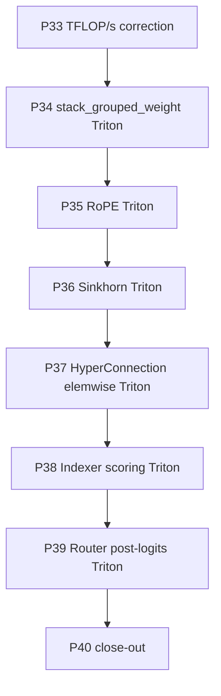

# 01 — Plan-6 Roadmap

> Plan-6 is **strictly bounded** to eight phases that take the
> V4-Flash single-node EP=8 training step from its plan-5 P32 final
> state (`603 ms / iter, 1134 TFLOP/s/GPU`, `14.64×` over P28) to
> the next bottleneck the trace exposes — the elemwise / layout-
> transform tail dominated by `_stack_grouped_linear_weight`,
> `apply_interleaved_partial_rope`, HyperConnection / Sinkhorn
> glue, Indexer scoring, and V4 router post-logits. No additional
> attention kernel work, no new model-arch change, no FP8 / FP4
> / convergence run gets added here — those belong to future plans.

## Per-phase deliverable convention

The eight-section per-phase summary file
(`progress/p<id>/p<id>-summary.md`) is a project-wide standing rule
(see [`../rules/rule.md` §R2.1](../rules/rule.md)). Plan-5 P29
`p29-summary.md` and plan-5 P32 `p32-summary.md` are the canonical
examples; every plan-6 phase ships one.

The `develop/perf/elem_fusion.md` cell format follows the standing
R2.5 decision: every cell added on or after plan-6 P34 uses
`<ms> ms | <tflops or throughput>` — wall-clock per-launch median
(from trace or microbench) plus an effective TFLOP/s or throughput
derived from that wall-clock.

## Phase Overview

| # | Phase | Type | Key Deliverables | Exit Criteria | Status |
| --- | --- | --- | --- | --- | --- |
| **P33** | **TFLOP/s closed-form correction (SWA + HC matmul)** | enablement | (a) `_attn_scores_fmac_per_layer` replaces `S_eff^2 / 2` with `visible_pairs(swa_window, compress_ratio, index_topk)` for the local SWA branch and for HCA / CSA local; (b) new `_hc_matmul_fmac_per_layer` adds the HyperMixer `fn.weight` matmul (`K*D -> (2+K)*K`) twice per decoder layer and once per `HyperHead` (main + per-MTP-depth); (c) `_V4FlopsBreakdown` gains a `hc` field; (d) `_log_breakdown` prints the new term; (e) unit-test `tests/unit_tests/backends/megatron/test_deepseek_v4_flops_patches.py` gains a SWA-prune case + an HC-matmul case; (f) `develop/perf/proxy_ep8.md` gains a `P33 corrected TFLOP/s` row reusing the P32 final iter-time (numerator only changes). | (1) G16 / G17 + the new G36 SWA-prune + G36a HC-matmul tests all pass. (2) `compute_v4_flops` smoke under the proxy at EP=8 prints the new `hc` term in the rank-0 breakdown line. (3) `proxy_ep8.md` `P33 corrected TFLOP/s` row pinned to the P32 final iter-time. | not started |
| **P34** | **`_stack_grouped_linear_weight` Triton FWD/BWD fusion** | core | (a) New `primus/backends/megatron/core/extensions/_triton/stack_grouped_weight.py` with `_stack_grouped_weight_fwd_kernel` / `_stack_grouped_weight_bwd_kernel` + a `torch.autograd.Function` wrapper. FWD reads E `[K, N]` per-expert weights, writes a single `[E, N, K]`-permuted contiguous buffer in one kernel; BWD scatters `dW [E, N, K]` back to each `weight{i}.grad` `[K, N]`. (b) `PrimusTurboGroupedMLP._stack_grouped_linear_weight` routes through the new path when `PRIMUS_STACK_GROUPED_WEIGHT_TRITON=1` (default `1`); set to `0` to fall back to `torch.stack + transpose + contiguous`. (c) microbench `progress/p34/bench_stack_grouped_weight.py` covers `E ∈ {8, 16, 32} × (K=4096, N=2048)` at proxy widths. (d) EP8 proxy A/B trace + `develop/profile/profile-after-p34-ep8-<YYYYMMDD>.{md,html}`. | (1) G37 (FWD bit-equal vs eager stack + BWD `gradcheck` fp32 + bf16 atol=0 layout-only parity) passes at fast + release tiers. (2) Plan-4 G23..G28 + plan-5 G32 / G34 / G34b / G35 ratchet stays green. (3) Microbench reports ≥ 5× speedup on the FWD path vs eager `stack + transpose + contiguous`. (4) EP8 proxy steady iter time drops by ≥ 150 ms vs P32 final (`603 → ≤ 450 ms`); `hipMemcpyWithStream` trace bucket drops by ≥ 200 ms. | not started |
| **P35** | **`apply_interleaved_partial_rope` Triton FWD/BWD fusion** | core | (a) New `primus/backends/megatron/core/transformer/v4_attention_kernels/_triton/rope_interleaved_partial.py` with `_apply_rope_fwd_kernel` / `_apply_rope_bwd_kernel` + `torch.autograd.Function`. FWD reads `x [..., H, head_dim]` + `cos / sin [..., 1, rd/2]`, writes `out [..., H, head_dim]` with the leading `nope` channels copied through and the trailing `rotary_dim` channels rotated in place. (b) `dual_rope.py::apply_interleaved_partial_rope` routes through the Triton path when `PRIMUS_ROPE_TRITON=1` (default `1`); the eager body stays as the `0` fallback. (c) microbench `progress/p35/bench_rope_triton.py` covers Q (`[B=1, S=4096, H=64, head_dim=512, rd=64]`) and K (`[B=1, S=4096, H=1, head_dim=64, rd=64]`) shapes. (d) EP8 proxy A/B trace + post-phase profile report. | (1) G38 (FWD parity vs eager within bf16 atol=1e-3 / rtol=1e-3 + BWD `gradcheck` fp32 + bf16 BWD parity at the release-tier shape) passes at fast + release tiers. (2) Plan-4 G23..G28 + plan-5 G34 / G34b / G35 stays green. (3) `CatArrayBatchedCopy_contig` trace bucket drops to ≈ 0. (4) EP8 proxy iter time drops by ≥ 15 ms vs P34. | not started |
| **P36** | **`sinkhorn_normalize` Triton FWD/BWD (replaces P29 `torch.compile`)** | core | (a) New `primus/backends/megatron/core/transformer/v4_attention_kernels/_triton/sinkhorn.py` with `_sinkhorn_fwd_kernel` / `_sinkhorn_bwd_kernel` + `torch.autograd.Function`. FWD tiles per `[..., K, K]` (K=hc_mult=4 at V4-Flash), loads the K×K matrix into registers, runs the 20-iter alternating row/col normalize in registers, writes back as bf16. BWD uses the implicit-function-theorem closed form (the doubly-stochastic projection has an analytic VJP that fits in registers at K=4). (b) `hyper_connection.py::sinkhorn_normalize` gains a new `use_triton: bool = False` keyword (similar to the existing `use_compiled` path); `HyperMixer.__init__` accepts `use_triton_sinkhorn`; new env `PRIMUS_SINKHORN_TRITON=1` (default `1`) flips the runtime path. `use_compiled` stays in tree as the secondary fallback. (c) microbench `progress/p36/bench_sinkhorn.py` covers `K ∈ {4, 8}, leading ∈ {1024, 4096, 8192}`. (d) EP8 proxy A/B trace + post-phase profile report. | (1) G39 (FWD parity vs eager and vs P29 compiled within `atol=1e-5 rtol=1e-5` fp32 / `atol=1e-3 rtol=1e-3` bf16 + BWD `gradcheck` fp32 + release-tier shape parametrised over `n_iters ∈ {5, 20}`) passes at fast + release tiers. (2) Plan-5 G32 (P29 parity) stays green — `use_compiled` path must not break. (3) `Torch-Compiled Region` and `CompiledFunctionBackward` trace buckets drop to ≈ 0. (4) EP8 proxy iter time drops by ≥ 10 ms vs P35. | not started |
| **P37** | **HyperConnection elemwise Triton fusion** | core | (a) New `primus/backends/megatron/core/transformer/v4_attention_kernels/_triton/hyper_connection_glue.py` with three sub-kernels and their BWDs: (i) `_hc_post_linear_glue_kernel` — fuses `logits.slice(..K) * scale[0] + base[..K]` (pre), `2.0 * sigmoid(logits.slice(K..2K) * scale[1] + base[K..2K])` (post), `softmax(logits.slice(2K..) * scale[2] + base[2K..])` (comb-pre-sinkhorn) in one program over `[..., (2+K)*K]`; (ii) `_hc_collapse_kernel` — `(pre.unsqueeze(-1) * x).sum(-2)`; (iii) `_hc_expand_outer_kernel` — `post.unsqueeze(-1) * out.unsqueeze(-2)` (the `+ matmul(comb, x)` part stays as a `torch.matmul` call). (b) `HyperMixer.compute_weights` / `collapse` / `expand` and `HyperHead.forward` route through the new Triton path when `PRIMUS_HC_TRITON=1` (default `1`). (c) microbench `progress/p37/bench_hyper_connection.py` covers `[B=1, S=4096, K=4, D=4096]` for each sub-kernel. (d) EP8 proxy A/B trace + post-phase profile report. | (1) G40 (FWD output parity vs eager within bf16 `atol=1e-3 rtol=1e-3` for each sub-kernel + composed end-to-end mixer / head parity + BWD `gradcheck` fp32) passes at fast + release tiers. (2) Plan-5 G32 (P29 compiled Sinkhorn boundary) + plan-4 ratchet stays green. (3) EP8 proxy iter time drops by ≥ 15 ms vs P36. | not started |
| **P38** | **`Indexer.forward` scoring Triton FWD/BWD** | core | (a) New `primus/backends/megatron/core/transformer/v4_attention_kernels/_triton/indexer_score.py` with `_indexer_score_fwd_kernel` / `_indexer_score_bwd_kernel` + `torch.autograd.Function`. FWD fuses `einsum(q_i [B, S, H, Hd], k_icomp [B, P, Hd]) → relu → mul(w_i.unsqueeze(-1)) → sum(-2) → + causal_mask` into one kernel; causal mask materialises inline via `tl.where(s_end <= t, 0, -inf)` per tile (no host-side mask tensor). BWD recomputes `relu` mask, accumulates `dq_i / dk_icomp / dw_i`. (b) `Indexer.forward` routes through the Triton path when `PRIMUS_INDEXER_TRITON=1` (default `1`); `topk` and the `where(isneginf, -1, ...) + pad cat` tail stay on host-side. (c) microbench `progress/p38/bench_indexer.py` covers `[B=1, S=4096, P=1024, H=8, Hd=128]`. (d) EP8 proxy A/B trace + post-phase profile report. | (1) G41 (FWD scores parity vs eager within bf16 `atol=5e-3 rtol=5e-3`, `topk_idxs` bit-equal at fast + release tiers + BWD `gradcheck` fp32) passes. (2) Plan-4 ratchet stays green. (3) EP8 proxy iter time drops by ≥ 10 ms vs P37 (Indexer runs only on `compress_ratio == 4` layers = 3 of 8 in the proxy). | not started |
| **P39** | **V4 Router post-logits Triton FWD/BWD (hash + topk shared)** | core | (a) New `primus/backends/megatron/core/transformer/moe/_triton/v4_router_post.py` with `_v4_router_post_fwd_kernel` / `_v4_router_post_bwd_kernel` + `torch.autograd.Function`. FWD takes `logits [N, E]` (+ optional `expert_bias [E]` + optional `topk_indices [N, K]` for hash) and writes (i) `probs [N, E]` sparse (mostly 0) and (ii) `routing_map [N, E] bool` in one program. Internally: `score_fn (softmax / sigmoid / sqrtsoftplus) → [add bias →] topk-K (tournament in registers for K ≤ 8) → gather → denom → scale → sparse scatter`. BWD reverses the chain (score_fn VJP + scatter back to `dlogits`). (b) Both `DeepseekV4LearnedRouter._compute_route` and `DeepseekV4HashRouter.forward` route through the new Triton path when `PRIMUS_V4_ROUTER_TRITON=1` (default `1`); hash router pre-computes `tid2eid[token_ids]` host-side and passes the K-indices as a kwarg so the same kernel handles both. (c) microbench `progress/p39/bench_router_post.py` covers `[N=4096, E=256, K=6]` × 3 score functions × {with / without bias}. (d) EP8 proxy A/B trace + post-phase profile report. | (1) G42 (FWD `probs / routing_map` bit-equal vs eager across 3 score functions × {with / without bias} × {hash / topk} + BWD `gradcheck` fp32) passes at fast + release tiers. (2) Plan-2 P14 router tests stay green. (3) EP8 proxy iter time drops by ≥ 5 ms vs P38. | not started |
| **P40** | **Plan-6 close-out — `elem_fusion.md` + cumulative perf table** | enablement | (a) New `develop/perf/elem_fusion.md` — one row per shipped fusion (P34..P39); cell format `<ms> ms \| <tflops or throughput>` per R2.5; columns: Phase / Target op / Eager baseline / Triton-fused / Speedup / Source bench / EP8 proxy delta. (b) `develop/perf/proxy_ep8.md` gains one row per phase (`P33 corrected TFLOP/s`, `P34`, ..., `P40 final`); the `P40 final` row records the cumulative speedup vs plan-5 P32 final. (c) `progress/p33/p33-summary.md` ... `p40/p40-summary.md` — one R2.1 eight-section summary per phase. (d) `run_deepseek_v4_flash_proxy.sh` surfaces all six new env knobs (`PRIMUS_STACK_GROUPED_WEIGHT_TRITON`, `PRIMUS_ROPE_TRITON`, `PRIMUS_SINKHORN_TRITON`, `PRIMUS_HC_TRITON`, `PRIMUS_INDEXER_TRITON`, `PRIMUS_V4_ROUTER_TRITON`) under `${VAR:-1}`-guard, with header notes per the plan-5 P32 final precedent. (e) Status pinning per R2.4 — every `[x]` row in Phase 33..40 gets the commit SHA + date. | (1) `elem_fusion.md` exists with one row per shipped fusion. (2) `proxy_ep8.md` `P40 final` row pinned to the final EP8 proxy steady-iter number. (3) Every Phase 33..40 status row in `progress/status.md` is `[x]` with a commit SHA. (4) Every `p3X-summary.md` follows R2.1. | not started |

## Dependency Graph

P33 ships first because every downstream phase's `proxy_ep8.md`
row uses the **corrected** TFLOP/s denominator; landing P33 last
would force a back-fill rewrite. P34 ships second because the
P32 final trace shows it is the single largest GPU-time item
(`hipMemcpyWithStream` at 289.6 ms / iter — almost half of step
time) — getting it right early gives the biggest wall-clock
delta and makes downstream A/B traces easier to read. P35..P39
are linearly chained for per-phase trace clarity (each phase's
A/B trace is against the immediately preceding phase's final
state, so the per-phase delta is unambiguous). P40 close-out
gates on all preceding phases being green.

## Milestones

| Milestone | Scope | Phases | Status |
| --- | --- | --- | --- |
| **M0: Plan-6 locked** | Plan docs + status.md tracking opened (Phase 33–40) | (kick-off, no commit) | in progress |
| **M1: TFLOP/s denominator corrected** | `compute_v4_flops` covers SWA visible-pair pruning + HyperConnection fn matmul; `proxy_ep8.md` gains a `P33 corrected TFLOP/s` row | P33 | not started |
| **M2: Grouped-MLP stack Triton-fused** | `_stack_grouped_linear_weight` runs via Triton FWD/BWD; `hipMemcpyWithStream` trace bucket drops by ≥ 200 ms; EP8 iter time ≤ 450 ms | P34 | not started |
| **M3: RoPE Triton-fused** | `apply_interleaved_partial_rope` runs via Triton FWD/BWD; `CatArrayBatchedCopy_contig` trace bucket ≈ 0 | P35 | not started |
| **M4: Sinkhorn / HyperConnection / Indexer / Router fused** | Each of P36..P39 lands behind its own default-on env flag; per-phase EP8 proxy A/B trace shows a positive delta | P36..P39 | not started |
| **M5: Plan-6 close-out** | `elem_fusion.md` finalised with one row per fusion; `proxy_ep8.md` `P40 final` row pinned; every p3X-summary.md follows R2.1 | P40 | not started |

End-of-plan-6 EP8 proxy steady-iter target: **≤ 310 ms / iter,
≥ 2200 TFLOP/s/GPU (post-P33 correction)**, ~`2×` over plan-5 P32 final
and ~`28×` over plan-5 P28 baseline. The target is **best-effort,
not a contract**; any phase that regresses end-to-end iter time
ships with its env default flipped to `0` and the regression goes
in the phase's "failed / negative probes" section (precedent: plan-5
P32 split-BWD / segreduce defaults default-OFF then default-ON
after the RoPE bug was fixed).

## Top Risks

| Risk | Impact | Mitigation |
| --- | --- | --- |
| **Microbench wins do not translate to proxy wins** — plan-5 P32 RoPE bug masked the split-BWD / segreduce microbench wins for 4 days; same risk applies to every plan-6 phase | Phase ships behind a `PRIMUS_<NAME>_TRITON=1` env, the EP8 proxy A/B regresses, and the team spends days root-causing | Every phase opens with a **task-list refinement** that re-anchors on the latest trace (not just the previous-phase microbench) and ships its env default-OFF if the proxy A/B regresses. The plan-5 P32 RoPE bf16 fix + the `PRIMUS_V4_DIAG_TIME=1` in-tree diagnostic stay armed so a future microbench-vs-proxy gap is one env-flip away from being root-caused. |
| **Hand-rolled Triton FWD/BWD parity vs eager / `torch.compile`** — the doubly-stochastic Sinkhorn BWD VJP is closed-form but error-prone; the V4-router VJP through `score_fn ∈ {softmax, sigmoid, sqrtsoftplus}` is non-trivial; the `_stack_grouped_linear_weight` BWD must scatter to per-expert `weight{i}.grad` correctly | Latent BWD miscompile shows up as a slow loss divergence, not a unit-test failure; plan-2 / plan-4 ratchet catches it but the per-phase commit ratchet should too | Every plan-6 phase ships with: (a) a fast-tier `torch.autograd.gradcheck` test in fp32, (b) a release-tier bf16 parity test with the documented tolerance from plan-4 P25 / P26 / P27, (c) an EP8 proxy 10-iter smoke G33a equivalent (the proxy A/B trace harness already does this in plan-5). The bar is **green at all three tiers** before the env default flips to `1`. |
| **HC `expand` matmul cannot be fused with the outer-product elemwise** — `expand` is `post.unsqueeze(-1) * out.unsqueeze(-2) + matmul(comb, x)`; fusing the matmul into the elemwise kernel would re-implement a GEMM | Plan-6 P37 spends weeks rewriting a GEMM that cuBLAS / Triton GEMM already runs at peak | P37 explicitly excludes the matmul — only the outer-product (`post * out`) and the trailing add are fused. The matmul stays as a `torch.matmul` call and the trailing add is a single Triton kernel that takes both the outer-product and the matmul output. |
| **Bf16 / fp32 dtype contracts in HyperConnection** — `compute_weights` runs in fp32 internally and casts back to bf16 only at the end (plan-2 P14 invariant — Sinkhorn-Knopp stability); a naive elemwise fusion that casts to bf16 mid-chain breaks numerics | P37 introduces a subtle convergence bug that only shows up after 1000+ iters | Plan-6 P37 mirrors the plan-5 P32 RoPE bf16 cast diagnostic: the new Triton kernels accept `in_dtype` / `out_dtype` kwargs and an explicit `compute_dtype=fp32` for the fp32-internal chain. G40 parametrises over `(in_dtype, compute_dtype, out_dtype) ∈ {(bf16, fp32, bf16), (fp32, fp32, fp32)}` and asserts bit-equal across `(bf16 in, fp32 compute, bf16 out)` vs the eager path. |
| **Plan-3 P20 TFLOP/s patch's `_log_breakdown` ordering** — the breakdown log line is the rank-0 "did this run with V4-aware FLOPs" signal; reordering fields breaks downstream grep on `attn_scores`, `compressor`, `indexer`, etc. | Plan-6 P33 silently breaks every CI / smoke log scrape that depends on the existing breakdown format | P33 adds the new `hc` field at the end of the breakdown (after `logits`), not in the middle, and keeps every other field name + ordering bit-identical. The G36 unit-test parametrises on the exact log-line format. |
| **`PRIMUS_STACK_GROUPED_WEIGHT_TRITON` BWD scatter contention** — multiple `(b, m, n)` programs writing back into the same `weight{i}.grad` element if the permute is wrong | Random per-rank `weight{i}.grad` corruption, exact same convergence-divergence symptom as the Sinkhorn case | P34 BWD uses `tl.atomic_add` if any partial overlap is possible (it should not be — the permute is a bijection — but defensive); the BWD kernel comments document the bijection proof. The G37 release-tier bf16 BWD test runs `gradcheck` against a hand-derived reference at `E ∈ {8, 16, 32}`. |

## Out of Scope (plan-6)

- **Attention kernel work** — plan-5 owns V4 / CSA attention; plan-6
  only plumbs the RoPE Triton entry point.
- **State-dict layout change for grouped MLP** — tracked as a plan-6
  follow-up if P34 does not close the `hipMemcpyWithStream` gap.
- **FP8 / FP4 / mxfp4** — separate plan.
- **Convergence run** — plan-6 runs 10-iter smokes only.
- **Long-context (1M-token) / multi-node EP / HF state-dict adapter** —
  same as plan-5.
- **`hc_sinkhorn_iters` reduction** — model-quality decision (plan-5
  P29 design note).
