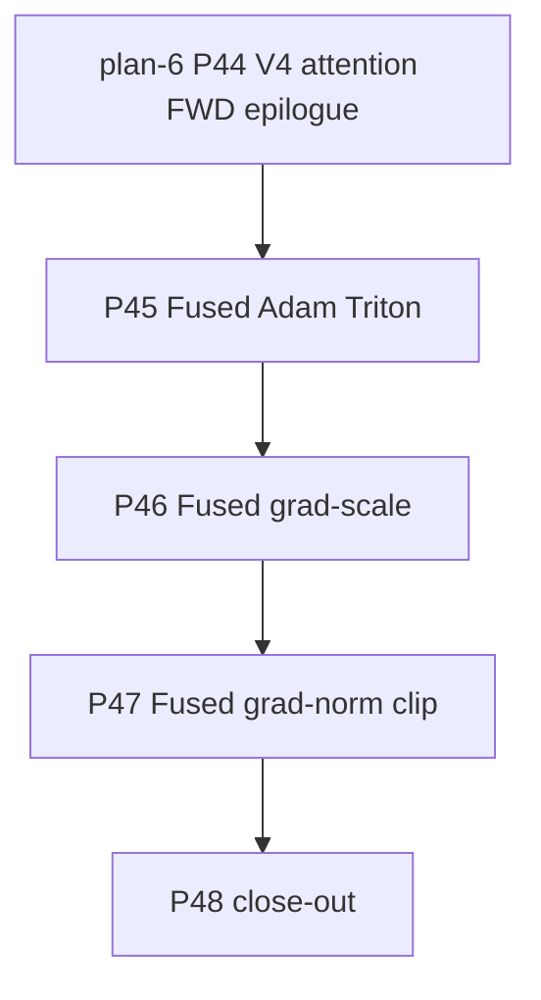

# 01 — Plan-7 Roadmap

> Plan-7 attacks the optimizer-step residual that the P40 trace
> surfaced after plan-6 closed the in-model elementwise sweep
> (P41..P44).  At plan-7 kick-off the V4-Flash EP=8 proxy steady-iter
> sits at ~500 ms / iter; ~242 ms of that is the Apex / TE-owned
> Adam + grad-scale + grad-norm chain, which is bandwidth-bound and
> very fusable.  No new in-model kernel work, no model-arch change,
> no FP8 / FP4 / convergence run gets added here — those belong to
> plan-8+.

## Per-phase deliverable convention

The eight-section per-phase summary file
(`progress/p<id>/p<id>-summary.md`) is a project-wide standing rule
(see [`../rules/rule.md` §R2.1](../rules/rule.md)).  Plan-6 P34
`p34-summary.md` is the canonical example for the elementwise-
fusion variant.  Every plan-7 phase ships one.

The `develop/perf/elem_fusion.md` cell format follows the standing
R2.5 decision: `<ms> ms | <effective TFLOP/s or GB/s>` per cell;
optimizer-step rows use GB/s as the throughput metric (the chain
is memory-bandwidth-bound).

R2.6 (per-phase trace + tgz archival) applies — every phase closes
with a chrome-trace capture compressed to a same-base-name `.tgz`.

## Phase Overview

| # | Phase | Type | Key Deliverables | Exit Criteria | Status |
| --- | --- | --- | --- | --- | --- |
| **P45** | **Custom Triton fused Adam (absorb ε-add into master functor)** | core | (a) New `primus/backends/megatron/extensions/_triton/fused_adam.py` with `_adam_master_param_remainder_fwd_kernel` + a `FusedAdamMasterParamRemainder` callable that accepts a multi-tensor batch list (gradient + master param + exp_avg + exp_avg_sq + remainder + param) and does one Triton kernel per program over a power-of-two chunk of param indices.  The kernel computes `m = beta1*m + (1-beta1)*g`, `v = beta2*v + (1-beta2)*g**2`, `(m_hat, v_hat)` bias correction, `update = lr * m_hat / (sqrt(v_hat) + eps)`, decoupled weight decay, master-param update, BF16 cast of `param` + remainder accumulation, **all in registers in a single kernel launch per group**.  No more separate BF16 ε-add launch. (b) New monkey-patch `primus/backends/megatron/patches/turbo_adam_patches.py` wraps `transformer_engine.optimizers.multi_tensor_adam_master_param_remainder` (or the Apex equivalent) and routes through the Triton kernel when `PRIMUS_FUSED_ADAM_TRITON=1` (default `"0"` — proxy A/B must confirm before flipping). (c) microbench `progress/p45/bench_fused_adam.py` covers V4-Flash production param-list shapes (the actual `[N_params, max_chunk_size]` distribution captured from a smoke run). (d) EP8 proxy A/B trace + post-phase profile report. | (1) G47 (FWD bit-equal vs upstream Adam at fast tier `[8 params × 4096 elements]` fp32 + bf16 master + atol=0 for the upper bits, ULP-difference ≤ 1 for the master-param remainder; release-tier on a full V4-Flash param list at bf16 `pytest.mark.slow`). (2) Plan-4/5/6 ratchet stays green. (3) Microbench reports ≥ 3x speedup vs the eager multi_tensor + ε-add chain. (4) EP8 proxy steady iter time drops by ≥ 100 ms vs P44 final.  Default flips to `"1"` only if the proxy A/B confirms a positive delta. | not started |
| **P46** | **Fused grad-scale Triton kernel** | core | (a) New `primus/backends/megatron/extensions/_triton/fused_grad_scale.py` with `_grad_scale_kernel` + a `FusedGradScale` callable that runs one Triton kernel per program over a multi-tensor batch list of gradients, applying `g.mul_(scale)` in place.  Replaces the per-param `multi_tensor<scale>` launches. (b) Patch + env gate (`PRIMUS_FUSED_GRAD_SCALE=1`, default `"0"` then `"1"` after A/B). (c) microbench + EP8 A/B. | (1) G48 (FWD bit-equal). (2) Microbench ≥ 2x speedup. (3) EP8 proxy iter time drops by ≥ 3 ms vs P45 final.  Default flips on A/B win. | not started |
| **P47** | **Fused grad-norm clip Triton kernel** | core | (a) New `primus/backends/megatron/extensions/_triton/fused_grad_norm_clip.py` with `_grad_norm_l2_fwd_kernel` (reduce per param) + `_grad_norm_global_kernel` (reduce across params + clip-scale derivation) + `_grad_clip_kernel` (apply clip).  Replaces `reduce<l2norm_bf16>` + `multi_tensor<l2norm>` + the separate clip-scale + apply chain.  Three kernels chained but each is single-launch. (b) Patch + env gate (`PRIMUS_FUSED_GRAD_NORM_CLIP=1`). (c) microbench + EP8 A/B. | (1) G49 (FWD bit-equal — L2 norm reduce is associative so the order matters; the kernel uses the same reduction order as the upstream multi-tensor functor). (2) Microbench ≥ 2x speedup vs the eager chain. (3) EP8 proxy iter time drops by ≥ 6 ms vs P46 final.  Default flips on A/B win. | not started |
| **P48** | **Plan-7 close-out — cumulative bake-off + perf docs + status pinning** | enablement | (a) Append plan-7 rows (P45/P46/P47/P48 final) to `develop/perf/proxy_ep8.md` and `develop/perf/elem_fusion.md`. (b) Per-phase summaries `progress/p45/p45-summary.md` … `progress/p48/p48-summary.md` per R2.1. (c) Status pinning per R2.4 — every `[x]` row in Phase 45..48 gets the commit SHA. (d) `run_deepseek_v4_flash_proxy.sh` surfaces the three new env knobs (`PRIMUS_FUSED_ADAM_TRITON`, `PRIMUS_FUSED_GRAD_SCALE`, `PRIMUS_FUSED_GRAD_NORM_CLIP`). (e) 15-iter clean bake-off with all plan-7 default-on knobs. (f) Plan-7 close-out commit `docs(deepseek-v4)[plan-7][P48]: plan-7 close-out`. | (1) `proxy_ep8.md` `P48 final` row pinned. (2) Every Phase 45..48 status row is `[x]` with a commit SHA. (3) Every `p4X-summary.md` follows R2.1. | not started |

## Dependency Graph

P45 ships first because it dominates the savings budget (~150 ms
out of ~165 ms total optimizer-step fusable).  P46 + P47 are
quick follow-ups that together close the remaining ~15 ms.  P48 is
the close-out (perf docs + cumulative bake-off + status pinning).

## Milestones

| Milestone | Scope | Phases | Status |
| --- | --- | --- | --- |
| **M0: Plan-7 locked** | Plan docs + status.md tracking opened (Phase 45–48) | (kick-off, no commit) | in progress |
| **M1: Adam fused** | Custom Triton Adam kernel ships behind `PRIMUS_FUSED_ADAM_TRITON`; EP8 proxy iter time drops by ≥ 100 ms | P45 | not started |
| **M2: Grad-scale + grad-norm fused** | Two follow-up fused kernels ship behind their env knobs; EP8 proxy iter time drops by ≥ 9 ms cumulative | P46 + P47 | not started |
| **M3: Plan-7 close-out** | `proxy_ep8.md` `P48 final` row pinned with the cumulative iter time + speedup; every p4X-summary.md follows R2.1 | P48 | not started |

End-of-plan-7 EP8 proxy steady-iter target: **≤ 340 ms / iter,
≥ 790 TFLOP/s/GPU (P33-corrected denominator)**, ~`1.5×` over the
plan-6 P44 final and ~`26×` over the plan-5 P28 baseline.  The
target is **best-effort, not a contract**; any phase that
regresses end-to-end iter time ships with its env default flipped
to `0` (R9.1 precedent).

## Top Risks

| Risk | Impact | Mitigation |
| --- | --- | --- |
| **Adam master-param remainder bit-equality** — the BF16 remainder accumulation is sensitive to rounding order; a naive Triton implementation may diverge from Apex / TE after 100+ steps | Latent miscompile shows up as slow loss divergence, not a unit-test failure | G47 asserts ULP ≤ 1 vs the upstream kernel on a 10-step micro-rollup AND a 100-step end-to-end loss-curve trace against the plan-6 P44 final baseline (fixed seed). |
| **TE / Apex API contract** — the multi-tensor functor interface may differ across versions (`multi_tensor_adam_master_param_remainder` vs `multi_tensor_adam`); the patch must probe + adapt | P45 silently no-ops or worse, crashes at startup | The monkey-patch probes both function names + the parameter signature; if it can't match, it falls back to the eager path + logs a rank-0 warning (banned-warning ratchet exempt). |
| **R6.2 — no third_party edits** | The Triton kernel can't be patched in-place inside TE / Apex | The plan-7 design is a **wrapper** at the Primus call site; the upstream functor stays untouched.  Same pattern as `compute_v4_flops` patching `num_floating_point_operations`. |
| **Optimizer-step fusion is invisible in the iter-time delta if the GPU is allreduce-bound** | The 150 ms Adam savings shrink to 30 ms / iter because allreduce overlaps with the optimizer step | Pre-check: the P40 trace shows allreduce at 31.42 ms / 9 launches on a separate stream — Adam runs on stream 0 (compute), allreduce on stream N (NCCL).  No overlap currently, so the full savings should surface.  Re-verify with the P44-post trace. |

## Out of Scope (plan-7)

- **In-model elementwise** — plan-6 owns this (P34..P44).
- **Attention kernel work** — future plan-8.
- **FP8 / FP4 / mxfp4** — separate plan.
- **Long-context (1M-token) / multi-node EP / HF state-dict adapter** —
  same as plan-5/6.
- **Convergence run** — plan-7 runs 10-iter smokes + 100-step
  loss-curve micro-runs only.
