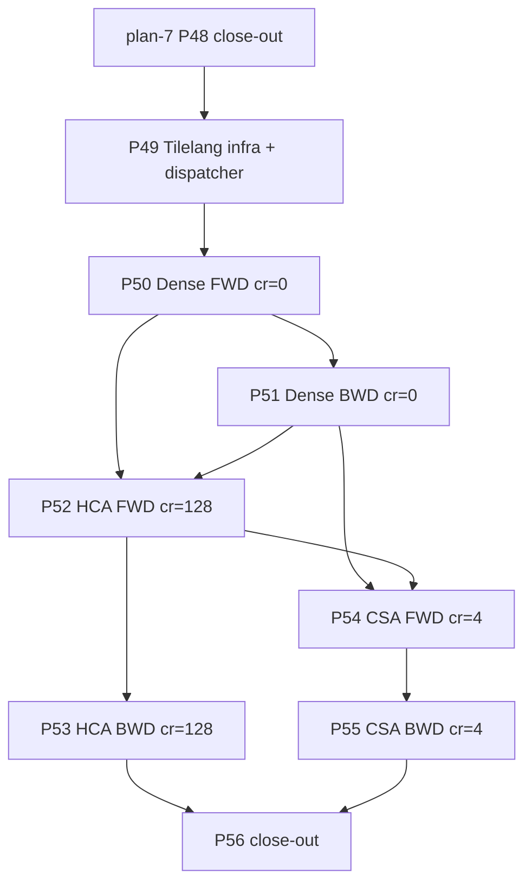

# 01 — Plan-8 Roadmap

> Plan-8 re-implements the V4 attention kernels in tilelang for the
> three compress-ratio families V4-Flash uses (`compress_ratio ∈
> {0, 4, 128}`).  The plan-4 P25 / P26 Triton kernels stay in tree
> as the parity reference + eager-fallback path; each tilelang
> kernel ships behind an env knob that defaults OFF until the
> release-tier parity gate + EP=8 proxy A/B confirms a positive
> delta.
>
> The plan-7 P48 anchor is **510.6 ms / iter** at
> **524.9 TFLOP/s/GPU** on the V4-Flash EP=8 proxy.  Plan-8's
> end-of-plan target is **≤ 470 ms / iter, ≥ 570 TFLOP/s/GPU**
> (~`1.09×` headroom over plan-7).  No optimizer-step / FP8 /
> model-arch change in plan-8 — those belong to a future plan.

## Per-phase deliverable convention

The eight-section per-phase summary file
(`progress/p<id>/p<id>-summary.md`) is a project-wide standing rule
(see [`../rules/rule.md` §R2.1](../rules/rule.md)).  Plan-4 P25
`p25-summary.md` is the canonical attention-kernel example; every
plan-8 phase ships one.

`develop/perf/attention_perf.md` cell format follows the standing
R2.5 decision: every plan-8 row uses `<ms> ms | <tflops>` —
wall-clock per-kernel-launch median (from trace or microbench)
plus the effective TFLOP/s derived from the documented
visible-pair count.

R2.6 (per-phase trace + tgz archival) applies — every phase
closes with a chrome-trace capture compressed to a same-base-name
`.tgz`.

## Phase Overview

| # | Phase | Type | Key Deliverables | Exit Criteria | Status |
| --- | --- | --- | --- | --- | --- |
| **P49** | **Tilelang infra + dispatcher** | enablement | (a) New `primus/backends/megatron/core/transformer/v4_attention_kernels/_tilelang/__init__.py` with the JIT cache key contract documented (env knob -> kernel hash).  (b) New env `PRIMUS_V4_TILELANG_ATTN` (default `"0"`).  When set, `v4_attention` / `v4_csa_attention` dispatch to the tilelang path before the Triton path.  (c) Dispatch precedence updated in `DeepseekV4Attention.forward`: `use_turbo_attention > PRIMUS_V4_TILELANG_ATTN > use_v4_triton_attention > eager` for cr=0/128; `PRIMUS_V4_TILELANG_ATTN > use_v4_triton_csa_attention > eager` for cr=4.  (d) Tilelang autotuner cache dir documented (`output/.tilelang_cache/v4/`), gitignored, env override `PRIMUS_V4_TILELANG_CACHE_DIR`.  (e) Build script `deepseek-v4/develop/progress/p49/build_tilelang_kernels.sh` that warms the cache via a one-shot AOT compile of each plan-8 kernel before the first proxy run.  (f) Ratchet check: plan-4 G23..G30 + plan-5 G32..G35 + plan-6 G36..G46 + plan-7 G47 all stay green with `PRIMUS_V4_TILELANG_ATTN=0` (no behaviour change at default-off). | (1) Importing `primus.backends.megatron.core.transformer.v4_attention_kernels._tilelang` runs at module import (no kernel JIT yet — the stub registers + raises NotImplementedError on call).  (2) Setting `PRIMUS_V4_TILELANG_ATTN=1` without any kernel landed yet falls through to the Triton path with a single rank-0 warning (banned-warning ratchet exempt).  (3) `progress/p49/p49-summary.md` documents the dispatch precedence + cache layout. | not started |
| **P50** | **Dense FWD tilelang (cr=0)** | core | (a) New `primus/backends/megatron/core/transformer/v4_attention_kernels/_tilelang/v4_attention_fwd_tilelang.py` with a `@tilelang.jit` + `@tilelang.autotune` kernel implementing the FlashAttention v2 online softmax: Q × K^T, online row-max, exp2 + cumsum, scale × V, per-head sink as virtual key column joined at end of K-loop, optional SWA window, optional `[Sq, Sk]` additive mask, optional MQA broadcast (`K_H == 1`).  Borrows from `tilelang/examples/amd/example_amd_flash_attn_fwd.py` (MI355X-tuned block sizes + WMMA `k_pack` + `T.use_swizzle`) and `tilelang/examples/attention_sink/example_mha_sink_fwd_bhsd.py` (sink fusion at end of softmax).  (b) Wrapper `v4_attention_fwd_tilelang(...)` matches the existing `_launch_v4_attention_fwd(...)` signature in `_triton/v4_attention_fwd.py` — returns `(out, lse)` with `out: q.dtype`, `lse: fp32`.  Triton path stays as the fallback when the tilelang flag is off. (c) Microbench `progress/p50/bench_v4_attention_fwd_tilelang.py` covers V4-Flash production widths (`B=1, H=64, Sq=Sk=4096, head_dim=512, dtype=bf16`) plus a small smoke shape; compares tilelang vs Triton FWD wall-clock + TFLOP/s.  (d) Unit tests `tests/unit_tests/megatron/transformer/deepseek_v4/test_p50_v4_attention_fwd_tilelang.py` (G50). | (1) G50 (FWD `out` + `lse` parity vs plan-4 G23 eager reference within bf16 `atol=2e-3 rtol=2e-3` at fast tier + release-tier slow at V4-Flash widths).  (2) Plan-4/5/6/7 ratchet stays green at `PRIMUS_V4_TILELANG_ATTN=0`.  (3) Microbench reports ≥ 1.2× FWD speedup vs the plan-4 P25 Triton kernel on V4-Flash widths (best-effort).  (4) Smoke EP=8 with `PRIMUS_V4_TILELANG_ATTN=1` on cr=0 layers only (HCA / CSA still on Triton) runs 10 iters clean with no NaN / Inf and `lm_loss` within `5e-2` of the plan-7 P48 baseline at fixed seed. | not started |
| **P51** | **Dense BWD tilelang (cr=0)** | core | (a) New `_tilelang/v4_attention_bwd_tilelang.py` implementing the **split BWD** that plan-5 P32 final shipped on the Triton side (separate `dQ` kernel + `dKV` kernel; saves the cross-block atomic_add traffic at the cost of an extra Q/K/V re-load — see `progress/p32-summary.md` §5).  Each kernel re-materialises `P` from saved `LSE` (FlashAttention-style) and walks back through the chain.  Sink, SWA, and additive-mask paths covered.  (b) Microbench `progress/p51/bench_v4_attention_bwd_tilelang.py`.  (c) Unit tests `tests/.../test_p51_v4_attention_bwd_tilelang.py` (G51). | (1) G51 (BWD `dQ` / `dK` / `dV` / `dSink` parity vs plan-4 G24 eager reference within bf16 `atol=5e-3 rtol=5e-3` at fast tier + release-tier slow).  `gradcheck` fp32 fast tier.  (2) Plan-4/5/6/7 ratchet stays green at default-off.  (3) Microbench reports ≥ 1.2× BWD speedup vs the plan-5 P32 split-BWD Triton kernels.  (4) EP=8 smoke with `PRIMUS_V4_TILELANG_ATTN=1` on cr=0 — clean 10 iters; iter time ≤ plan-7 P48 anchor. | not started |
| **P52** | **HCA FWD tilelang (cr=128)** | core | (a) Extend the P50 dense FWD kernel with the **split-mask mode** that V4 HCA uses: `seq_local_len` queries hit kernel-native SWA on `k_local`; the trailing `seq_pool_len` queries hit the compressed pool with a caller-supplied `[Sq_local, Sk_pool]` additive bias.  The joint softmax merges all candidates plus the per-head sink at the end of the K-loop.  This mirrors the plan-4 P25 `hca_local_seqlen` parameter + plan-5 P30b split-mask design.  (b) Microbench + G52 unit tests. | (1) G52 (FWD parity vs plan-4 G23 HCA path within bf16 `atol=2e-3 rtol=2e-3`).  (2) Microbench ≥ 1.15× FWD speedup vs Triton.  (3) EP=8 smoke (cr=0 + cr=128 on tilelang; CSA still on Triton) — clean 10 iters. | not started |
| **P53** | **HCA BWD tilelang (cr=128)** | core | (a) Extend the P51 split BWD with the HCA split-mask BWD path: `dq` covers both local + pool branches (re-materialises `P` from saved `LSE` + saved `local_mask` / `pool_mask`); `dk_local` / `dv_local` cover the local branch via the `k_local` / `v_local` half of the inputs; `dk_pool` / `dv_pool` cover the compressed-pool half.  Sink BWD reuses the dense path.  (b) Microbench + G53 unit tests. | (1) G53 (BWD parity vs plan-4 G24 HCA path within bf16 `atol=5e-3 rtol=5e-3`).  `gradcheck` fp32.  (2) Microbench ≥ 1.15× BWD speedup vs Triton.  (3) EP=8 smoke — clean 10 iters; lm_loss within 5e-2 of P48 baseline. | not started |
| **P54** | **CSA FWD tilelang (cr=4)** | core | (a) New `_tilelang/v4_csa_attention_fwd_tilelang.py` implementing the joint local + sparse fused softmax: per-program-tile `(b, qhid_block, m_tile)`; loads `Q_block + k_local_tile + v_local_tile` for the SWA branch; loads sparse `gathered[B, Sq, K_topk, D]` tile + `sparse_mask` for the top-K branch; per-head sink as virtual key column at end-of-K-loop.  Borrows from `tilelang/examples/dsa_sparse_finetune/sparse_mla_fwd.py` (sparse-gather pattern at MLA scale) and the plan-4 P26 + plan-5 P31 design notes (single-row sparse-tile to fit SMEM budget; in-kernel top-K gather from `pool` + `topk_idxs`).  (b) Microbench `progress/p54/bench_v4_csa_attention_fwd_tilelang.py` covers V4-Flash CSA widths (`B=1, H=64, Sq=4096, K_topk=512, head_dim=512`).  (c) Unit tests (G54). | (1) G54 (FWD parity vs plan-4 G26 eager CSA reference within bf16 `atol=2e-3 rtol=2e-3` at fast + release tiers).  (2) Microbench ≥ 1.2× FWD speedup vs plan-5 P32 final CSA Triton FWD.  (3) EP=8 smoke with all three tilelang knobs on — clean 10 iters; lm_loss within 5e-2 of P48 baseline. | not started |
| **P55** | **CSA BWD tilelang (cr=4)** | core | (a) New `_tilelang/v4_csa_attention_bwd_tilelang.py` implementing CSA BWD as a 3-kernel pipeline matching plan-5 P31b + plan-5 P32 final's segreduce design: (i) `dq_kernel` — re-materialises both branches' softmax from saved `LSE`, walks back through local + sparse + sink chains, emits `dq`; (ii) `dkv_local_kernel` — emits `dk_local / dv_local` (no atomic_add, one program per `(b, k_h_id, n_tile)`); (iii) `dpool_kernel` — segreduce variant for `dpool` (sparse scatter using sorted-inverse index, same pattern as plan-5 P32 `PRIMUS_V4_CSA_BWD_SEGREDUCE`).  Sink BWD reuses the dense pattern.  (b) Microbench + G55 unit tests. | (1) G55 (BWD parity vs plan-4 G27 eager CSA reference within bf16 `atol=5e-3 rtol=5e-3` at fast + release tiers).  `gradcheck` fp32.  (2) Microbench ≥ 1.2× BWD speedup vs plan-5 P32 final CSA Triton BWD.  (3) EP=8 smoke — clean 10 iters. | not started |
| **P56** | **Plan-8 close-out** | enablement | (a) `develop/perf/attention_perf.md` — append plan-8 rows (P50..P55) using the R2.5 cell format.  (b) `develop/perf/proxy_ep8.md` — append `P50..P55 individual` rows + `P56 final` cumulative row pinned to the 15-iter clean bake-off steady iter.  (c) `progress/p49/p49-summary.md` ... `progress/p56/p56-summary.md` per R2.1.  (d) Status pinning per R2.4.  (e) `run_deepseek_v4_flash_proxy.sh` surfaces `PRIMUS_V4_TILELANG_ATTN` env knob (default `"1"` only if the bake-off confirms ≥ 30 ms / iter saved vs P48 anchor).  (f) Plan-8 close-out commit `docs(deepseek-v4)[plan-8][P56]: plan-8 close-out`. | (1) `attention_perf.md` + `proxy_ep8.md` rows pinned.  (2) Every Phase 49..56 status row `[x]` with commit SHA.  (3) Every `p4X-summary.md` follows R2.1. | not started |

## Dependency Graph

P49 (infra) ships first because every downstream phase needs the
dispatcher + the env knob + the autotune cache directory.  P50
(dense FWD) ships next as the load-bearing FWD primitive; P51
(dense BWD) and P52 (HCA FWD — which extends P50) are independent
of each other and ship in parallel.  P53 (HCA BWD) follows P52
+ P51 (it composes both designs).  P54 (CSA FWD) re-uses the
P50 + P52 patterns and the new sparse-gather idioms.  P55 (CSA
BWD) follows P54 and re-uses P51's split-BWD pattern.  P56
close-out gates on all preceding phases.

## Milestones

| Milestone | Scope | Phases | Status |
| --- | --- | --- | --- |
| **M0: Plan-8 locked** | Plan docs + status.md tracking opened (Phase 49–56) | (kick-off, no commit) | in progress |
| **M1: Tilelang infra ready** | env knob + dispatcher + cache layout + import-time smoke | P49 | not started |
| **M2: Dense (cr=0) on tilelang** | FWD + split BWD ship behind `PRIMUS_V4_TILELANG_ATTN`; EP=8 proxy A/B shows ≥ 10 ms / iter saved on cr=0-only layers | P50 + P51 | not started |
| **M3: HCA (cr=128) on tilelang** | FWD + BWD ship; combined cr=0 + cr=128 EP=8 proxy A/B shows ≥ 5 ms / iter additional savings | P52 + P53 | not started |
| **M4: CSA (cr=4) on tilelang** | FWD + BWD ship; all three families on tilelang; combined EP=8 proxy A/B shows ≥ 15 ms / iter additional savings | P54 + P55 | not started |
| **M5: Plan-8 close-out** | `attention_perf.md` + `proxy_ep8.md` rows pinned with 15-iter clean bake-off; `PRIMUS_V4_TILELANG_ATTN` default flips to `"1"` only if the cumulative EP=8 A/B beats the P48 anchor by ≥ 30 ms / iter | P56 | not started |

End-of-plan-8 EP=8 proxy steady-iter target: **≤ 470 ms / iter, ≥
570 TFLOP/s/GPU (P33-corrected denominator)**, ~`1.09×` over the
plan-7 P48 anchor of 510.6 ms.  Best-effort, not a contract; per
R9.1 any phase that regresses end-to-end ships default-off.

## Top Risks

| Risk | Impact | Mitigation |
| --- | --- | --- |
| **Tilelang JIT cache cold-start cost** — first-iter JIT-compile of the autotune sweep adds minutes to the first proxy run on a fresh host | P50–P55 EP=8 smokes take 10+ minutes wall-clock instead of ~70 s | P49 ships `build_tilelang_kernels.sh` that AOT-compiles every shape variant up front (covers `(seq_len ∈ {4096}, head_dim ∈ {512}, K_topk ∈ {512}, has_sink ∈ {True}, swa_window ∈ {128, 0})`).  Cache dir under `output/.tilelang_cache/v4/` is gitignored but reused across runs on the same host. |
| **head_dim=512 is too large for tilelang's default tile shapes** — `tilelang/examples/amd/example_amd_flash_attn_fwd.py` autotune covers `dim ∈ {64, 128}`; V4 uses `512` and may exceed SMEM at block_M = block_N = 64 | P50 / P51 / P54 land slower than the Triton kernel (which already drops to BLOCK_M = BLOCK_N = 32 at d=512 for SMEM-budget reasons) | Each plan-8 phase's task-list refinement reruns the autotuner with `block_M ∈ {16, 32}` if the default sweep exceeds the MI355 160 KiB SMEM budget.  Microbench is the gate — if no tile shape beats Triton on the V4-Flash shape, that phase descopes default-off + flags the SMEM gap for upstream tilelang. |
| **Single-row sparse-tile constraint for CSA carries over** — plan-5 P31's per-(b, qhid, m) row-tile choice was forced by the `[BLOCK_M, BLOCK_K, head_dim] * 2 bytes ≈ 1 MiB` sparse SMEM footprint | P54 / P55 stuck at the same per-row layout as the Triton kernel; no headroom from larger tiles | The wins should come from MFMA scheduling control (`k_pack`, swizzle, pipelining) at the same tile shape, not from larger tiles.  If the per-row tilelang kernel ties the per-row Triton kernel, that phase descopes default-off.  Multi-row sparse tiles are a plan-9 follow-up if upstream tilelang exposes a programmable SMEM partitioning. |
| **Tilelang autotune is non-deterministic** — the autotuner picks the median-fastest config across a noisy bench; repeated runs may pick different configs and produce slightly different numerics | Latent miscompile shows up as a slow loss divergence after 100+ steps, not as a unit-test failure | Every plan-8 phase ships with: (a) a fast-tier `torch.autograd.gradcheck` test in fp32, (b) a release-tier bf16 parity test with `atol=2e-3` / `5e-3` (FWD / BWD), (c) an EP8 proxy 10-iter smoke comparing `lm_loss` to the plan-7 P48 baseline at fixed seed.  Bar: green at all three tiers before the env flag stays on for the next phase.  Plan-5 P32 RoPE precedent. |
| **Tilelang version drift** — `tilelang/` is a vendored clone (per R6.2 we don't edit it); upstream version bumps may break the plan-8 kernels | A future `git pull` of tilelang invalidates the plan-8 autotune cache + may break parity | Plan-8 P49 pins the tilelang commit SHA in `progress/p49/p49-summary.md` + `run_deepseek_v4_flash_proxy.sh` header note.  Any subsequent `tilelang/` update must re-run the G50..G55 ratchets before bumping the pin. |

## Out of Scope (plan-8)

- **Optimizer-step fusion** — plan-7's territory; the plan-7 P45
  prototype is the seed for a future plan-9 fused-Adam.
- **Model-arch change / new compress ratios** — plan-8 stays at
  the V4-Flash `[0, 4, 128]` schedule.
- **FP8 / FP4 / mxfp4** — separate plan.
- **Long-context (1M-token) / multi-node EP / HF state-dict
  adapter** — same as plan-5/6/7.
- **Convergence run** — plan-8 runs 10-iter smokes + 100-step
  loss-curve micro-runs only.
- **Multi-row sparse CSA tile** — plan-9 follow-up if upstream
  tilelang exposes a programmable SMEM partitioning.
