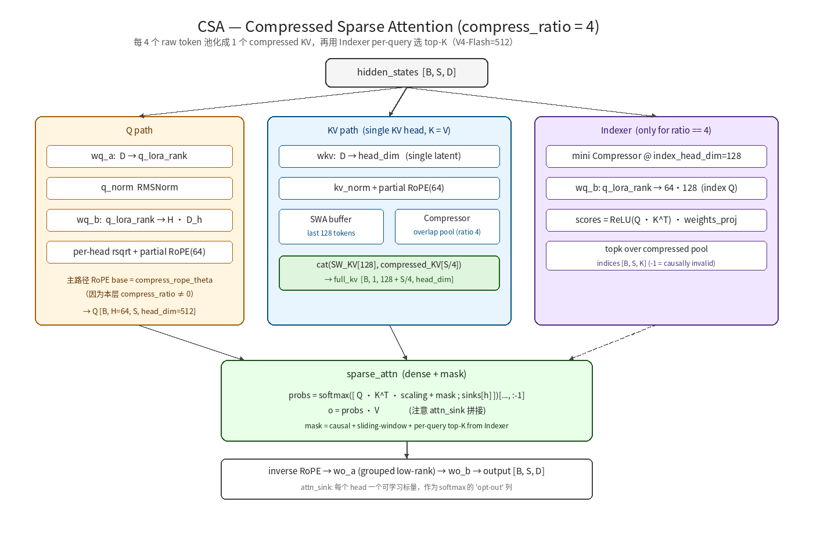
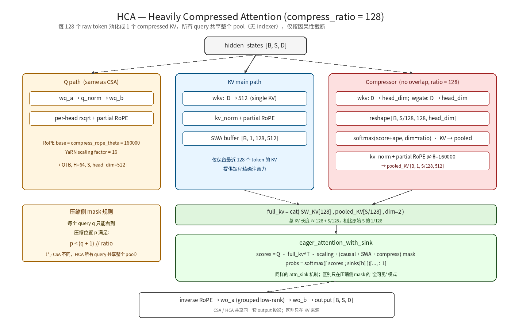
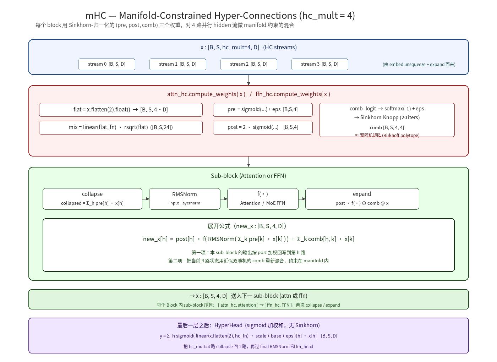
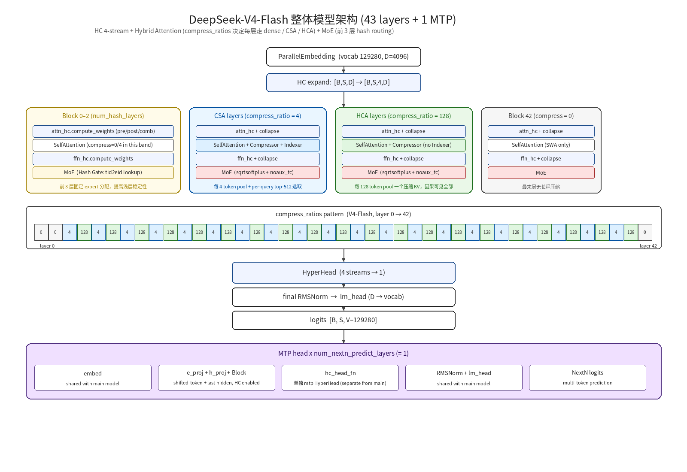

# DeepSeek-V4 Architecture Deep Dive: Core Changes vs V3 / V3.2

> This article walks the DeepSeek-V4 official technical report + `inference/model.py`
> source, plus the existing training-side port in NVIDIA NeMo AutoModel, to
> dissect every architectural change V4 introduces. The goal is to leave a
> "side-by-side, implementation-grounded" engineering reference for adding
> DeepSeek-V4 training support to Primus's Megatron-LM backend.
>
> Sources
>
> - Official weights / inference implementation: `deepseek-v4/deepseek-ai/DeepSeek-V4-Flash/` (incl. `DeepSeek_V4.pdf`, `config.json`, `inference/model.py`, `inference/kernel.py`)
> - HF Transformers PR 45616 / 45643 ("Add DeepSeek V4", author Arthur Zucker)
> - NVIDIA NeMo AutoModel training-side port: `deepseek-v4/NVIDIA-NeMo/Automodel/nemo_automodel/components/models/deepseek_v4/`
> - RedNote slide deck: "DeepSeek V4 architecture / code, all the details in one read!" (`deepseek-v4/references/deepseek-rednote-1/`)

## TL;DR — Key Differences vs V3 / V3.2

While retaining the V3 family's MoE + MTP training paradigm, DeepSeek-V4
treats "long context + efficient inference" as a primary objective and
systematically redesigns three dimensions: attention, residual connectivity,
and optimizer. **V4 is no longer a small step from V3.2 — it is an
architecture-level generation change.**

| Module | DeepSeek-V3 | DeepSeek-V3.2 (Exp) | DeepSeek-V4 |
|---|---|---|---|
| Attention | MLA (Multi-Latent Attention): low-rank KV compression + a single dense attention | MLA + DSA (DeepSeek Sparse Attention), per-layer token-level lightning indexer picking top-k tokens | **HCA + CSA** hybrid: `compress_ratios[layer_id]` decides per layer which long-range branch to take; the first `num_hash_layers` layers use Hash-Clustering instead of score routing; an `attn_sink` learnable per-head bias is added |
| Residual | Plain residual `x = x + f(x)` | Same as V3 | **mHC** (manifold-Constrained Hyper-Connections): each block carries `hc_mult=4` parallel hidden copies, mixed via a Sinkhorn-normalized `pre/post/comb` triplet of weights |
| MoE Routing | sigmoid + noaux_tc + group-limited | Same as V3 + slight sigmoid coefficient tweaks | **`sqrtsoftplus` + noaux_tc**; the first `num_hash_layers` layers replace score-topk with **`tid2eid`** hash lookup |
| FFN Activation | Plain SwiGLU | Same as V3 | **clamped SwiGLU** (`swiglu_limit=10.0`): both gate / up are absolute-value-clipped, paired with FP4/FP8 experts |
| MTP | 1-layer NextN | 1-layer NextN | Same as V3, 1-layer NextN, but the MTP block also takes part in the HC stream computation |
| Quantization | BF16 / FP8 training | Same | **MoE expert FP4** + everything else FP8 ("FP4 + FP8 Mixed"); `ue8m0` scaling format |
| Optimizer | AdamW | AdamW | **Muon** (named in DeepSeek's own report — "for faster convergence and more stable training") |
| RoPE | Single RoPE θ | Same | **Per-layer dual RoPE**: dense / SWA layers use `rope_theta=10000` with YaRN off; compressed (CSA/HCA) layers use `compress_rope_theta=160000` + YaRN factor=16 |
| Context | 128K (post YaRN) | 128K | **Native 1M tokens** (`max_position_embeddings=1048576`); pre-trained on 32T+ tokens directly to 1M, no V3-style YaRN context extension |
| KV Quantization | bf16 KV | bf16 KV + DSA fp8 sim | **Per-layer single KV-head** (`num_key_value_heads=1`) + bf16 KV + long-range branch fp4/fp8 simulation (QAT) + sliding-window KV (128 tokens) + compressed KV pool |
| Total / Active | 671B / 37B | Same | Flash 284B / 13B; Pro 1.6T / 49B |

Per the official report: "At 1M tokens, V4-Pro per-token inference FLOPs are
only **27%** of V3.2's, KV-Cache is only **10%**." These numbers come straight
from the combined CSA + HCA + Compressor compression scheme.

---

## 1. Hybrid Attention Overview: CSA + HCA

V4's attention is not a single formula but a **layer-id-switched hybrid**:

```
config.compress_ratios = [
    0,   0,                   # layer 0-1: full attention (no long-range compression branch)
    4, 128, 4, 128, ...        # layer 2-N-2: alternates between ratio=4 / ratio=128
    0                          # last layer: full attention
]
```

| Layer kind | Trigger | Name | Behavior |
|---|---|---|---|
| Full attention | `compress_ratios[i] == 0` | sliding-window dense | Local sliding window only (128 tokens) + `attn_sink` |
| HCA (Heavy Compress Attn) | `compress_ratios[i] == 128` | "Heavily Compressed" | Pool every 128 tokens into 1 compressed KV, appended to the sliding-window KV |
| CSA (Compress + Sparse Attn) | `compress_ratios[i] == 4` | "Compressed Sparse" | Pool every 4 tokens into 1 compressed KV, then via the **Indexer** pick per-query top-512 / top-1024 compressed KV |

> The "**Compressed Sparse Attention (CSA)** + **Heavily Compressed Attention (HCA)**" in the official report
> are exactly `compress_ratio==4 + Indexer` and `compress_ratio==128`.

### 1.1 Overall Data Flow

The diagrams below give the compute paths for CSA (`compress_ratio==4`, with
Indexer) and HCA (`compress_ratio==128`, fully visible):

**CSA — Compressed Sparse Attention (`compress_ratio == 4`)**



**HCA — Heavily Compressed Attention (`compress_ratio == 128`)**



The shared backbone (main Q + SWA KV + optional Compressor + optional Indexer
+ sparse_attn + grouped output) is already drawn as sub-diagrams above; we
will not repeat it here. Sections 1.2–1.5 walk the components in plain text.

### 1.2 Substantive Differences from V3 MLA

V3 MLA (simplified):

```
q_compressed = wq_a(x); q = wq_b(q_compressed)              # uplift Q
kv_compressed = wkv_a(x); k = wk_b(kv_compressed); v = wv_b(kv_compressed)
attn = softmax(q @ k^T / sqrt(d)) @ v
```

V4 attention (compress branch removed):

```
q_lora = q_norm(wq_a(x)); q = wq_b(q_lora) -> reshape [H, D_h]
q = q * rsqrt(mean(q**2)) ; q = partial_rope(q)             # extra per-head rsqrt
kv = kv_norm(wkv(x)) ; kv = partial_rope(kv)                # single KV head: K = V = kv
o = sliding_window_attn_with_sink(q, kv, sink_per_head)
o = inverse_rope(o)
o = wo_a(o.grouped_view) -> wo_b -> hidden                  # output uses grouped low-rank
```

**Key differences**:

1. **K and V share the same low-dim latent** (`num_key_value_heads=1`,
   `head_dim=512`); V3 has separate K / V projections. This shrinks per-layer
   KV memory by a factor of `num_attention_heads` vs V3.
2. The output projection moves from a single `[H*D_h] -> D` to a
   **grouped low-rank**: split `H` heads into `o_groups` groups, each group
   does `(H*D_h/o_groups) -> o_lora_rank`, then all `o_groups * o_lora_rank`
   are projected back to `D`. This sets up FP8/FP4 quantization and head-level
   TP partitioning later.
3. **`attn_sink`**: a per-head learnable scalar that acts as an extra
   "sink slot" appended to the softmax — semantically similar to the sink
   token in GPT-OSS / Llama 4, but here it is a learned per-head constant
   not tied to a specific token position.

### 1.3 Compressor: the Long-Range Compression Branch

`Compressor` downsamples a KV sequence of arbitrary length to `length / ratio`:

```text
hidden [B,S,D]
  ├── wkv:   D → coff·head_dim
  ├── wgate: D → coff·head_dim
  │           score += ape (per-position learnable)
  ↓
reshape [B, S/ratio, ratio, coff·head_dim]
  ↓ (if ratio==4)
overlap_transform → [B, S/ratio, 2·ratio, head_dim]
  ↓ (else skip overlap_transform)
pool = (KV * score.softmax(dim=ratio_axis)).sum(dim=ratio_axis)
  ↓
kv_norm (RMSNorm) → partial RoPE @ θ=160000
  ↓
pooled_KV [B, S/ratio, head_dim]
```

Mathematical formula (`m = compress_ratio`; in overlap mode, two adjacent
windows take half of the channels each):

\[
S^{(a)}_{m'i:m'(i+1)-1} = \mathrm{Softmax}_{\mathrm{row}}\bigl(Z^{(a)}_{m'i:m'(i+1)-1} + B^{(a)}\bigr), \quad
C^{Comp}_{i} = \sum_{j=m(i-1)}^{mi-1} S^{(b)}_{j}\odot C^{(b)}_{j} + \sum_{j=mi}^{m(i+1)-1} S^{(a)}_{j}\odot C^{(a)}_{j}
\]

where `(a)` / `(b)` correspond to the current and previous windows
respectively (overlap stitches the halves), and `B^{(a)}, B^{(b)}` are
learnable APEs.

- **`coff = 2 if ratio==4 else 1`**: at `ratio=4` we project to `2*head_dim` so
  that in overlap mode "current window" and "previous window" each take half
  the channels — adjacent compressed tokens slide into each other's contexts,
  smoothing window boundaries.
- **`ape`**: learnable absolute position embedding of shape
  `[ratio, coff*head_dim]`, added onto the score before softmax.
- **softmax is over `dim=2` (the ratio axis)**, not over tokens. Each
  compressed token is a weighted sum over its `ratio` raw tokens, weighted by
  `wgate` and softmax-normalized.
- **RoPE uses `compress_rope_theta=160000` instead of the main path's
  `rope_theta=10000`**. After compression, position spacing is stretched by
  `ratio`, so a longer base prevents high-frequency aliasing. The NeMo port
  flags this explicitly; HF PR 45616 missed it.

### 1.4 Indexer: CSA's Sparse Selector

Only `ratio==4` layers enable the Indexer. It picks `index_topk` compressed
KV positions per query (V4-Flash = 512, V4-Pro = 1024 — see `config.json`).

The full compute path is shown in the right-hand sub-diagram of `csa.png`.
Below is the V3.2-style mathematical formulation (V4 inherits the V3.2
lightning-indexer structure but bolts it onto its own compressed KV pool
rather than the raw KV):

\[
\mathbf{q}^Q_t = h_t W^{DQ}, \quad
\mathbf{q}^I_{t,h} = \mathbf{q}^Q_t W^{IUQ}_h, \quad
\mathbf{w}^I_{t,h} = h_t W^{w}_h
\]

\[
I_{t,s} = \sum_{h=1}^{n^I_h} w^I_{t,h} \cdot \mathrm{ReLU}\bigl(\mathbf{q}^I_{t,h} \cdot K^{IComp}_s\bigr), \qquad
C^{SprsComp}_t = \bigl\{\, C^{Comp}_s \;\big|\; I_{t,s}\in\mathrm{Top}\text{-}k(I_{t,:}) \,\bigr\}
\]

This can be read as the canonical "low-rank query-head + ReLU + head-level
weighted sum + top-k" sparse-attention selector.

Key points:

- **The Indexer carries its own mini Compressor** (`index_head_dim=128`,
  `index_n_heads=64`); the KV it produces is used only "to pick top-K for
  main attention" and does not participate in the final attention computation.
- The selected `topk_idxs` has shape `[B, S, K]`; values are either valid pool
  positions in `[0, P)`, or `-1` (causally invalid — the current query cannot
  see that far yet).
- main attention takes `topk_idxs` and turns it into a "mask over the
  compressed KV pool": unselected positions get `-inf`. So **`sparse_attn` in
  practice is dense attention + mask**, relying on the compiler / kernel to
  optimize the `-inf` mask into a sparse compute.
- HF PR 45616 originally **missed** the RoPE base switch + overlap mode +
  post-attn inverse RoPE; the NeMo port's `_apply_partial_rope` /
  `_overlap_transform` patches were precisely to align with the released
  weights. Our Primus implementation must inherit those fixes.

### 1.5 attn_sink: Stabilizing the Softmax

Each head learns a scalar `sinks[h]`; we append an "extra key column" to
each query's logits (whose value vector is zero):

```python
# eager_attention_with_sink(...) simplified
attn = q @ k^T * scaling + mask                      # [B, H, S, K]
sink = sinks.reshape(1, H, 1, 1).expand(...)          # [B, H, S, 1]
combined = cat([attn, sink], dim=-1)                  # [B, H, S, K+1]
combined -= combined.max(dim=-1, keepdim=True)        # numerical stability
probs = softmax(combined)[..., :-1]                   # take only the real-token part
out = probs @ v
```

`sinks[h]` lets each head reserve some weight that does not go to any token,
i.e. attention is allowed to opt out. This is the key to keeping the V4
softmax from being dominated by long-context noise tokens.

---

## 2. mHC: Manifold-Constrained Hyper-Connections

V4's other core innovation. A plain transformer has

```
x_{l+1} = x_l + f_l(LN(x_l))
```

V4 expands the hidden state to `hc_mult=4` parallel streams:

```
shape: [B, S, D] --(at embed)--> [B, S, 4, D]
```

The full collapse / compute / expand flow is illustrated below:



In every block, the attention / FFN sub-modules each perform a
"reduce → compute → expand". The whole loop in pseudocode:

```text
# x : [B, S, hc_mult, D]   (HC streams)
for sub_block in (Attention, FFN):
    pre, post, comb = self.<sub>_hc.compute_weights(x)   # pre/post: [B,S,4],  comb: [B,S,4,4]
    collapsed = (pre.unsqueeze(-1) * x).sum(dim=2)        # [B,S,D]
    out       = sub_block(LayerNorm(collapsed))           # [B,S,D]
    x = post.unsqueeze(-1) * out.unsqueeze(-2) + torch.matmul(comb, x)
# x stays as [B, S, hc_mult, D] entering the next layer
```

### 2.1 Inside the Mixer: pre / post / comb

`compute_weights(x)` uses one packed linear `fn` to project `[B, S, 4*D]` to
`[B, S, (2 + hc_mult) * hc_mult] = [B, S, 24]`, sliced into three pieces:

```python
mix = linear(flat_x, fn) * rsqrt              # rms-style normalization
pre  = sigmoid(mix[..., :4]   * scale[0] + base[:4])  + eps      # [B, S, 4]
post = 2 * sigmoid(mix[..., 4:8] * scale[1] + base[4:8])         # [B, S, 4]  -- 2x coefficient, NO eps
comb_logit = mix[..., 8:].view(*mix.shape[:-1], 4, 4) * scale[2] + base[8:].view(4, 4)
comb = softmax(comb_logit, dim=-1) + eps
# Sinkhorn iterations (alternating row / col normalization)
comb = comb / (comb.sum(dim=-2, keepdim=True) + eps)
for _ in range(sinkhorn_iters - 1):
    comb = comb / (comb.sum(dim=-1, keepdim=True) + eps)
    comb = comb / (comb.sum(dim=-2, keepdim=True) + eps)
```

- **`pre`**: `sigmoid + eps` produces "stream weights" in `(eps, 1+eps]`, used to
  collapse the 4 streams into 1 for attn / FFN.
- **`post`**: `2 * sigmoid(...)` (range 0–2; **note: no `+eps`, and a 2x
  coefficient**), used to expand the attn / FFN output back to 4 streams,
  acting like a GLU gate scaling factor.
- **`comb`**: a near-doubly-stochastic matrix from Sinkhorn (rows / cols
  approximately sum to 1), shape `[B, S, 4, 4]`, used to **mix the 4 streams
  with each other** while keeping them on the manifold (this is where
  "Manifold-Constrained" comes from).
- The full expand formula:
  `new_stream[h] = post[h] * f(...) + Σ_k comb[h,k] * x[k]`,
  i.e. "Sinkhorn-mix the existing 4 streams, then add the current sub-block
  output (weighted by post)".

### 2.2 Numerical Stability Constraints

The NeMo port lists three pitfalls that NVIDIA engineers actually hit, and
the **Primus implementation must avoid them**:

1. **`comb` must use softmax + Sinkhorn, not sigmoid** (HF PR 45616 originally
   used sigmoid; that's incompatible with the released weights).
2. **`post` must be `2 * sigmoid(...)`, not `sigmoid(...) + eps`** (HF PR
   originally wrote it the same as pre).
3. **All HC parameters (`fn`, `base`, `scale`) must stay in fp32**, even when
   the surrounding cast is bf16; Sinkhorn stability strongly depends on fp32.

### 2.3 Model Exit: HyperHead

After all main-trunk layers, `x` is still `[B, S, 4, D]`. A final
**`HyperHead`** collapses the 4 streams to 1:

```python
flat = x.flatten(2).float()                    # [B, S, 4D]
mixes = linear(flat, hc_fn) * rsqrt(...)       # [B, S, 4]
pre = sigmoid(mixes * scale + base) + eps      # [B, S, 4]  -- no Sinkhorn here
y = sum(pre.unsqueeze(-1) * x, dim=2)          # [B, S, D]
```

Note that `HyperHead` **does not run Sinkhorn** — it is a plain sigmoid
weighted sum. Sinkhorn is only used inside per-layer mixers; the final
collapse no longer needs to preserve double-stochasticity (because there are
no more "4 parallel streams" downstream).

### 2.4 HC Inside the MTP Block

The Next-N predict layer (`MTPBlock`) in V4 also outputs 4 streams, but its
head is **its own small `hc_head_fn`** (it does not reuse the main model's
HyperHead), with shape `[hc_mult, hc_mult*D]`. Unlike the main head, each
MTP layer trains its own copy (count = `num_nextn_predict_layers`).

---

## 3. Hash Routing: the MoE Gate for the First N Layers

`config.num_hash_layers = 3` means the first 3 MoE layers no longer use
score-topk but instead a **fixed token id → expert id lookup**:

```python
self.tid2eid = nn.Parameter(torch.empty(vocab_size, n_activated_experts, dtype=int32),
                            requires_grad=False)
# forward
indices = self.tid2eid[input_ids.flatten()]    # [N, n_activated_experts]
weights = scores.gather(1, indices.long())     # weights are still computed from scores
```

Why:

- In shallow layers, token embeddings are not yet semantically mixed; pure
  score routing causes routing jitter for identical token ids. Pre-assigning
  by hash means "the same token always goes to the same group of experts",
  which helps training stability.
- `tid2eid` is an `int32`/`int64` buffer; **it does not participate in
  gradient updates** and is pre-generated (via some hash function over token id).
- After `num_hash_layers`, layers fall back to the standard
  `sqrtsoftplus + noaux_tc` routing.

> This requires our Primus MoE Gate to allow injecting token id information,
> and to support "first N layers one gate, the rest a different gate" —
> i.e. layer-level heterogeneous specs.

---

## 4. MoE Routing: `score_function = sqrtsoftplus`

V3 used `sigmoid` as the expert score. V4 changes it to:

```python
scores = F.softplus(linear(x, gate.weight)).sqrt()
# noaux_tc: scores += bias (only for selection, not for weights)
indices = (scores + bias).topk(k, dim=-1).indices
weights = scores.gather(1, indices)            # use the *original* scores for weights
weights = weights / weights.sum(-1, keepdim=True) * route_scale
```

Why `sqrtsoftplus` (i.e. `sqrt(log(1+exp(x)))`):

- **Smooth and strictly non-negative**, avoiding sigmoid's gradient saturation
  for large positives.
- **Linear in the tail (x → +∞ ≈ √x)** — gives larger separation among
  high-score experts than sigmoid, friendlier for load balancing across many
  experts.
- Combines with `noaux_tc` (no auxiliary loss + self-updating bias) to
  achieve "load balancing without aux loss".

`route_scale` is 1.5 in V4-Flash and 2.5 in V4-Pro (larger models scale
expert weights more, akin to V3's `routed_scaling_factor=2.5`).

---

## 5. Clamped SwiGLU

Each expert's FFN adds a clamping layer on its forward:

```python
gate = self.w1(x).float()
up   = self.w3(x).float()
if swiglu_limit > 0:
    up   = torch.clamp(up,   min=-swiglu_limit, max=swiglu_limit)
    gate = torch.clamp(gate, max=swiglu_limit)
x = F.silu(gate) * up
return self.w2(x.to(dtype))
```

`swiglu_limit=10.0` is the same in both released checkpoints. fp4/fp8
quantization is highly sensitive to outliers; clamp is essential for
numerical stability.

---

## 6. RoPE: dual base + YaRN details

```yaml
rope_theta: 10000              # main attention path
compress_rope_theta: 160000    # Compressor / Indexer sub-modules
rope_scaling:
  type: yarn
  factor: 16
  beta_fast: 32
  beta_slow: 1
  original_max_position_embeddings: 65536
```

**Implementation notes**:

1. For any layer with `compress_ratios[i] != 0`, **the main Q/KV path also
   uses compress_rope_theta + YaRN, not just the Compressor internals**. The
   NeMo port flags this as "reference behavior; HF PR 45616 missed it" —
   Primus should follow the corrected version directly.
2. **YaRN is not enabled model-wide**: dense / SWA layers (`compress_ratio == 0`)
   use `rope_theta=10000` and `original_seq_len=0` (YaRN off); compressed
   layers use `compress_rope_theta=160000` + `original_seq_len=65536` + YaRN
   (`factor=16`, `beta_fast=32`, `beta_slow=1`). This is explicit in
   `Attention.__init__`:
   ```python
   if self.compress_ratio:
       original_seq_len, rope_theta = args.original_seq_len, args.compress_rope_theta
   else:
       original_seq_len, rope_theta = 0, args.rope_theta   # disable YaRN
   ```
   **Meaning V4's 1M long-context capability comes mainly from the
   compression branches + Sinkhorn-stable HC, not from V3-style "short
   training + YaRN extension at inference".**
3. RoPE is only applied to the last `qk_rope_head_dim=64` dimensions per
   head (partial RoPE); the leading `head_dim - 64 = 448` dims stay nope.
   This matches V3's `qk_pos_emb_head_dim=64`.
4. The released weights were trained with the **complex-multiplication
   interleaved RoPE** (pairs `(2k, 2k+1)`); HF Llama-style `rotate_half`
   (pairs `(d, d+rd/2)`) yields incompatible results. **Primus must use the
   interleaved variant to align with the released weights** (in case we want
   to load pretrained weights later). For pure from-scratch training either
   layout works, but for NeMo / HF interop only one layout is correct.

---

## 7. Other Engineering Details

| Detail | Value / behavior |
|---|---|
| `sliding_window` | 128 tokens (every layer's main attention has this banded mask) |
| KV cache (inference) | sliding-window buffer + compress pool concatenated; cache size = `window + max_seq_len/ratio` |
| `o_groups` | Flash 8 / Pro 16; controls how `wo_a`'s grouped low-rank is partitioned |
| `o_lora_rank` | 1024; output projection rank |
| `q_lora_rank` | Flash 1024 / Pro 1536 |
| `head_dim` | 512 (NOT V3's 192 = 128 nope + 64 rope! V4 fuses nope into a single 512 head) |
| `index_head_dim` | 128 |
| `index_n_heads` | 64 |
| `index_topk` | Flash 512 / Pro 1024 |
| `expert_dtype` | fp4 (`float4_e2m1fn_x2`) for Flash/Pro releases; FP8 for Base |
| Optimizer | Muon (named in DeepSeek's report; the inference repo does not include the training loop) |

---

## 8. Overall Model Architecture

Overall architecture (V4-Flash, 43 layers + 1 MTP); each layer takes one of
dense / CSA / HCA branches based on `compress_ratios[i]`:



Quick reference for each layer kind:

| Layer range | compress_ratio | gate type | attention branch |
|---|---|---|---|
| 0 ~ `num_hash_layers - 1` (first 3 layers) | 0 / 4 / 128 | hash (tid2eid) | depends on ratio |
| from `num_hash_layers` onward | 0 / 4 / 128 | sqrtsoftplus + noaux_tc | depends on ratio |
| last layer | 0 | sqrtsoftplus | SWA only |
| MTP (last + 1 ...) | same as main | same | same |

---

## 9. Supplementary Details from the RedNote Slides

The content below comes from the RedNote slide deck
(`deepseek-v4/references/deepseek-rednote-1/images_png/`, 12 slides total),
which I read after converting the original webp to PNG. They are
**complementary** to the main text above — adding mathematical derivations,
design motivations, and the author's calls on V4's engineering trade-offs.

I have already converted the 12 originals into PNGs at
[`deepseek-v4/references/deepseek-rednote-1/images_png/`](../../references/deepseek-rednote-1/images_png/),
and inline them directly in this document.

### 9.1 Big-Picture: V4's 4 Core Improvements (slide 2 / 3)

| Dimension | V3 / V3.2 | V4 |
|---|---|---|
| FFN | DeepSeekMoE (fine-grained routed + shared) | Gate switches to √Softplus(·); first 3 layers use Hash routing |
| Attention | MLA (V3) / MLA + DSA Lightning Indexer (V3.2) | Hybrid Attention: interleaved CSA + HCA |
| Residual | Standard residual | mHC: Manifold-Constrained Hyper-Connections |
| Optimizer | AdamW | Muon (embedding / head / mHC static bias / RMSNorm still on AdamW) |

> Author's verbatim quote:
>
> > "**Hybrid Attention**: CSA (Compressed Sparse Attention) + HCA (Heavily
> > Compressed Attention) interleaved (except for the first two layers which
> > are consecutive HCA). CSA uses compress ratio 4 and a Lightning Indexer
> > to do top-K sparse KV selection. HCA uses a high compress ratio of 128
> > with no KV sparsity, just dense MQA. **This is the core technology that
> > lets DS V4 reach low FLOPs / KV cache at 1M context.**"

We can read the overall structure as 3 parallel
"Pre-Block Mixing → DeepSeekMoE / CSA-HCA → Post-Block Mixing → Residual Mixing"
sub-modules (the transformer-block ×L block diagram in slide 3). mHC's three
mappings respectively play the Pre / Post / Residual "manifold-constrained
mixing" roles.

The original block diagram (corresponding to slide 3):


### 9.2 CSA's Math: from O(n) candidates to O(n/m) candidates (slide 3)

V3.2's DSA runs the Lightning Indexer top-K directly on the raw KV, so
**each query's candidate set is O(n)**. V4's key insight is:

> **Compress KV to O(n/m) first, then run the Lightning Indexer top-K**.
> The Indexer's candidate set shrinks to 1/m of what it was.

This is two steps:

1. **KV Compress**: two learnable low-rank KV projections take the current
   window and the previous window into latents
   `C^a_i = H · W^aKV` and `C^b_i = H · W^bKV` (note: two latents, one for
   "current window" and one for "previous window" overlap).
2. Two more projections `Z^a = H · W^aZ`, `Z^b = H · W^bZ` compute softmax
   weights (gating).
3. **Two compress weights are computed for `m=4` consecutive tokens**:

   \[
   S^{(a)}_{m'i:m'(i+1)-1};\; S^{(b)}_{m'(i-1):m'i-1}
   = \mathrm{Softmax}_{\text{row}}\!\left(\bigl[Z^{(a)}_{m'i:m'(i+1)-1} + B^{(a)};\; Z^{(b)}_{m'(i-1):m'i-1} + B^{(b)}\bigr]\right)
   \]

4. **The weights compose the compressed entry** ("the two windows overlap by
   half — the key to CSA's smoothness"):

   \[
   C^{Comp}_i = \sum_{j=mi}^{m(i+1)-1} S^{(a)}_j \odot C^{(a)}_j + \sum_{j=m(i-1)}^{mi-1} S^{(b)}_j \odot C^{(b)}_j
   \]

> "Strict causality leaves blind spots inside each compressed block" (slide 7):
> a CSA / HCA query can only "see" already-finished compressed blocks;
> the `m-1` neighbors inside the same compressed block are mutually invisible.
> **Hence the SWA buffer (`n_win=128`) is needed as uncompressed KV,
> concatenated in front of the compressed KV for attention** — this is the
> "blind-spot fix" motivation for V4 attention.

### 9.3 mHC: the Three Manifold-Constraint Properties (slides 7–9)

The RedNote post spends 3 slides on a complete mathematical exposition of
mHC; here is the condensed version.

#### 9.3.1 HC's Formal Definition

HC widens the residual stream from `C` to `nC` (`n = hc_mult = 4`),
i.e. n parallel residual streams. The HC formula at one layer:

\[
\mathbf{x}_{l+1} = \mathcal{H}^{res}_l \mathbf{x}_l + \mathcal{H}^{post}_l \mathcal{F}\bigl(\mathcal{H}^{pre}_l \mathbf{x}_l, W_l\bigr)
\]

- $\mathcal{H}^{res} \in \mathbb{R}^{n\times n}$: learnable feature mixing matrix within the residual streams.
- $\mathcal{H}^{pre} \in \mathbb{R}^{1\times n}$: collapse → 1 stream into the sub-block.
- $\mathcal{H}^{post} \in \mathbb{R}^{1\times n}$: expand → n streams back out.

All three mappings have the form `α · tanh(θ x̄_l^T) + b`, **with RMSNorm on
the input, a learnable gating factor α (paper initializes α=0.01), and a
static bias b**.

#### 9.3.2 The Key mHC Constraint: `H^res` is Doubly Stochastic

The core constraint mHC adds on top of HC is to keep $\mathcal{H}^{res}$
on the **Birkhoff polytope** (the manifold of doubly stochastic matrices):

\[
\mathcal{P}_{\mathcal{M}^{res}}(\mathcal{H}^{res}) := \bigl\{\, H \in \mathbb{R}^{n\times n}\;\big|\; H \mathbf{1}_n = \mathbf{1}_n,\; \mathbf{1}_n^\top H = \mathbf{1}_n^\top,\; H \ge 0 \,\bigr\}
\]

With this constraint, HC's three classic problems are addressed:

| Property | Meaning | Problem solved |
|---|---|---|
| **Norm preservation** | A doubly stochastic matrix has spectral norm $\Vert H \Vert_2 \le 1$ | The learned mapping is non-expansive — **alleviates exploding gradients** |
| **Compositional closure** | Doubly stochastic matrices are closed under multiplication; the composite $\prod H^{res}$ is still doubly stochastic | **Stability is guaranteed in the depth direction** |
| **Birkhoff polytope as convex hull** | It is the convex hull of all $n\times n$ permutation matrices; $H x$ is therefore a convex combination of stream features | Mean preserved, variance bounded, **naturally prevents signal drift** |

> Toy example (n=2): $H = \begin{pmatrix} 0.7 & 0.3\\ 0.3 & 0.7 \end{pmatrix}$,
> i.e. "each stream's output = 0.7 of itself + 0.3 of the other stream". There
> is information mixing, but no per-stream amplification — **"stable with
> information exchange"**.

#### 9.3.3 Implementation: Two-Step Projection

**Step 1**: compute the unconstrained $\tilde{\mathcal{H}}$:

\[
\tilde{x}_l = \mathrm{RMSNorm}(\mathrm{vec}(x_l)),\quad
\tilde{\mathcal{H}}^{pre}_l = \alpha^{pre}_l \cdot (\tilde{x}_l \varphi^{pre}_l) + b^{pre}_l, \;
\tilde{\mathcal{H}}^{post}_l = \alpha^{post}_l \cdot (\tilde{x}_l \varphi^{post}_l) + b^{post}_l, \;
\tilde{\mathcal{H}}^{res}_l = \alpha^{res}_l \cdot \mathrm{mat}(\tilde{x}_l \varphi^{res}_l) + b^{res}_l
\]

> The key parameterization difference between HC and mHC: HC RMSNorms each
> stream's `n×C` state independently, whereas **mHC first flattens all streams
> into one `1×nC` vector then RMSNorms and projects** — so all three mappings
> can use full cross-stream information at compute time.

**Step 2**: project onto the manifold constraint:

\[
\mathcal{H}^{pre}_l = \sigma(\tilde{\mathcal{H}}^{pre}_l) \in (0, 1),\qquad
\mathcal{H}^{post}_l = 2\sigma(\tilde{\mathcal{H}}^{post}_l) \in (0, 2),\qquad
\mathcal{H}^{res}_l = \mathrm{Sinkhorn\text{-}Knopp}(\tilde{\mathcal{H}}^{res}_l)
\]

- The reasons the `2 · σ(\tilde{\mathcal{H}}^{post})` factor of 2 appears:
  **make the expectation roughly 1 (matching HC's static bias of 1 at init)**
  while widening the output range to (0, 2) for more expressive room.
- Sinkhorn-Knopp algorithm: $M^{(0)} = \exp(\tilde{\mathcal{H}}^{res})$, then
  alternate row / col normalization $M^{(t)} = \mathcal{T}_r(\mathcal{T}_c(M^{(t-1)}))$.
  **Experiments show $t_{\max}=20$ iterations are sufficient for very high precision.**

> This **lines up exactly** with the NeMo engineering experience in §2.2:
> `comb` must be softmax + Sinkhorn (not sigmoid), `post` must be `2 · sigmoid`
> (not `sigmoid + eps`), and HC parameters must stay fp32 throughout.

### 9.4 Anticipatory Routing: a "delayed-by-one" rescue for MoE routing (slide 11)

> The author observes that loss spikes are correlated with MoE routing:
> the routing mechanism amplifies outliers.
> The fix: at step `t`, compute features with the current parameters $\theta_t$,
> but **use the routing index pre-computed with $\theta_{t-\Delta t}$** (i.e.
> routing lags by one step). This is a **rescue strategy used only when a
> loss spike is detected**, and we resume synchronous routing once the loss
> stabilizes.

This is not visible in the public `inference/model.py` (inference does not
need it), but the training side does:

- a loss-spike detector (Z-score over a trailing window)
- an EMA copy of the routing parameters (a lagged copy of `gate.weight`,
  `e_score_correction_bias`)
- a switch to enable "lagged routing" during a spike

For Primus this is **low priority**: in v1 we can skip it and stabilize the
basic routing first.

### 9.5 Muon Hybrid Newton-Schulz Coefficients (slides 11–12)

Muon replaces AdamW's second-moment estimate with a Newton-Schulz (NS)
iteration. Full pseudocode:

```text
Algorithm 2 Muon
Require: learning rate η, momentum μ
  Initialize B_0 = 0
  for t = 1, ..., do
      G_t = ∇_θ L_t(θ_{t-1})
      B_t = μ B_{t-1} + G_t          # momentum running average
      O_t = NewtonSchulz5(B_t)       # project B_t onto the nearest semi-orthogonal matrix
      θ_t = θ_{t-1} - η · O_t
  end for
```

The NS iteration finds the semi-orthogonal matrix nearest to the momentum
matrix $B_t$:
$\mathrm{Ortho}(B_t) = \arg\min_O \{\Vert O - B_t \Vert_F :\, O^\top O = I\;\text{or}\; O O^\top = I\}$.

DeepSeek V4's actual **Hybrid Newton-Schulz iteration**:

\[
M_k = a M_{k-1} + b \bigl(M_{k-1} M_{k-1}^\top\bigr) M_{k-1} + c \bigl(M_{k-1} M_{k-1}^\top\bigr)^2 M_{k-1}
\]

| Phase | Steps | (a, b, c) | Purpose |
|---|---|---|---|
| Aggressive | first 8 steps | (3.4445, -4.7750, 2.0315) | drive singular values toward 1 quickly |
| Stable | last 2 steps | (2, -1.5, 0.5) | lock singular values around 1 |

**Why two phases**: a single aggressive coefficient overshoots (singular
values oscillate); a single stable coefficient converges too slowly.

**Why semi-orthogonal**: the $\Delta W$ produced by SGD-momentum / Adam is
typically low-rank (updates dominated by a few directions); orthogonalization
flattens update magnitude across all directions — some "small-magnitude
directions" are important globally but get drowned out otherwise.

**Why V4 no longer needs QK-Clip** (which V3.2's Muon used): V4 RMSNorms Q
and KV directly, so attention logits cannot blow up — Muon no longer needs
QK-Clip as a safety net.

#### 9.5.1 Muon vs AdamW Parameter Allocation (slide 12)

| Module | Optimizer | Reason |
|---|---|---|
| Embedding | AdamW | Sparse update (only rows for tokens seen in the batch) |
| Prediction head | AdamW | Same |
| **mHC's static bias $b_l$, gating factor $\alpha_l$** | AdamW | They are 1D scalars / vectors — orthogonalization is meaningless |
| RMSNorm | AdamW | Same — 1D vectors |
| **All other parameters (attention, MoE expert, mHC's `fn` / `scale`, etc.)** | **Muon** | 2D weight matrices — orthogonalization equalizes update directions |

Primus's existing `muon_optimizer_patches.py` already supports "pick optimizer
by module type"; we just need a yaml whitelist / blacklist field that maps
to V4's table above.

### 9.6 Anticipatory + clamped SwiGLU + Quantization (slide 11)

- `swiglu_limit=10.0` (10 in both V4-Flash and V4-Pro): `up = clamp(up, -10, 10)`,
  `gate = clamp(gate, max=10)`.
- **MoE expert is FP4 throughout (MXFP4 format)**, **CSA Indexer's QK path is
  also FP4** ("to reduce the indexer's own memory traffic and compute"),
  **everything else stays FP8**.
- auxiliary-loss-free load balancing is retained (bias controls top-k); a
  **low-rank sequence-level balance loss** is added as auxiliary.

### 9.7 The Layer Layout's Intuitive Explanation (slide 6)

> "Notice that V4-Pro's `config.json` has a `compress_ratios` parameter —
> a length-62 list (61 main layers + 1 MTP)."
>
> - **Layers 0–1**: HCA only (`m=128`). The bottom layer (non-abstract
>   features) needs a global coarse view; the Indexer is unnecessary.
> - **Layers 2–60**: CSA and HCA alternate.
> - **Layer 61 (the MTP block)**: `m=0`, falls back to plain sliding-window
>   attention.
>
> Intuitively: the bottom keeps a global view; afterwards we alternate
> fine-grained local detail (CSA top-k sparse + 4× compression) with coarse
> global summaries (HCA 128× dense).

V4-Flash, with only 43 layers, shrinks the front dense block to 2 layers —
the rest follows the same pattern.

### 9.8 Recommended Reading (slide 2)

The "must-read paper" list from the RedNote post (sorted by importance) —
useful as a reference when reviewing the Primus implementation:

| Importance | Paper | Mapping to V4 |
|---|---|---|
| ★★★★★ | **Muon optimizer** | §9.5 Muon |
| ★★★★★ | **mHC: Manifold-Constrained Hyper-Connections** | §9.3 mHC |
| ★★★ | Residual baselines: mHC / AttenRes / MoDA | mHC ablation studies |
| ★★ | Engram: Conditional Memory via Scalable Lookup | hash routing extension (V4 doesn't use it but the idea is close — see §3) |
| ★★ | DualPath: Breaking the Storage Bandwidth Bottleneck in Agentic LLM Inference | KV cache optimization (another reference for V4's 1/10 KV) |

---

## 10. Implementation Priorities from the Primus / Megatron-LM Perspective

Where V4 differs from existing GPT / MLA / Mamba specs (sorted by amount of work, biggest first):

1. **Hybrid Attention (CSA + HCA + SWA)**: must write a new
   `DeepSeekV4SelfAttention` (cannot reuse `MLASelfAttention`) that wraps
   custom `Compressor` / `Indexer` sub-modules. Needs a new `attn_sink`
   parameter (per-head learnable scalar) and the sparse-attention mask
   construction logic. **The SWA buffer is mandatory** (§9.2 motivation —
   the causal blind-spot fix); cannot be skipped.
2. **mHC Hyper-Connections**: requires writing a new
   `HyperConnectionTransformerLayer` to replace `TransformerLayer`, since the
   hidden state shape changes from `[B, S, D]` to `[B, S, 4, D]`, and the
   `pre/post/comb` calculations and the residual path are all different.
   **All HC parameters must be fp32** (§2.2, §9.3); the Sinkhorn-Knopp
   iteration runs 20 times. Coupling with Megatron's PP/TP, the shape change
   has implications at PP send/recv stage boundaries.
3. **Heterogeneous MoE Gate**: the first `num_hash_layers=3` layers use
   `tid2eid` hashing — we need the `gate_module_spec` to support
   "different gate class per layer index" and to plumb `input_ids` into the
   gate at forward time (not in the Megatron standard forward signature).
4. **dual-RoPE (different bases for main / compress paths + YaRN only on
   compressed layers)**: per-layer RoPE choice driven by `compress_ratio`:
   - `compress_ratio == 0` → `rope_theta=10000`, YaRN off
   - `compress_ratio != 0` → `compress_rope_theta=160000`, YaRN factor=16

   Need to inject layer-aware `freqs_cis` before `apply_rotary_emb`.
   **This is the key to V4's long-context capability and cannot be simplified
   to a single model-wide RoPE.**
5. **`sqrtsoftplus` score function**: a small branch in Megatron's
   `TopKRouter` (which already supports sigmoid / softmax). Tiny patch.
6. **clamped SwiGLU**: clamp on top of the `MLP` activation. Tiny patch.
7. **Muon optimizer parameter allocation**: Primus already has
   `muon_optimizer_patches.py`, but we need to follow §9.5.1: "Embedding /
   Prediction head / mHC static bias / RMSNorm" → AdamW; everything else →
   Muon. Need yaml whitelist / blacklist. Hybrid Newton-Schulz coefficients
   (8 aggressive + 2 stable steps) must be the §9.5 numbers exactly.
8. **MTP**: Primus already supports `mtp_num_layers`, but V4's MTP also
   carries HC streams — the MTP block must accept 4-stream input; the MTP
   has its own independent `hc_head_fn` (does not reuse the main model's
   HyperHead).
9. **(Optional) Anticipatory Routing**: loss-spike detection + routing-param
   EMA + lagged-routing switch. As a rescue strategy only; **can be skipped
   in v1** and added later as a stability enhancement.
10. **(Phase 2) FP4/FP8 Mixed**: BF16 reference implementation suffices for
    training v1; FP4 expert (MXFP4) + FP4 Indexer QK + FP8 elsewhere is a
    follow-on optimization phase.

The next step is to convert this analysis into a **development plan**
(`deepseek-v4/develop/plan-deepseek-v4-in-primus.md`) that breaks the work
down by module / phase.

---

## Appendix A: Key Parameter Reference (V4-Flash vs V4-Pro)

| Field | V4-Flash | V4-Pro | Notes |
|---|---|---|---|
| `hidden_size` | 4096 | 7168 | |
| `num_hidden_layers` | 43 | 61 | |
| `num_attention_heads` | 64 | 128 | |
| `num_key_value_heads` | 1 | 1 | single KV head |
| `head_dim` | 512 | 512 | |
| `q_lora_rank` | 1024 | 1536 | |
| `o_lora_rank` | 1024 | 1024 | |
| `o_groups` | 8 | 16 | |
| `n_routed_experts` | 256 | 384 | |
| `n_shared_experts` | 1 | 1 | |
| `num_experts_per_tok` | 6 | 6 | |
| `moe_intermediate_size` | 2048 | 3072 | per-expert FFN inter dim |
| `routed_scaling_factor` | 1.5 | 2.5 | |
| `num_hash_layers` | 3 | 3 | |
| `hc_mult` | 4 | 4 | |
| `hc_sinkhorn_iters` | 20 | 20 | |
| `index_topk` | 512 | 1024 | |
| `compress_ratios` | see below | see below | per-layer pattern |
| Total / Active params | 284B / 13B | 1.6T / 49B | |
| Context length | 1M | 1M | YaRN factor=16 |

`compress_ratios` pattern (V4-Flash, full sequence):

```
[0, 0, 4, 128, 4, 128, 4, 128, 4, 128, 4, 128, 4, 128, 4, 128,
 4, 128, 4, 128, 4, 128, 4, 128, 4, 128, 4, 128, 4, 128, 4, 128,
 4, 128, 4, 128, 4, 128, 4, 128, 4, 128, 4, 0]
```

Read as: "the first 2 layers are dense; the middle 40 alternate ratio=4 / 128
(CSA + HCA); the last layer is dense." V4-Pro's pattern:

```
[128, 128, 4, 128, 4, 128, ..., 4, 0]
```

Note that V4-Pro's first 2 layers have ratio=128 (not 0), and the total
layer count grows accordingly.

---

## Appendix B: Per-Layer Parameter Count (V4-Flash, rough)

```
attention:
  wq_a:        D * q_lora_rank        = 4096 * 1024            ≈ 4.2 M
  wq_b:        q_lora_rank * H * Dh   = 1024 * 64 * 512        ≈ 33.6 M
  q_norm:      q_lora_rank            = 1024
  wkv:         D * head_dim           = 4096 * 512             ≈ 2.1 M
  kv_norm:     head_dim               = 512
  wo_a:        H*Dh/og * og*olr       = 4096 * 1024 (= 4.2M)
  wo_b:        og*olr * D             = 8 * 1024 * 4096        ≈ 33.6 M
  attn_sink:   H = 64
  -> per attention layer ≈ 78 M (including wq_a/wq_b/wkv/wo_a/wo_b)

  compressor (ratio==4 layers also have indexer):
    wkv:       D * 2*head_dim         = 4096 * 1024            ≈ 4.2 M
    wgate:     D * 2*head_dim         = 4096 * 1024            ≈ 4.2 M
    ape:       4 * 1024
    indexer.compressor (index_head_dim=128):  4096 * 256 + 4096*256 ≈ 2.1 M
    indexer.wq_b:  1024 * 64*128 = 8.4 M
    indexer.weights_proj:  4096 * 64 = 0.26 M
    -> CSA layer extra ≈ 19 M; HCA layer extra ≈ 8.4 M

moe:
  router:     D * E_total             = 4096 * 256             ≈ 1.0 M
  routed expert:  3 * D * D_inter * E = 3 * 4096 * 2048 * 256  ≈ 6.4 B (BF16) / 1.6 B (FP4 expert)
  shared expert:  3 * D * D_inter     = 3 * 4096 * 2048        ≈ 25 M

HC mixer (per block, fp32):
  attn_hc.fn:  24 * 4 * D = 24 * 4 * 4096                      ≈ 0.4 M
  ffn_hc.fn:   24 * 4 * D                                      ≈ 0.4 M
  scales/bases: a few KB
```

`Total ~ 284B` is dominated by 43 layers × 6.4B (BF16 expert) ≈ 275B of
expert parameters.

---

> Next up: `deepseek-v4/develop/plan-deepseek-v4-in-primus.md` — turn the
> "differences" above into a concrete code-change list inside the Primus
> repo, sequenced by milestone.
