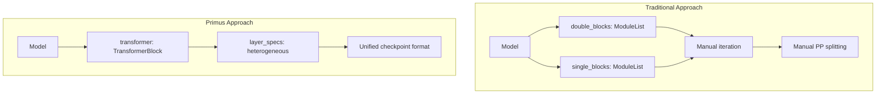

# Flux Architecture Deep Dive

## Table of Contents

1. [Overview](#overview)
2. [Architecture Principles](#architecture-principles)
3. [Model Components](#model-components)
4. [Data Flow](#data-flow)
5. [Mathematical Formulation](#mathematical-formulation)
6. [Implementation Details](#implementation-details)
7. [Megatron-Core Integration](#megatron-core-integration)
8. [Performance Optimizations](#performance-optimizations)

---

## Overview

Flux is a **flow-based diffusion model** for high-quality text-to-image generation. It uses an innovative **MMDiT (Multimodal Diffusion Transformer)** architecture that jointly processes image and text tokens through shared transformer blocks.

### Key Innovations

1. **Flow Matching**: Uses rectified flow instead of traditional diffusion
2. **MMDiT Architecture**: Joint image-text attention in early layers
3. **3D RoPE**: Multi-dimensional rotary position embeddings for spatial awareness
4. **Two-Stage Processing**: Joint layers followed by image-only layers

### Model Variants

| Variant | Joint Layers | Single Layers | Parameters | Use Case |
|---------|--------------|---------------|------------|----------|
| Flux 535M | 1 | 1 | ~535M | Development, testing |
| Flux 12B | 19 | 38 | ~12B | Production deployment |

---

## Architecture Principles

### 1. Flow Matching Framework

Unlike traditional diffusion (which adds Gaussian noise), Flux uses **rectified flow**:

```
Forward process:  z_t = (1-t) * z_0 + t * z_1
where:
  - z_0 = original image (latent)
  - z_1 = random noise
  - t ∈ [0, 1] is the flow timestep
```

The model predicts the **velocity field** v_θ:

```
v_θ(z_t, t, c) ≈ z_1 - z_0
```

**Advantages**:
- Straight-line interpolation paths (more efficient than diffusion curves)
- Faster sampling (fewer steps needed)
- Better training stability

### 2. MMDiT (Multimodal Diffusion Transformer)

Traditional DiT processes image tokens independently. MMDiT jointly processes image and text:

```
┌─────────────┐     ┌─────────────┐
│ Image Tokens│     │ Text Tokens │
└──────┬──────┘     └──────┬──────┘
       │                   │
       └───────┬───────────┘
               │
        ┌──────▼──────┐
        │ Joint Attn  │ ← Cross-attend image ↔ text
        └──────┬──────┘
               │
        ┌──────▼──────┐
        │   Split     │
        └──┬───────┬──┘
           │       │
   ┌───────▼──┐ ┌─▼────────┐
   │ Image MLP│ │ Text MLP │ ← Separate processing
   └──────────┘ └──────────┘
```

**Benefits**:
- Better text-image alignment
- Richer cross-modal interactions
- Improved compositional understanding

### 3. Two-Stage Processing

Flux uses a unique two-stage architecture:

**Stage 1: Joint Processing (Double Blocks)**
- Both image and text tokens
- Multi-modal attention
- Rich semantic understanding

**Stage 2: Image Refinement (Single Blocks)**
- Image tokens only (text concatenated but not separated)
- Focus on spatial coherence
- Fine-grained detail generation

---

## Model Components

### 1. Input Embeddings

#### Image Path

```
Image (RGB) → VAE Encoder → Latents [B, 64, H/8, W/8]
                           ↓
                    Patchify + Linear
                           ↓
              Image Tokens [B, H*W, 3072]
```

**VAE**: AutoencoderKL (8x downsampling)
- Input: 1024×1024 RGB image
- Output: 64×128×128 latent

**Linear Projection**: Maps 64 channels → 3072 hidden dim

#### Text Path

```
Caption → T5-XXL Encoder → Embeddings [B, S, 4096]
                          ↓
                    Linear Projection
                          ↓
              Text Tokens [B, S, 3072]

Caption → CLIP-L Encoder → Pooled [B, 768]
                          ↓
                    MLP Embedder
                          ↓
                Vector Embedding [B, 3072]
```

**T5-XXL**: Context-rich text embeddings (max 512 tokens)
**CLIP-L**: Global style/semantic vector (768 dim)

#### Conditioning

```
Timestep t ∈ [0, 1] → Sinusoidal Encoding → [B, 256]
                                            ↓
                                          MLP
                                            ↓
                              Timestep Embedding [B, 3072]

(Optional) Guidance scale g → Linear → [B, 3072]
```

**Combined Conditioning Vector**:
```
vec = timestep_emb + clip_pooled_emb + [guidance_emb]
```

### 2. Position Embeddings (3D RoPE)

Flux uses **3D Rotary Position Embeddings** for spatial awareness:

**Axes**:
1. **Axis 0**: Channel groups (16 groups for 64 channels)
2. **Axis 1**: Height positions (e.g., 128 for 1024px)
3. **Axis 2**: Width positions (e.g., 128 for 1024px)

**Implementation**:
```python
# Generate position IDs for each axis
pos_ids = [
    (h * W + w) // (16 * patch_size),  # Axis 0: channel group
    h,                                  # Axis 1: height
    w,                                  # Axis 2: width
]

# Compute frequencies for each axis
theta_i = theta ^ (2i / dim_axis)
freqs = pos_id / theta_i

# Apply RoPE rotation
cos_freq = cos(freqs)
sin_freq = sin(freqs)
```

**Advantages**:
- Encodes spatial structure (height × width)
- Encodes channel relationships
- Works for any resolution (generalization)

### 3. MMDiT Layer (Double Block)

Each MMDiT layer performs:

```
Input: img [B, H*W, D], txt [B, S, D], vec [B, D]

1. Pre-normalization (AdaLN with timestep conditioning)
   img_norm = AdaLN(img, vec)
   txt_norm = AdaLN(txt, vec)

2. Joint Self-Attention
   img_qkv = Linear(img_norm)  # [B, H*W, 3*D]
   txt_qkv = Linear(txt_norm)  # [B, S, 3*D]

   # Concatenate for joint attention
   joint_qkv = concat([img_qkv, txt_qkv], dim=1)  # [B, H*W+S, 3*D]

   # Apply attention
   joint_out = Attention(joint_qkv)  # [B, H*W+S, D]

   # Split back
   img_attn, txt_attn = split(joint_out, [H*W, S])

3. Gated Residual Addition
   img = img + gate_img * img_attn
   txt = txt + gate_txt * txt_attn

4. Feed-Forward Networks (separate for img and txt)
   img_mlp = AdaLN(img, vec) → Linear → GELU → Linear
   txt_mlp = AdaLN(txt, vec) → Linear → GELU → Linear

   img = img + gate_img_mlp * img_mlp
   txt = txt + gate_txt_mlp * txt_mlp

Output: img [B, H*W, D], txt [B, S, D]
```

**Key Features**:
- **Shared attention space**: Image and text attend to each other
- **Adaptive gating**: Timestep-conditioned residual connections
- **Separate MLPs**: Modality-specific processing

### 4. Flux Single Block

After joint processing, image tokens go through single blocks:

```
Input: img [B, H*W, D], txt [B, S, D], vec [B, D]

1. Concatenate (but don't split later)
   combined = concat([img, txt], dim=1)  # [B, H*W+S, D]

2. Pre-normalization (AdaLN)
   combined_norm = AdaLN(combined, vec)

3. Self-Attention
   qkv = Linear(combined_norm)  # [B, H*W+S, 3*D]
   attn_out = Attention(qkv)     # [B, H*W+S, D]

4. Gated Residual
   combined = combined + gate * attn_out

5. Feed-Forward
   mlp_norm = AdaLN(combined, vec)
   mlp_out = Linear → GELU → Linear
   combined = combined + gate_mlp * mlp_out

6. Extract image tokens
   img = combined[:, :H*W, :]  # Only use image part

Output: img [B, H*W, D]  (text tokens discarded)
```

**Rationale**:
- Text still influences attention (as keys/values)
- Output focuses on image generation
- More efficient than full joint processing

### 5. Output Processing

```
Image Tokens [B, H*W, D]
        ↓
    AdaLNContinuous(vec)  ← Final timestep conditioning
        ↓
    Linear Projection
        ↓
     [B, H*W, 64]
        ↓
    Reshape
        ↓
  [B, 64, H, W]  ← Predicted velocity field
```

---

## Data Flow

### Complete Forward Pass

```
                            Input
                              │
          ┌───────────────────┼───────────────────┐
          │                   │                   │
        Image               Text               Timestep
    [B,64,H,W]           [B,S,4096]             [B]
          │                   │                   │
          ▼                   ▼                   ▼
     img_linear          txt_linear          time_emb
          │                   │                   │
          ├─────── + ─────────┴─────── vec ──────┤
          │              (conditioning)           │
          ▼                                       │
    img [B,H*W,3072]                             │
    txt [B,S,3072]                               │
          │                                       │
          │              ┌──────────┐            │
          └──────────────► MMDiT    ├────◄───────┤
          ┌──────────────◄ Layer 1  ├────────────┘
          │              └──────────┘
          │              ┌──────────┐
          └──────────────► MMDiT    ├────◄───────┐
          ┌──────────────◄ Layer 2  ├────────────┤
          │              └──────────┘            │
          ...                                    vec
          │              ┌──────────┐            │
          └──────────────► MMDiT    ├────◄───────┘
          ┌──────────────◄ Layer N  ├────────────┐
          │              └──────────┘            │
          │                                       │
    img [B,H*W,3072]                             │
    txt [B,S,3072]                               │
          │                                       │
          │              ┌──────────┐            │
          └──────────────► Single   ├────◄───────┤
          ┌──────────────◄ Block 1  ├────────────┘
          │              └──────────┘
          │              ┌──────────┐
          └──────────────► Single   ├────◄───────┐
          ┌──────────────◄ Block 2  ├────────────┤
          │              └──────────┘            │
          ...                                    vec
          │              ┌──────────┐            │
          └──────────────► Single   ├────◄───────┘
          ┌──────────────◄ Block M  ├────────────┐
          │              └──────────┘            │
          │                                       │
    img [B,H*W,3072]                             │
          │                                       │
          ▼                                       │
    AdaLNContinuous ◄───────────────────────────┘
          │
          ▼
    Linear Projection
          │
          ▼
    Reshape to [B,64,H,W]
          │
          ▼
   Predicted Velocity
```

### Training Data Flow

```
Original Image
      │
      ▼
   VAE Encode → z_0 [B,64,H,W]
      │
      ├─────────────┐
      │             │
      ▼             ▼
   z_0        Sample Noise → z_1
      │             │
      │    Sample t ~ Uniform(0,1)
      │             │
      └──────┬──────┘
             │
        z_t = (1-t)*z_0 + t*z_1  ← Noisy latent
             │
             ▼
      Flux Model(z_t, text, t)
             │
             ▼
       v_pred [B,64,H,W]  ← Predicted velocity
             │
             ▼
    Loss = MSE(v_pred, z_1 - z_0)  ← Flow matching loss
```

---

## Mathematical Formulation

### Flow Matching Objective

**Forward Process**:
```
z_t = (1 - t) * z_0 + t * z_1,  where t ~ Uniform(0, 1)
```

**Velocity Target**:
```
v* = dz_t/dt = z_1 - z_0
```

**Training Loss**:
```
L = E_{z_0, z_1, t, c} [ ||v_θ(z_t, t, c) - (z_1 - z_0)||² ]

where:
  z_0 = VAE(image)                    # Original latent
  z_1 ~ N(0, I)                       # Random noise
  c = (text_emb, clip_pooled)         # Conditioning
  v_θ = Flux model                    # Predicted velocity
```

### Sampling (Inference)

**Euler Integration** (first-order ODE solver):
```
z_0 = z_1  # Start from noise
for t in [1.0, 0.9, ..., 0.1, 0.0]:
    v_t = Flux(z_t, t, c)
    z_{t-Δt} = z_t - Δt * v_t
```

**Higher-Order Solvers** (optional):
- Heun's method (2nd order)
- DPM-Solver (adaptive)

### Classifier-Free Guidance

During inference, use guidance scale `w`:

```
v_guided = v_uncond + w * (v_cond - v_uncond)

where:
  v_cond = Flux(z_t, t, c_text)       # With text
  v_uncond = Flux(z_t, t, c_empty)    # Without text (null prompt)
  w = guidance scale (typically 3-5)
```

**Implementation**: Use guidance embedding in config:
```python
config = FluxConfig(guidance_embed=True, guidance_scale=3.5)
```

### 3D RoPE Mathematics

For position `(h, w)` in image:

**Position IDs**:
```
pid = [floor((h*W + w) / 16), h, w]  # [channel_group, height, width]
```

**Frequencies**:
```
θ_i = θ_base ^ (2i / d_axis),  for i = 0, ..., d_axis/2

freq_{axis,i} = pid[axis] / θ_i
```

**RoPE Rotation**:
```
q_rot = [q[:d/2] * cos(freq) - q[d/2:] * sin(freq),
         q[:d/2] * sin(freq) + q[d/2:] * cos(freq)]

k_rot = [k[:d/2] * cos(freq) - k[d/2:] * sin(freq),
         k[:d/2] * sin(freq) + k[d/2:] * cos(freq)]
```

---

## Implementation Details

### Memory Layout

Megatron-Core uses **sequence-first format**: `[seq, batch, hidden]`

**Conversions**:
```python
# User format: [B, C, H, W]
img_latents = torch.randn(B, 64, H, W)

# Reshape to [B, H*W, 64]
img_seq = rearrange(img_latents, 'b c h w -> b (h w) c')

# Project to hidden_size
img_tokens = linear(img_seq)  # [B, H*W, 3072]

# Convert to Megatron format: [seq, batch, hidden]
img_megatron = rearrange(img_tokens, 'b s d -> s b d')
```

### Adaptive Layer Normalization

**Standard AdaLN**:
```python
class AdaLN:
    def forward(self, timestep_emb):
        modulation = MLP(SiLU(timestep_emb))
        shift, scale, gate = split(modulation, 3)
        return shift, scale, gate

    @staticmethod
    def modulate(x, shift, scale):
        return LayerNorm(x) * (1 + scale) + shift
```

**Usage in Layer**:
```python
shift, scale, gate = adaln(timestep_emb)
x_norm = AdaLN.modulate(x, shift, scale)
x_attn = attention(x_norm)
x = x + gate * x_attn  # Gated residual
```

### Attention Implementation

**Using Megatron SelfAttention**:
```python
from megatron.core.transformer.attention import SelfAttention

attn = SelfAttention(
    config=config,
    submodules=submodules,
    layer_number=layer_idx,
    attn_mask_type=AttnMaskType.no_mask,  # Flux uses no mask
)

# Megatron expects [seq, batch, hidden]
output = attn(hidden_states)
```

**Joint Attention Trick**:
```python
# Concatenate image and text
combined = torch.cat([img, txt], dim=0)  # [seq_img+seq_txt, batch, hidden]

# Single attention call processes both
joint_output = attention(combined)

# Split back
img_out = joint_output[:seq_img]
txt_out = joint_output[seq_img:]
```

---

## Megatron-Core Integration

### TransformerConfig

Flux uses Megatron's `TransformerConfig`:

```python
from megatron.core.transformer.transformer_config import TransformerConfig

config = TransformerConfig(
    num_layers=19 + 38,  # joint + single
    hidden_size=3072,
    num_attention_heads=24,
    ffn_hidden_size=3072 * 4,  # Standard 4x expansion
    layernorm_epsilon=1e-6,
    hidden_dropout=0.0,
    attention_dropout=0.0,
    add_qkv_bias=True,
    # ... other Megatron params
)
```

### Layer Specs

Flux provides factory functions for layer specs:

```python
from primus.backends.megatron.core.models.diffusion.flux.layer_spec import (
    get_flux_double_transformer_spec_for_backend,
    get_flux_single_transformer_spec_for_backend,
    get_flux_layer_spec,
)

# For MMDiT layers (pass backend from config)
double_spec = get_flux_double_transformer_spec_for_backend(backend)

# For single blocks
single_spec = get_flux_single_transformer_spec_for_backend(backend)

# Or use high-level API for full TransformerBlock
layer_specs = get_flux_layer_spec(config, backend=backend)
```

### Distributed Training Support

Flux inherits Megatron's parallelism:

**Tensor Parallelism** (TP):
```python
config = TransformerConfig(
    tensor_model_parallel_size=8,  # 8-way TP
    sequence_parallel=True,        # Sequence parallelism
)
```

**Pipeline Parallelism** (PP): not supported for diffusion models. The forward
path runs embeddings/output head on every rank and does not relay activations
between stages, so `pipeline_model_parallel_size` must be 1 (PP > 1 is rejected
at config construction).

**Data Parallelism**: Handled automatically by trainer

---

## Performance Optimizations

### 1. Transformer Engine

Flux uses NVIDIA Transformer Engine for FP8 training:

```python
from megatron.core.extensions.transformer_engine import (
    TELayerNormColumnParallelLinear,
    TERowParallelLinear,
)

# Automatically used in layer specs
linear_qkv = TELayerNormColumnParallelLinear(...)
linear_proj = TERowParallelLinear(...)
```

**Benefits**:
- FP8 matmul (faster, less memory)
- Fused operations (LayerNorm + Linear)
- Automatic scaling for numerical stability

### 2. Flash Attention

Enabled via Megatron:

```python
config = TransformerConfig(
    attention_type='flash_attention',  # Use Flash Attention 2
)
```

**Speedup**: 2-3x faster attention, 4x less memory

### 3. Gradient Checkpointing

For large models:

```python
config = TransformerConfig(
    recompute_granularity='selective',  # Checkpoint expensive ops
    recompute_method='uniform',
    recompute_num_layers=19,  # Checkpoint all joint layers
)
```

**Memory Savings**: ~40% reduction, ~20% slower

### 4. Fused Operations

```python
config = TransformerConfig(
    bias_activation_fusion=True,      # Fuse bias + activation
    masked_softmax_fusion=True,       # Fuse mask + softmax
    gradient_accumulation_fusion=True, # Fuse grad accumulation
)
```

### 5. Mixed Precision

```python
from primus.backends.megatron.training.diffusion.loss_computation import compute_flow_matching_loss

# Using PyTorch autocast
with torch.autocast(device_type='cuda', dtype=torch.bfloat16):
    output = model(img, txt, y, timesteps, img_ids, txt_ids)
    target = noise - clean_latents
    loss = compute_flow_matching_loss(output, clean_latents, noise)

# Backward pass (handled automatically)
scaler = torch.cuda.amp.GradScaler()
scaler.scale(loss).backward()
scaler.step(optimizer)
scaler.update()
```

---

## Comparison with Other Models

### Flux vs DiT

| Aspect | DiT | Flux |
|--------|-----|------|
| Architecture | Image-only transformer | MMDiT (image + text joint) |
| Conditioning | AdaLN (injected) | Joint attention |
| Position Encoding | Learned 2D | 3D RoPE |
| Diffusion Type | DDPM | Flow matching |

### Flux vs Stable Diffusion

| Aspect | Stable Diffusion (UNet) | Flux (Transformer) |
|--------|-------------------------|---------------------|
| Backbone | UNet with ResNet blocks | Full transformer |
| Text Integration | Cross-attention | Joint self-attention |
| Scalability | Limited (U-Net bottleneck) | Excellent (transformer scaling) |
| Efficiency | Fast (fewer params) | Slower but higher quality |

---

## Design Decisions

### Why Two-Stage (Joint + Single)?

**Joint Blocks**:
- Deep semantic understanding
- Text-image alignment
- Compositional reasoning

**Single Blocks**:
- Spatial refinement
- Detail generation
- Efficient (no text processing)

**Alternative**: All joint blocks → slower, marginal quality gain

### Why Flow Matching?

**Advantages over DDPM**:
1. **Simpler training**: Straight-line interpolation (no schedule design)
2. **Faster sampling**: Fewer steps (10-20 vs 50-100)
3. **Better mode coverage**: Straighter paths → less error accumulation

**Math**: Rectified flow is ODE-based (vs SDE for DDPM)

### Why 3D RoPE?

**Advantages**:
1. **Spatial awareness**: Encodes (height, width) structure
2. **Resolution flexibility**: Works for any image size
3. **Channel grouping**: Models relationships between channels

**Alternative**: Learned absolute embeddings → less flexible

---

## Primus Implementation Highlights

### TransformerBlock Architecture

Primus's key architectural enhancement is the use of Megatron-Core's **TransformerBlock with heterogeneous layer specifications**:



**Benefits**:
1. **Unified Checkpointing**: Single `transformer.layers.{0-56}` namespace
2. **Future-Proof**: Native support for new Megatron-Core features
3. **Cleaner Code**: No manual iteration over separate block lists

### Layer Specification Pattern

```python
# Primus approach
layer_specs = get_flux_layer_spec(config, backend=backend)
# Or manually:
# layer_specs = [
#     *[get_flux_double_transformer_spec_for_backend(backend) for _ in range(19)],
#     *[get_flux_single_transformer_spec_for_backend(backend) for _ in range(38)],
# ]

transformer = TransformerBlock(
    config=config,
    spec=TransformerBlockSubmodules(layer_specs=layer_specs)
)

# Automatic PP slicing handled by TransformerBlock
# No manual offset calculation needed
```

### Checkpoint Format Comparison

**Traditional Format**:
```
double_blocks.0.attn.qkv.weight
double_blocks.18.mlp.fc2.bias
single_blocks.0.attn.qkv.weight
single_blocks.37.mlp.fc2.bias
```

**Primus Format** (TransformerBlock):
```
transformer.layers.0.self_attention.linear_qkv.weight   # Joint layer 0
transformer.layers.18.mlp.linear_fc2.bias               # Joint layer 18
transformer.layers.19.self_attention.linear_qkv.weight  # Single layer 0
transformer.layers.56.mlp.linear_fc2.bias               # Single layer 37
```

Benefits: Simpler distributed checkpointing, easier layer inspection, consistent with Megatron GPT models.

---

## Future Enhancements

### Planned Features

1. **ControlNet Support**:
   - Spatial conditioning (pose, depth, edges)
   - Residual connections from control encoder

2. **Multi-Resolution Training**:
   - Dynamic image sizes during training
   - Aspect ratio bucketing

3. **Efficient Sampling**:
   - DPM-Solver integration
   - Distillation for 1-step generation

4. **LoRA Fine-Tuning**:
   - Low-rank adaptation for custom styles
   - Efficient personalization

### Research Directions

- **Sparse Attention**: Reduce quadratic complexity for high-res
- **Mixture of Experts**: Conditional computation for efficiency
- **3D Extension**: Video generation with Flux architecture

---

## References

### Papers

1. **Flow Matching**: Lipman et al., "Flow Matching for Generative Modeling", 2022
2. **Rectified Flow**: Liu et al., "Flow Straight and Fast: Learning to Generate and Transfer Data with Rectified Flow", 2022
3. **DiT**: Peebles & Xie, "Scalable Diffusion Models with Transformers", 2023
4. **RoPE**: Su et al., "RoFormer: Enhanced Transformer with Rotary Position Embedding", 2021
5. **Transformer Engine**: NVIDIA, "Transformer Engine: Accelerating Transformer Training", 2022

### Code References

- **Primus Flux**: `primus/backends/megatron/core/models/diffusion/flux/`
- **Megatron-Core**: `megatron/core/transformer/`
- **Transformer Engine**: `transformer_engine/pytorch/`
- **Official Flux**: Black Forest Labs (HuggingFace)

---

## Appendix: Hyperparameters

### Flux 535M Training

```yaml
model:
  num_joint_layers: 1
  num_single_layers: 1
  hidden_size: 3072
  num_attention_heads: 24

training:
  batch_size: 256  # global
  learning_rate: 1e-4
  weight_decay: 0.01
  lr_schedule: cosine
  warmup_steps: 10000
  total_steps: 500000

optimization:
  optimizer: AdamW
  beta1: 0.9
  beta2: 0.999
  epsilon: 1e-8
  gradient_clip: 1.0
```

### Flux 12B Training

```yaml
model:
  num_joint_layers: 19
  num_single_layers: 38
  hidden_size: 3072
  num_attention_heads: 24

training:
  batch_size: 2048  # global, multi-node
  learning_rate: 1e-4
  weight_decay: 0.01
  lr_schedule: cosine
  warmup_steps: 10000
  total_steps: 1000000

optimization:
  optimizer: AdamW
  beta1: 0.9
  beta2: 0.95
  epsilon: 1e-8
  gradient_clip: 1.0

parallelism:
  tensor_parallel: 8
  pipeline_parallel: 4
  data_parallel: 8
  sequence_parallel: True
```

---

*For API usage, see [api_reference.md](api_reference.md).*
