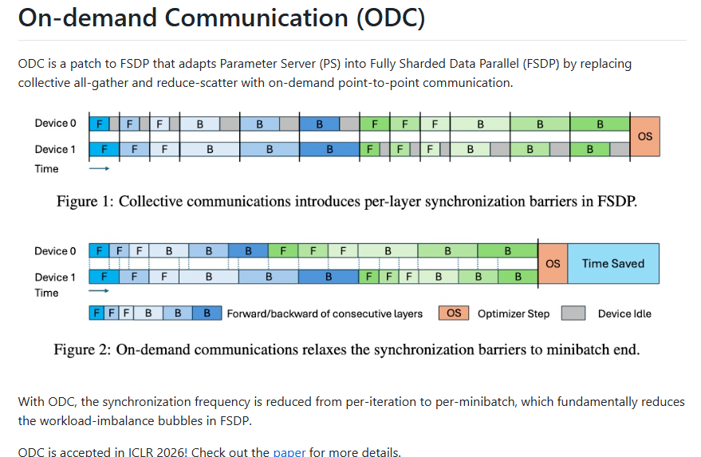

# 使用ODC来加速amd sft训练

> 面向从事分布式训练的工程师。本文记录我们把 [sail-sg/odc](https://github.com/sail-sg/odc)（ICLR 2026 论文《On-Demand Communication for FSDP》，[OpenReview PDF](https://openreview.net/pdf?id=iIEEgI6WsF)）从 NVIDIA/NVSHMEM 移植到 AMD ROCm（MI300X，ROCm 7.2），并在 [Primus](https://github.com/AMD-AGI/Primus) 框架中跑通单机与双机的完整过程。文中所有加速比与 trace 现象均取自真实实验日志；不达标之处（小 batch 更慢、双机部分档位不及 RCCL）也如实呈现，不作粉饰。

---

## 目录

1. [为什么 FSDP 会慢：逐层同步屏障与负载不均衡气泡](#1)
2. [ODC 的核心思想：把集合换成按需 p2p](#2)
3. [在 trace 上看见它：由浅及深](#3)
4. [数据说话：单机 1.5B 与双机 14B 的加速比](#4)
5. [结论与展望](#5)
6. [附录：动手复现（从 0 到跑出加速比）](#6)

---

<a id="1"></a>

## 1. 为什么 FSDP 会慢：逐层同步屏障与负载不均衡气泡

标准的 FSDP2（PyTorch `fully_shard`）把每一层的参数按 DP 维度切片存放。为了计算其中一层，它必须：

- **前向**：对本层参数做一次 `all_gather`，把完整权重拼回来，算完立即 reshard 释放；
- **反向**：算出完整梯度后做一次 `reduce_scatter`，把梯度规约并切回本 rank 的分片。

这套集合通信有两笔隐藏成本：

1. **逐层同步屏障**。集合通信（all-gather / reduce-scatter）要求 DP 组里**所有 rank 在同一层、同一时刻、以相同的调用次数**一起进入。只要有一个 rank 变慢，其他 rank 就都得卡在集合原语里等它。于是每一层都成了一道"通信对齐屏障"。**这道屏障是实打实的性能浪费**：每算完一层就得停下来等全组对齐，通信被钉死在关键路径上、无法与计算重叠，于是大量 GPU 周期不是花在"算数据"上，而是白白耗在"等通信、等别人"上——层数越多，这类等待浪费越大。

2. **负载不均衡气泡**。在变长序列的 SFT / 长上下文训练中，不同 rank 拿到的 token 数天然不同（有的样本 6 万 token，有的只有几百）。但集合通信强制"所有 rank 步调一致"，**轻 rank 只能空等重 rank**——这正是论文 Fig.1/Fig.2 所描述的 bubble：GPU 明明有活可以往前算，却被卡在通信屏障上干等。**更麻烦的是，纯集合通信对此几乎无解**：为了让各 rank 步调一致、能安全地逐微批调集合，唯一的办法就是用 padding 把负载轻的 rank"补空桶"填平到和最重的 rank 一样多的微批数（即后文第 3 节要对比的 `pad` 路线）。这等于**用无效算力换取步调对齐**——轻 rank 的算力被白白浪费在空桶的无用前反向上，浪费的量正比于各 rank 负载的不均衡程度。

论文的关键观察是：这两类浪费源自 **FSDP 通信模式本身**，而非网络带宽不足。要根治，就必须把"逐层、逐 microbatch、全体对齐"的集合通信，换成一种**不强制步调一致**的通信方式。

借用官方仓库对 ODC 的一句话定义：*"ODC is a patch to FSDP that adapts Parameter Server (PS) into FSDP by replacing collective all-gather and reduce-scatter with on-demand point-to-point communication."*（ODC 是给 FSDP 打的补丁，用**按需点对点通信**替换集合式的 all-gather / reduce-scatter，把参数服务器（PS）的思路融入 FSDP）。它带来的直接效果是把**同步频率从 per-iteration 降到 per-minibatch**，从根本上压掉 FSDP 的负载不均衡气泡。

下面这张来自[论文](https://openreview.net/pdf?id=iIEEgI6WsF)/[官方仓库](https://github.com/sail-sg/odc)的示意图。



- **上半（Figure 1）**：在标准 FSDP 中，集合 all-gather/reduce-scatter 让两张卡在**每一层**都要停下来对齐（逐层同步屏障），任一张卡变慢就拖着整体一起等——灰块就是被浪费掉的 GPU 空闲。
- **下半（Figure 2）**：ODC 把逐层对齐**放松到 minibatch 末**，中间各卡按自己的节奏连续做前反向，直到末尾才统一结算一次，于是右侧多出一段 **Time Saved**。这正是我们要在 ROCm 上复现的目标。

> 值得强调：ODC 论文的对照基线**并非**弱基线。它的对手是**已经开启负载均衡的集合通信版本（Collective + LB-Micro）**——即先用打包/padding 把各 rank 的负载对齐，再跑标准 RCCL/NCCL collective。ODC 要战胜的正是这个"武装到牙齿"的集合基线；这一点，后文的 `NCCL_pad` 公平基线会严格对齐。

---

<a id="2"></a>

## 2. ODC 的核心思想：把集合换成按需 p2p

ODC 是给 FSDP 打的一个通信替换 patch。它主要做了三件事（对应官方仓库 README 与论文 Fig.5）：

### 2.1 集合通信原语 → 单边 p2p 的两个原语

- **gather（取参数）**：前向/反向需要某层完整权重时，**按需**从持有各分片的 peer 那里"拉"回来（单边 `getmem`）。谁需要、谁去拉，无需全组一起调用。
- **scatter-accumulate（推梯度）**：算出梯度后，把每个分片**单边推送**（`putmem`）给"拥有该分片的 rank"（相当于一个参数服务器），由对方**异步累加**到它的梯度累加器上。推完即走，不等对方。

这两个原语都是**单边**的：发起方并不要求对端"同时也在调用同一个集合"，从而打破了集合通信"调用次数必须一致"的硬约束。


对照上图：**gather** 是"缺哪片就去哪台拉哪片"，**scatter-accumulate** 是"算完哪片就推给对应 owner 去累加"。两者都由需要方单边发起、发射后无需等待对端进入同一次集合——这正是 ODC 能容忍"各 rank 步调不一致"的根本原因。官方仓库也点明：其通信底座在节点内用 CUDA IPC、节点间用 NVSHMEM 来实现这套 RDMA 单边原语；我们在 ROCm 上则把它替换为 XGMI/HIP-IPC + rocSHMEM/MORI 的等价物。

### 2.2 同步频率：per-iteration → per-minibatch

标准 FSDP 每个 microbatch、每一层都要规约一次梯度。ODC 则把**跨 rank 的同步从"每一层 / 每个 microbatch"降到"每个 minibatch 一次"**：一个 minibatch 内所有 microbatch 的梯度先在本地/参数服务器上累加，直到 minibatch 结束才做一次"结算（settle）"，确保所有梯度都已落地，优化器再读取。

在我们的移植中，这条时间线由 `odc/fsdp/fsdp2.py` 明确编排：

- `pre_minibatch_start()`：清空累加器，并做一次 `dist.barrier()`（让上一步的优化器更新对所有 rank 可见）；
- 反向过程中每层调用 `ReductionService.scatter_accumulate(...)`（推梯度并触发累加）；
- `pre_optimizer_step()` 中调用 `scatter.sync(group)` 做**唯一一次** minibatch 级结算，随后由 `update_gradients()` 让优化器读到最终梯度。

### 2.3 与反向重叠 + 末尾一次 settle

因为推梯度是"发射后不管"，理论上它可以和后续的反向计算重叠，只在 minibatch 末尾做一次统一的等待/结算。**这正是 ODC 省下气泡的关键**——它把"逐层的通信等待"折叠成"minibatch 末的一次等待"。

**原版实现的通信底座**：节点内用 CUDA IPC（把 peer 的显存映射进本进程后直接读写），节点间用 NVSHMEM（GPU-initiated 单边 RDMA）。移植到 AMD，就是要把这两层替换为 ROCm 上的等价物：节点内走 **XGMI + HIP IPC**（peer 显存直接读写），节点间走 **rocSHMEM或MORI（默认，GPU-initiated RDMA）**。

---

<a id="3"></a>

## 3. 在 trace 上看见它：由浅及深

光讲原理还不够。我们用 PyTorch Profiler 抓取了单机/双机、NCCL/ODC、pad/nopad 各组合的真实 trace，下面这组实测截图由浅入深地展示"ODC 到底改变了什么"：先看逐层集合屏障如何消失（图 3、图 4），再看补空桶与变长微批的形态差异（图 5、图 6）。

### 图 3 —— 单机 1.5B，NCCL 基线：逐层同步屏障


**图注**：单机 8 卡、DeepSeek-R1-Distill-Qwen-1.5B、标准 FSDP2 + RCCL。多个 rank（`[R0]/[R1]/[R2]`）的 `stream 14` 上密密麻麻地铺满 `nccl:reduce_scatter_base` + `ncclDevKernel_Generic_2`，**每一层一道**；`stream 0` 则是计算（`void ck_tile`）。这些集合核就是"通信对齐屏障"——所有 rank 必须在此处对齐，才能继续往下算。

这就是"病症"的基线：通信被切成许多小集合，穿插在每一层的前反向之间，形成规律的锯齿状同步点。

### 图 4 —— 开 ODC 后：逐层集合屏障消失，同步搬到 minibatch 末


**图注**：同一模型、同一配置，仅把通信后端换成 ODC。`stream 0` 是连续的众多小微批计算（`void ck_tile`），`stream 11` 是连续的绿色 F（前向），而 `stream 16–23` 上**再也看不到逐层的集合核**——反向过程中只剩连续的 p2p 推送 / 本地累加，跨 rank 的对齐点被整体搬到了 minibatch 末尾（一次 `scatter_accumulate_sync`）。原来"每层一道"的通信对齐屏障被彻底放松，逐层隐式同步不复存在。

图 3 与图 4 的对比，正是 2.2 节"per-iteration → per-minibatch"在 trace 上最直接的体现：屏障从"每层一道"塌缩成"每 minibatch 一次"。

### 图 5 vs 图 6 —— odc_pad vs odc_nopad：补空桶 vs 变长微批

这两张图揭示了 ODC 真正的杀手锏，也说明了为什么 `nopad` 只有 ODC 能跑。**先把两张图的归属讲清楚：图 5 是"有补空桶"的 odc_pad，图 6 是"没有补空桶"的 odc_nopad。**

**先说两张图共同的实验设定，以及它为何关键。** 两张 trace 都取自同一档配置：`global_batch_size=16`、`dp=8`，于是每个 DP rank 平均只分到 `16/8 = 2` 个样本；这些变长样本经 KK（Karmarkar-Karp）均衡跨 rank 分配后，在本 rank 内打包成 seq≈65536（64K token）的微批。**由图中可以看出**，每 rank 只有 2 个样本，"样本长度的天然抖动"几乎无法在 rank 内被平均掉——某个 rank 可能两条都是长文（要拆成 2 个 64K 微批），另一个 rank 可能两条都短（1 个微批就装下）。于是"各 rank 微批数不一致"在这一档被放大到最明显，正好用来对比 pad / nopad 两条路线：**pad 强行把大家对齐成相同微批数（代价是空桶算力），nopad 则允许各跑各的（免掉空桶，但对通信语义提出了更苛刻的要求）。** 这也是 ODC 价值最集中体现的一档（对应第 4 节单机 gbs16 的峰值加速比）。


**图 5（odc_pad，LB-Micro `same_num_in_dp`）——为兼容集合语义而付出的代价。** pad 路线要求**所有 rank 的微批数强制相同**：负载最重的那个 rank 决定了"每 rank 要跑几个微批"，其他较轻的 rank 必须**补齐到同样的微批数**——补上的正是**"空桶"（padding 微批）**，里面塞满无意义的 padding token，纯粹为了让各 rank 步调对齐、以便安全地逐微批调集合。反映到 trace 上，整体被压成**单个连续的密集 burst**：那些 padding 微批照样消耗前向/反向的算力和显存带宽，却不贡献任何有效梯度。这也解释了为什么在纯集合基线里，只要想跑变长数据就**必须** pad（`LB_MINI_SAME_MICRO=1` / `NCCL_pad`）：集合通信别无选择，只能用空桶把不齐的负载"填平"。


**图 6（odc_nopad，LB-Mini 变长微批数）——这才是 ODC 想要的形态。** 因为允许各 rank 微批数不同，数据层（LB-Mini）按每 rank 的**真实变长负载**排布：有的 rank 分到的两条样本合起来要 2 个 64K 微批，有的只要 1 个。反映到 trace 上，**快 rank 跑完自己的微批无需空等慢 rank，慢 rank 也不必被拖着走**；中间那段"看似空白"，其实是各 rank 微批数不同、在时间轴上自然错开所致，而非集合屏障造成的干等。**关键在于：这种"各 rank 微批数可以不等"的形态，只有 ODC 的单边 p2p 才驱动得起来。** 集合通信（all-gather / reduce-scatter）要求 DP 组里每个 rank 以**完全相同的次数**进入同一个原语——一旦某个 rank 少调一次（微批数不同时必然发生），跨节点集合就会因 barrier 次数不匹配而直接 hang 死。而 ODC 的 `getmem`/`putmem` 是单边的，谁需要谁发起、发射后不管，天生不受"调用次数必须一致"的约束，这才让 nopad 成为可能（实现细节见 `odc/primitives/scatter_accumulate.py` ）。

**两图对读，结论十分直接：** odc_pad（图 5）与 odc_nopad（图 6）的**有效计算量完全相同**，差别在于 pad 多做了一批空桶。nopad 把这批空桶省掉——省下的量正比于"各 rank 负载的不均衡程度"，在 gbs 小（每 rank 样本少、抖动大）、序列变长明显的场景里最为可观。而"变长微批数、免补空桶"这条路，**只有 ODC 的单边 p2p 走得通**：集合基线为了不死锁只能 pad，这就造成只能浪费补充的 padding 算力。这就是 ODC 在"负载不均衡"场景下的结构性红利，也是第 4 节 gbs16 峰值加速比里"变长负载均衡"那部分收益的来源。

---

<a id="4"></a>

## 4. 实验结果数据说话：单机 1.5B 与双机 14B 的加速比

> 口径说明：加速比 = `NCCL_pad 的 ms/步 ÷ 本 run 的 ms/步`（>1 表示比 NCCL 快）。基线是**开启打包/pad 的标准 RCCL collective**（`NCCL_pad`），即论文意义上"武装到牙齿的集合基线"，而非弱基线。所有数字均取自各自实验日志的真实值；三条路线的 loss 收敛曲线与 NCCL 基线对齐、全程 0 nan。

### 4.1 单机 1.5B（8 GPU，device 路径，总时间口径）

模型 DeepSeek-R1-Distill-Qwen-1.5B、单机 8 卡、节点内 XGMI + HIP IPC。下表按 gbs 给出 `ODC_nopad` 相对 `NCCL_pad` 基线的加速比与趋势（三条路线的 loss 收敛均与基线对齐、全程 0 nan）：

| gbs | ODC_nopad 加速比 | 趋势解读 |
|---|---|---|
| 8 | ≈ **0.911×**（略慢） | minibatch 太小，反向中 p2p / 结算的固定开销占比大、又没能 overlap 起来 |
| 16 | ≈ **1.201×（峰值）** | 两块红利叠加，XGMI 按需 p2p 省集合 + 变长均衡免补空桶 |
| 32 | ≈ **1.142×** | 仍有优势，但 compute 变大、通信/均衡红利被摊薄 |
| 64 | ≈ **1.083×** | compute 变大、红利被摊薄，与 RCCL 基本持平 |
| 128 | ≈ **1.051×** | compute 已完全主导，ODC 的固定红利被摊平，与 RCCL 收敛|

单机的加速比曲线是**"gbs8 略慢 → gbs16 冲上峰值 → 之后随 gbs 增大缓慢回落，但始终稳定 >1"**。注意：它并**不会**在大 batch 处收敛到与 RCCL 持平，以下是对其实验结果详细的分析。

- **gbs8 略慢（nopad 0.911×、pad 0.898×）——固定开销摊不掉。** 单机每步的通信总量本就不大（1.5B 模型、节点内 XGMI），但 ODC 的 device 路径每个 minibatch 仍要付一笔**近乎固定的开销**：per-minibatch 的 `barrier` 加上 scatter-accumulate 的 `sync`/结算。当 gbs 只有 8 时，一步里真正的前反向计算量太小，这笔固定开销的**占比被放大**；再加上此时反向的 p2p 推送尚未能与计算 overlap（见第 5 节图 7），固定成本"露"在关键路径上收不回来，于是净体验比高度优化的 RCCL collective 略慢。这并非 ODC 的败笔，而恰恰印证了"红利需要足够的 batch 才能兑现"。

- **gbs16 见峰（nopad 1.201×）——峰值来自消除每层的隐式同步和减少补空桶的算力"。** 把峰值拆成两块乘子，正好落在实测上：
  1. **通信侧（`NCCL_pad → ODC_pad`）：XGMI 按需 p2p 省掉集合。 ODC 的 gather/scatter-accumulate 在节点内走 XGMI + HIP IPC（把 peer 显存直接映射进本进程、copy_ 直读写），是"谁需要谁去拉/推"的单边访问；而且同步频率从 per-layer 降到 per-minibatch，每 minibatch 的同步开销远小于每层一道集合的同步开销，省掉了 RCCL collective 里"全组逐层对齐 + ring/tree 调度"的固定成本。
  2. **负载侧（`ODC_pad → ODC_nopad`）：变长均衡免补空桶。 gbs16 / dp8 → 每 rank 只有 2 个样本，各 rank 负载抖动最大（见第 3 节图 5/图 6），nopad 允许各 rank 微批数不等、免去 pad 的空桶算力浪费，这块红利在小 gbs、强变长时最高。

  两者复合起来——用同节点 apples-to-apples 的 NCCL_pad → ODC_pad → ODC_nopad 阶梯（另一组 50 轮实验、只逐步改一个变量）：NCCL_pad → ODC_pad 先快 ~9.8%（纯减小每层同步的红利：数据、pad 策略完全一样，只把 RCCL 的逐层集合换成 ODC 的 XGMI 按需 p2p，每 minibatch 同步一次省下逐层同步）；ODC_pad → ODC_nopad 再快 ~10.2%（纯负载均衡红利：通信后端一样，只把"补空桶"换成"变长微批"）。两者复合起来 1.098 × 1.102 ≈ 1.21×（约合 ~20%），正好落在实测的 gbs16 峰值上。即单机的收益 = XGMI 按需通信 + 变长负载均衡，两块可加、缺一不可。

- 大 gbs 回落到持平（gbs64→1.0×、gbs128→~0.99×）——compute 主导、红利被摊薄。 gbs 越大，一步里的前反向 GEMM 计算量越大、占满了 GPU；而上面那两块红利是每步近乎固定或按比例但增速慢于 compute 的量。当 compute 成为绝对大头，固定红利被摊薄到噪声级别，ODC 与 RCCL 自然收敛到持平——这也解释了为什么单机是"驼峰"而非"单调"。

### 4.2 双机 14B（16 GPU，GDA/DEFER 路径，总时间口径）

跨节点场景换用 14B 模型、2×8 = 16 卡，节点间走 GDA（GPU-Direct RDMA）后端、nopad 走 DEFER rendezvous。下表按 gbs 给出 `ODC_nopad` 相对 `NCCL_pad` 基线的加速比与趋势：

| gbs | ODC_nopad 加速比 | 趋势解读 |
|---|---|---|
| 16 | ≈ **0.796×**（明显慢） | 缺 GDRW（GPU-initiated RDMA write），只能手动同步读保序，每层反向多一次同步开销 |
| 32 | ≈ **0.892×**（pad 0.844×） | 劣势收窄，但仍不及 RCCL |
| 64 | ≈ **1.120×（首次反超）** | 大 batch 摊薄跨节点固定开销 + 变长气泡收益兑现 |
| 128 | ≈ **1.154×** | gbs 越大、跨节点集合越贵，ODC 的摊销收益越大 |

双机的曲线与单机**恰好相反：随 gbs 单调上升**，而且其拐点与斜率都能用"跨节点固定开销 vs 可摊薄的 batch"这一对矛盾来解释：

- **小 gbs 明显慢（gbs16 ~0.796×、gbs32 nopad 0.892×/pad 0.844×）——跨节点固定开销叠加缺 GPU-initiated 的手动同步。** 跨节点这一跳，ODC 的 GDA 后端每步都要付几笔硬开销：① **跨节点 RDMA 本身**（`reduce_scatter` 的 pull 与 `all_gather`，实测占比约为单机同类核的 3×）；② **每步的同步 / settle**——由于我们的 ROCm GDA 目前**缺少 GDRW（GPU-initiated RDMA write）实现**，无法像 NVSHMEM 那样由 device kernel 直接发起并保证写有序可见，为确保"刚写下的梯度对远端 NIC 的 RDMA 读有序且正确可见"，必须**手动插一次同步读**（以读触发 HDP 冲刷，即第 5 节展望提到的 strided-touch），再叠加 per-minibatch 的 `barrier`——**每层反向都因此多背一笔同步开销**。这些都是**每步固定**的量，gbs16 时一步的有效计算太小、根本摊不掉，于是明显慢于成熟的 RCCL collective。

- **随 gbs 单调上升——固定开销被摊薄，变长红利同时放大。** gbs 从 16→32→64→128，一步里的有效前反向计算线性增长，而上面那笔"跨节点固定开销"基本不随 gbs 增长。于是每步"固定开销 / 有效计算"的比值单调下降，ODC 相对 RCCL 的劣势被持续吃掉；与此同时，跨节点场景下"负载不均衡气泡"比单机更昂贵（快 rank 得跨网络等慢 rank），nopad 免空桶、免同步等待的红利也随之放大——两股力量同向叠加，推着加速比一路走高。值得注意的是，跨节点场景下 `ODC_nopad` 全程都比 `ODC_pad` 更优（变长均衡的价值比单机更突出）。

- **gbs64 起 odc_nopad 反超（1.120×）、gbs128 达 1.154×——大 batch 兑现结构性红利。** 到 gbs64，摊薄后的固定开销已低于"省集合 + 免空桶气泡"的收益，odc_nopad **首次反超 RCCL**（此时 odc_pad 还差一口气，0.950×）；gbs128 时 batch 更大，RCCL 一侧的跨节点集合更贵，pad/nopad 双双反超（1.130× / 1.154×），ODC 的按需 p2p + 变长均衡愈发划算。这条"设备越多、越跨节点、负载越不均衡，ODC 越赚"的规律，与论文 Fig.10 的结论**完全一致**——ODC 的价值本就随规模与异质性增长。

---

<a id="5"></a>

## 5. 结论与展望

**回到第 1 节提出的两笔浪费。** FSDP 的集合通信同时制造了两类性能浪费：一是**逐层同步屏障的等待浪费**——每层都要停下来等全组对齐，GPU 周期空耗在跨 rank 等待上、通信无法与计算重叠；二是**负载不均衡气泡的算力浪费**——为了让集合能安全逐微批调用，只能靠"补空桶"把轻 rank 填平，轻 rank 的算力被 padding 微批白白吃掉。**ODC 正是对症下药**：把逐层屏障放松到 per-minibatch 一次结算，消除前一类等待浪费；用单边 p2p 支持变长微批、免掉空桶，消除后一类算力浪费。本文第 4 节的加速比，正是这两类浪费被消除后兑现的净收益——在 batch 足够大、负载足够不均衡的场景里，它们叠加成实打实的墙钟时间节省。

**结论**：

1. **移植跑通**：ODC 的算法层（gather / scatter-accumulate、per-minibatch 同步、LB-Mini 变长均衡）已在 AMD ROCm / MI300X 上用 **rocSHMEM / MORI** 后端跑通，**单机与双机**均能正确收敛（loss 与基线对齐、全程 0 nan）。NVIDIA 代码路径保留作 fallback，便于跟随上游合并。
2. **收益场景清晰**：ODC 在**"大 batch / 跨节点 / 存在负载不均衡"**时收益最大——单机 gbs16 峰值 ~1.201×、且大 batch 仍稳定领先（gbs128 ~1.051×）；双机自 gbs64 起 nopad 反超 RCCL、gbs128 达 ~1.154×。这与论文"ODC 从根本上减少 FSDP 的负载不均衡气泡，且加速比随设备数增长"的结论一致。


### 5.1 进一步优化的方向：settle 还没和反向 overlap

**ODC 的结算（settle）目前基本"露"在反向的关键路径上，未能与计算重叠。** 这一点在 trace 上看得非常清楚，也恰好与成熟的原生 NCCL 形成刺眼的对照——下面两张图（图 7 vs 图 8）。


**图 7（ODC 反向：settle 堆在关键路径上，未 overlap）**：放大 ODC 的反向（`ProfilerStep#8`）。`stream 11` 上是 `FSDP::all_gather`，而 `stream 16–23` 上一整列 `FSDP::post_backward_reduce`（即 scatter-accumulate 的结算 / `WAIT_ACC` 等待，带 `M/n` 标记）**堆叠聚集在同一时刻**，并未铺开去与 `stream 0` 的计算重叠——结算被串在了关键路径上，overlap 很低（实测 ~5%）。也就是说，尽管我们已把跨 rank 同步从 per-iteration 降到 per-minibatch（第 3 节图 4），但**每层结算的等待仍"露"在计算之外**，未被后续反向计算掩盖。


**图 8（对照：原生 NCCL 反向能把通信藏进计算）**：作为标杆，再看原生 FSDP2 + NCCL 的反向。红框圈出的是同一时段内 `stream 14` 的 `nccl:reduce_scatter_base`（+`ncclDevKernel_Generic_2`）与 `stream 0` 的 `void ck_tile` 计算**并行重叠**（`ProfilerStep#10`）——`reduce_scatter` 的通信核被 FSDP2 的 **prefetch** 机制**藏到了计算后面**：下一层的通信在当前层计算时就已发起，通信与计算实打实地并行。


**展望（待优化点，按性价比）**：

- **让 settle 与反向 overlap（首要）** 原生 NCCL 靠 prefetch 把通信藏进计算，我们要做的则是一条**跨迭代的软流水**——用独立 stream + event，把"上一组 microbatch 的 reduce-scatter / settle"与"本组 microbatch 的反向计算"重叠起来，只在 minibatch 末做一次总的 join。这最贴合 ODC 论文"推梯度与反向重叠"的思想，也最有可能把双机中等 gbs 追平、乃至把峰值再往上顶。
- **削减 / 合并跨节点固定开销**：warm-up settle 已从 full 优化到 strided（省 ~9–10%）；进一步可将每步的多个小集合分桶合并、减少 barrier 次数，直接压掉 4.2 提到的那笔"每步固定开销"。

---

<a id="6"></a>

## 6. 附录：动手复现（从 0 到跑出加速比）

本节把前文实验沉淀成可照做、可复制粘贴的教程，让**从未接触过这套代码的读者**也能从 0 起步，完整跑出**单机 1.5B** 与**双机 14B** 的 `odc_nopad` 实验（含 `nccl_pad` 公平基线）并算出加速比。

> **整体流程一览（6 步；强烈建议先把单机跑通，再上双机）**
> 1. **起容器**（6.2）：clone PR #864 分支 + Primus-Turbo，`docker run` 起容器。
> 2. **GDA 算子就位**（6.3）：**从源码编 Primus-Turbo**（host + GDA 各一份，构建期链接 rocSHMEM），再用 `.image_bak` 去掉镜像自带的无 ODC 算子的 stock turbo，经 `PRIMUS_TURBO_PATH` 消费，验证 `has_gda=True`。
> 3. **备好离线数据**（6.1）：stage 好 HF 模型/数据，设 `HF_HOME` + `HF_HUB_OFFLINE=1`。
> 4. **用配置项打开 ODC**（6.4）：`odc_nopad` 臂 = `enable_odc:true`+`enable_odc_lb_mini:true`+`odc_p2p_backend:rocshmem`；`nccl_pad` 对齐基线 = `enable_odc:false`+`enable_odc_lb_mini:true`。
> 5. **起训**：单机看 6.5（8 卡、无需 RoCE/GDA，**新手先做这步**），跑通后再按 6.6 上双机（16 卡、rocSHMEM GDA）。
> 6. **验收 + 算加速比**（6.7）：日志确认三处修复生效、loss 下降、0 nan，`加速比 = nccl_pad 的 ms/iter ÷ odc_nopad 的 ms/iter`。
>
> 卡住时先查 6.8 踩坑清单。

> **重要变化——ODC 现在由「配置项」驱动，不再靠环境变量。** PR [#864](https://github.com/AMD-AGI/Primus/pull/864)（分支 `feat/odc-consume-turbo`）把所有正式功能开关都改成了 Primus 的 yaml 配置项（`enable_odc`、`odc_phase`、`enable_odc_lb_mini`、`odc_p2p_backend`、`odc_rocshmem_gda`、`odc_gda_*` …），运行时不再读 `os.environ`。因此本节命令都以「改配置项 / CLI 覆盖」为准；遗留的 `ODC_*` 环境变量已失效。

要让 ODC 在 ROCm 上**跑得通、跑得对、跑得快**，有**三处修复缺一不可**（分工：**Primus** 负责算法层 + 集成，`primus/core/odc/` 下纯 Python；**Primus-Turbo** 负责 rocSHMEM 通信算子）：

- **① Primus-Turbo 通信算子（`odc_rocshmem_host` / `odc_rocshmem_gda`）。** ODC 的 P2P 通信本体。算子源码已并入 [Primus-Turbo](https://github.com/AMD-AGI/Primus-Turbo) 官方 `main`（PR #409，含 GDA 必需的 `--lto-partitions=1`），但被 `#ifndef DISABLE_ROCSHMEM` 门控——**直接 `pip install @main` 装不出算子**（`has_gda=False`）。必须**从源码构建、构建期把 `ROCSHMEM_HOME` 指向预编 rocSHMEM**（单机 host / 双机 GDA 各一份），详见 6.3。
- **② hook 到正确的 FSDP2 类（PR [#808](https://github.com/AMD-AGI/Primus/pull/808) / [#864](https://github.com/AMD-AGI/Primus/pull/864)）。** ODC 必须 hook 新的 `PrimusTorchFullyShardedDataParallel`，否则 `reduction_service` 为 `None`、**iter2 崩** `'NoneType' ... clear_accumulations`。PR #864 已改，仅在 `enable_odc: true` + `use_torch_fsdp2: true` 时生效。
- **③ #856 device_id 门控（保速）。** ODC 臂（`enable_odc: true`）自动跳过 [#856](https://github.com/AMD-AGI/Primus/pull/856) 的 eager-RCCL `device_id` 注入（补丁 `condition = use_torch_fsdp2 and not enable_odc`）；缺了它单机会被 eager-RCCL 串行化 ODC 的 XGMI 拷贝流、慢 ~6%。

上述三项**全部由 yaml 配置项门控**（不再靠 `ODC_*` 环境变量），对 `nccl_pad` / 原生 FSDP2 零影响。

### 6.1 前提条件

**硬件**

- 单机 1.5B：1 台 AMD MI300X/MI355X（`gfx942`）×8，节点内 XGMI 互联即可。
- 双机 14B：2 台 ×8 = 16 卡，节点间需 RoCE/RDMA（多张 mlx5 NIC）。**务必选同一 leaf 交换机下、RoCE 互通的相邻节点**——跨拓扑的节点对常在首个跨节点通信处 hang（我们实测多组不相邻节点卡在 GDA warmup，长时间不出 `iteration`）。

**软件**

- ROCm 7.2.0（`gfx942`）、Docker、（双机可选）SLURM。
- 容器镜像：`tasimage/primus-odc:v26.2`（ROCm 7.2.0 based，`primus/core/odc/README.md` 推荐同款）。
- **Primus-Turbo GDA 依赖**：一份编好 ODC rocSHMEM 算子的 Primus-Turbo（含 `odc_rocshmem_host` / `odc_rocshmem_gda`）。双机 GDA 必须用**打开 `GDA_MLX5`、且 device-LTO 单分区**（`-Xoffload-linker --lto-partitions=1`，PR #409 已在 `setup.py` 内置）编出的那份，否则跨节点 `getmem` 读到 0 → **双机 `grad_norm=0`**。
- HF 离线缓存：预先把模型/数据 stage 到本地，训练时设 `HF_HOME` + `HF_HUB_OFFLINE=1` 全程离线。单机 1.5B 用 `deepseek-ai/DeepSeek-R1-Distill-Qwen-1.5B`、双机 14B 用 `deepseek-ai/DeepSeek-R1-Distill-Qwen-14B`，SFT 数据均为 `zai-org/LongAlign-10k`。

**预先下载（在一台有网的机器上执行一次，之后训练可全程离线）：**

```bash
export HF_HOME=$HOME/primus_packed/hf_home           # 缓存落这里
pip install -U "huggingface_hub[cli]"
# 模型（单机 1.5B / 双机 14B）
huggingface-cli download deepseek-ai/DeepSeek-R1-Distill-Qwen-1.5B
huggingface-cli download deepseek-ai/DeepSeek-R1-Distill-Qwen-14B
# SFT 数据集
huggingface-cli download zai-org/LongAlign-10k --repo-type dataset
# 训练时再设：export HF_HOME=$HOME/primus_packed/hf_home HF_HUB_OFFLINE=1
```

（`huggingface-cli` 在较新版本亦可写作 `hf download ...`；缓存目录随 `HF_HOME` 走，训练侧只要指向同一 `HF_HOME` 即可命中。）

### 6.2 取代码、起容器

```bash
# 1) 取 PR #864 分支（ODC 算法层 + 集成，配置项驱动）
git clone -b feat/odc-consume-turbo https://github.com/AMD-AGI/Primus.git
# 通信算子来自 Primus-Turbo：其源码在官方 main（PR #409），但 pip 直装不会暴露算子
# （算子被 -DDISABLE_ROCSHMEM 编掉，需构建期链接 rocSHMEM）。见 6.3：从源码编 host + GDA
# 两份，经 PRIMUS_TURBO_PATH + .image_bak 消费

# 2) 每个物理节点起一个容器（挂载代码与 HF 缓存）
docker run -d --name odc_dev \
  --privileged --network host --ipc host --shm-size 64G \
  --device /dev/kfd --device /dev/dri --device /dev/infiniband \
  --group-add video --cap-add SYS_PTRACE --cap-add CAP_SYS_ADMIN \
  --security-opt seccomp=unconfined --ulimit memlock=-1:-1 \
  -v "$HOME":"$HOME" \
  tasimage/primus-odc:v26.2 sleep infinity
```

> 上面的挂载/设备/`--ipc host`/`--security-opt seccomp=unconfined` 组合与我们跑通验证用的 `odc_dev200` 容器一致（`/dev/kfd`+`/dev/dri` 给 GPU，`/dev/infiniband` 给双机 RoCE）。**`-v` 一定要写 `src:dst`**，只写裸路径会被 docker 建匿名空卷盖住。

### 6.3 编含 ODC 算子的 Primus-Turbo（从源码构建 + `.image_bak` 消费）

> **为什么不能只 `pip install @main`（本节最重要的一条）。** 算子源码虽在官方 `main`（PR #409），但被 `#ifndef DISABLE_ROCSHMEM` 门控：`setup.py` 只有在 `ROCSHMEM_HOME`（+`MPI_HOME`）指向一份**预编好的 rocSHMEM 静态库**时才编入算子，否则加 `-DDISABLE_ROCSHMEM` 整段编掉。镜像里没有 rocSHMEM、pip 也不设 `ROCSHMEM_HOME`，故直接 `pip install @main` 得到的是 `has_host=False has_gda=False` 的空壳包（三节点实测复现）。换分支 `pip … @feat/odc-rocshmem-dist` 也不行——该分支只在个人 fork、官方仓库没有。

**正确、且本文全部结果所用的做法：从源码构建 Primus-Turbo，构建期把 `ROCSHMEM_HOME` 指向预编 rocSHMEM，单机 / 双机各编一份。** rocSHMEM 是**非 pip 的外部依赖**，其 `librocshmem.a` 需针对 host/XGMI-IPC 与 GDA/MLX5 两条路径分别预编（记作 `rocshmem_single` / `rocshmem_gda`）。在**每个节点的容器内**执行一次：

```bash
# 容器内（用镜像自带的 ROCm torch，故 --no-build-isolation，避免 pip 拉非 ROCm torch）
export MPI_HOME=/usr/lib/x86_64-linux-gnu/openmpi     # 镜像自带 openmpi
export GPU_ARCHS="gfx942"                             # 按卡填 gfx942 / gfx950

git clone https://github.com/AMD-AGI/Primus-Turbo.git Primus-Turbo-single   # host/单机 版
git clone https://github.com/AMD-AGI/Primus-Turbo.git Primus-Turbo          # GDA/双机 版

# host 版（单机 XGMI-IPC）：链接 host 版 rocSHMEM
cd Primus-Turbo-single && ROCSHMEM_HOME=<path>/rocshmem_single \
  pip3 install --no-build-isolation -e ".[pytorch]" -v && cd ..
# GDA 版（多机 GPU-Direct）：链接 GDA 版 rocSHMEM（--lto-partitions=1 已内置于 setup.py）
cd Primus-Turbo && ROCSHMEM_HOME=<path>/rocshmem_gda \
  pip3 install --no-build-isolation -e ".[pytorch]" -v && cd ..
```

装好后，镜像 `tasimage/primus-odc:v26.2` 的 site-packages 里可能残留一份**无 ODC 算子的 stock `primus_turbo`**，它会**抢先 import 遮住**你要用的 dev 树。用 `.image_bak` 把它改名失效，让 `PRIMUS_TURBO_PATH` 上的那份胜出，再验证算子在位：

```bash
# 去影子：把 stock primus_turbo 改名（每个节点的容器各做一次，不可省）
SP=$(python -c "import sysconfig;print(sysconfig.get_paths()['purelib'])")
[ -e "$SP/primus_turbo" ] && [ ! -L "$SP/primus_turbo" ] && mv "$SP/primus_turbo" "$SP/primus_turbo.image_bak"
for d in "$SP"/primus_turbo-*.dist-info; do [ -e "$d" ] && mv "$d" "$d.image_bak"; done

# 验证 ODC 算子在位（host=单机 XGMI-IPC，gda=多机 GPU-Direct）——两份 dev 树都应 True True
PYTHONPATH=<path>/Primus-Turbo-single python -c "import primus_turbo.pytorch._C as C; \
  print('single:', hasattr(C,'odc_rocshmem_host'), hasattr(C,'odc_rocshmem_gda'))"
PYTHONPATH=<path>/Primus-Turbo        python -c "import primus_turbo.pytorch._C as C; \
  print('gda   :', hasattr(C,'odc_rocshmem_host'), hasattr(C,'odc_rocshmem_gda'))"
# 期望两行都是: True True
```

- **单机 / 双机各用各的 dev 树**（`Primus-Turbo-single` / `Primus-Turbo`）：两者链接的 rocSHMEM 对称堆 / 传输后端不同（host/IPC vs GDA/MLX5），**不能共用同一份包**，混用会在 symmetric-heap 报错（见 6.8）。运行时后文 6.5 用 `PRIMUS_TURBO_PATH=<...>/Primus-Turbo-single`、6.6 用 `<...>/Primus-Turbo`。
- `PRIMUS_TURBO_PATH` **不可省**：`run_odc.sh` 会把它 prepend 到 `PYTHONPATH`，`import primus_turbo` 才命中带 ODC 算子的 dev 树；只靠 site-packages（stock 版或 pip @main 版）会得到 `has_gda=False`。
- `.image_bak` 去影子也**不可省**：不改名的话 site-packages 的 stock 版会抢先 import 遮住 dev 树。

### 6.4 打开 ODC = 改配置项（本次重构的核心）

**ODC 的开关现在全在 yaml 配置里，不再 `export ODC_ENABLE=1`。** 相关配置项（默认值见 `primus/configs/modules/megatron/trainer_base.yaml` 与 `sft_trainer.yaml`）：

| 配置项 | 作用 | 取代的旧 env | 默认 |
|---|---|---|---|
| `enable_odc` | ODC **总开关**（true 才路由梯度到 P2P；false = 纯 FSDP2+RCCL，所有 ODC 补丁 no-op） | `ODC_ENABLE` | `false` |
| `odc_phase` | 接入深度，`2`＝完整路由梯度（生产值） | `ODC_PHASE` | `2` |
| `enable_odc_lb_mini` | LB-Mini 变长 KK 均衡**数据**（与 `enable_odc` **解耦**、可独立生效）：`enable_odc: true`→**解耦**（各 rank 微批数可不等＝nopad，需 ODC P2P）；`enable_odc: false`→**对齐**（`all_reduce(MAX)` 令各 rank 微批数一致，标准 FSDP2+RCCL 步调锁定＝RCCL-safe 的「同数据」基线） | `ODC_LB_MINI` / `LB_MINI_FORCE_DATA` | `false` |
| `lb_mini_cost_model` / `lb_mini_max_token_len` | LB-Mini 代价模型 / 每微批 token 上限 | `LB_MINI_*` | `linear` / `0` |
| `odc_p2p_backend` | P2P 后端：`rocshmem`（本文主用、已验证）｜ `mori` | `ODC_P2P_BACKEND` | `mori` |
| `odc_rocshmem_gda` | rocSHMEM GPU-Direct（GDA）设备路径，**双机必开** | `ODC_ROCSHMEM_GDA` | `false` |
| `odc_gda_defer_reduce` / `odc_gda_warmup_mode` / `odc_gda_stride_bytes` / `odc_gda_pipe` | GDA 结算延迟 / warmup / 步长 / 流水深度 | `ODC_GDA_*` | `auto` / `strided` / `65536` / `1` |
| `odc_grad_spike_threshold` | 异步 reduce 偶发梯度尖刺的跳步阈值 | — | `1000.0` |

要点：

- **`odc_nopad` 臂** = `enable_odc: true` + `enable_odc_lb_mini: true` + `odc_p2p_backend: rocshmem`（双机再加 `odc_rocshmem_gda: true`）。两份示例配置 `deepseek1.5B-odc-lbmini.yaml`、`qwen14B-odc-dn.yaml` **已把这些带齐**（`enable_odc: true` / `odc_phase: 2` / `enable_odc_lb_mini: true` / `odc_p2p_backend: rocshmem`，双机版还带 `odc_rocshmem_gda: true`）——**开箱即用，无需再手动补后端**。（注意 `trainer_base.yaml` 里 `odc_p2p_backend` 的**全局默认仍是 `mori`**，所以你若自写配置要记得设 `rocshmem`。）
- **`nccl_pad` 对齐基线臂** = `enable_odc: false` + **`enable_odc_lb_mini: true`**（标准 FSDP2 + RCCL）。⚠️ **`enable_odc_lb_mini: true` 不可省（公平口径关键）**：`enable_odc: false` 时它切到**对齐模式**（`all_reduce(MAX)` 令各 rank 微批数一致、集合可安全逐微批调），让基线消费**与 `odc_nopad` 完全相同的 LB-Mini 变长数据**（旧 env `LB_MINI_FORCE_DATA` 的合规替代）。漏了它基线会跑更重的标准 padded 数据、口径不可比、加速比虚高（早期 ~1.9× 假象，见 6.7）。
- **`mori` 后端双机有已知 bug，切勿用于双机**；本文所有 ODC 结果都用 `rocshmem`。

统一入口 `run_odc.sh`（单机 / 双机同一脚本，兜底路径用）：

```
run_odc.sh <mori|rocshmem> <pad|nopad> <exp_yaml_relpath> <exp_name> [KEY=VAL ...]
```

第 1 位参只负责铺 rocSHMEM 运行时 infra env（heap / bootstrap ifname / 每次 run 新建 `TRITON_CACHE_DIR`），**真正选后端的是 yaml 的 `odc_p2p_backend`**；第 2 位参 `pad|nopad` 已是 no-op（对齐/解耦现由 `enable_odc` 自动派生）；其余 `KEY=VAL` 只传基础设施 env（ODC 功能开关一律改 yaml）。脚本会铺好 `PYTHONPATH`（含 `odc_early` shim 与 `PRIMUS_TURBO_PATH`）再调 `run_pretrain.sh`；**不透传 CLI 覆盖**，改 batch/开关都改 yaml。

### 6.5 单机 1.5B `odc_nopad`（8 卡，host / XGMI-IPC）

**① 配置**：示例配置 `examples/megatron/configs/MI355X/deepseek1.5B-odc-lbmini.yaml` **已开箱即用**——含 `enable_odc: true` / `odc_phase: 2` / `enable_odc_lb_mini: true` / **`odc_p2p_backend: rocshmem`** / `lb_mini_cost_model: fit` / `global_batch_size: 16`，无需再改（`odc_p2p_backend: rocshmem` 已内置；`trainer_base.yaml` 的全局默认才是 `mori`）。

对齐基线臂复制一份、**只把 `enable_odc` 关掉、保留 `enable_odc_lb_mini: true`**（这样基线消费与 odc_nopad 相同的变长数据、只是微批数对齐）：

```bash
cd Primus
cp examples/megatron/configs/MI355X/deepseek1.5B-odc-lbmini.yaml \
   examples/megatron/configs/MI355X/deepseek1.5B-nccl.yaml
# 在 deepseek1.5B-nccl.yaml 的 overrides: 里：
#   enable_odc: false          # 关 ODC 通信
#   enable_odc_lb_mini: true   # 保留！=> 对齐模式，喂同一份 LB-Mini 变长数据（公平口径）
# （不设 odc_p2p_backend；enable_odc: false 时后端项无意义）
```

**② 起训**（容器内，单机 8 卡）：

```bash
export PRIMUS_TURBO_PATH=/path/to/Primus-Turbo-single      # 单机 IPC 版 Turbo
export NNODES=1 GPUS_PER_NODE=8 NODE_RANK=0 MASTER_ADDR=localhost MASTER_PORT=29700
export HF_HOME=$HOME/primus_packed/hf_home HF_HUB_OFFLINE=1 PRIMUS_SKIP_PIP=1
cd Primus
RUN=primus/core/odc/rocshmem_runtime/scripts/run_odc.sh

# odc_nopad（rocSHMEM host/XGMI-IPC）——第 1 位参 rocshmem 铺好 rocSHMEM infra env，
# 真正选后端的是 yaml 里的 odc_p2p_backend: rocshmem；第 2 位参 nopad 现已是 no-op
bash "$RUN" rocshmem nopad examples/megatron/configs/MI355X/deepseek1.5B-odc-lbmini.yaml odc_nopad

# nccl_pad 对齐基线（yaml: enable_odc: false + enable_odc_lb_mini: true
#  → 标准 FSDP2 + RCCL，喂与 odc_nopad 相同的 LB-Mini 变长数据，微批数对齐）
bash "$RUN" rocshmem nopad examples/megatron/configs/MI355X/deepseek1.5B-nccl.yaml nccl_pad
```

单机走节点内 XGMI + HIP-IPC，reduce-scatter-accumulate 是 device 侧的 owner-pull（on-chip fp32 求和、无 host watcher 子进程）。要扫不同 batch，改 yaml 的 `global_batch_size`（`run_odc.sh` 不透传 CLI 覆盖）；本文单机各档跑 **200 iter**。跑完后按 6.7 核对成功日志与加速比。

### 6.6 双机 14B `odc_nopad`（16 卡，rocSHMEM GDA）

双机在**每个节点各起一个 rank 组**（NODE_RANK 0/1，各 8 卡 → 共 16 rank），rocSHMEM 用 **uid-over-socket** bootstrap（PR #864 后不再用 MPI，纯 torchrun 起）。**首选、且本文已端到端验证**的双机路径是 `primus-cli slurm srun`：一行 fan-out 到两节点、各自 `docker run --rm` 起全新容器再驱动 `torchrun`，**无需常驻容器、无需 `rank_node.sh`**（若集群主机名映射到 loopback 无法用它，见文末 `srun --overlap` 兜底）。因为功能开关已配置项化，`--env` 清单只剩**真正的基础设施变量**：import 路径、NCCL 控制面、rocSHMEM 运行时（heap/ifname/HCA/GID）、HF 离线缓存、以及绕过 primus-cli 内置 hook 的 SFT-skip 三件套。

**① 配置**：`qwen14B-odc-dn.yaml` **已开箱即用**——含 `enable_odc: true` / `odc_phase: 2` / `enable_odc_lb_mini: true` / **`odc_p2p_backend: rocshmem`** / **`odc_rocshmem_gda: true`**，无需再改（下面命令的 `--odc_p2p_backend`/`--odc_rocshmem_gda` 覆盖只是冗余保险）。GDA 的 `warmup=strided` / `stride=65536` / `defer_reduce=auto` / `pipe=1` 均为配置默认；`defer_reduce: auto` 在 `n_pes>local_world_size`（16>8）时自动把逐微批 reduce-scatter 延迟到 minibatch 末一次 rendezvous，避免 nopad 变长微批在跨节点 barrier 死锁。

```bash
# 编排节点。JOB＝已持有这两节点的 Slurm 作业号（keepalive）
JOB=<slurm_jobid>; PORT=29604
ROOT=<PRIMUS_ROOT>                                       # 含 #864 的 Primus 工作树
TURBO=/path/to/Primus-Turbo                              # 双机 GDA 版 Turbo（lto=1）
PYDEPS=/path/to/pydeps                                   # flydsl 等
SP=/opt/venv/lib/python3.12/site-packages
HCA=mlx5_0,mlx5_2,mlx5_3,mlx5_4,mlx5_5,mlx5_7,mlx5_8,mlx5_9   # 按集群 NIC 调整
TS=$(date +%Y%m%d_%H%M%S)

# primus-cli 内置 pretrain hook 缺 SFT skip，预置一个 .done 标志让它跳过 prep（见坑③）
touch /home/botahu/primus_packed/pcli_notok_bookcorpus.done

cd "$ROOT"
./primus-cli slurm srun --jobid="$JOB" --overlap -N2 --ntasks-per-node=1 \
  -p amd-rccl --nodelist=<nodeA>,<nodeB> \
  -- --image tasimage/primus-odc:v26.2 --clean \
     --privileged --network host --ipc host --shm-size 64G \
     --device /dev/kfd --device /dev/dri --device /dev/infiniband \
     --group-add video --cap-add SYS_PTRACE --cap-add CAP_SYS_ADMIN \
     --security-opt seccomp=unconfined \
     --volume /home/botahu:/home/botahu \
     `# --- import 路径 / turbo / linker（primus-cli 不跑 setup_pythonpath，必须补全）---` \
     --env PYTHONPATH="$ROOT:$PYDEPS:$TURBO:$ROOT/primus/core/odc/odc_early:$ROOT/primus/core:$SP" \
     --env PRIMUS_TURBO_PATH="$PYDEPS:$TURBO" \
     --env LD_LIBRARY_PATH=/opt/rocm/lib:/usr/lib/x86_64-linux-gnu:/usr/lib/x86_64-linux-gnu/openmpi/lib \
     `# --- NCCL 控制面（覆盖单机 lo / IB-off 默认）---` \
     --env NCCL_SOCKET_IFNAME=eth0 --env GLOO_SOCKET_IFNAME=eth0 \
     --env NCCL_IB_DISABLE=0 --env NCCL_IB_GID_INDEX=3 \
     `# --- rocSHMEM 运行时 infra（heap 纯字节 / bootstrap / provider / NIC / GID）---` \
     --env ROCSHMEM_HEAP_SIZE=8589934592 --env ROCSHMEM_BOOTSTRAP_SOCKET_IFNAME=eth0 \
     --env ROCSHMEM_GDA_PROVIDER=mlx5 --env ROCSHMEM_HCA_LIST="$HCA" \
     --env ROCSHMEM_IB_GID_INDEX=3 --env ROCSHMEM_ROCE_GID_INDEX=3 --env ROCSHMEM_GID_INDEX=3 \
     `# --- 每次 run 新建 triton cache（避免复用不匹配 device kernel → NaN）---` \
     --env TRITON_CACHE_DIR=/tmp/tcache_rocshmem_pcli_$TS \
     `# --- HF 离线缓存 + 节点本地缓存 ---` \
     --env HF_HOME=/home/botahu/primus_packed/hf_home \
     --env HF_HUB_CACHE=/home/botahu/primus_packed/hf_models \
     --env HF_DATASETS_CACHE=/home/botahu/primus_packed/hf_home/datasets \
     --env HF_HUB_OFFLINE=1 --env DATA_PATH=/workspace \
     --env PRIMUS_PACK_CACHE_DIR=/home/botahu/primus_packed \
     --env PRIMUS_PACK_LOCK_DIR=/tmp/primus_lock \
     --env PRIMUS_CACHE_ROOT=/tmp/primus_cache_pcli_$TS --env PRIMUS_SKIP_PIP=1 \
     `# --- 绕过内置 pretrain hook 的 SFT prep（见坑③）---` \
     --env TOKENIZED_DATA_PATH=/home/botahu/primus_packed/pcli_notok_bookcorpus \
     --env HF_TOKEN=hf_offline_dummy \
  -- -- train pretrain --config examples/megatron/configs/MI355X/qwen14B-odc-dn.yaml \
     --backend_path "$ROOT/third_party/Megatron-LM" \
     `# --- ODC 功能开关：配置项，用 CLI 覆盖直接传（不再走 --env）---` \
     --odc_p2p_backend rocshmem --odc_rocshmem_gda true --enable_fused_linear_ce true \
     --train_iters 50 --global_batch_size 128 --micro_batch_size 1 \
     --use_torch_fsdp2 True --manual_gc True \
     --profile false --use_pytorch_profiler false \
     --disable_wandb True --disable_tensorboard True --disable_last_saving True
```

`primus-cli slurm srun` 里三段 `--` 依次分隔：**slurm/srun 参数** ｜ **docker/容器参数（含全部 `--env`）** ｜ **`train pretrain` 训练参数（含 ODC 配置项覆盖）**。`slurm-entry` 会自动把 `MASTER_ADDR/MASTER_PORT/NNODES/NODE_RANK/GPUS_PER_NODE` 注入每个节点。`ROCSHMEM_HCA_LIST` 是 RoCE NIC 白名单（本集群 10 张 mlx5，`mlx5_1/_6` 是 eth 管理口须排除）。

**对照 `nccl_pad` 对齐基线**：把最后一段的 ODC 覆盖换成 `--enable_odc false --enable_odc_lb_mini true`（去掉 `--odc_p2p_backend`/`--odc_rocshmem_gda`，其余不变），即标准 FSDP2 + RCCL。⚠️ **`--enable_odc_lb_mini true` 不可省**：`enable_odc: false` 时它自动切到**对齐模式**，喂给基线**与 `odc_nopad` 完全相同的 LB-Mini 变长数据**（各 rank 微批数被 `all_reduce(MAX)` 对齐、RCCL-safe）——这才是公平口径；漏了它基线会跑更重的标准 padded 数据、加速比虚高（见 6.7 的 ~1.9× 假象）。

#### 三条正确性铁律（不可省）

- **RoCE 相邻节点**：务必选同一 leaf 交换机下、RoCE 互通的相邻节点；不相邻的节点对常卡在首个跨节点 GDA warmup（长时间无 `iteration`）。
- **device-LTO 单分区**：GDA 版 Turbo 必须以 `-Xoffload-linker --lto-partitions=1` 构建（PR #409 已内置），否则跨节点 `getmem` 读到 0 → **双机 `grad_norm=0`**。
- **双机专用 GDA Turbo**：`$TURBO` 用 relink 到 `rocshmem_gda` 的那份，与单机 IPC 版分开——两者对称堆/连接后端不同，混用会在 symmetric-heap 打架。

#### `primus-cli` 直连的 3 个坑

1. **`--volume` 必须写 `src:dst`**（`--volume /home/botahu:/home/botahu`）：只写裸路径会被 docker 建匿名空卷盖住 → 容器里看不到代码/缓存。
2. **`PYTHONPATH` 必须整条注入**：primus-cli 直连路径**跳过了 `setup_pythonpath`**，须自己补全 repo + pydeps + **GDA Turbo**（`$TURBO`，放在 site-packages 前面即可让 GDA 算子胜出、`has_gda=True`，无需在临时容器里做 `.image_bak`）+ `odc/odc_early` + `primus/core` + site-packages，否则 `import odc`/`import primus_turbo` 失败。
3. **内置 pretrain hook 缺 SFT skip**：内置 runner hook（`train/pretrain/megatron/prepare.py`）没有 `stage=='sft'` 跳过分支，会去要 `HF_TOKEN` + 下载 bookcorpus。解法：预先 `touch` 一个 `.done` 标志并把 `TOKENIZED_DATA_PATH` 指向它、`HF_TOKEN` 给个占位值，让 hook 跳过 prep（它 emit 的 `--train_data_path` 对 SFT provider 无害）。

> **`slurm-entry` 的 MASTER_ADDR 注意**：`slurm-entry` 会强制 `MASTER_ADDR=`短主机名。本文验证的集群里 `/etc/hosts` 的 `127.0.1.1` 行被注释掉、短主机名解析到可路由 IP，故直接可用；若集群把主机名映射到 loopback（`127.0.1.1 <hostname>`），rendezvous 会绑回环、跨节点连不上，此时改用下方 `srun --overlap` 兜底。

#### 兜底：`srun --overlap` + `docker exec` + `run_odc.sh`

若集群主机名映射到 loopback、或想复用常驻容器里预置的环境，可退回 **`srun --overlap` + `docker exec` + `run_odc.sh`**（每节点各送进常驻容器一个 rank），两节点分别执行：

```
export NNODES=2 GPUS_PER_NODE=8 NODE_RANK=<0|1> MASTER_ADDR=<nodeA-可路由IP> MASTER_PORT=<port>
bash run_odc.sh rocshmem nopad examples/megatron/configs/MI355X/qwen14B-odc-dn.yaml odc_nopad \
  NCCL_SOCKET_IFNAME=eth0 GLOO_SOCKET_IFNAME=eth0 NCCL_IB_DISABLE=0 NCCL_IB_GID_INDEX=3 \
  ROCSHMEM_GDA_PROVIDER=mlx5 ROCSHMEM_HCA_LIST=$HCA \
  ROCSHMEM_IB_GID_INDEX=3 ROCSHMEM_ROCE_GID_INDEX=3 ROCSHMEM_GID_INDEX=3
```

这里 `KEY=VAL` 只传基础设施 env，ODC 功能开关仍看 yaml（`qwen14B-odc-dn.yaml` 已带齐）；基线同法用 `enable_odc: false` + 保留 `enable_odc_lb_mini: true` 的副本跑 `... <baseline_yaml> nccl_pad`。它对 hostname/loopback 更鲁棒（0→1 首次打通即用此路径），封装样例见 `full_exp/matrix_dual_harness/`。

### 6.7 判断成功、读结果、算加速比

**第一步——确认 ODC 真在 rocSHMEM GDA 上跑。** 在训练日志里核对这几行真实标记（下方均取自本文双机 primus-cli 验证 run 的实际日志）：

1. **配置项已生效（enable_odc + 后端）**：

   ```
   [Primus:Runtime] Applying CLI overrides: {'odc_p2p_backend': 'rocshmem', 'odc_rocshmem_gda': True, ...}
   ```

2. **rocSHMEM GDA 后端已起（修复 ①）**——这是 `has_gda=True` 真正生效的运行时证据：

   ```
   init_shmem (rocSHMEM GDA, uid bootstrap): my_pe=15 n_pes=16
   [GDA] reduce-scatter warm-up mode=strided stride_bytes=65536
   ```

   同时能看到一批 `Rank N create tensor gda_acc_* / gda_in_* / gda_scr_*` 的 GDA 对称堆张量。若后端跑成 `mori`（无这些 `rocSHMEM GDA` / `gda_*` 行），说明 `odc_p2p_backend` 没设对。

3. **hook 到正确的 FSDP2 类（修复 ②）** + **nopad 解耦数据**：

   ```
   [PRE-FORWARD canary] wrap-chain: PrimusTorchFullyShardedDataParallel.module=FSDPFloat16Module.module=GPTModel
   [ODC.lb_mini] built LB-Mini train iterator: ... same_micro_num=False (LB-Mini decoupled (ODC))
   [ODC.torch_fsdp2] hooked optimizer.step (pre_optimizer_step injected)
   ```

   wrapper 必须是 **`PrimusTorchFullyShardedDataParallel`**（不是旧的 `TorchFullyShardedDataParallel`；hook 旧类会在 iter2 崩 `NoneType ... clear_accumulations`）；`same_micro_num=False` 即 nopad/解耦。
   > 注：代码里还有 `[ODC.torch_fsdp2] runtime config populated ...` 与 `[Patch] ⊘ Skipped ... device_id`（修复 ③，`condition = use_torch_fsdp2 and not enable_odc` 为假 → 跳过 eager-RCCL）等 `log_rank_0` 标记；它们在补丁注册/`before_train` 早期打印，能佐证但不一定落进 torchrun 捕获流，故以上面几行为准。对照组 `nccl_pad` 因需要 RCCL comm，会打 `[Patch] ✓ Applied ... device_id`。

4. **训练稳定推进**：`lm loss` 随 iter **下降**、**0 nan / 0 crash**、稳态 `ms/iter` 平稳，且 **`grad norm` 全程非 0**——`grad_norm=0` 即跨节点 GDA `getmem` 读到 0（device-LTO 多分区），说明 GDA Turbo 没编对。

快速抓取：

```bash
grep -E "rocSHMEM GDA|gda_acc_|reduce-scatter warm-up|LB-Mini decoupled|PrimusTorchFullyShardedDataParallel" "$LOG"
grep -E "lm loss|elapsed time per iteration|grad norm|nan iterations" "$LOG" | tail -40
```

**第二步——读关键指标、算加速比。** 每步日志会打印 `iteration N/M | ... | elapsed time per iteration (ms): X | ... | lm loss: ...`，还有 `compute per GPU (TFLOP/s/GPU)`、`tokens/s/GPU`。取稳定段（跳过前几步 warmup）的 `ms/iter` 中位数，按

> 加速比 = `nccl_pad 的 ms/iter` ÷ `odc_nopad 的 ms/iter`（>1 即比 RCCL 快）

**成功判据**：全程 0 nan、loss 逐步下降、跑满目标步数（单机 200/200 或双机 50/50）。

**最终验证结果**（配置项驱动：ODC 经 `enable_odc`，`nccl_pad` 经**对齐** `enable_odc_lb_mini` 喂同一份变长数据；严格同源 apples-to-apples——同镜像 v26.2、同节点、只差 arm）：

| 场景 | odc_nopad（config） | 对齐 nccl_pad | 加速比 | loss |
|---|---|---|---|---|
| 双机 14B，gbs128，50 iter | ≈ **70.5k** ms/iter（primus-cli 实测中位数，iter26–50） | ≈ **80.2k** ms/iter | ≈ **1.14×** | 12.07→9.34、grad_norm 全程非 0、0 nan |
| 单机 1.5B，gbs16，200 iter | ≈ **2.1k** ms/iter | ≈ **2.5k** ms/iter | ≈ **1.19–1.21×** | 收敛至 ~10.0、0 nan |

> 双机 14B 那一行由本文的 **`primus-cli slurm` 路径端到端验证**：50/50 iter 全程 0 nan、`grad_norm` 非 0、稳态中位数 ~70.5k ms/iter，与早期 `srun --overlap` 兜底路径（~71k）一致，两条路径行为等价。

> **口径校正（重要）**：此前对**非对齐** nccl 基线一度看到 ~1.9× 的加速，那是**口径假象**——基线跑了更重的标准 padded 数据；改用 `enable_odc_lb_mini: true` 的**对齐同数据**基线后已纠正，真实加速比即上表的 ~1.14×（双机）/ ~1.2×（单机）。跨节点是 ODC 的主场——设备越多、越跨节点、负载越不均衡，ODC 越赚。

### 6.8 踩坑清单（强烈建议先读）

- **`has_host=False has_gda=False`（修复 ①）**：在用 stock turbo 或 `pip install @main` 的空壳包（算子被 `-DDISABLE_ROCSHMEM` 编掉）。正解见 6.3：从源码构建、构建期 `ROCSHMEM_HOME` 指向预编 rocSHMEM，再经 `PRIMUS_TURBO_PATH`（或 site-packages 的 `.image_bak` 去影子）确认 `has_gda==True`。
- **iter2 崩 `'NoneType' ... clear_accumulations`（修复 ②）**：hook 了旧 FSDP2 类。确认 Primus 为 `feat/odc-consume-turbo` 分支，wrap-chain 出现 `PrimusTorchFullyShardedDataParallel`。
- **能跑但单机慢 ~6%（修复 ③ 未生效）**：确认 `enable_odc: true` 真到位、device_id patch 被 `⊘ Skipped`（gate 靠 `enable_odc` 配置项，非 `ODC_ENABLE`）。
- **后端跑成 mori**：`trainer_base.yaml` 全局默认是 `mori`，自写配置忘设 `rocshmem` 就会跑到 mori（**双机 mori 有已知 bug**）；日志无 `rocSHMEM GDA`/`gda_*` 行即可辨。
- **首步就 NaN**：复用了异构 toolchain 的 Triton cache。每次 run 用**全新带时间戳的** `TRITON_CACHE_DIR`。
- **双机 `grad_norm=0`**：device-LTO 多分区，双机 GDA Turbo 务必 `-Xoffload-linker --lto-partitions=1`（PR #409 已内置）。
- **rocSHMEM heap 是纯字节数**：`ROCSHMEM_HEAP_SIZE` 不接受 K/M/G 后缀（8 GiB = `8589934592`）。
- **数据 packing 较慢**：大 gbs（双机 gbs128）的 LB-Mini packing 可能耗约 10 分钟才进首个 `iteration`，属正常，不是 hang。
- **gbs16 偶发不收敛（loss 卡 ~11.95）**：训练稳定性问题、与 ODC 无关（`nccl_pad` 也会中招）；换 `seed` 或跳过该 run。

---

### 参考

- 论文：《On-Demand Communication for FSDP》(ICLR 2026) — [OpenReview PDF](https://openreview.net/pdf?id=iIEEgI6WsF)（动机 Fig.1/2、方法 Fig.5、Collective LB-Micro 基线、加速比随设备数增长 Fig.10）
- 官方仓库：[sail-sg/odc](https://github.com/sail-sg/odc)（FSDP patch、gather + scatter-accumulate 原语、CUDA IPC + NVSHMEM 底座）
- 底座：[ROCm/mori](https://github.com/ROCm/mori)（MORI-SHMEM / MORI-IR，替代 NVSHMEM）、[Primus](https://github.com/AMD-AGI/Primus)（训练框架）
- 移植源码（PR #864 后 in-tree 路径，均在 Primus 仓库树下）：
  - 算法层（Python）：`primus/core/odc/primitives/{gather,scatter_accumulate,_rocshmem_backend,shmem_triton,utils}.py`、`primus/core/odc/fsdp/{fsdp1,fsdp2}.py`、`primus/core/odc/odc_early/sitecustomize.py`、`primus/backends/megatron/patches/odc_{lb_mini,torch_fsdp2}_patches.py`
  - rocSHMEM 运行时与启动脚本：`primus/core/odc/rocshmem_runtime/`（含 `scripts/run_odc.sh`、`README.md`）
  - 通信算子（PR #409 后已上移至 Primus-Turbo）：`csrc/kernels/odc_rocshmem/{odc_rocshmem_host,odc_rocshmem_gda}.cu` + `csrc/pytorch/dist/` 的 thin pybind wrapper（`primus_turbo.pytorch._C.odc_rocshmem_host / odc_rocshmem_gda`）
