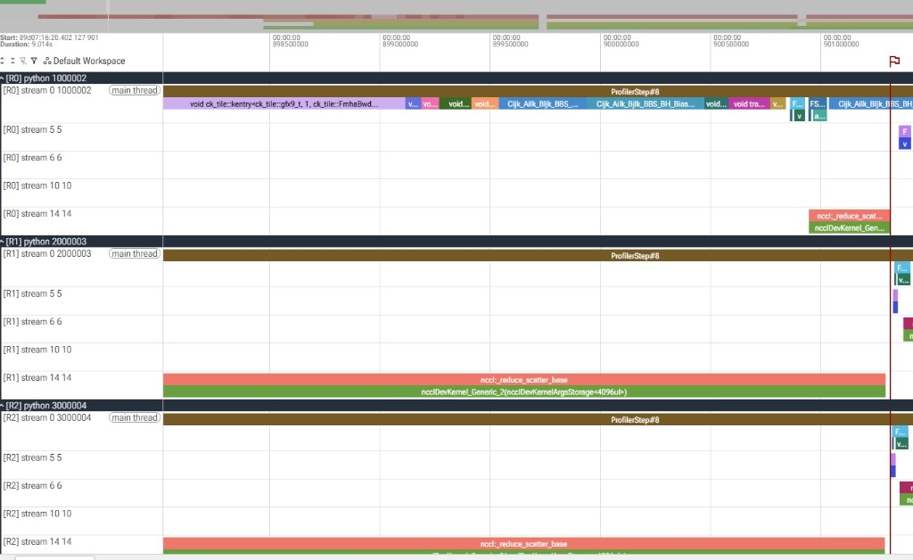
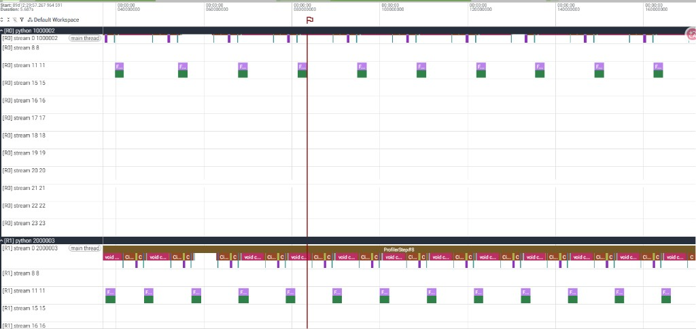
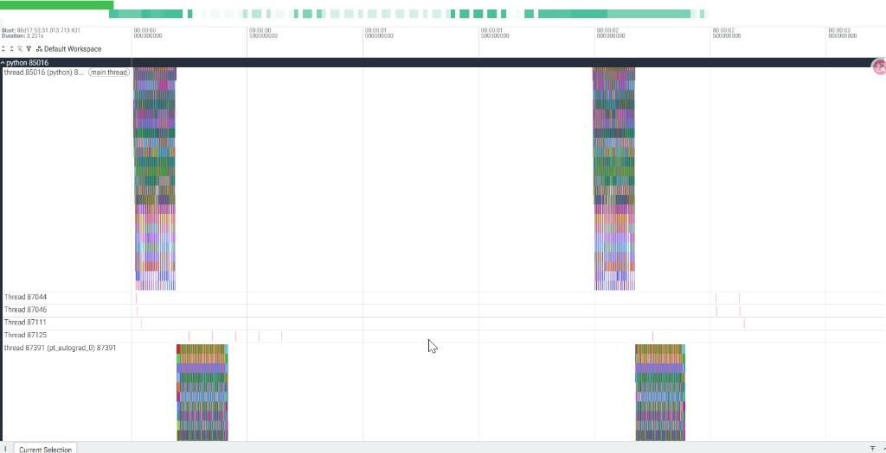
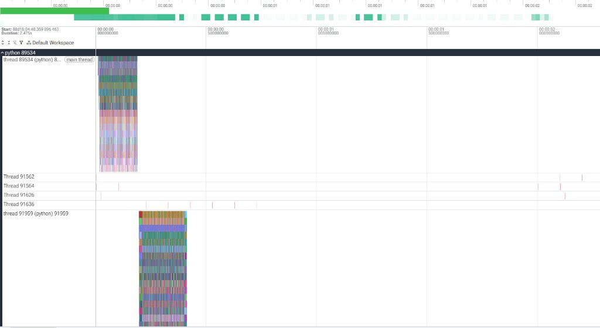
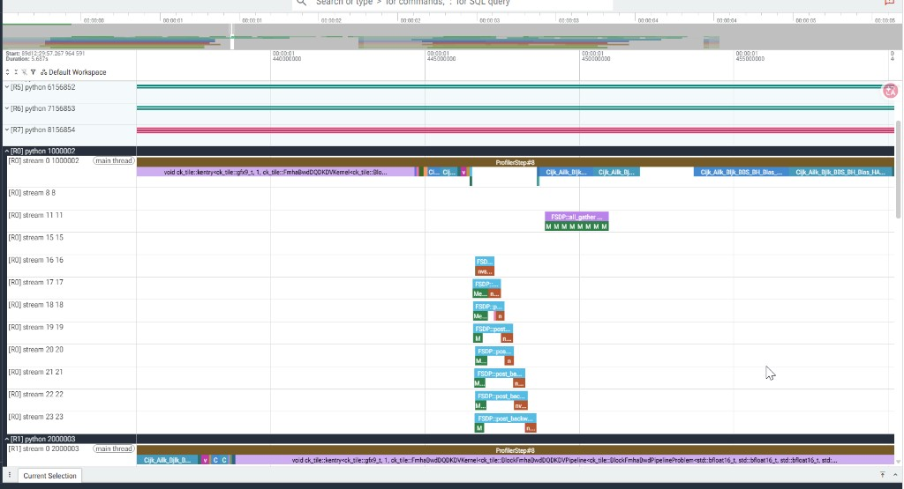
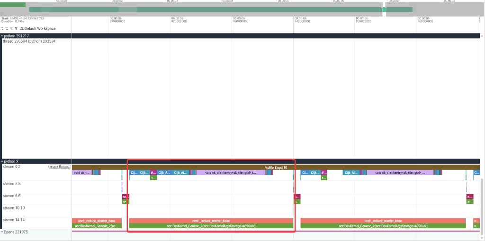

# Accelerating AMD SFT Training with ODC

> For engineers working on distributed training. This post documents how we ported [sail-sg/odc](https://github.com/sail-sg/odc) (the ICLR 2026 paper *On-Demand Communication for FSDP*, [OpenReview PDF](https://openreview.net/pdf?id=iIEEgI6WsF)) from NVIDIA/NVSHMEM to AMD ROCm (MI300X, ROCm 7.2), and got it running end-to-end for both single-node and dual-node setups within the [Primus](https://github.com/AMD-AGI/Primus) framework. Every speedup number and trace observation in this article is taken from real experiment logs; the spots where we fell short (slower at small batch sizes, some dual-node configurations trailing RCCL) are reported honestly, without embellishment.

---

## Table of Contents

1. [Why FSDP is slow: per-layer synchronization barriers and load-imbalance bubbles](#1)
2. [The core idea of ODC: replacing collectives with on-demand p2p](#2)
3. [Seeing it in the trace: from the surface to the depths](#3)
4. [Let the data speak: speedups for single-node 1.5B and dual-node 14B](#4)
5. [Conclusions and outlook](#5)
6. [Appendix: hands-on reproduction (from zero to measured speedups)](#6)

---

<a id="1"></a>

## 1. Why FSDP is slow: per-layer synchronization barriers and load-imbalance bubbles

Standard FSDP2 (PyTorch `fully_shard`) stores each layer's parameters sharded along the DP dimension. To compute a single layer, it must:

- **Forward**: perform one `all_gather` for that layer's parameters to reassemble the full weights, then reshard and release them immediately after the computation;
- **Backward**: after computing the full gradient, perform one `reduce_scatter` to reduce the gradient and slice it back into this rank's shard.

This set of collective communications carries two hidden costs:

1. **Per-layer synchronization barriers**. Collective communication (all-gather / reduce-scatter) requires **all ranks in the DP group to enter together, at the same layer, at the same moment, with the same number of calls**. If even one rank slows down, all the other ranks get stuck inside the collective primitive waiting for it. As a result, every layer becomes a "communication alignment barrier". **This barrier is pure, tangible performance waste**: after computing each layer you have to stop and wait for the whole group to align, communication is nailed onto the critical path and cannot overlap with computation, so a large number of GPU cycles are spent not on "crunching data" but on "waiting for communication, waiting for others" — the more layers there are, the greater this kind of waiting waste.

2. **Load-imbalance bubbles**. In variable-length-sequence SFT / long-context training, different ranks naturally receive different numbers of tokens (some samples have 60,000 tokens, others only a few hundred). But collective communication forces "all ranks to move in lockstep", so **light ranks can only sit idle waiting for heavy ranks** — this is exactly the bubble described in the paper's Fig.1/Fig.2: the GPU clearly has work it could push ahead on, yet it is stuck idling at the communication barrier. **Worse still, pure collective communication has almost no way around this**: to keep all ranks in lockstep so that collectives can be safely invoked microbatch by microbatch, the only option is to use padding to "top up" the lightly-loaded ranks with empty buckets until they have as many microbatches as the heaviest rank (this is the `pad` route we will contrast in Section 3). This amounts to **trading useless compute for lockstep alignment** — the light ranks' compute is wasted on the useless forward/backward passes of empty buckets, and the amount wasted is proportional to the degree of load imbalance across ranks.

The paper's key observation is that both kinds of waste stem from the **FSDP communication pattern itself**, not from insufficient network bandwidth. To cure it at the root, you must replace the "per-layer, per-microbatch, all-aligned" collective communication with a communication scheme that **does not force lockstep**.

To borrow the official repository's one-line definition of ODC: *"ODC is a patch to FSDP that adapts Parameter Server (PS) into FSDP by replacing collective all-gather and reduce-scatter with on-demand point-to-point communication."* (ODC is a patch applied to FSDP that replaces the collective all-gather / reduce-scatter with **on-demand point-to-point communication**, folding the parameter server (PS) approach into FSDP.) Its direct effect is to lower the **synchronization frequency from per-iteration to per-minibatch**, fundamentally squeezing out FSDP's load-imbalance bubbles.

Below is a diagram from the [paper](https://openreview.net/pdf?id=iIEEgI6WsF) / [official repository](https://github.com/sail-sg/odc).


- **Top half (Figure 1)**: in standard FSDP, collective all-gather/reduce-scatter forces both cards to stop and align at **every layer** (the per-layer synchronization barrier); if either card slows down it drags the whole thing into waiting — the gray blocks are the wasted GPU idle time.
- **Bottom half (Figure 2)**: ODC **relaxes the per-layer alignment to the end of the minibatch**; in between, each card runs forward/backward continuously at its own pace, and only settles once at the very end, so there is an extra stretch of **Time Saved** on the right. This is exactly what we set out to reproduce on ROCm.

> Worth emphasizing: the ODC paper's comparison baseline is **not** a weak baseline. Its opponent is the **already load-balanced collective-communication version (Collective + LB-Micro)** — i.e., first use packing/padding to align the load across ranks, then run standard RCCL/NCCL collectives. ODC has to beat this "armed-to-the-teeth" collective baseline; the `NCCL_pad` fair baseline later in this post aligns strictly with it.

---

<a id="2"></a>

## 2. The core idea of ODC: replacing collectives with on-demand p2p

ODC is a communication-replacement patch applied to FSDP. It mainly does three things (corresponding to the official repository's README and the paper's Fig.5):

### 2.1 Collective communication primitives → two one-sided p2p primitives

- **gather (fetch parameters)**: when the forward/backward pass needs a layer's full weights, it **on-demand** "pulls" them back from the peers holding each shard (a one-sided `getmem`). Whoever needs it goes and pulls it; no group-wide call is required.
- **scatter-accumulate (push gradients)**: after computing the gradient, each shard is **pushed one-sidedly** (`putmem`) to "the rank that owns that shard" (equivalent to a parameter server), which **asynchronously accumulates** it into its gradient accumulator. Push and go, no waiting for the other side.

Both primitives are **one-sided**: the initiator does not require the peer to "be calling the same collective at the same time", thereby breaking the collective's hard constraint that "the number of calls must match".

![Figure 2: paper Figure 5 — ODC's two one-sided primitives. Left (gather, to device 0): when device 0 needs the full parameter, it pulls the shards (Param0/Param1) scattered across devices back to local on demand and reassembles them; right (scatter-accumulate, from device 0): the per-shard gradients computed by device 0 (Grad0/Grad1) are pushed one-sidedly to "the owner of that shard", which accumulates them into its gradient accumulator (Acc). Source: paper https://openreview.net/pdf?id=iIEEgI6WsF , official repository https://github.com/sail-sg/odc .](odc_blog/fig8_paper_primitives.png)

Comparing with the figure above: **gather** is "whichever shard is missing, go to the corresponding machine and pull that shard", and **scatter-accumulate** is "whichever shard you finished computing, push it to the corresponding owner to accumulate". Both are initiated one-sidedly by the party that needs it, and once fired there is no need to wait for the peer to enter the same collective — this is precisely the root reason ODC can tolerate "ranks being out of lockstep". The official repository also makes it clear: its communication substrate uses CUDA IPC intra-node and NVSHMEM inter-node to implement this set of RDMA one-sided primitives; on ROCm we replace it with the equivalents of XGMI/HIP-IPC + rocSHMEM/MORI.

### 2.2 Synchronization frequency: per-iteration → per-minibatch

Standard FSDP reduces gradients once per microbatch, per layer. ODC instead **lowers the cross-rank synchronization from "per layer / per microbatch" to "once per minibatch"**: the gradients of all microbatches within a minibatch are first accumulated locally / on the parameter server, and only at the end of the minibatch is a single "settle" performed to ensure all gradients have landed, after which the optimizer reads them.

In our port, this timeline is explicitly orchestrated by `odc/fsdp/fsdp2.py`:

- `pre_minibatch_start()`: clears the accumulators and does one `dist.barrier()` (so that the previous step's optimizer update is visible to all ranks);
- during the backward pass, each layer calls `ReductionService.scatter_accumulate(...)` (pushing gradients and triggering accumulation);
- inside `pre_optimizer_step()`, `scatter.sync(group)` is called to do the **single** minibatch-level settle, after which `update_gradients()` lets the optimizer read the final gradients.

### 2.3 Overlap with backward + a single settle at the end

Because pushing gradients is "fire and forget", in theory it can overlap with the subsequent backward computation, waiting/settling only once at the end of the minibatch. **This is exactly the key to how ODC saves bubbles** — it folds "per-layer communication waits" into "a single wait at the end of the minibatch".

**The original implementation's communication substrate**: CUDA IPC intra-node (mapping the peer's device memory into the current process for direct read/write) and NVSHMEM inter-node (GPU-initiated one-sided RDMA). Porting to AMD means replacing these two layers with their ROCm equivalents: intra-node goes over **XGMI + HIP IPC** (direct read/write of peer device memory), and inter-node goes over **rocSHMEM or MORI (default, GPU-initiated RDMA)**.

---

<a id="3"></a>

## 3. Seeing it in the trace: from the surface to the depths

Explaining the principles is not enough. We used the PyTorch Profiler to capture real traces across combinations of single-node/dual-node, NCCL/ODC, and pad/nopad. The set of measured screenshots below shows "what exactly ODC changes" from the surface to the depths: first we see how the per-layer collective barriers disappear (Figures 3 and 4), then the shape differences between empty-bucket padding and variable-length microbatches (Figures 5 and 6).

### Figure 3 — Single-node 1.5B, NCCL baseline: per-layer synchronization barriers



**Caption**: single-node, 8 GPUs, DeepSeek-R1-Distill-Qwen-1.5B, standard FSDP2 + RCCL. On `stream 14` of several ranks (`[R0]/[R1]/[R2]`), `nccl:reduce_scatter_base` + `ncclDevKernel_Generic_2` are packed densely, **one per layer**; `stream 0` is the computation (`void ck_tile`). These collective kernels are the "communication alignment barriers" — all ranks must align here before they can continue computing.

This is the baseline of the "symptom": communication is chopped into many small collectives, interspersed between each layer's forward/backward pass, forming regular sawtooth-shaped synchronization points.

### Figure 4 — After enabling ODC: the per-layer collective barriers disappear, synchronization moves to the end of the minibatch



**Caption**: same model, same configuration, only swapping the communication backend to ODC. `stream 0` is a continuous stream of many small microbatch computations (`void ck_tile`), `stream 11` is a continuous stretch of green F (forward), and on `stream 16–23` the **per-layer collective kernels are no longer visible** — during the backward pass only continuous p2p pushes / local accumulations remain, and the cross-rank alignment point has been moved wholesale to the end of the minibatch (a single `scatter_accumulate_sync`). The "one barrier per layer" communication alignment barrier has been thoroughly relaxed, and per-layer implicit synchronization no longer exists.

The contrast between Figure 3 and Figure 4 is the most direct manifestation, in the trace, of Section 2.2's "per-iteration → per-minibatch": the barriers collapse from "one per layer" to "one per minibatch".

### Figure 5 vs Figure 6 — odc_pad vs odc_nopad: empty-bucket padding vs variable-length microbatches

These two figures reveal ODC's real trump card, and explain why `nopad` only works with ODC. **First, let's be clear about which figure is which: Figure 5 is odc_pad "with empty-bucket padding", and Figure 6 is odc_nopad "without empty-bucket padding".**

**First, the experimental setup common to both figures, and why it matters.** Both traces are taken from the same configuration: `global_batch_size=16`, `dp=8`, so each DP rank receives on average only `16/8 = 2` samples; after these variable-length samples are balanced across ranks by KK (Karmarkar-Karp), they are packed within each rank into microbatches of seq≈65536 (64K tokens). **As can be seen in the figures**, with only 2 samples per rank, the "natural jitter of sample length" can barely be averaged out within a rank — one rank might get two long documents (which must be split into 2 microbatches of 64K), while another rank might get two short ones (fitting into a single microbatch). So the "unequal number of microbatches across ranks" is amplified to its most obvious at this configuration, making it perfect for contrasting the pad / nopad routes: **pad forcibly aligns everyone to the same number of microbatches (at the cost of empty-bucket compute), while nopad allows each to run its own (avoiding empty buckets, but imposing far stricter requirements on communication semantics).** This is also the configuration where ODC's value is most concentrated (corresponding to the peak speedup at single-node gbs16 in Section 4).



**Figure 5 (odc_pad, LB-Micro `same_num_in_dp`) — the price paid to remain compatible with collective semantics.** The pad route requires **all ranks to have the same number of microbatches**: the most heavily-loaded rank determines "how many microbatches each rank must run", and the other, lighter ranks must **be padded up to the same number of microbatches** — what gets padded in is exactly the **"empty buckets" (padding microbatches)**, stuffed with meaningless padding tokens, purely so that the ranks stay in lockstep and collectives can be safely invoked microbatch by microbatch. Reflected in the trace, the whole thing is compressed into **a single continuous dense burst**: those padding microbatches still consume forward/backward compute and memory bandwidth, yet contribute no useful gradients. This also explains why, in a pure collective baseline, you **must** pad whenever you want to run variable-length data (`LB_MINI_SAME_MICRO=1` / `NCCL_pad`): collective communication has no other choice but to use empty buckets to "level out" the uneven load.



**Figure 6 (odc_nopad, LB-Mini variable microbatch count) — this is the shape ODC wants.** Because ranks are allowed to have different numbers of microbatches, the data layer (LB-Mini) arranges things according to each rank's **true variable-length load**: some ranks whose two assigned samples together need 2 microbatches of 64K, others need only 1. Reflected in the trace, **a fast rank that finishes its microbatches need not idle waiting for a slow rank, and a slow rank is not dragged along either**; the "seemingly blank" stretch in the middle is actually caused by the ranks having different numbers of microbatches and naturally staggering along the time axis, not by idle waiting caused by a collective barrier. **The key point is: this "the number of microbatches per rank can be unequal" shape can only be driven by ODC's one-sided p2p.** Collective communication (all-gather / reduce-scatter) requires every rank in the DP group to enter the same primitive **exactly the same number of times** — as soon as one rank makes one fewer call (which is inevitable when the microbatch counts differ), the cross-node collective will hang outright because the barrier counts do not match. ODC's `getmem`/`putmem`, on the other hand, are one-sided; whoever needs it initiates it, and once fired there is no waiting — inherently free from the "call counts must match" constraint, which is exactly what makes nopad possible (see `odc/primitives/scatter_accumulate.py` for implementation details).

**Reading the two figures together, the conclusion is very direct:** odc_pad (Figure 5) and odc_nopad (Figure 6) have **exactly the same amount of useful computation**; the difference is that pad does an extra batch of empty buckets. nopad removes this batch of empty buckets — and the amount saved is proportional to "the degree of load imbalance across ranks", which is most substantial in scenarios with small gbs (few samples per rank, large jitter) and pronounced sequence-length variation. And this path of "variable microbatch counts, no empty-bucket padding" **only works with ODC's one-sided p2p**: to avoid deadlock, the collective baseline can only pad, which forces wasting the supplementary padding compute. This is ODC's structural dividend in "load-imbalanced" scenarios, and it is also the source of the "variable-length load balancing" portion of the gbs16 peak speedup in Section 4.

---

<a id="4"></a>

## 4. Experiment results — let the data speak: speedups for single-node 1.5B and dual-node 14B

> Definition: speedup = `ms/step of NCCL_pad ÷ ms/step of this run` (>1 means faster than NCCL). The baseline is the **standard RCCL collective with packing/pad enabled** (`NCCL_pad`), i.e., the "armed-to-the-teeth collective baseline" in the sense of the paper, not a weak baseline. All numbers are real values taken from the respective experiment logs; the loss convergence curves of all three routes align with the NCCL baseline, with 0 nan throughout.

### 4.1 Single-node 1.5B (8 GPUs, device path, total-time basis)

Model DeepSeek-R1-Distill-Qwen-1.5B, single-node 8 GPUs, intra-node XGMI + HIP IPC. The table below gives, by gbs, the speedup and trend of `ODC_nopad` relative to the `NCCL_pad` baseline (the loss convergence of all three routes aligns with the baseline, with 0 nan throughout):

| gbs | ODC_nopad speedup | Trend interpretation |
|---|---|---|
| 8 | ≈ **0.911×** (slightly slower) | the minibatch is too small; the fixed overhead of p2p / settle during backward takes up a large fraction and fails to overlap |
| 16 | ≈ **1.201× (peak)** | the two dividends stack: XGMI on-demand p2p saves collectives + variable-length balancing avoids empty buckets |
| 32 | ≈ **1.142×** | still an advantage, but compute grows larger and the communication/balancing dividend is diluted |
| 64 | ≈ **1.083×** | compute grows larger, the dividend is diluted, roughly on par with RCCL |
| 128 | ≈ **1.051×** | compute now fully dominates, ODC's fixed dividend is averaged away, converging with RCCL |

The single-node speedup curve is **"slightly slower at gbs8 → surging to a peak at gbs16 → then slowly declining as gbs grows, but always staying stably >1"**. Note: it does **not** converge to be on par with RCCL at large batch sizes. Below is a detailed analysis of these experimental results.

- **Slightly slower at gbs8 (nopad 0.911×, pad 0.898×) — the fixed overhead cannot be amortized away.** The total per-step communication volume on a single node is not large to begin with (1.5B model, intra-node XGMI), but ODC's device path still pays a **near-fixed overhead** every minibatch: the per-minibatch `barrier` plus scatter-accumulate's `sync`/settle. When gbs is only 8, the real forward/backward compute in a step is too small, so this fixed overhead's **fraction is amplified**; on top of that, the backward p2p pushes at this point cannot yet overlap with computation (see Figure 7 in Section 5), so the fixed cost is "exposed" on the critical path and cannot be recovered, and the net experience ends up slightly slower than the highly optimized RCCL collective. This is not a failure of ODC but rather confirms that "the dividend needs a sufficient batch to materialize".

- **Peak at gbs16 (nopad 1.201×) — the peak comes from eliminating per-layer implicit synchronization and reducing empty-bucket compute.** Decompose the peak into two multiplicative factors, which land right on the measurements:
  1. **Communication side (`NCCL_pad → ODC_pad`): XGMI on-demand p2p saves collectives.** ODC's gather/scatter-accumulate goes over XGMI + HIP IPC intra-node (mapping the peer's device memory directly into the current process, `copy_` reading/writing directly), a one-sided access of "whoever needs it goes to pull/push"; moreover, the synchronization frequency drops from per-layer to per-minibatch, so the per-minibatch synchronization overhead is far smaller than the synchronization overhead of one collective per layer, saving the fixed cost of RCCL collectives' "group-wide per-layer alignment + ring/tree scheduling".
  2. **Load side (`ODC_pad → ODC_nopad`): variable-length balancing avoids empty buckets.** gbs16 / dp8 → only 2 samples per rank, so the load jitter across ranks is largest (see Figures 5/6 in Section 3); nopad allows ranks to have unequal microbatch counts, avoiding the empty-bucket compute waste of pad, and this dividend is highest at small gbs with strong length variation.

  Compounding the two — using the same-node, apples-to-apples NCCL_pad → ODC_pad → ODC_nopad ladder (another set of 50-round experiments, changing one variable at a time): NCCL_pad → ODC_pad is first ~9.8% faster (the pure dividend of reducing per-layer synchronization: the data and pad strategy are exactly the same, only RCCL's per-layer collectives are swapped for ODC's XGMI on-demand p2p, synchronizing once per minibatch to save per-layer synchronization); ODC_pad → ODC_nopad is then ~10.2% faster (the pure load-balancing dividend: the communication backend is the same, only "padding empty buckets" is swapped for "variable-length microbatches"). Compounding the two, 1.098 × 1.102 ≈ 1.21× (about ~20%), lands right on the measured gbs16 peak. That is, the single-node gain = XGMI on-demand communication + variable-length load balancing, two additive pieces, neither dispensable.

- **Declining to par at large gbs (gbs64→1.0×, gbs128→~0.99×) — compute dominates, the dividend is diluted.** The larger gbs is, the larger the forward/backward GEMM compute per step, filling up the GPU; whereas the two dividends above are amounts that are near-fixed per step or that grow proportionally but slower than compute. When compute becomes the absolute majority, the fixed dividend is diluted to noise level, and ODC naturally converges to par with RCCL — which also explains why single-node is a "hump" rather than "monotonic".

### 4.2 Dual-node 14B (16 GPUs, GDA/DEFER path, total-time basis)

For the cross-node scenario we switch to the 14B model, 2×8 = 16 GPUs, with the inter-node GDA (GPU-Direct RDMA) backend, and nopad using DEFER rendezvous. The table below gives, by gbs, the speedup and trend of `ODC_nopad` relative to the `NCCL_pad` baseline:

| gbs | ODC_nopad speedup | Trend interpretation |
|---|---|---|
| 16 | ≈ **0.796×** (clearly slower) | missing GDRW (GPU-initiated RDMA write), must manually synchronize the read to preserve ordering, adding one synchronization overhead per backward layer |
| 32 | ≈ **0.892×** (pad 0.844×) | the disadvantage narrows, but still trails RCCL |
| 64 | ≈ **1.120× (first overtaking)** | the large batch amortizes the cross-node fixed overhead + the variable-length bubble benefit materializes |
| 128 | ≈ **1.154×** | the larger gbs, the more expensive cross-node collectives, the greater ODC's amortization benefit |

The dual-node curve is **exactly the opposite of single-node: it rises monotonically with gbs**, and both its inflection point and slope can be explained by the tension between "cross-node fixed overhead vs. an amortizable batch":

- **Clearly slower at small gbs (gbs16 ~0.796×, gbs32 nopad 0.892×/pad 0.844×) — cross-node fixed overhead compounded by the manual synchronization from lacking GPU-initiated writes.** On this cross-node hop, ODC's GDA backend must pay several hard overheads per step: ① **the cross-node RDMA itself** (the pull of `reduce_scatter` and the `all_gather`, measured at about 3× the cost of the equivalent single-node kernels); ② **the per-step synchronization / settle** — since our ROCm GDA currently **lacks a GDRW (GPU-initiated RDMA write) implementation** and cannot, like NVSHMEM, have the device kernel initiate directly and guarantee ordered, visible writes, to ensure "the just-written gradient is ordered and correctly visible to the remote NIC's RDMA read" we must **manually insert a synchronizing read** (using the read to trigger an HDP flush, i.e., the strided-touch mentioned in the Section 5 outlook), stacked on top of the per-minibatch `barrier` — so **every backward layer carries an extra synchronization overhead**. These are all **per-step fixed** amounts; at gbs16 the useful compute in a step is too small to amortize them at all, so it is clearly slower than the mature RCCL collective.

- **Rising monotonically with gbs — the fixed overhead is amortized, and the variable-length dividend is amplified at the same time.** As gbs goes 16→32→64→128, the useful forward/backward compute per step grows linearly, while the "cross-node fixed overhead" above essentially does not grow with gbs. So the per-step "fixed overhead / useful compute" ratio decreases monotonically, and ODC's disadvantage relative to RCCL is steadily eaten away; meanwhile, in the cross-node scenario the "load-imbalance bubble" is more expensive than single-node (a fast rank has to wait for a slow rank across the network), so nopad's dividend of avoiding empty buckets and avoiding synchronization waits is amplified accordingly — the two forces stack in the same direction, pushing the speedup ever higher. Notably, in the cross-node scenario `ODC_nopad` is better than `ODC_pad` throughout (the value of variable-length balancing stands out even more than on single-node).

- **odc_nopad overtakes from gbs64 (1.120×), reaching 1.154× at gbs128 — the large batch cashes in the structural dividend.** By gbs64, the amortized fixed overhead is already lower than the benefit of "saving collectives + avoiding empty-bucket bubbles", and odc_nopad **overtakes RCCL for the first time** (at this point odc_pad is still just short, 0.950×); at gbs128 the batch is larger and RCCL's cross-node collectives are more expensive, so both pad/nopad overtake (1.130× / 1.154×), and ODC's on-demand p2p + variable-length balancing becomes ever more worthwhile. This rule of "the more devices, the more cross-node, the more load-imbalanced, the more ODC gains" is **fully consistent** with the conclusion of the paper's Fig.10 — ODC's value grows with scale and heterogeneity to begin with.

---

<a id="5"></a>

## 5. Conclusions and outlook

**Back to the two kinds of waste raised in Section 1.** FSDP's collective communication creates two kinds of performance waste at once: the first is the **waiting waste of per-layer synchronization barriers** — every layer must stop and wait for the whole group to align, GPU cycles are burned idling on cross-rank waits, and communication cannot overlap with computation; the second is the **compute waste of load-imbalance bubbles** — to let collectives be safely invoked microbatch by microbatch, one can only rely on "padding empty buckets" to level up the light ranks, and the light ranks' compute is eaten up in vain by padding microbatches. **ODC treats exactly these symptoms**: it relaxes the per-layer barrier into a single settle per minibatch, eliminating the former waiting waste; and it uses one-sided p2p to support variable-length microbatches and avoid empty buckets, eliminating the latter compute waste. The speedups in Section 4 are precisely the net benefit realized after these two kinds of waste are eliminated — in scenarios where the batch is large enough and the load is imbalanced enough, they stack into tangible wall-clock time savings.

**Conclusions**:

1. **The port works**: ODC's algorithmic layer (gather / scatter-accumulate, per-minibatch synchronization, LB-Mini variable-length balancing) already runs on AMD ROCm / MI300X with the **rocSHMEM / MORI** backend, and **both single-node and dual-node** converge correctly (loss aligns with the baseline, 0 nan throughout). The NVIDIA code path is retained as a fallback, to make it easy to follow upstream merges.
2. **The benefit scenario is clear**: ODC gains the most when there is **"large batch / cross-node / load imbalance"** — single-node peaks at ~1.201× at gbs16, and still leads stably at large batch (gbs128 ~1.051×); dual-node has nopad overtaking RCCL from gbs64, reaching ~1.154× at gbs128. This is consistent with the paper's conclusion that "ODC fundamentally reduces FSDP's load-imbalance bubbles, with the speedup growing as the number of devices grows".


### 5.1 A direction for further optimization: settle does not yet overlap with backward

**ODC's settle is currently basically "exposed" on the backward critical path, failing to overlap with computation.** This is very clear in the trace, and forms a jarring contrast with mature native NCCL — see the two figures below (Figure 7 vs Figure 8).



**Figure 7 (ODC backward: settle stacked on the critical path, not overlapping)**: zooming into ODC's backward (`ProfilerStep#8`). On `stream 11` is `FSDP::all_gather`, while on `stream 16–23` a whole column of `FSDP::post_backward_reduce` (i.e., the settle of scatter-accumulate / `WAIT_ACC` waits, marked with `M/n`) is **stacked and clustered at the same moment**, and is not spread out to overlap with `stream 0`'s computation — the settle is serialized onto the critical path, and overlap is very low (measured ~5%). In other words, although we have already lowered cross-rank synchronization from per-iteration to per-minibatch (Figure 4 in Section 3), **the per-layer settle waits are still "exposed" outside of computation**, not hidden behind the subsequent backward computation.



**Figure 8 (contrast: native NCCL backward can hide communication behind computation)**: as a benchmark, look at the backward of native FSDP2 + NCCL. The red box circles, within the same time window, `stream 14`'s `nccl:reduce_scatter_base` (+`ncclDevKernel_Generic_2`) **overlapping in parallel** with `stream 0`'s `void ck_tile` computation (`ProfilerStep#10`) — the communication kernel of `reduce_scatter` is **hidden behind the computation** by FSDP2's **prefetch** mechanism: the next layer's communication is already initiated while the current layer computes, and communication and computation truly run in parallel.


**Outlook (points to optimize, by cost-effectiveness)**:

- **Make settle overlap with backward (top priority)**: native NCCL hides communication behind computation via prefetch; what we need to do is a **cross-iteration software pipeline** — using an independent stream + events to overlap "the reduce-scatter / settle of the previous group of microbatches" with "the backward computation of the current group of microbatches", doing a single total join only at the end of the minibatch. This most closely matches the ODC paper's idea of "overlapping gradient pushing with backward", and is the most likely to catch up dual-node medium gbs, and even push the peak higher.
- **Reduce / merge cross-node fixed overhead**: warm-up settle has been optimized from full to strided (saving ~9–10%); further, the multiple small collectives per step can be bucketed and merged, reducing the number of barriers, directly squeezing out the "per-step fixed overhead" mentioned in 4.2.

---

<a id="6"></a>

## 6. Appendix: hands-on reproduction (from zero to measured speedups)

This section distills the full reproduction procedure of the earlier experiments into a copy-pasteable, follow-along tutorial. To make ODC run **correctly, and fast** on ROCm, **three fixes are all indispensable** (spread across two companion PRs):

- **① Primus-Turbo [#409](https://github.com/AMD-AGI/Primus-Turbo/pull/409) — the communication body.** It merges ODC's rocSHMEM single-node (host / XGMI-IPC) and multi-node (GDA, GPU-Direct RDMA) backends into the operator library, exposing them as two pybind submodules `primus_turbo.pytorch._C.odc_rocshmem_host` / `odc_rocshmem_gda`. **Without it, ODC cannot do P2P communication at all** (it reports "please install Primus-Turbo with ODC rocSHMEM ops" directly at `import` time).
- **② `e4577ce` inside Primus [#864](https://github.com/AMD-AGI/Primus/pull/864) — hook into the correct FSDP2 class.** [#808](https://github.com/AMD-AGI/Primus/pull/808) replaced Megatron's FSDP2 wrapper with `PrimusTorchFullyShardedDataParallel`; if ODC still hooks the old class, `reduction_service` is always `None`, and **iter2 will inevitably crash** with `'NoneType' object has no attribute 'clear_accumulations'`. `e4577ce` changes it to hook the new class (with an old-class fallback), and only takes effect under `ODC_ENABLE=1 + use_torch_fsdp2`, without affecting native FSDP2 / nccl_pad.
- **③ The #856 device_id gate inside Primus [#864] — preserving single-node speed.** Append `and os.environ.get("ODC_ENABLE","0") != "1"` to the `condition` in `distributed_init_patches.py`, so ODC **skips** the [#856](https://github.com/AMD-AGI/Primus/pull/856) patch that injects `device_id`→eagerly builds RCCL communicators. **Without it, single-node is slowed by ~6%**: eager-RCCL's stream/DMA queues serialize ODC's XGMI copy stream from "overlapping with computation" onto the critical path (measured cross-stream overlap 120ms→2.4ms), dropping the speedup from ~1.15× to ~1.08×. ODC's main communication goes over rocSHMEM P2P, so it doesn't need these eager RCCL comms in the first place.

The division of labor among the three: **Primus handles the algorithmic layer** (gather / scatter-accumulate, LB-Mini variable-length balancing, per-minibatch settle, and including the two integration fixes ② ③ above), and **Primus-Turbo handles the communication operators** (rocSHMEM host/GDA). After PR #864, ODC is a **pure Python** in-tree module under `primus/core/odc/`, and the rocSHMEM operators are consumed from Primus-Turbo (no longer compiling a ctypes `.so` in-tree; `build_rocshmem_backend.sh` has been deleted).

### 6.1 Prerequisites

**Hardware**

- Single-node 1.5B: 1 MI300X ×8 machine, intra-node XGMI interconnect suffices.
- Dual-node 14B: 2 MI300X ×8 = 16 GPUs, and RoCE/RDMA (multiple mlx5 NICs) is required between nodes. **Be sure to choose adjacent nodes under the same leaf switch that are RoCE-interconnected** — node pairs across topology often hang at the first cross-node communication (we measured several non-adjacent node pairs getting stuck at GDA warmup, taking a long time without emitting `iteration`).

**Software**

- ROCm 7.2.0 (`gfx942`), Docker, (optionally) SLURM.
- Container image: this project's base image `tasimage/primus-odc:v26.2` (ROCm 7.2.0 based, the same one recommended by `primus/core/odc/README.md`); readers can use an equivalent official Primus ROCm image.
- HF offline cache: stage the model/data to local ahead of time, and during training set `HF_HOME` + `HF_HUB_OFFLINE=1` to be fully offline throughout. Single-node 1.5B uses `deepseek-ai/DeepSeek-R1-Distill-Qwen-1.5B` (the model goes to the default `$HF_HOME/hub`, so **do not** override `HF_HUB_CACHE`) + SFT data `zai-org/LongAlign-10k`; dual-node 14B uses the corresponding weights.

### 6.2 Get the code, start the container

```bash
# 1) Branches of the two companion PRs
git clone -b feat/odc-consume-turbo https://github.com/AMD-AGI/Primus.git
git clone -b feat/odc-rocshmem-dist https://github.com/AMD-AGI/Primus-Turbo.git

# 2) Start one container per physical node (-v mounts the code and HF cache directories)
docker run -d --name odc_dev \
  --network host --ipc host --privileged \
  --device /dev/kfd --device /dev/dri --device /dev/infiniband \
  --group-add video --cap-add SYS_PTRACE --security-opt seccomp=unconfined \
  --shm-size 32G --ulimit memlock=-1:-1 \
  -v "$PWD":/workspace/code -v "$HOME"/hf_cache:/workspace/hf_cache \
  <your-rocm-primus-image> sleep infinity
```

### 6.3 Compile Primus-Turbo: provide the ODC rocSHMEM operators (PR #409)

PR #409 puts the host/GDA implementations in `csrc/kernels/odc_rocshmem/*.cu`, leaving only a thin pybind wrapper in `csrc/pytorch/dist/`. Compilation has **two key points**:

1. **The rocSHMEM library must be in place first**, with `ROCSHMEM_HOME` pointing to it; multi-node must use a rocSHMEM build **with `GDA_MLX5` enabled**, otherwise cross-node GDA cannot be used.
2. **Device LTO must be single-partition**: `-Xoffload-linker --lto-partitions=1` (PR #409 already builds this into `setup.py`). This is the deepest pit we stepped into — the default multi-partition device-LTO splits rocSHMEM's device default context and ODC's device kernel into different partitions, internalizing the symbols, causing cross-node `getmem` to read 0 → **dual-node `grad_norm=0`**. Single-partition puts them together, restoring the dual-node numerics consistent with the in-tree implementation.

```bash
# Inside the container
export GPU_ARCHS=gfx942 MAX_JOBS=64
export ROCSHMEM_HOME=/path/to/rocshmem_gda        # rocSHMEM install tree with GDA_MLX5 enabled
export MPI_HOME=/usr/lib/x86_64-linux-gnu/openmpi
cd /workspace/code/Primus-Turbo
pip3 install --no-build-isolation -e ".[pytorch]" -v

# Verify the operators are in place
python -c "import primus_turbo.pytorch._C as C; \
print(hasattr(C,'odc_rocshmem_host'), hasattr(C,'odc_rocshmem_gda'), C.odc_rocshmem_gda.rs_uid_bytes())"
# Expected output: True True 128
```

> **Recommendation: compile a separate Turbo for single-node and dual-node.** Single-node goes over host/XGMI-IPC (`odc_rocshmem_host`), dual-node goes over GDA (`odc_rocshmem_gda`); the two depend on different rocSHMEM connection backends, and single-node IPC's symmetric heap easily clashes with dual-node GDA on the symmetric-heap when mixed. Our approach is to keep two directories — `Primus-Turbo` (`ROCSHMEM_HOME=rocshmem_gda`, multi-node, with lto=1) and `Primus-Turbo-single` (`ROCSHMEM_HOME=rocshmem_single`, single-node IPC) — and point `PRIMUS_TURBO_PATH` at each respectively at runtime. Put simply, `Primus-Turbo-single` is not some separate component; **it is just a second copy of Turbo, only linked to the single-node rocSHMEM build**; this is purely a naming / convenience trade-off, **not mandatory** — if you only run single-node, keep just the `single` copy; if you only run dual-node, keep just the `gda` copy.

### 6.4 On the Primus side (PR #864): no more compiling .so, just be able to import the operators

After PR #864, ODC is pure Python and **no longer needs** `build_rocshmem_backend.sh`. You just need to make `import primus_turbo` (including the ODC operators) resolvable — `run_odc.sh` prepends `PRIMUS_TURBO_PATH` to `PYTHONPATH`. Then have the HF model/data cache ready (`HF_HOME`, `HF_HUB_OFFLINE=1`).

The unified entry point `run_odc.sh` (same script for single-node / dual-node):

```
run_odc.sh <mori|rocshmem> <pad|nopad> <exp_yaml> <exp_name> [KEY=VAL ...]
```

- **The 1st argument** selects ODC's P2P backend: `rocshmem` = the **main, validated** backend used in this article (the rocSHMEM one-sided p2p we ported; both single-node host/XGMI-IPC and dual-node GDA go over it); `mori` (MORI-SHMEM) is a **legacy / low-priority** option — **its dual-node (multi-node) implementation has a known bug, do not use it for dual-node** — all ODC results in this article use `rocshmem`. `run_odc.sh` defaults to `export ODC_ENABLE=1`, so the baseline arm must explicitly append `ODC_ENABLE=0` to fall back to standard FSDP2 + RCCL; **note that in this case the 1st positional argument (the backend) is completely ignored** — ODC is turned off entirely, and what runs is standard Megatron FSDP2 + RCCL, which has **nothing to do** with `mori` / "mori pad" (see the table below).
- **The 2nd argument** selects packing: `pad` (`LB_MINI_SAME_MICRO=1`, aligning the microbatch counts across ranks) or `nopad` (`LB_MINI_SAME_MICRO=0`, LB-Mini variable-length microbatches);
- The remaining `KEY=VAL` are `export`ed one by one after the script's fixed `export`s (so they can override the script's default values, used for passing cluster / GDA environments). Under the `rocshmem` backend, the script also automatically sets `ODC_P2P_BACKEND=rocshmem`, `ROCSHMEM_HEAP_SIZE` (default `8589934592` = 8 GiB in pure bytes), and creates a fresh `TRITON_CACHE_DIR` for each run (to avoid reusing a mismatched device kernel cache).

### 6.5 Single-node 1.5B (8 GPUs, host / XGMI-IPC)

```bash
# Inside the container, single-node 8 GPUs
export PRIMUS_TURBO_PATH=/workspace/code/Primus-Turbo-single   # single-node IPC version
export NNODES=1 GPUS_PER_NODE=8 NODE_RANK=0 MASTER_ADDR=localhost MASTER_PORT=29700
export HF_HOME=/workspace/hf_cache HF_HUB_OFFLINE=1 PRIMUS_SKIP_PIP=1
cd /workspace/code/Primus
RUN=primus/core/odc/rocshmem_runtime/scripts/run_odc.sh
EXP=examples/megatron/configs/MI355X/deepseek1.5B-odc-lbmini.yaml   # relative to Primus root; gbs is determined by the yaml's global_batch_size

# Baseline: standard FSDP2 + RCCL (ODC_ENABLE=0 → the 1st arg backend is ignored, rocshmem is just a placeholder)
bash "$RUN" rocshmem_pad   "$EXP" nccl_pad  ODC_ENABLE=0 LB_MINI_FORCE_DATA=1
# ODC: pad / nopad
bash "$RUN" rocshmem_pad   "$EXP" odc_pad
bash "$RUN" rocshmem_nopad "$EXP" odc_nopad
```

Single-node goes over intra-node XGMI + HIP-IPC, and reduce-scatter-accumulate is a device-side owner-pull (on-chip fp32 summation, no host watcher subprocess). Each single-node configuration in this article runs **200 iters** (the experiment driver `single_driver.sh` sets `ITERS=200`). After it finishes, check the success logs and speedups per 6.7.

### 6.6 Dual-node 14B (16 GPUs, GDA)

Dual-node **starts one rank group on each node** (NODE_RANK 0/1, 8 GPUs each → 16 ranks total), and rocSHMEM uses **uid-over-socket** bootstrap (after PR #864 it no longer uses MPI, launched purely with torchrun). **Dual-node bring-up has now been validated end-to-end with `primus-cli slurm`** (16 ranks, rocSHMEM GDA `n_pes=16`, `ODC_PHASE=2`, loss decreasing step by step, 0 nan throughout, measured on a pair of RoCE-adjacent nodes) — this is the **simplest dual-node path** recommended in this article, replacing the earlier `srun --overlap` + `docker exec` + `run_odc.sh` orchestration.

#### Main path: `primus-cli slurm` one-liner bring-up (validated)

`primus-cli slurm srun` **fans the job out to both nodes simultaneously**, each doing one `docker run --rm` to start a brand-new container and then driving `torchrun` — **no persistent container (odc_dev200), no `rank_node.sh` required**. The key is: it **does not go through `run_odc.sh`**, so the entire set of ODC environment variables that `run_odc.sh` normally auto-exports must be **manually injected here one by one via `--env`** (about 40 of them). Below is the command validated in practice (placeholders `<nodeA>/<nodeB>` = the two RoCE-adjacent nodes, `<PRIMUS_ROOT>` = the Primus working tree containing #864):

```bash
# On the orchestration node. JOB = the Slurm job number already holding these two nodes (keepalive)
JOB=<slurm_jobid>; PORT=29604
ROOT=<PRIMUS_ROOT>                                            # Primus working tree containing #864
TURBO=/home/botahu/0701_ODC_primus/Primus-Turbo               # multi-node GDA version of Turbo (lto=1)
PYDEPS=/home/botahu/0701_ODC_primus/full_exp/pydeps           # flydsl, etc.
SP=/opt/venv/lib/python3.12/site-packages
HCA=mlx5_0,mlx5_2,mlx5_3,mlx5_4,mlx5_5,mlx5_7,mlx5_8,mlx5_9   # adjust to the cluster NICs

# First, pre-place the SFT skip-prep .done flag on the shared NFS (see pit ③ below)
touch /home/botahu/primus_packed/pcli_notok_bookcorpus.done

cd "$ROOT"
./primus-cli slurm srun --jobid="$JOB" --overlap -N2 --ntasks-per-node=1 \
  -p amd-rccl --nodelist=<nodeA>,<nodeB> \
  -- --image tasimage/primus-odc:v26.2 --clean \
     --privileged --network host --ipc host --shm-size 64G \
     --device /dev/kfd --device /dev/dri --device /dev/infiniband \
     --group-add video --cap-add SYS_PTRACE --cap-add CAP_SYS_ADMIN \
     --security-opt seccomp=unconfined \
     --volume /home/botahu:/home/botahu \
     `# --- PYTHONPATH / turbo / linker (primus-cli does not run run_pretrain's setup_pythonpath, must complete it) ---` \
     --env PYTHONPATH="$ROOT:$PYDEPS:$TURBO:$ROOT/primus/core/odc/odc_early:$ROOT/primus/core:$SP" \
     --env PRIMUS_TURBO_PATH="$PYDEPS:$TURBO" \
     --env LD_LIBRARY_PATH=/opt/rocm/lib:/usr/lib/x86_64-linux-gnu:/usr/lib/x86_64-linux-gnu/openmpi/lib \
     `# --- ODC core switches (the ones run_odc.sh normally sets) ---` \
     --env ODC_ENABLE=1 --env ODC_LB_MINI=1 --env ODC_PHASE=2 --env LB_MINI_SAME_MICRO=0 \
     --env ODC_P2P_BACKEND=rocshmem --env LB_MINI_PACKING=kk --env FUSED_LINEAR_CE=1 \
     --env MORI_SHMEM_HEAP_SIZE=8G --env ROCSHMEM_HEAP_SIZE=8589934592 \
     --env TRITON_CACHE_DIR=/tmp/tcache_rocshmem_pcli \
     `# --- multi-node control plane (override run_odc's single-node lo / IB-off defaults) ---` \
     --env NCCL_SOCKET_IFNAME=eth0 --env GLOO_SOCKET_IFNAME=eth0 \
     --env NCCL_IB_DISABLE=0 --env NCCL_IB_GID_INDEX=3 \
     `# --- rocSHMEM GDA multi-node ---` \
     --env ODC_ROCSHMEM_GDA=1 --env ROCSHMEM_GDA_PROVIDER=mlx5 \
     --env ROCSHMEM_BOOTSTRAP_SOCKET_IFNAME=eth0 --env ROCSHMEM_HCA_LIST="$HCA" \
     --env ODC_GDA_WARMUP_MODE=strided --env ODC_GDA_STRIDE_BYTES=65536 \
     --env ODC_GDA_DEFER_REDUCE=1 --env ODC_GDA_PIPE=1 --env PRIMUS_TURBO_ODC_GDA_PIPE=1 \
     --env MORI_IB_GID_INDEX=3 --env ROCSHMEM_IB_GID_INDEX=3 \
     --env ROCSHMEM_ROCE_GID_INDEX=3 --env ROCSHMEM_GID_INDEX=3 \
     `# --- HF offline cache + node-local cache ---` \
     --env HF_HOME=/home/botahu/primus_packed/hf_home \
     --env HF_HUB_CACHE=/home/botahu/primus_packed/hf_models \
     --env HF_DATASETS_CACHE=/home/botahu/primus_packed/hf_home/datasets \
     --env HF_HUB_OFFLINE=1 --env DATA_PATH=/workspace \
     --env PRIMUS_PACK_CACHE_DIR=/home/botahu/primus_packed \
     --env PRIMUS_PACK_LOCK_DIR=/tmp/primus_lock \
     --env PRIMUS_CACHE_ROOT=/tmp/primus_cache_pcli \
     --env PRIMUS_SKIP_PIP=1 \
     `# --- bypass the built-in pretrain hook's SFT prep (see pit ③) ---` \
     --env TOKENIZED_DATA_PATH=/home/botahu/primus_packed/pcli_notok_bookcorpus \
     --env HF_TOKEN=hf_offline_dummy \
  -- -- train pretrain --config examples/megatron/configs/MI355X/qwen14B-odc-dn.yaml \
     --backend_path "$ROOT/third_party/Megatron-LM" \
     --train_iters 50 --global_batch_size 128 --micro_batch_size 1 \
     --use_torch_fsdp2 True --manual_gc True \
     --profile false --use_pytorch_profiler false \
     --disable_wandb True --disable_tensorboard True --disable_last_saving True
```

The three `--` separators in `primus-cli slurm srun` delimit, in order: **slurm/srun arguments** | **docker/container arguments (including all `--env`)** | **`train pretrain` training arguments**. `slurm-entry` automatically injects `MASTER_ADDR/MASTER_PORT/NNODES/NODE_RANK/GPUS_PER_NODE` into each node, no manual passing needed.

**One-line explanation of the key ODC items in `--env`** (these are exactly what must be manually supplemented after `primus-cli` bypasses `run_odc.sh`):

- `ODC_ROCSHMEM_GDA=1`: switch to the multi-node GPU-Direct RDMA path (`odc_rocshmem_gda`), rather than single-node host/XGMI-IPC.
- `ODC_GDA_DEFER_REDUCE=1` (+ `ODC_GDA_PIPE=1`/`PRIMUS_TURBO_ODC_GDA_PIPE=1`): defer the per-microbatch reduce-scatter settle to a single rendezvous at the end of the minibatch, avoiding nopad variable microbatch counts deadlocking on the cross-node barrier; PIPE uses both the old and new names to be compatible with the turbo and primus sides reading it.
- `ROCSHMEM_HCA_LIST=$HCA`: the RoCE NIC allowlist (this cluster has 8 mlx5 cards, with `mlx5_1/_6` being eth management ports that must be excluded).
- `ROCSHMEM_BOOTSTRAP_SOCKET_IFNAME=eth0` + `ODC_P2P_BACKEND=rocshmem`: rocSHMEM uses **uid-over-socket** bootstrap (built into ODC, no MPI) to exchange uid over eth0.
- `PYTHONPATH` (including `$TURBO` = the GDA version of Turbo and `odc_early`): make both `import primus_turbo` (GDA ops) and `import odc` resolve to the multi-node build; this is the most easily missed and most fatal item on the primus-cli direct path.

#### Correctness essentials (three not to be skipped)

- **RoCE-adjacent nodes**: `<nodeA>/<nodeB>` must be adjacent nodes under the same leaf switch that are RoCE-interconnected — non-adjacent node pairs often get stuck at the first cross-node GDA warmup (a long time without `iteration`).
- **device-LTO single-partition**: the GDA version of Turbo must be built with `-Xoffload-linker --lto-partitions=1` (PR #409 already builds it in), otherwise cross-node `getmem` reads 0 → **dual-node `grad_norm=0`**.
- **Dual Turbo (GDA-linked `Primus-Turbo`)**: dual-node uses the Turbo relinked to `rocshmem_gda` (`$TURBO`), kept separate from the single-node IPC version `Primus-Turbo-single` — the two have different symmetric heaps / connection backends, and mixing them clashes on the symmetric-heap.

#### 3 pits + 2 caveats for `primus-cli` (all from this bring-up)

1. **`--volume` must be written `src:dst`**: `--volume /home/botahu:/home/botahu`. If you write only the bare path `--volume /home/botahu`, docker creates an **anonymous empty volume** covering that path → the code/cache is invisible inside the container.
2. **`PYTHONPATH` must be injected in full**: the primus-cli direct path **skips `run_pretrain.sh`'s `setup_pythonpath`**, and without completing it (repo + pydeps + GDA Turbo + `odc/odc_early` + `primus/core` + site-packages) `import odc` / `import primus_turbo` will fail.
3. **The built-in pretrain hook lacks the SFT skip**: the built-in runner hook that primus-cli goes through (`train/pretrain/megatron/prepare.py`) **does not have** the `stage=='sft'` skip branch that `examples/megatron/prepare.py` has, and will try to require `HF_TOKEN` + download bookcorpus. The temporary workaround is to point `TOKENIZED_DATA_PATH` at a **pre-`touch`ed `.done` flag** so the hook skips prep (the resulting `--train_data_path` is harmless to the SFT dataset provider, which only recognizes `sft_dataset_name`); **the cleaner approach is for upstream to add a `stage=='sft'` skip to that hook**.
- **Caveat A (`slurm-entry`'s MASTER_ADDR)**: `slurm-entry` forces `MASTER_ADDR=` the short hostname. This works fine when the `127.0.1.1` line in `/etc/hosts` is commented out; if the cluster maps the hostname to loopback (`127.0.1.1 <hostname>`), rendezvous will bind to the local loopback → cross-node cannot connect, in which case switching to the `srun --overlap` fallback path below is more stable.
- **Caveat B (all ODC env goes via `--env`)**: because it does not go through `run_odc.sh`, any missed ODC variable will not be auto-supplemented, so be sure to align with the complete list above.

#### Robust fallback: `srun --overlap` + `docker exec` harness

If the cluster maps hostnames to loopback, or if you need to reuse the environment pre-configured in a persistent container, you can fall back to the old **`srun --overlap` + `docker exec` + `run_odc.sh`** orchestration (each node `run_odc.sh rocshmem nopad qwen14B-odc-dn.yaml ...` + `COMMON_KV`/`GDA_KV`, the two ranks each fed into the persistent container). It is more robust to hostname/loopback; see `full_exp/matrix_dual_harness/` for the wrapper. But the **preferred, validated** dual-node path is now the `primus-cli slurm` above.

Three key points:

- **DEFER reduce-scatter on by default**: when `n_pes > local_world_size` (truly cross-node, 16 > 8), PR #864 defaults to `ODC_GDA_DEFER_REDUCE=1`, deferring the per-microbatch collective settle to a single rendezvous at the end of the minibatch, so `nopad` variable microbatch counts will not deadlock on the cross-node barrier.
- **strided warmup**: `ODC_GDA_WARMUP_MODE=strided` uses "strided touching" to trigger an HDP flush for ordering (compensating for the current lack of GPU-initiated RDMA write), saving ~9–10% over full warmup.

### 6.7 Judging success, reading results, computing speedup

**Step one — confirm all three fixes take effect.** Find these lines in order in the training log (all from the real code's `log_rank_0`):

1. **The #856 device_id gate takes effect** (fix ③) — the ODC arm should print:

   ```
   [Patch] ⊘ Skipped: megatron.distributed.init_process_group_device_id (condition not met)
   ```

   because `ODC_ENABLE=1` makes `... != "1"` in `condition` false → skipping eager-RCCL. **The control group nccl_pad, by contrast, should see `[Patch] ✓ Applied: megatron.distributed.init_process_group_device_id`** (it does need these RCCL comms for reduce-scatter). If the ODC arm also shows `✓ Applied`, the gate did not take effect and the speed will drop to the SLOW cluster.

2. **ODC hooks into the correct FSDP2 class** (fix ②):

   ```
   [ODC.torch_fsdp2] hooked PrimusTorchFullyShardedDataParallel.__init__
   [ODC.torch_fsdp2] TorchFSDP wrapped with ODC (ODC_PHASE=2)
   [ODC.torch_fsdp2] hooked train_step (pre_minibatch_start injected)
   [ODC.torch_fsdp2] hooked optimizer.step (pre_optimizer_step injected)
   ```

   The key is that the class name must be **`PrimusTorchFullyShardedDataParallel`** (not the old `TorchFullyShardedDataParallel`); if it crashes at iter2 with `NoneType ... clear_accumulations`, then `e4577ce` did not take effect.

3. **Training advances stably**: `lm loss` **decreases** with iter (1.5B/LongAlign first step ~11.x, a normal run has iter200 loss ≈ 10.18); **0 nan / 0 crash**; the steady-state `ms/step` is stable.

Quick grab:

```bash
grep -E "hooked PrimusTorchFullyShardedDataParallel|⊘ Skipped: .*device_id|✓ Applied: .*device_id" "$LOG"
grep -E "lm loss|elapsed time per iteration|nan" "$LOG" | tail -40
```

**Step two — compute the speedup.** Each run's log prints `iteration N/M | ... | elapsed time per iteration (ms): X`. Take the median `ms/iter` of the stable segment (skipping the first few warmup steps), and use

> speedup = `ms/iter of NCCL_pad` ÷ `ms/iter of this run` (>1 means faster than RCCL)

**This article's measurements (for reference, all strictly same-source apples-to-apples — same image v26.2, same node, differing only in commit / arm):**

- **Single-node gbs sweep (`odc_nopad` vs `nccl_pad`)**: gbs8 ≈ 0.91× (batch too small, ODC's fixed overhead can't be amortized, slightly slower), gbs16 ≈ 1.20×, gbs32 ≈ 1.14×, gbs64 ≈ 1.08×, gbs128 ≈ 1.05× — an "inverted U", peaking at **gbs16–32**, then slowly declining as compute dominates.
- **Dual-node 14B, gbs128, 50 iter**: `odc_nopad` ≈ **1.05–1.15×** vs `nccl_pad` (`odc_pad` is similar). Cross-node is ODC's home turf — the more devices, the more cross-node, the more load-imbalanced, the more ODC gains.

### 6.8 List of pitfalls (strongly recommended to read first)

- **`import primus_turbo` errors / no `odc_rocshmem_host` (fix ①)**: most likely the image's built-in old turbo (`DISABLE_ROCSHMEM`) got imported first, or `PRIMUS_TURBO_PATH` did not take effect. First run `container_prep.sh` to move the image's built-in turbo out of site-packages, then confirm `python -c "import primus_turbo; print(primus_turbo.__file__)"` lands in the tree you built in 6.3; `hasattr(C,'odc_rocshmem_host')==False` means rocSHMEM was not compiled in at build time (`find_rocshmem_library()` returned None → `-DDISABLE_ROCSHMEM` was auto-added), so go back to 6.3 and check `ROCSHMEM_HOME`/`MPI_HOME`, and **do not** explicitly set `DISABLE_ROCSHMEM`.
- **iter2 crashes with `'NoneType' object has no attribute 'clear_accumulations'` (fix ②)**: the old class was hooked. Confirm Primus is on the branch containing `e4577ce`; the log should show `hooked PrimusTorchFullyShardedDataParallel.__init__` (not the old `TorchFullyShardedDataParallel`).
- **Runs but single-node is ~6% slower (ms/step ~2270+, fix ③)**: the #856 gate did not take effect / `ODC_ENABLE` was not set to 1. Confirm `run_odc.sh` set `ODC_ENABLE=1`, and that the device_id patch in the log is `⊘ Skipped ...(condition not met)` rather than `✓ Applied`.
- **NaN at the very first step (rocshmem backend)**: a Triton cache from a heterogeneous toolchain was reused, loading a mismatched device kernel. `run_odc.sh` already uses a fresh `TRITON_CACHE_DIR` by default for rocshmem each time, so don't manually pin to an old cache.
- **Dual-node `grad_norm=0`**: caused by multi-partition device-LTO; be sure to use `-Xoffload-linker --lto-partitions=1` (PR #409 already builds it in).
- **Compile single-node and dual-node Turbo separately**: the rocSHMEM symmetric heaps / connection backends of single-node IPC and dual-node GDA differ, and mixing them errors on the symmetric-heap; isolate them with two `PRIMUS_TURBO_PATH`.
- **env naming must be consistent**: the device-kernel knobs have been unified to `PRIMUS_TURBO_ODC_GDA_{BLOCK,PIPE,NUM_QP}` (PR #409), and the Primus consumer side (the PIPE in `scatter_accumulate.py`) was renamed accordingly (PR #864); they only take effect when both sides share the name. Just run this article's defaults, no need to set them explicitly.
- **Node selection**: for dual-node be sure to choose RoCE-interconnected adjacent nodes; non-adjacent node pairs often get stuck at the first cross-node GDA warmup (a long time without `iteration`). You can first do a short `nccl_pad` run of a few steps as a connectivity smoke test — if it stably emits `iteration`, RoCE is connected.
- **rocSHMEM heap is a pure byte count**: `ROCSHMEM_HEAP_SIZE` does not accept K/M/G suffixes; write the full byte count (e.g., 8 GiB = `8589934592`).
- **Data packing is somewhat slow**: LB-Mini packing for large gbs (e.g., dual-node gbs128) may take about 10 minutes before entering the first `iteration`, which is normal, not a hang.
- **gbs16 occasionally fails to converge (loss stuck at ~11.95)**: a training stability issue unrelated to ODC/#856; `nccl_pad` is affected too — see 6.9.

---

### References

- Paper: *On-Demand Communication for FSDP* (ICLR 2026) — [OpenReview PDF](https://openreview.net/pdf?id=iIEEgI6WsF) (motivation Fig.1/2, method Fig.5, the Collective LB-Micro baseline, speedup growing with device count Fig.10)
- Official repository: [sail-sg/odc](https://github.com/sail-sg/odc) (the FSDP patch, the gather + scatter-accumulate primitives, the CUDA IPC + NVSHMEM substrate)
- Substrate: [ROCm/mori](https://github.com/ROCm/mori) (MORI-SHMEM / MORI-IR, replacing NVSHMEM), [Primus](https://github.com/AMD-AGI/Primus) (the training framework)
- Ported source code (in-tree paths after PR #864, all under the Primus repo tree):
  - Algorithmic layer (Python): `primus/core/odc/primitives/{gather,scatter_accumulate,_rocshmem_backend,shmem_triton,utils}.py`, `primus/core/odc/fsdp/{fsdp1,fsdp2}.py`, `primus/core/odc/odc_early/sitecustomize.py`, `primus/backends/megatron/patches/odc_{lb_mini,torch_fsdp2}_patches.py`
  - rocSHMEM runtime and launch scripts: `primus/core/odc/rocshmem_runtime/` (including `scripts/run_odc.sh`, `README.md`)
  - Communication operators (moved up to Primus-Turbo after PR #409): `csrc/kernels/odc_rocshmem/{odc_rocshmem_host,odc_rocshmem_gda}.cu` + the thin pybind wrapper in `csrc/pytorch/dist/` (`primus_turbo.pytorch._C.odc_rocshmem_host / odc_rocshmem_gda`)
