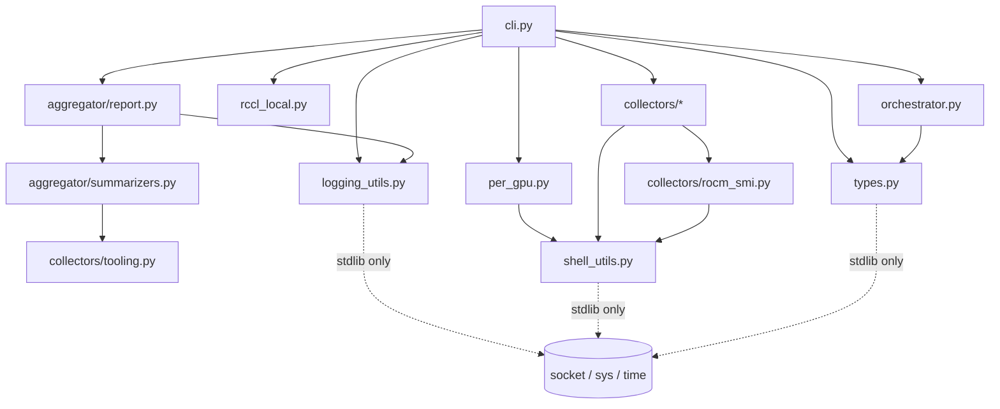

# Node-Local Smoke Test

A lightweight, distributed-rendezvous-free preflight check that runs on every node in parallel under SLURM. Designed to **quickly identify broken nodes before a large training job commits to a global rendezvous**, in the common case where we own full nodes and care which *node* is sick rather than which GPU within an otherwise-healthy node.

- **Implementation**: `primus/tools/preflight/node_smoke/` (Python sub-package; entry point `python -m primus.tools.preflight.node_smoke`).
- **Wrapper**: `runner/run_node_smoke_direct.sh`
- **Companion**: see `docs/preflight.md` for the full preflight tool (with global rendezvous and richer perf tests).

## Quick start

```bash
# Inside an existing SLURM allocation (the normal case):
srun -N "$SLURM_NNODES" --ntasks-per-node=1 \
     bash runner/run_node_smoke_direct.sh

# With perf sanity (GEMM TFLOPS, HBM GB/s, local 8-GPU RCCL all-reduce):
srun -N "$SLURM_NNODES" --ntasks-per-node=1 \
     bash runner/run_node_smoke_direct.sh --tier2-perf

# Hard-fail on partial NIC enumeration (e.g. 7 of 8 RDMA NICs):
srun ... bash runner/run_node_smoke_direct.sh --tier2-perf \
     --expected-rdma-nics 8

# Single-node local check (no SLURM):
bash runner/run_node_smoke_direct.sh
```

`VENV_ACTIVATE` must point at the Python virtualenv activation script (same convention as `run_preflight_direct.sh`).

## Outputs

After a run, `<dump>/` (default `output/preflight/`) contains:

| File | Purpose |
|---|---|
| `smoke/<short-host>.json` | Per-node verdict + every collected metric. One file per node. |
| `smoke_report.md` | Human-readable cluster report (status table, drift sections, perf summary, failing-node detail). |
| `passing_nodes.txt` | Newline-separated short hostnames. Pipe into `srun --nodelist=`. |
| `failing_nodes.txt` | Newline-separated short hostnames. Pipe into `srun --exclude=`. |
| `expected_nodes.txt` | (auto-populated from `scontrol show hostnames "$SLURM_JOB_NODELIST"`) Used by the aggregator to name nodes that never reported. |

```bash
# Re-run training, excluding the bad nodes from the previous smoke:
srun --exclude=$(paste -sd, output/preflight/failing_nodes.txt) ... your-real-job
```

## Architecture

- **Per-node Python entry** (`node_smoke.py run`) — runs independently on every node. No `MASTER_ADDR`, no global `torch.distributed` rendezvous; a stuck node cannot wedge its peers.
- **Per-GPU isolation** — each GPU's checks run in their own Python subprocess with a hard timeout. A stuck `torch.cuda.set_device()` (which can't be aborted by `signal.alarm` because it sits inside a non-interruptible driver syscall) is `SIGKILL`'d from the parent without affecting the rest of the node's checks.
- **Local-only RCCL** — Tier 2 all-reduce uses `torch.multiprocessing.spawn` over `tcp://127.0.0.1`. No cross-node communication.
- **Aggregator on `NODE_RANK==0`** — polls `<dump>/smoke/` for the expected number of JSONs (with a timeout), computes drift across the cluster, writes the markdown report and pass/fail txt files. Returns non-zero if any node FAILs or never reports.

## Module layout — where each check lives

The implementation is a Python sub-package under `primus/tools/preflight/node_smoke/`, split so each Tier 1 sub-section, the per-GPU subprocess body, the orchestrator, and the aggregator each live in their own file. The single public entry point is `main` (re-exported from `__init__`); `python -m primus.tools.preflight.node_smoke ...` resolves to `__main__.py` which calls it.

```
primus/tools/preflight/node_smoke/
├── __init__.py          # re-export `main`
├── __main__.py          # `python -m primus.tools.preflight.node_smoke`
├── cli.py               # `_build_parser`, `_cmd_run`, `_cmd_aggregate`,
│                        # `_cmd_per_gpu`, `main`
├── types.py             # `GPUResult`, `NodeResult` dataclasses
├── logging_utils.py     # `_ts`, `_log`, `_warn`, hostname normalisation
├── shell_utils.py       # `_which`, `_read_text`, `_resolve_gpu_bdf`,
│                        # `_systemctl_is_active`, `_parse_size_with_unit`,
│                        # `_findings_to_dicts`
├── per_gpu.py           # `_per_gpu_body` (Tier 1 + optional Tier 2 perf,
│                        # GEMM/HBM bandwidth measurement)
├── rccl_local.py        # node-local RCCL all-reduce (Tier 2)
├── orchestrator.py      # `_spawn_per_gpu`, `_node_status_from`,
│                        # `_clean_dump_path`
├── collectors/          # one module per Tier 1 sub-section
│   ├── dmesg.py             # recent dmesg error scan
│   ├── fingerprint.py       # Tier 1 A — software-stack fingerprint
│   ├── nics.py              # Tier 1 B — NIC / RDMA roll-call
│   ├── host_limits.py       # Tier 1 C — ulimit / shm / NUMA / governor
│   ├── gpu_low_level.py     # Tier 1 D-1 — amd-smi metric (ECC, throttle,
│   │                        #               clocks, power)
│   ├── xgmi.py              # Tier 1 D-2 — XGMI link matrix
│   ├── clock.py             # Tier 1 E — wall time + time-daemon health
│   ├── rocm_smi.py          # Tier 1 F + cross-tool fallbacks for D-1/2/G
│   ├── gpu_processes.py     # Tier 1 G — foreign / leaked PID detection
│   ├── tooling.py           # tooling availability inventory
│   └── reused_info.py       # reused gpu/host/network info collectors
└── aggregator/
    ├── summarizers.py       # `_*_rows` / `_*_summary` data shapers
    └── report.py            # `write_smoke_report` + one `_write_<section>`
                             # helper per Markdown `##` section
```

Dependency graph (acyclic; arrows mean "imports"):



* `collectors/` are leaf modules (depend on `shell_utils` + sometimes `collectors/rocm_smi`); they never import `cli` / `orchestrator` / `per_gpu`.
* `per_gpu` is the body of the `_per_gpu` subprocess and is the ONLY module loaded inside that subprocess via `python -m primus.tools.preflight.node_smoke _per_gpu N` — so its dependency surface is intentionally narrow (only `shell_utils`).
* `aggregator/` only depends on its own `summarizers` plus `logging_utils` (and `collectors/tooling` for the static `_TRACKED_TOOLS` constant).

## What's checked

### Tier 1 — mandatory (~5 s / GPU, always runs)

**Per-GPU subprocess (with hard timeout):**
- `torch.cuda.set_device(i)` — proves the device is bindable (a stale GPU often fails here)
- 256 MB allocation
- Tiny GEMM (2048² bf16) with `isfinite()` check on the result

**Reused from existing preflight collectors** (no rendezvous needed):
- `collect_gpu_info` — `level='fail'` Findings cause node FAIL
- `collect_host_info` — same
- `collect_network_info(expect_distributed=False)` — same

**dmesg recent-error scan** — greps the last `--dmesg-minutes` (default 15) of `dmesg` for known patterns (`xid`, `gpu reset`, `hung_task`, `mce:`, `amdgpu.*error`, ...). Matches are surfaced in the report.

**A. Software-stack fingerprint** (`tier1.fingerprint`):
- Kernel, OS, Python
- ROCm version (`/opt/rocm/.info/version`)
- amdgpu kernel-module version (`/sys/module/amdgpu/version`)
- PyTorch version, `torch.version.hip`, RCCL version (via `torch.cuda.nccl.version()`), librccl path
- Per-IB-device firmware (`/sys/class/infiniband/<dev>/fw_ver`) and HCA model

**B. NIC / RDMA roll-call** (`tier1.nics`):
- Per port (read entirely from `/sys/class/infiniband` — no `ibv_devinfo`/`ibstat` dependency, works inside containers): `state`, `phys_state`, `rate`, netdev + MTU, total non-zero GIDs, RoCE v2 GID count
- **Hard fail rules**: any port not `ACTIVE` / not `LinkUp`, any active port with zero RoCE v2 GIDs, NIC count != `--expected-rdma-nics N` (when set)

**C. Host limits / system tunables** (`tier1.host_limits`):
- `RLIMIT_MEMLOCK`, `RLIMIT_NOFILE`, `RLIMIT_NPROC`
- `/dev/shm` size + free
- NUMA node count, CPU count, `cpu0` scaling governor
- **Hard fail rules**: `RLIMIT_MEMLOCK` finite and below `--ulimit-l-min-gb` (default 32 GiB) → "RDMA pin will fail under load"; `/dev/shm` size below `--shm-min-gb` (default 8 GiB) → "NCCL shared-mem may fail"

### Tier 2 — optional perf sanity (`--tier2-perf`)

Per-GPU steady-state metrics, with iteration counts aligned to the preflight `--quick` preset (`warmup=5, iters=20` for GEMM/RCCL; `warmup=10, iters=20` for HBM) so smoke and preflight numbers are directly comparable.

- **GEMM TFLOPS** — 8192³ bf16 `torch.matmul`, threshold `--gemm-tflops-min` (default 600).
- **HBM GB/s** — 512 MB device-to-device `torch.Tensor.copy_` (counts read + write), threshold `--hbm-gbs-min` (default 2000).
- **Local 8-GPU RCCL all-reduce GB/s** — algorithmic bandwidth `2·S·(P-1)/P / t / 1e9` at 64 MB, threshold `--rccl-gbs-min` (default 100).

## Aggregator report sections

Every section short-circuits to a placeholder (`*All nodes match.*` / `*No NIC issues.*` / `*No host-limit issues.*`) on a healthy cluster, so the report stays short. Each section header is part of the operator-facing contract — order and wording are stable across releases (some Slack bots / CI scripts grep for them).

In order:

1. **Status table** — one row per node with `node_rank`, hostname, PASS/FAIL, duration, top fail reason.
2. **Stack drift across cluster** — for every scalar fingerprint key, outliers vs the cluster majority.
3. **NIC firmware drift across cluster** — per-IB-device firmware drift.
4. **NIC / RDMA roll-call issues** — every offending node + port.
5. **NIC port-count summary** — cluster-majority port count and any node that disagrees (catches partial-NIC degradation without `--expected-rdma-nics`).
6. **Host limits issues** — per-node hard-limit violations.
7. **GPU visibility issues** — nodes where torch couldn't see the GPUs or amd-smi sees more GPUs than torch (stale ROCm / wedged amdgpu driver). Independent of every other collector.
8. **GPU low-level outliers (PCIe link / HBM)** — per-GPU outliers vs the cluster majority on PCIe width/speed and HBM total.
9. **XGMI link issues** — any non-XGMI GPU pair (intra-node collectives silently fall back to PCIe).
10. **Cluster clock + time daemons** — wall-clock spread plus per-node time-daemon health.
11. **Tooling self-latency (`rocm-smi --version`)** — slow / timed-out tool calls (precursor to a wedged amdgpu driver).
12. **Tooling availability** — always-on inventory of `amd-smi` / `rocm-smi` / `lsof` per node, plus which Tier 1 checks have NO working tool on each node.
13. **Busy GPUs / leaked processes** — foreign PIDs holding GPUs at smoke start (most common cause of training failing to launch on an otherwise-healthy node).
14. **GPU pre-touch HBM usage outliers** — GPUs with non-trivial HBM in use BEFORE smoke touched the device.
15. **GPU compute-activity outliers** — GPUs with `gfx_activity_pct >= --gpu-activity-warn-pct` at smoke start (warn-only).
16. **Tier 2 perf summary** (conditional, only when at least one node ran Tier 2) — per-node GEMM TFLOPS / HBM GB/s as `min / median / max`, plus local RCCL GB/s.
17. **Failing nodes — full reasons** (conditional, only when there are failing nodes) — every fail reason, expanded per node.

Each section that does pure data shaping is wrapped in its own `try / except`, so a future schema bug in one section can't truncate the rest of the report. The two intentional EXCEPTIONS are **Tier 2 perf summary** and **Failing nodes — full reasons** — both deliberately propagate exceptions so a regression in either bubbles up rather than silently rendering a half-empty section.

## Configuration knobs

The authoritative source of flags + defaults is `python -m primus.tools.preflight.node_smoke run --help` (and `... aggregate --help`). The tables below mirror the parser as of the package-split refactor.

### `run` subcommand

| Flag | Default | Purpose |
|---|---|---|
| `--dump-path` | `output/preflight` | Output directory. |
| `--expected-gpus N` | auto | Override GPU count (auto-detected from `LOCAL_WORLD_SIZE` / `GPUS_PER_NODE` / `torch.cuda.device_count()`). |
| `--per-gpu-timeout-sec` | 15 | Hard timeout per per-GPU subprocess. |
| `--tier2-perf` | off | Enable Tier 2 perf sanity (per-GPU GEMM TFLOPS + HBM GB/s + node-local RCCL all-reduce). Single switch — you cannot enable just one half. |
| `--gemm-tflops-min` | 600 | Tier 2 GEMM threshold. |
| `--hbm-gbs-min` | 2000 | Tier 2 HBM threshold. |
| `--rccl-size-mb` | 64 | Local RCCL message size. |
| `--rccl-gbs-min` | 100 | Local RCCL bandwidth threshold. |
| `--rccl-timeout-sec` | 30 | Hard timeout for the RCCL phase. |
| `--skip-dmesg` | off | Skip dmesg scan (e.g. inside containers). |
| `--dmesg-minutes` | 15 | dmesg `--since` window. |
| `--expected-rdma-nics N` | auto-report-only | When set, NIC count mismatch becomes a node FAIL. |
| `--ulimit-l-min-gb GB` | 32 | RLIMIT_MEMLOCK threshold (0 disables). |
| `--shm-min-gb GB` | 8 | `/dev/shm` size threshold (0 disables). |
| `--rocm-smi-timeout-sec SEC` | 5.0 | Hard timeout for the `rocm-smi --version` self-latency canary; hitting it is a node FAIL (driver likely wedging). |
| `--hbm-busy-threshold-gib GiB` | 2.0 | FAIL the node if any GPU has more than this many GiB of HBM in use BEFORE smoke touches the device (i.e. someone else is holding it). |
| `--allow-foreign-procs` | off | Do NOT FAIL the node when foreign processes are found holding a GPU. They will still be reported. |
| `--allowed-procs LIST` | `gpuagent,rocm-smi-daemon,amd-smi,dcgm-exporter` | Comma-separated process names that are OK to find holding the GPU. Set to `""` to disable the whitelist. |
| `--gpu-activity-warn-pct PCT` | 20.0 | Warn (does NOT fail) if amd-smi reports any GPU's `gfx_activity_pct` above this when smoke starts. |
| `--require-tools LIST` | `""` (warn-only) | Comma-separated CLI tool names that MUST be in PATH (`amd-smi`, `rocm-smi`, `lsof`); anything missing becomes a hard node FAIL. |
| `--no-clean-dump-path` | off | Do NOT auto-wipe stale per-node JSONs / aggregator outputs from `--dump-path` on rank 0 at startup. Default behavior is to clean so re-runs on a different (smaller) nodelist don't inherit ghost PASS verdicts from removed nodes. |

### `aggregate` subcommand

| Flag | Default | Purpose |
|---|---|---|
| `--dump-path` | `output/preflight` | Same as `run`. |
| `--expected-nodes N` | none | If fewer JSONs land within `--wait-timeout-sec`, missing nodes are added as FAIL placeholders. |
| `--wait-timeout-sec` | 60 | Polling timeout. |
| `--rocm-smi-warn-sec SEC` | 1.0 | Flag (warn-only) any node where `rocm-smi --version` took longer than this. |
| `--clock-skew-warn-sec SEC` | 30.0 | Warn when wall-clock spread across nodes exceeds this many seconds. Includes srun launch jitter so the default is loose. |
| `--hbm-busy-threshold-gib GiB` | 2.0 | Mirrors the `run`-side default; used to label the **GPU pre-touch HBM usage outliers** section. |
| `--gpu-activity-warn-pct PCT` | 20.0 | Mirrors the `run`-side default; used to label the **GPU compute-activity outliers** section. |
| `--expected-nodelist-file FILE` | none | One short hostname per line. Missing nodes get their **real short hostname** in the report and `failing_nodes.txt` (instead of `<missing-N>` placeholders). The wrapper auto-populates this from `scontrol show hostnames "$SLURM_JOB_NODELIST"`. |

Wrapper-only flags (consumed by `run_node_smoke_direct.sh`, not forwarded):

| Flag | Purpose |
|---|---|
| `--silent` | Suppress wrapper stdout (final report path still printed) |
| `--aggregate-only` | Skip per-node run, only aggregate |
| `--no-aggregate` | Skip the rank-0 aggregator step |
| `--wait-timeout-sec SEC` | Override aggregator timeout |

Anything else is forwarded verbatim to `node_smoke run`.

## Comparison with the full `preflight`

| Aspect | `node_smoke` | full `preflight` |
|---|---|---|
| Rendezvous | None — every node independent | Global `torch.distributed` |
| Wall clock | ~50–60 s for 6 nodes (Tier 1+2) | Minutes; scales with N for inter-node tests |
| GEMM threshold | Hard threshold per GPU | Reports per-GPU numbers, no auto-fail |
| HBM bandwidth | Yes (D2D `copy_`) | Not measured |
| Inter-node all-reduce/all-to-all | Not tested (intentionally) | Yes |
| Drift detection | Yes (versions, NIC firmware, port count) | No |
| Host limits / RDMA roll-call | Yes (hard fail) | Reported via `collect_*_info` only |
| Output format | Per-node JSON + cluster md + SLURM-ready txt | Markdown + PDF |

Use `node_smoke` to **screen** a cluster fast and exclude bad nodes. Use the full `preflight` when you want **deep cross-node measurements** (inter-node bandwidth matrix, ring-P2P, etc.).

---

## Implementation history

Captured here so future contributors understand *why* the design looks the way it does.

### 1. Configurable preflight (predecessor work)

Before `node_smoke` existed, the goal was simply to make the full `preflight` perf phase configurable: which tests to run, which message sizes, which subgroup sizes. Outcome (committed before `node_smoke`):

- `--tests gemm,intra-allreduce,inter-allreduce,...` to select tests
- `--comm-sizes-mb 2,8,64,1024`, `--intra-comm-sizes-mb`, `--inter-comm-sizes-mb`, `--ring-p2p-sizes-mb`
- `--intra-group-sizes 2,4,8`, `--inter-group-sizes 2,4,all`
- `--quick` preset (small warmup/iters, single message size)
- New flag-precedence rules: `--tests` / `--quick` imply `--perf-test`; mixing perf and info selectors warns and drops info; tuning knobs without perf intent are inert with a quieter warn
- Report improvements: Node/Rank columns compressed into ranges (e.g. `0-7`), a Node→Hostname legend at the top, "Leader hostname" column showing only the first host of each group

This work is in `primus/tools/preflight/preflight_perf_test.py` and the comm modules. It set up the global accessors (`set_warmup` / `set_iteration` / `get_*`) that `node_smoke` later mirrored to keep iteration counts comparable.

### 2. Why a separate node-local smoke test

A user pointed out that for large jobs, what really matters is "which node has a problem", not which GPU. They proposed a per-node distributed-environment with simple checks (`set_device`, quick bandwidth/speed tests) that returns a success/fail flag per node, *before* the real training job opens its global rendezvous. This was the motivation for `node_smoke.py` — much faster, no dependency on a healthy cluster, and a stuck node can't take down its peers.

### 3. Tiering decision

Two tiers, picked interactively:

- **Tier 1**: mandatory, fast (~5 s/GPU) — `set_device`, alloc, tiny GEMM, plus reused info collectors. The bar is "the GPU enumerated and runs ops".
- **Tier 2**: optional perf sanity (`--tier2 / --tier2-rccl`) — GEMM TFLOPS, HBM bandwidth, local 8-GPU RCCL. The bar is "the GPU is at expected steady-state performance".

HBM bandwidth was clarified to mean device-to-device `torch.Tensor.copy_` of a 512 MB buffer, counting read + write, which gives ~70–80 % of the MI300X HBM3 roofline (~5300 GB/s) on healthy hardware.

### 4. First scaled run + measurement-quality bug

The first 6-node run produced:

- GEMM 8192³ bf16: smoke median **724 TFLOPS**, full preflight median **765 TFLOPS** (~6 % gap)
- Local AR 64 MB / 8 GPU: smoke median **199 GB/s**, full preflight median **230 GB/s** (~12 % gap)

Formula audit confirmed `2·S·(P-1)/P / t` and `2·N³/t` are identical to `intra_node_comm.py` and `square_gemm.py`. The systematic offset traced to **iteration counts being too low**. The original RCCL loop was `1 warmup + 1 timed iter` — basically a kernel-launch latency test, not a bandwidth test. Fixed by aligning to the preflight `--quick` preset:

- GEMM: `warmup 3→5, iters 10→20`
- HBM: `warmup 5→10, iters 10→20`
- RCCL: `warmup 1→5, iters 1→20`

Per-node runtime cost rounded to <1 s additional. Aggregator gained a "Tier 2 perf summary" section so per-node GEMM/HBM/RCCL outliers are visible without grepping JSONs.

### 5. A + B + C (drift, NIC roll-call, host limits)

Discussion of what the smoke test was *missing* led to six categories. A, B, C landed:

- **A. Stack drift detection** — per-node `fingerprint` (kernel, ROCm, amdgpu, RCCL, torch, NIC firmware, HCA model) + aggregator-side cluster-majority-vs-outlier comparison. Catches "1 of N nodes on a different RCCL build" — a frequent cause of "job dies at minute 3".
- **B. NIC / RDMA roll-call** — sysfs-only inventory of `/sys/class/infiniband` (no `ibv_devinfo` dependency), per-port hard-fail rules for state ≠ ACTIVE, missing RoCE v2 GIDs, count mismatch (when `--expected-rdma-nics` is set).
- **C. Host limits** — `RLIMIT_MEMLOCK` (32 GiB default threshold), `/dev/shm` (8 GiB default threshold), plus collected-only NUMA / governor / kernel for drift detection.

Verified with a synthetic two-node drift test (one real + one edited copy with mismatched RCCL, mismatched amdgpu, mismatched `rdma3` firmware, `rdma2:1` DOWN, and `memlock=64 MiB`): every section lit up correctly, `fail_reasons` were prefixed with `nic:` / `host_limits:` for traceability, exit code propagated.

### 6. Aggregator crash on heterogeneous fingerprints

An 18-node run on a different cluster crashed the aggregator with `TypeError: unhashable type: 'dict'`. Root cause: `_stack_drift_rows()` added a key to its scalar-comparison set whenever **any** node reported it as `None` (or a scalar), then iterated **all** nodes' values for that key into `Counter(...)`. On the failing cluster `nic_fw` was `None` on one node and a dict on others — the dict wasn't hashable. Fix:

1. Only collect a key when at least one node reports it as a real scalar (drop the "None counts as scalar" path).
2. Defense-in-depth `isinstance(v, (str, int, float))` check inside the per-host loop.
3. Each report section wrapped in its own `try / except` so one section's bug can't truncate the rest of the report.
4. New "NIC port-count summary" section that always renders and lists nodes whose port count differs from the cluster majority (so partial-NIC degradation like 7-of-8 is visible without `--expected-rdma-nics`).

### 7. Package split (refactor of the 4.5k-line monolith)

`node_smoke.py` had grown to ~4500 lines with all collectors, the orchestrator, the per-GPU subprocess body, and the ~700-line aggregator markdown writer in a single file. The refactor turned it into a Python sub-package (`primus/tools/preflight/node_smoke/`) with one module per Tier 1 sub-section (`collectors/`), the per-GPU subprocess body, the orchestrator, and the aggregator's data shapers (`aggregator/summarizers.py`) and Markdown writer (`aggregator/report.py`, with one `_write_<section>` helper per `##` heading). The single public entry point — `main` — is re-exported from `__init__.py`, so the existing `python -m primus.tools.preflight.node_smoke ...` invocation (used by `runner/run_node_smoke_direct.sh` and by `_spawn_per_gpu` for per-GPU subprocesses) keeps working unchanged. Behavior parity was checked by diffing the per-node JSON and `smoke_report.md` against a baseline (with a small allowlist for run-variant fields like PIDs, hardware cycle counters, and `available_gb`/`free_gb`/`cached_gb`); CLI help text, JSON schema, report section order, and exit-code semantics for `run` / `_per_gpu` / `aggregate` are byte-identical to pre-refactor.

### 8. Short hostnames + naming nodes that never reported

`failing_nodes.txt` held FQDNs (`socket.gethostname()` returned the FQDN on the failing cluster) — not pipeable into `srun --exclude=`. Nodes that never produced a JSON only showed up as `<missing-N>` placeholders, so operators couldn't act on them.

Fix:

1. Normalize `host = socket.gethostname().split(".", 1)[0]` in `_cmd_run` for both the JSON filename and the `host` field; logs use the short name too.
2. Aggregator defensively short-normalizes every loaded JSON, so legacy FQDN files produce SLURM-ready txt outputs without re-running the smoke step.
3. New `aggregate --expected-nodelist-file FILE` flag — missing nodes appended with their real short hostname (and a self-describing `expected hostname '<host>' from --expected-nodelist-file` reason), written to `failing_nodes.txt` directly.
4. Wrapper resolves `SLURM_JOB_NODELIST` via `scontrol show hostnames` into `<dump>/expected_nodes.txt` and forwards it to the aggregator. Best-effort: silent fallback to count-only behaviour when `scontrol` is unavailable.

This also makes "the node that SLURM marked as `task X: unknown`" visible in the report under its real hostname.

---

## Future work

These were proposed but not yet built. In rough priority order:

### D. GPU low-level health (beyond "alloc + small GEMM works")

Reveals hardware that *enumerates* but is degraded. Most map to one `rocm-smi` query or one sysfs read in the existing per-GPU subprocess.

- GPU count == expected and `lspci -d 1002:` agrees
- PCIe link width/speed per GPU (`/sys/bus/pci/devices/<bdf>/current_link_{speed,width}`) — catches "GPU at Gen3 x8 because the slot needs reseating"
- XGMI link matrix between every GPU pair (reuse `primus/tools/preflight/gpu/gpu_topology.py`)
- HBM size per GPU matches expected
- ECC counters: uncorrectable as hard fail, correctable as info-only with a cluster-median baseline
- GPU clock state: flag any GPU stuck at idle GFX clock (stale-state symptom)
- Throttle reasons from `rocm-smi --showperflevel` (`power_throttle` / `thermal_throttle`)
- Power cap drift across the cluster

Aggregator gets a "GPU-level drift" section that pinpoints `host:gpu` outliers, not just node-level.

### E. Time / cluster sync

- Wall-clock skew vs `node_rank=0`: each node writes its `time.time()` into its JSON; aggregator computes `max - min` and warns at > 1 s, fails at > 5 s
- Time-daemon health (`systemctl is-active chronyd / ntpd / systemd-timesyncd`)

### F. Storage / runtime liveness (site-specific)

- Shared-FS latency probe: 1 KB write + `stat` to a unique path, aggregator flags nodes far above the cluster median (Lustre/NFS hiccups)
- Shared-FS quota / free space
- DNS resolution sanity for peer hostnames
- `rocm-smi --version` self-latency (5 s timeout) — catches drivers that have started to wedge but haven't crashed yet (we've seen 30–60 s `rocm-smi` calls precede a full GPU hang by minutes)
- Container / image hash drift — if the launcher exports `CONTAINER_IMAGE_TAG`, fold it into the existing fingerprint

### Bigger architectural item (lower priority)

- If `NODE_RANK==0` itself fails to start, no aggregator runs anywhere. Possible mitigations: separate aggregator step submitted after the smoke step, or polling watchdog on the submit host. Out of scope for now — handled in practice by always passing `--time=` to `srun` so SLURM force-terminates a stuck job and you can re-run the aggregator alone with `--aggregate-only` + `--expected-nodelist-file`.
