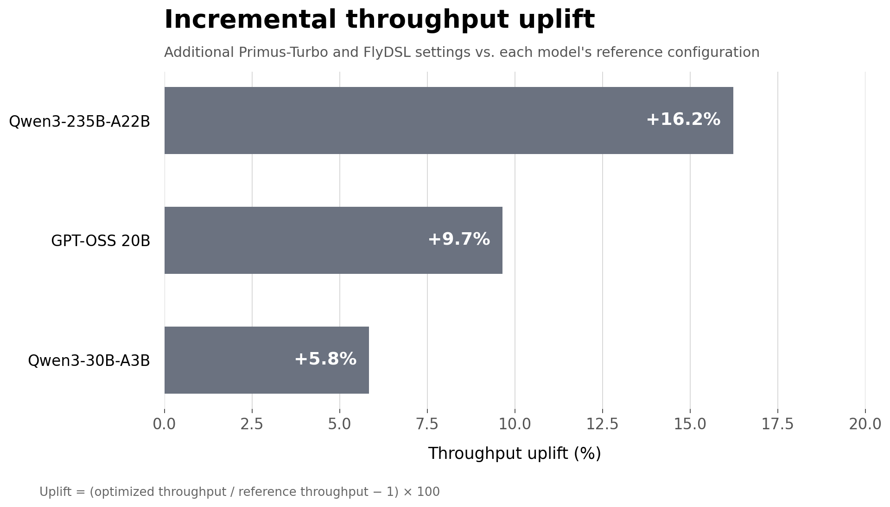
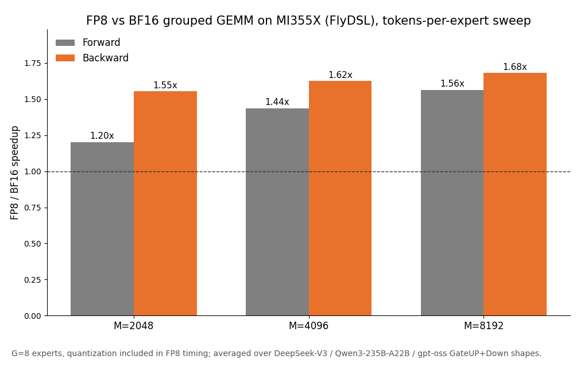
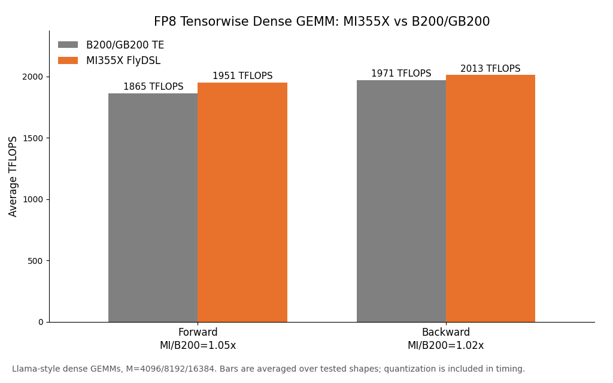
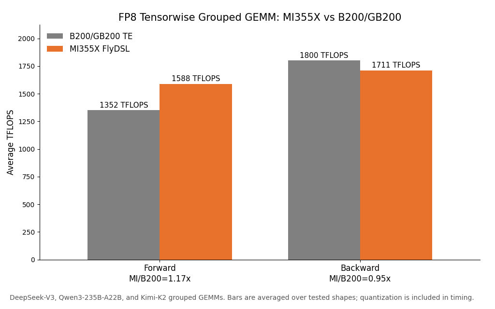
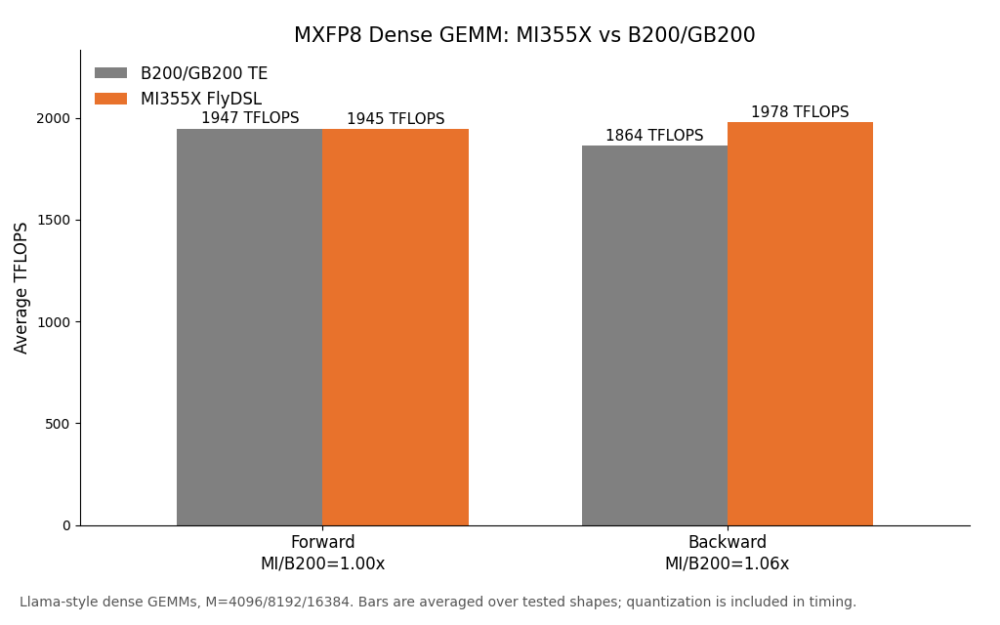
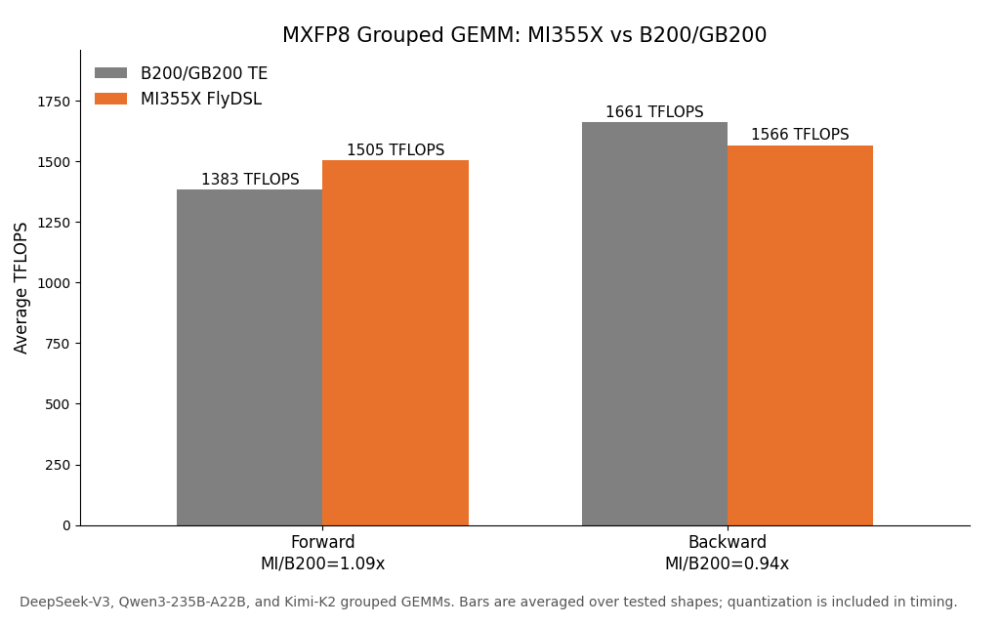

<!---
Copyright (c) 2025 Advanced Micro Devices, Inc. (AMD)

Permission is hereby granted, free of charge, to any person obtaining a copy
of this software and associated documentation files (the "Software"), to deal
in the Software without restriction, including without limitation the rights
to use, copy, modify, merge, publish, distribute, sublicense, and/or sell
copies of the Software, and to permit persons to whom the Software is
furnished to do so, subject to the following conditions:

The above copyright notice and this permission notice shall be included in all
copies or substantial portions of the Software.

THE SOFTWARE IS PROVIDED "AS IS", WITHOUT WARRANTY OF ANY KIND, EXPRESS OR
IMPLIED, INCLUDING BUT NOT LIMITED TO THE WARRANTIES OF MERCHANTABILITY,
FITNESS FOR A PARTICULAR PURPOSE AND NONINFRINGEMENT. IN NO EVENT SHALL THE
AUTHORS OR COPYRIGHT HOLDERS BE LIABLE FOR ANY CLAIM, DAMAGES OR OTHER
LIABILITY, WHETHER IN AN ACTION OF CONTRACT, TORT OR OTHERWISE, ARISING FROM,
OUT OF OR IN CONNECTION WITH THE SOFTWARE OR THE USE OR OTHER DEALINGS IN THE
SOFTWARE.
--->

<!---
NOTE: This is a DRAFT of the MoE 2.0 blog. Each section carries an HTML-comment
"OWNER / FILL" note describing what the section owner still needs to supply
(final numbers, figures, benchmark tables). The prose is a starting point —
owners should verify all technical claims and replace every `[TODO: ...]` /
`[X]` placeholder and every image path under `imgs/` with the real asset before
publishing. All OWNER / FILL comments and placeholders must be removed before
release.
--->

# MoE Training Optimization with Primus

_Mixture-of-Experts (MoE) has become the default architecture for frontier-scale language models, and our users increasingly train large MoE models on AMD Instinct™ GPUs. Driven by these real workload requirements — and by where the industry has recently concentrated its MoE optimization efforts — we have built a broad set of MoE training optimizations in Primus. This blog walks through that work: kernel-level work (a fused MoE **megakernel** and **low-precision operators**), general **Primus + Primus-Turbo** training optimizations, **time-to-train** improvements on large models such as DeepSeek-V3, small-model MoE optimizations benchmarked against **NVIDIA B200**, our **JAX (MaxText)** MoE training path, and **performance projection**. Both the Megatron-LM and JAX backends of Primus are covered. For the foundational optimizations this work builds on, see our earlier [MoE Training Best Practices on AMD GPU](https://rocm.blogs.amd.com/software-tools-optimization/primus-moe-package/README.html) post._

All feature demonstrations and benchmarking results in this guide are built on Primus. [Primus/Primus-LM](https://github.com/AMD-AGI/Primus) is a flexible, high-performance framework for large-scale foundation model training and inference on AMD GPUs. As the training-framework layer of the Primus ecosystem, Primus-LM works alongside [Primus-Turbo](https://github.com/AMD-AGI/Primus-Turbo) (high-performance operators) and [Primus-SaFE](https://github.com/AMD-AGI/Primus-SaFE) (stability and platform infrastructure) to deliver a scalable, production-ready solution for state-of-the-art large-model development.

---

## Background

The open-source MoE landscape has both broadened and deepened: models are larger and sparser, expert granularity is finer, and MoE has become the default architecture for frontier-scale language models. Combined with the growing demand from real training workloads, this makes MoE training efficiency a first-order concern. This section motivates why it matters and lays out the optimization directions this blog covers.

### MoE model trends

<!---
OWNER / FILL: TBD (Background owner). Verify the representative model list and the
architectural trend claims below; add citations/links where useful. Consider a
small table of the MoE models Primus now supports (DeepSeek-V3, Qwen3-235B-A22B,
Qwen3-30B-A3B, GLM, MiniMax, GPT-OSS-120B, Mixtral) with total/active params.
--->

Modern MoE models share a set of clear architectural trends:

- **Scaling total parameters while keeping activation sparse.** Total parameter counts continue to climb toward the trillion-parameter regime, while only a small fraction of parameters are activated per token. This decouples model capacity from per-token compute, but shifts the training bottleneck toward memory, routing, and communication.
- **Fine-grained experts.** Newer models use many small experts rather than a few large ones (for example, DeepSeek-V3's 256 routed experts with top-8 routing), increasing expert count and the number of fine-grained operators per MoE layer.
- **Shared plus routed experts.** A shared "always-on" expert combined with sparsely routed experts has become common, adding structure to the MoE layer that optimizations must respect.
- **Higher top-k and larger EP.** More experts activated per token and larger expert-parallel (EP) groups increase all-to-all traffic, making dispatch/combine communication a first-order cost.

Representative models in this generation include DeepSeek-V3, Qwen3-235B-A22B and Qwen3-30B-A3B, GLM, MiniMax, GPT-OSS, and Mixtral — all of which Primus supports today. These trends mean that MoE training efficiency is no longer just about fast GEMMs: it is about co-optimizing compute, communication, memory, and scheduling across the whole training stack.

### Directions for MoE training optimization

Guided by real workload requirements and by the industry's recent optimization focus, this blog is organized around the following directions:

- **Kernel-level fusion** — a fused MoE *megakernel* that combines expert dispatch, grouped GEMM, activation, and combine into a single persistent kernel to overlap communication and compute at tile granularity.
- **Low-precision operators** — FP8/MXFP8 expert GEMMs and the surrounding quantization pipeline, with attention to accuracy and system-level break-even.
- **General framework optimizations** — the broad set of Primus + Primus-Turbo improvements that benefit every MoE workload.
- **Time-to-train (TTT)** — end-to-end optimization of real large-model runs, using DeepSeek-V3 as the flagship case study (fine-grained recompute, scaling, and long-duration runs).
- **Small-model MoE and cross-vendor comparison** — optimizations for smaller MoE models, benchmarked against NVIDIA B200.
- **Framework backends** — both the Megatron-LM and JAX (MaxText) training paths.
- **Performance projection** — estimating memory and throughput before committing cluster time.

---

## Optimization Overview

<!---
OWNER / FILL: Overview owner. Replace [X] placeholders with the real headline
numbers once the per-model results below are finalized, and make sure this
paragraph matches the "Overall performance uplift" chart. Keep it to one
paragraph of end-to-end story + headline numbers.
--->

Taken together, the optimizations in this blog deliver end-to-end training speedups across the modern MoE model family on AMD Instinct MI300/MI355-series GPUs. Compared to an unoptimized baseline configuration, the combined kernel, communication, precision, and scheduling improvements yield up to **[X]×** higher training throughput on representative models such as DeepSeek-V3 and Qwen3-235B-A22B, while our projection tooling keeps configuration cost low by predicting memory and performance before a run. The remainder of this blog details each contributing optimization and its measured impact.

### Overall performance uplift

<!---
OWNER / FILL: Overview owner. Add the asset at imgs/moe_perf_overview.png — a bar
chart of end-to-end training throughput uplift across common MoE models
(DeepSeek-V3, Qwen3-235B-A22B, Qwen3-30B-A3B, GPT-OSS, Mixtral, ...). State the
baseline, hardware (MI300 / MI355), precision, and the measured speedups in the
caption. Replace the placeholder image reference below.
--->

The chart below summarizes end-to-end training throughput improvements across common MoE models on AMD Instinct MI355X, measured against an unoptimized baseline configuration.

**Figure 1: End-to-end MoE training throughput uplift across representative models on AMD Instinct MI355X** _(placeholder — asset and numbers to be finalized)_

---

## Performance Optimization Features

### General performance optimization: Primus + Primus-Turbo

<!---
OWNER / FILL: Ruibin Zhang. Verify the list of general optimizations and add any
missing recent ones. Add a summary table or figure of the general-optimization
uplift if available. The first blog already documents Turbo Grouped GEMM,
DeepEP, Sync-Free MoE, 1F1B A2A overlap, arbitrary pipeline partition, selective
recompute, loss fusion, CPU launch optimization, and manual GC — reference it
rather than repeating in full.
--->

Most MoE workloads benefit first from a foundation of general-purpose training optimizations delivered through Primus and [Primus-Turbo](https://github.com/AMD-AGI/Primus-Turbo). A core set — Turbo grouped GEMM, DeepEP-accelerated dispatch, sync-free MoE, 1F1B all-to-all overlap, arbitrary pipeline partitioning, selective-layer recompute, loss fusion, NUMA binding and kernel-launch tuning, and manual GC (covered in detail in our earlier [MoE blog](https://rocm.blogs.amd.com/software-tools-optimization/primus-moe-package/README.html)) — forms the backbone of every recipe here.

On top of this foundation, we have hardened and extended the following for the current model generation:

- **Precision-aware optimizer with BF16 states.** Storing master gradients and the Adam moment estimates in BF16 (`main_grads_dtype`, `exp_avg_dtype`, `exp_avg_sq_dtype`) meaningfully reduces optimizer memory and gradient-reduction cost, freeing memory headroom for larger micro-batches.
- **Fused cross-entropy and RoPE.** TE-backed cross-entropy loss fusion (`cross_entropy_fusion_impl: te`) and fused RoPE (`apply_rope_fusion`) cut memory and kernel overhead in the loss and attention paths.
- **Turbo RMSNorm and fused activation.** Fused normalization and SwiGLU-with-probs paths reduce the number of small kernels in the MoE block.
- **Pipeline warm-up (`pp_warmup`).** A parallel forward+backward warm-up on every pipeline rank exercises all lazy-init paths (CUDA/HIP, TE, FP8, NCCL) concurrently, removing first-iteration stalls without changing numerics.
- **Faster process teardown.** An opt-in fast-exit path shaves wall-clock time from the tail of large runs.

<!---
OWNER / FILL: Ruibin Zhang. Insert a figure/table quantifying the cumulative
general-optimization uplift on a representative model (e.g. Qwen3-30B-A3B or
DeepSeek-V3) at imgs/general_opt_uplift.png. Replace the placeholder below.
--->

**Figure 2: Cumulative impact of general Primus + Primus-Turbo optimizations on a representative MoE model** _(placeholder — asset and numbers to be finalized)_

Together, these general optimizations are the default-on baseline that the model-specific and kernel-level work below builds upon.

### Megakernel

<!---
OWNER / FILL: Xiaoming Peng, Zhen Huang. This section describes research-stage
work (RocMoE / MonolithEP super-kernel). Before publishing:
  - Confirm which numbers are cleared for public release. The standalone GEMM
    roofline (near-peak MFMA) is safe and compelling; end-to-end fused-kernel
    speedups are still being finalized at training scale — keep them as
    placeholders ([X]) or mark clearly as preliminary until validated.
  - Decide how much AMD-specific implementation detail (DTOLDS/AGPR/wave
    specialization) to expose publicly.
  - Add figures: (a) fused single-kernel dataflow diagram, (b) timeline showing
    dispatch/GEMM/combine overlap, (c) a perf bar vs. the separate-kernel baseline.
--->

**Motivation.** In a standard MoE layer, expert dispatch and combine are collective all-to-all operations, while FC1/FC2 are grouped GEMMs. Because collective libraries are host-initiated and operate at kernel granularity, communication and expert compute execute in separate kernels and can only be overlapped coarsely across kernel boundaries. Profiling shows the MoE forward pass split roughly between all-to-all communication and expert compute, so the biggest remaining prize is to overlap the two *inside* a single kernel at fine granularity.

**Design.** The megakernel fuses the entire MoE forward path — dispatch (all-to-all) → FC1 (gate/up grouped GEMM) → SwiGLU → FC2 (down grouped GEMM) → combine (all-to-all) — into a **single persistent kernel**. The key ideas are:

- **Role-specialized workgroups.** The persistent grid is partitioned into roles (dispatch, compute, combine), so communication workgroups can make progress while compute workgroups run MFMA GEMMs concurrently on the same device.
- **Tile-granularity overlap via arrival scoreboards.** Instead of a global barrier between dispatch and compute, per-block arrival flags let a compute workgroup begin FC1 on a tile the moment that tile's tokens have landed — hiding communication latency inside the GEMM.
- **Zero-permute token layout.** Received tokens are packed contiguously per expert, so the grouped GEMM indexes them directly with no separate permutation step.
- **Epilogue fusion.** SwiGLU is fused into the FC1 epilogue and FC2 output is written directly into the combine path, eliminating intermediate activation round-trips to HBM.

**AMD-specific engineering.** The design maps the pattern onto CDNA3/CDNA4 (gfx942/gfx950): direct-to-LDS asynchronous loads replace TMA, MFMA accumulators live in AGPRs, `__hip_atomic_*` release/acquire plus LDS signaling replaces mbarrier/cluster synchronization, wave specialization within a workgroup replaces warpgroup register partitioning, and XGMI/IPC peer transfers replace NVLink.

**Results.** The hand-tuned expert grouped-GEMM inner loop reaches near-peak MFMA utilization on MI355X (approaching the BF16 roofline for representative DeepSeek-V3 expert shapes), and the fused single-kernel prototype overlaps dispatch/compute/combine to reduce MoE-layer forward time versus a separate-kernel baseline.

<!---
OWNER / FILL: Xiaoming Peng, Zhen Huang. Replace [X] below with cleared numbers,
or reword to a qualitative claim if numbers are not yet public.
--->

On representative DeepSeek-V3 expert shapes, the fused megakernel achieves up to **[X]×** speedup over the separate dispatch/GEMM/combine baseline for the MoE forward layer. _(preliminary — to be finalized)_

**Figure 3: Fused MoE megakernel — single persistent kernel overlapping dispatch, grouped GEMM, and combine** _(placeholder — asset to be added)_

We are working to graduate this research super-kernel into a feature-flagged Primus-Turbo operator, extend it to FP8/MXFP8 expert weights, and scale it beyond a single node.

### Low-precision operator optimization

<!---
OWNER / FILL: Ruibin Zhang, Kyle Zhao. Confirm which FP8 recipes/results are
public. Add: (a) an accuracy/convergence statement for FP8 MoE training, (b) a
kernel-level FP8-vs-BF16 grouped-GEMM speedup figure, and (c) any end-to-end FP8
result. Keep the system-level break-even discussion (amax reduction, cast cost)
honest but framed around how Primus mitigates it. Replace [X] placeholders.
--->

Low precision is one of the most direct levers for MoE training throughput, since expert GEMMs dominate compute. Primus supports FP8 training through Transformer Engine recipes with a Primus-Turbo operator overlay, covering **delayed**, **tensorwise (current) scaling**, **blockwise scaling**, and **MXFP8** recipes. For MoE specifically, the routed-expert path uses an FP8 **grouped GEMM** (`grouped_gemm_fp8`) with per-first-microbatch weight quantization and caching, and pads permuted tokens to the quantization block boundary so that dispatch, permutation, and expert GEMM all agree on the FP8 layout. These paths run on Primus-Turbo kernels supporting both FP8 tensorwise scaling and MXFP8 block scaling (`E4M3`, block size 32, `E8M0` scale).

Key considerations for FP8 MoE training on AMD GPUs:

- **Accuracy is preserved.** Both the FP8 and MXFP8 expert GEMMs are numerically validated (including uneven-`M` grouped cases); at the training level the default tensorwise (current-scaling) recipe tracks BF16 convergence, while MXFP8's per-block scaling further contains quantization error on the expert GEMMs.
- **Recipe choice matters.** Tensorwise (current) scaling and block/MX scaling behave differently in both accuracy and speed on MI355X; Primus exposes the recipe as a single knob (`fp8_recipe`) so users can select the right trade-off.
- **Format selection.** On gfx950, using the OCP E4M3 format for expert GEMMs avoids costly up-conversions.
- **System-level break-even.** At the kernel level, FP8 expert GEMMs are substantially faster than BF16. End-to-end, the win depends on amortizing the surrounding quantization work — amax reduction, casting, and token-count synchronization. Primus reduces this overhead through weight-quantization caching, quantization-aware padding, and keeping token counts on-GPU, so the kernel speedup translates into end-to-end gains.

Figure 4 isolates that kernel-level payoff on MI355X alone, sweeping tokens-per-expert `M` over training-relevant sizes and reporting the FP8 (tensorwise) grouped-GEMM speedup over BF16 with quantization included in the FP8 timing:

  

**Figure 4: Kernel-level FP8-vs-BF16 grouped-GEMM speedup on AMD Instinct MI355X, swept over tokens-per-expert `M` and averaged over the DeepSeek-V3 / Qwen3-235B-A22B / gpt-oss expert shapes; quantization is included in the FP8 timing.**

The trend is clear: the forward speedup grows with `M` — from ~1.2x at `M`=2048 to ~1.6x at `M`=8192 as the GEMM gets large enough to hide the cast/amax cost that Primus already minimizes — while the backward is consistently ~1.5–1.7x. At training-relevant token counts the FP8 grouped-GEMM speedup is real and sizable.

To place these kernels, we benchmark end-to-end quantized dense and grouped GEMMs (quantization included in timing, correctness checked by output/gradient SNR) against the NVIDIA B200/GB200 TransformerEngine baseline on representative Llama-style dense shapes and DeepSeek-V3 / Qwen3-235B-A22B / Kimi-K2 expert shapes. Across these shapes MI355X is broadly at parity: dense GEMM is essentially even in both precisions, and grouped GEMM leads on the forward pass (driven by the memory-bound `Down` projection) while backward is close to parity, with large-`N` `GateUP` weight-gradient the main remaining gap.

<table>
  <tr>
    <td></td>
    <td></td>
  </tr>
  <tr>
    <td></td>
    <td></td>
  </tr>
</table>

**Figure 5: FP8 tensorwise (top) and MXFP8 (bottom) GEMM throughput on AMD Instinct MI355X vs NVIDIA B200/GB200 (TE) — dense (left) and grouped (right), forward and backward, averaged over the tested shapes.**

The main lesson is that low precision is not just a datatype switch: for MoE, layout and grouped scheduling matter as much as the quantization recipe. Removing the forward transpose tax and autotuning each grouped shape turns an apparent forward deficit into a forward lead, and MXFP8 layers finer-grained scaling on top of the same execution path while staying competitive with the B200/GB200 baseline.

### Benchmarking against B200

<!---
OWNER / FILL: Wei Huang. This work originated from MLPerf but the narrative should
center on the MoE training optimizations and the B200 comparison, not MLPerf
process. Before publishing:
  - Ensure the B200-vs-MI355X comparison is apples-to-apples (same model config,
    precision/FP8 recipe, patch set, multi-rank averaging). Only publish the
    comparison once it is clean.
  - Replace [X] step-time / throughput placeholders and add the comparison figure.
--->

Small MoE models expose a different optimization regime than trillion-parameter models: compute per layer is modest, so framework overhead, gradient reduction, and normalization/activation kernels dominate. Working from a GPT-OSS-class MoE model (32 experts, top-4, 8K sequence length) on a single 8×MI355X node, we tuned a set of optimizations that are broadly applicable to small MoE training:

- **BF16 gradient reduction** (`grad_reduce_in_bf16`) — the single largest step-time win in this regime, reducing communication volume and freeing significant memory.
- **Tuned normalization kernels** — a fast RMSNorm path that avoids regressions seen with generic implementations on this stack.
- **Precision-aware optimizer and memory tuning** — enabling larger micro-batches for higher hardware utilization.
- **Fused RoPE/attention and sync-free MoE tuning** — removing small-kernel and CPU-sync overhead.

We use NVIDIA B200 as the cross-vendor reference point for the same small MoE model.

<!---
OWNER / FILL: Wei Huang. Replace [X] with the finalized, apples-to-apples numbers
and add the comparison chart at imgs/b200_comparison.png.
--->

On the same small MoE training configuration, AMD Instinct MI355X reaches **[X]** ms/step (**[X]** TFLOP/s/GPU) versus **[X]** ms/step on NVIDIA B200. _(to be finalized as an apples-to-apples comparison)_

**Figure 6: Small MoE training step time — AMD Instinct MI355X vs NVIDIA B200** _(placeholder — asset and numbers to be finalized)_

### Time-to-Train (TTT) oriented optimization

Time-to-train measures what actually matters to users: how long a full training run takes end to end at real scale. This section uses DeepSeek-V3 as the flagship case study.

#### DeepSeek-V3 performance optimization

<!---
OWNER / FILL: Lihuan Zhang. Fill in each sub-topic with the concrete recipe and
measured results. DeepSeek-V3 reference config in Primus:
  examples/moe_package/run_deepseek_v3_pretrain_mi355x.sh
  (61 layers, EP8, PP16, VPP2, per-stage pipeline layout, per-scale recompute IDs).
Add a scaling chart and, if available, a 24-hour run summary.
--->

DeepSeek-V3 (61 layers, 256 routed experts, top-8, MLA attention) is representative of frontier MoE training. Our Primus recipe combines the general and communication optimizations above with pipeline and recompute strategies tuned specifically for its scale.

- **Fine-grained recompute.** Rather than recomputing a fixed number of layers everywhere, Primus supports recomputing an explicit list of layer IDs (`--recompute_layer_ids`), so recompute is concentrated on the pipeline stages that need the memory headroom most. The optimal set of recompute IDs changes with cluster size, letting each scale trade compute for memory precisely rather than uniformly.

<!--- OWNER / FILL: Lihuan Zhang — describe the recompute-ID selection method and show memory/throughput impact. --->

- **Scaling.** Primus pairs a custom per-stage pipeline layout (`pipeline_model_parallel_layout`) with interleaved pipeline parallelism (VPP) to keep the pipeline-bubble ratio low as node count grows, while EP-scaled all-to-all is accelerated by DeepEP.

<!--- OWNER / FILL: Lihuan Zhang — add the scaling curve (throughput vs node count) at imgs/dsv3_scaling.png and the parallelism configuration table. --->

- **24-hour run.** [TODO: summarize a long-duration DeepSeek-V3 run — sustained throughput, stability (manual GC / NUMA binding), and any tokens-processed / time-to-target milestone.]

<!--- OWNER / FILL: Lihuan Zhang — add remaining sub-topics as needed. --->

**Figure 7: DeepSeek-V3 training scaling and time-to-train on AMD Instinct MI355X** _(placeholder — asset and numbers to be finalized)_

### JAX MoE training optimization

<!---
OWNER / FILL: Liying Li. Accuracy note: in Primus today the JAX path is a wrapper
over the ROCm MaxText fork; MoE efficiency comes from MaxText-native controls
(megablox / sparse_matmul / capacity_factor / expert parallelism) plus ROCm
XLA/TE tuning. DeepEP / grouped-GEMM on JAX and DeepSeek-V3-on-JAX are
in-progress/roadmap, not yet landed — please frame them as such. Add any JAX MoE
benchmark numbers once available.
--->

Primus also supports MoE training on the JAX backend via [MaxText](https://github.com/AMD-AGI/maxtext) (the ROCm fork), integrated through a thin backend adapter that drives MaxText's native training loop. On this path, MoE efficiency is delivered through MaxText's native controls — block-sparse/grouped expert matmul (`megablox` / `sparse_matmul`), expert capacity (`capacity_factor`), and expert parallelism across intra-node and inter-node mesh axes — combined with ROCm-tuned XLA and Transformer Engine settings (latency-hiding scheduler, collective-combine thresholds, hipBLASLt/CK attention). Primus provides ready-to-run MoE configs for models including DeepSeek-V2, Mixtral, Qwen3-30B-A3B, and Grok on both MI300X and MI355X.

- **JAX DeepEP / grouped GEMM** — [TODO: status and results for accelerated expert dispatch/combine and grouped GEMM on the JAX path. If still in progress, describe the plan and current MaxText-native baseline.]
- **DeepSeek-V3** — [TODO: status and results for DeepSeek-V3 on the JAX backend.]

<!--- OWNER / FILL: Liying Li — add a JAX MoE throughput figure at imgs/jax_moe.png if available. --->

### Primus Projection

Estimating memory and throughput before committing cluster time is essential at MoE scale, where a single misconfiguration can OOM a large run or leave hardware underutilized. Primus includes a **projection** tool that answers "Will it fit?" and "How fast will it be?" without a full-scale run — via analytical memory estimation and a hybrid benchmark/simulation performance projection that models parallelism, communication, and pipeline scheduling. For MoE models in particular, it captures the `topk`-scaled activation footprint and grouped-GEMM/all-to-all behavior that dominate memory and time.

For a full treatment of the projection tool — including memory and performance modes, sub-node benchmarking, pure-CPU simulation, and validation within 10% of measured multi-node results — see the dedicated [Primus Projection blog](https://rocm.blogs.amd.com/software-tools-optimization/primus-projection/README.html).

<!--- OWNER / FILL: Lihuan Zhang — confirm the final published URL for the projection blog and keep this section short. --->

---

## Future Outlook

<!--- OWNER / FILL: TBD — confirm the forward-looking items below with each owner. --->

Looking ahead, we are pursuing several directions:

- **Productionizing the MoE megakernel** as a feature-flagged Primus-Turbo operator, with FP8/MXFP8 expert weights and multi-node scaling.
- **Closing the FP8 end-to-end gap** by further reducing quantization and amax-reduction overhead so kernel-level FP8 speedups translate fully to end-to-end throughput.
- **Deeper communication/compute overlap** across dispatch, grouped GEMM, and pipeline schedules for the largest MoE models.
- **Broader backend parity**, bringing DeepEP/grouped-GEMM-class optimizations and more MoE models to the JAX (MaxText) path.
- **Wider model coverage** across the growing open-source MoE family.

---

## Acknowledgments

<!--- OWNER / FILL: TBD — finalize the team/individual acknowledgments before publishing (see the first MoE blog for the format: CK, aiter, AIG-Models, ROCm/DeepEP, rocSHMEM, mori teams, plus the Primus TAS team and contributors to this blog). --->

We thank the collaborating teams and individuals across the ROCm and Primus ecosystem — including the Composable Kernel, AITER, ROCm/DeepEP, and MaxText teams, and the AMD AI Brain – Training at Scale (TAS) team — whose contributions made this work possible.

---

## Disclaimers

The estimates, projections, and benchmark numbers in this blog are intended for
engineering guidance. Results depend on hardware configuration, software
versions, model settings, and workload characteristics, and may change as these
evolve. Numbers should be independently reproduced on the target system before
being treated as official performance claims.

Third-party content is licensed to you directly by the third party that owns the
content and is not licensed to you by AMD. ALL LINKED THIRD-PARTY CONTENT IS
PROVIDED "AS IS" WITHOUT A WARRANTY OF ANY KIND. USE OF SUCH THIRD-PARTY CONTENT
IS DONE AT YOUR SOLE DISCRETION AND UNDER NO CIRCUMSTANCES WILL AMD BE LIABLE TO
YOU FOR ANY THIRD-PARTY CONTENT. YOU ASSUME ALL RISK AND ARE SOLELY RESPONSIBLE
FOR ANY DAMAGES THAT MAY ARISE FROM YOUR USE OF THIRD-PARTY CONTENT.
