<!---
Copyright (c) 2025 Advanced Micro Devices, Inc. (AMD)

Permission is hereby granted, free of charge, to any person obtaining a copy
of this software and associated documentation files (the "Software"), to deal
in the Software without restriction, including without limitation the rights
to use, copy, modify, merge, publish, distribute, sublicense, and/or sell
copies of the Software, and to permit persons to whom the Software is
furnished to do so, subject to the following conditions:

The above copyright notice and this permission notice shall be included in all
copies or substantial portions of the Software.

THE SOFTWARE IS PROVIDED "AS IS", WITHOUT WARRANTY OF ANY KIND, EXPRESS OR
IMPLIED, INCLUDING BUT NOT LIMITED TO THE WARRANTIES OF MERCHANTABILITY,
FITNESS FOR A PARTICULAR PURPOSE AND NONINFRINGEMENT. IN NO EVENT SHALL THE
AUTHORS OR COPYRIGHT HOLDERS BE LIABLE FOR ANY CLAIM, DAMAGES OR OTHER
LIABILITY, WHETHER IN AN ACTION OF CONTRACT, TORT OR OTHERWISE, ARISING FROM,
OUT OF OR IN CONNECTION WITH THE SOFTWARE OR THE USE OR OTHER DEALINGS IN THE
SOFTWARE.
--->

<!---
说明：本文是 MoE 2.0 blog 的中文草稿，与英文版 moe_package.md 一一对应。
每个章节都带有一条 HTML 注释「负责人 / 待补充」，说明该节负责人还需要提供什么
（最终数字、图表、benchmark 表格）。正文只是起点 —— 负责人应核对所有技术表述，
并在发布前替换所有 `[TODO: ...]` / `[X]` 占位符，以及 `imgs/` 下的所有占位图片。
发布前必须删除全部「负责人 / 待补充」注释和占位符。

结构：全文自底向上贯穿训练栈 ——
  基础（框架）-> kernel -> 规模（TTT）-> 其他区间与后端 -> 工具。
后文的每一个结果都是在第一节的框架基线之上测得的，因此该节应保持在最前。
megakernel 的数字是在减层的 DeepSeek-V3 代理配置上实测的；凡出现之处都应写明这一范围。
--->

# 基于 Primus 的 MoE 训练优化

_Mixture-of-Experts（MoE）已经成为前沿规模语言模型的默认架构，我们的用户也越来越多地在 AMD Instinct™ GPU 上训练大型 MoE 模型。本文介绍我们为这些真实负载在 Primus 上构建的一系列 MoE 训练优化，并自底向上贯穿整个训练栈：每一次 MoE 训练都会继承的 **Primus + Primus-Turbo** 通用框架优化、kernel 层面的工作（**低精度专家 GEMM** 与融合式 MoE **megakernel**）、最高 1024 GPU 规模下 DeepSeek-V3 的 **time-to-train** 优化、与 **NVIDIA B200** 对比的**小 MoE 模型**这一不同瓶颈区间、我们的 **JAX（MaxText）** 训练路径，以及在开跑前就为训练定规模的**性能预估（projection）**工具。Primus 的 Megatron-LM 与 JAX 两个后端都会涉及。关于这些工作所依赖的基础优化，可参阅我们此前的 [AMD GPU 上的 MoE 训练最佳实践](https://rocm.blogs.amd.com/software-tools-optimization/primus-moe-package/README.html)。_

本文中所有功能演示与 benchmark 结果均基于 Primus。[Primus/Primus-LM](https://github.com/AMD-AGI/Primus) 是一个面向 AMD GPU、用于大规模基础模型训练与推理的灵活、高性能框架。作为 Primus 生态中的训练框架层，Primus-LM 与 [Primus-Turbo](https://github.com/AMD-AGI/Primus-Turbo)（高性能算子）和 [Primus-SaFE](https://github.com/AMD-AGI/Primus-SaFE)（稳定性与平台基础设施）协同工作，共同提供一套可扩展、可用于生产环境的先进大模型开发方案。

---

## 背景

开源 MoE 领域在广度和深度上都在快速演进：模型更大、更稀疏，专家（expert）粒度更细，MoE 已经成为前沿规模语言模型的默认架构。再叠加真实训练业务日益增长的需求，MoE 训练效率成为一等重要的问题。

### MoE 模型正在如何变化

<!---
负责人 / 待补充：待定（背景章节负责人）。请核对下面的代表模型列表与架构趋势表述，
必要时补充引用/链接。可以考虑加一张小表，列出 Primus 目前支持的 MoE 模型
（DeepSeek-V3、Qwen3-235B-A22B、Qwen3-30B-A3B、GLM、MiniMax、GPT-OSS-120B、Mixtral）
及其总参数量 / 激活参数量。
--->

现代 MoE 模型呈现出一组清晰的架构趋势：

- **总参数量持续扩大，同时保持激活稀疏。** 总参数量持续向万亿（trillion）规模逼近，而每个 token 只激活其中一小部分参数。这把模型容量与单 token 计算量解耦，但也把训练瓶颈转移到了显存、路由（routing）和通信上。
- **细粒度专家。** 新模型倾向于使用大量小专家，而非少数大专家（例如 DeepSeek-V3 的 256 个路由专家、top-8 路由），这增加了专家数量，也增加了每个 MoE 层中细粒度算子的数量。
- **共享专家 + 路由专家。** 一个「常驻」的共享专家配合稀疏路由的专家，已经成为常见结构；这给 MoE 层增加了额外结构，优化时必须加以考虑。
- **更高的 top-k 与更大的 EP。** 每个 token 激活更多专家、更大的 expert-parallel（EP）组，都会加剧 all-to-all 通信量，使 dispatch/combine 通信成为一等的开销。

这一代的代表模型包括 DeepSeek-V3、Qwen3-235B-A22B 与 Qwen3-30B-A3B、GLM、MiniMax、GPT-OSS、Mixtral —— Primus 目前都已支持。

### 时间都花在哪里，以及本文覆盖什么

这些趋势意味着，MoE 训练效率不再只是「把 GEMM 做快」。一次现代 MoE 迭代同时受制于四类瓶颈，而只针对其中一类的优化，往往只会把下一类暴露出来。下表把每一类瓶颈映射到本文对应的工作，方便你直接跳到当前限制自己训练的那一节。

| 瓶颈 | 我们的应对 | 章节 |
|---|---|---|
| **专家 GEMM 吞吐** —— 专家 FFN 主导算力 | FP8/MXFP8 grouped GEMM、FlyDSL kernel、量化权重缓存 | [低精度专家 GEMM](#低精度专家-gemm) |
| **all-to-all dispatch/combine** —— 随 top-k 与 EP 宽度增长 | DeepEP dispatch、1F1B overlap，以及单 kernel 内的 tile 级融合 | [框架基础](#基础primus--primus-turbo)、[Megakernel](#moe-megakernel) |
| **显存上限** —— 决定 micro-batch 大小与 recompute 代价 | precision-aware optimizer、流水线布局、细粒度 recompute、事前 projection | [规模化的 DeepSeek-V3](#time-to-train256-1024-gpu-上的-deepseek-v3)、[Projection](#开跑之前先做预估primus-projection) |
| **Host 与 launch 开销** —— 层规模小时占主导 | sync-free MoE、NUMA 绑定与 launch 调优、流水线预热 | [框架基础](#基础primus--primus-turbo)、[小 MoE 模型](#小-moe-模型另一种瓶颈区间) |

有两节不在上表的框架内：[JAX（MaxText）路径](#超越-megatron-lmjaxmaxtext路径)把同样的 grouped GEMM 与 DeepEP 原语带到第二个后端；[Primus Projection](#开跑之前先做预估primus-projection) 则在花费任何集群时间之前，先回答「装得下吗、能跑多快」。

---

## 基础：Primus + Primus-Turbo

<!---
负责人 / 待补充：Ruibin Zhang。请核对通用优化列表，补上最近新增的项。第一篇 blog
已经记录了 Turbo Grouped GEMM、DeepEP、Sync-Free MoE、1F1B A2A overlap、任意流水线
切分、选择性 recompute、loss fusion、CPU launch 优化、manual GC —— 引用即可，
不必完整重复。
--->

本文后面的每一个结果都是在同一套基础之上测得的，因此这一节放在最前。在任何模型专项调优之前，大多数 MoE 负载就已经从 Primus 与 [Primus-Turbo](https://github.com/AMD-AGI/Primus-Turbo) 提供的一组通用优化中受益：Turbo grouped GEMM、DeepEP 加速的 dispatch、sync-free MoE、1F1B all-to-all overlap、任意流水线切分、选择性层 recompute、loss fusion、NUMA 绑定与 kernel launch 调优，以及 manual GC。这些内容在我们此前的 [MoE blog](https://rocm.blogs.amd.com/software-tools-optimization/primus-moe-package/README.html) 中已有详述，并且在本文所有配方中都是默认开启的。

在此基础之上，我们针对当前这一代模型进一步强化并扩展了以下能力。

**性能**

- **量化权重缓存（Quantized-weight）。** 在多个 microbatch 之间缓存量化后的权重，降低 FP4 与 FP8 训练中的量化开销。
- **FlyDSL GEMM 与 grouped GEMM kernel。** 支持 FlyDSL FP8 GEMM 与 grouped GEMM kernel，相较 Triton 实现带来更高性能。
- **Grouped linear 单参数化。** 将多个专家的权重合并为单个连续 tensor，并应用 grouped 量化 kernel，降低量化开销。
- **BF16 状态的 precision-aware optimizer。** 将 master 梯度与 Adam 的一阶/二阶矩以 BF16 存储（`main_grads_dtype`、`exp_avg_dtype`、`exp_avg_sq_dtype`），可显著降低优化器显存与梯度规约（gradient reduction）开销，为更大的 micro-batch 腾出显存余量。
- **融合的 cross-entropy 与 RoPE。** 基于 TE 的 cross-entropy loss fusion（`cross_entropy_fusion_impl: te`）与融合 RoPE（`apply_rope_fusion`）减少了 loss 与 attention 路径上的显存和 kernel 开销。

**易用性**

- **流水线预热（`pp_warmup`）。** 在每个流水线 rank 上并行执行一次 forward+backward 预热，让所有惰性初始化路径（CUDA/HIP、TE、FP8、NCCL）并发完成，从而在不改变数值的前提下消除首个迭代的停顿。
- **更快的进程退出。** 一个可选的 fast-exit 路径，削减大规模训练收尾阶段的墙钟时间。

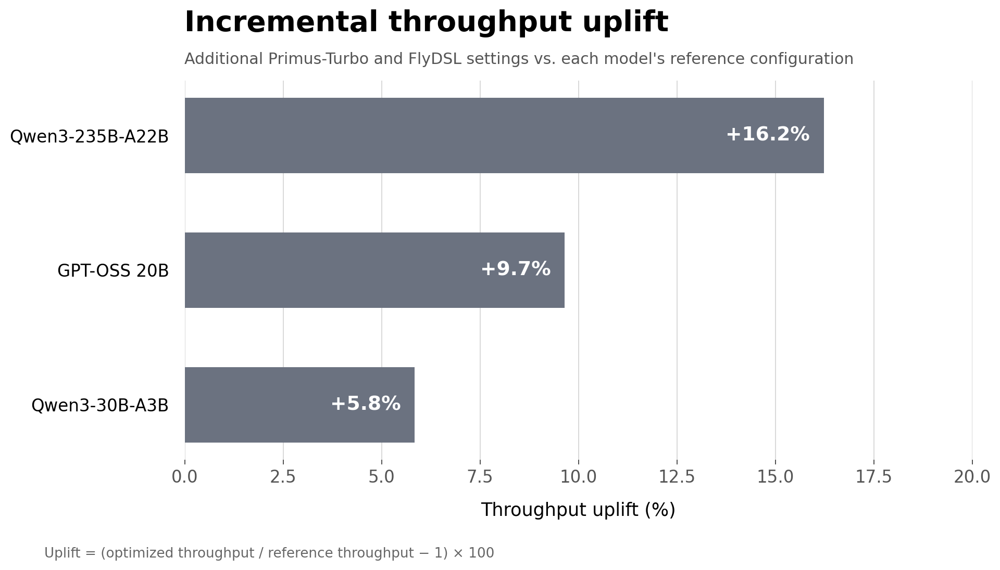

**图 1：额外 Primus-Turbo 优化带来的增量吞吐提升。** 相较所列参考配置，额外的 Turbo 与 FlyDSL 设置在 Qwen3-235B-A22B 上提升 **16.2%**，在 GPT-OSS 20B 上提升 **9.7%**，在 Qwen3-30B-A3B 上提升 **5.8%**。

各模型的具体配置与实测吞吐如下所示。

| 模型 | GPU 数 | 精度 | 并行（TP/PP/CP/EP/DP） | MBS | GBS | 序列长度 | 关键配置 / 标志 | 吞吐（tokens/s） |
|---|---|---|---|---|---|---|---|---|
| Qwen3-235B-A22B（最优配置） | 32 | FP8-CS | 1/1/4/8/1 | 2 | 1024 | 4096 | `turbo_sync_free_moe_stage: 1` | 4137.5 |
| Qwen3-235B-A22B（Turbo 加速） | 32 | FP8-CS | 1/1/4/8/1 | 2 | 1024 | 4096 | `use_turbo_grouped_gemm: true`<br>`turbo_sync_free_moe_stage: 2`<br>`PRIMUS_TURBO_GROUPED_GEMM_BACKEND=flydsl` | 4809.1 |
| GPT-OSS 20B（MLPerf 配置） | 8 | FP8-CS | 1/1/1/1/8 | 2 | 16 | 4096 | `use_turbo_grouped_gemm: true`<br>`use_turbo_fused_act_with_probs: true`<br>`use_turbo_rms_norm: true` | 25660.1 |
| GPT-OSS 20B（Turbo 加速） | 8 | FP8-CS | 1/1/1/1/8 | 2 | 16 | 4096 | `use_turbo_grouped_gemm: true`<br>`use_turbo_fused_act_with_probs: true`<br>`use_turbo_rms_norm: true`<br>`PRIMUS_TURBO_GROUPED_GEMM_BACKEND=flydsl` | 28136.7 |
| Qwen3-30B-A3B（最优配置） | 8 | FP8-CS | 1/1/1/8/1 | 8 | 512 | 4096 | `turbo_sync_free_moe_stage: 1` | 26058.7 |
| Qwen3-30B-A3B（Turbo 加速） | 8 | FP8-CS | 1/1/1/8/1 | 8 | 512 | 4096 | `turbo_sync_free_moe_stage: 2`<br>`use_turbo_gemm: true`<br>`use_turbo_grouped_gemm: true`<br>`PRIMUS_TURBO_GROUPED_GEMM_BACKEND=flydsl` | 27581.3 |

---

## Kernel 层面优化

有了框架基线之后，下一个着力点是专家 GEMM 本身 —— 先让每次 GEMM 更便宜（低精度），再拆掉它周围的 kernel 边界（megakernel）。

### 低精度专家 GEMM

<!---
负责人 / 待补充：Ruibin Zhang、Kyle Zhao。确认哪些 FP8 recipe/结果可公开。补充：
(a) FP8 MoE 训练的精度/收敛性说明；(b) kernel 级 FP8-vs-BF16 grouped-GEMM 加速图；
(c) 任何端到端 FP8 结果。系统级收支平衡的讨论（amax 规约、cast 开销）保持诚实，
但落脚到 Primus 如何缓解它。
--->

低精度是提升 MoE 训练吞吐最直接的手段，因为专家 GEMM 主导了计算量。Primus 通过 Transformer Engine 的 recipe 并叠加一层 Primus-Turbo 算子来支持 FP8 训练，覆盖 **delayed**、**tensorwise（current）scaling**、**blockwise scaling** 与 **MXFP8** 等 recipe。针对 MoE，路由专家路径使用 FP8 **grouped GEMM**（`grouped_gemm_fp8`），权重按「首个 micro-batch」量化并缓存；并把 permute 后的 token 补齐（pad）到量化 block 边界，使 dispatch、permutation 与专家 GEMM 对 FP8 布局达成一致。这些路径运行在同时支持 FP8 tensorwise scaling 与 MXFP8 block scaling（`E4M3`、block size 32、`E8M0` scale）的 Primus-Turbo kernel 上。本节结果背后的 FP8 GEMM 与 grouped GEMM kernel 由 [FlyDSL](https://github.com/ROCm/FlyDSL) 编写。

在 AMD GPU 上做 FP8 MoE 训练，有四点尤其重要：

- **精度得以保持。** FP8 与 MXFP8 专家 GEMM 都经过数值验证（包括 `M` 不均的 grouped 情形）；在训练层面，默认的 tensorwise（current-scaling）recipe 与 BF16 的收敛保持一致，而 MXFP8 的 per-block scaling 进一步抑制了专家 GEMM 上的量化误差。
- **recipe 的选择很关键。** 在 MI355X 上，tensorwise（current）scaling 与 block/MX scaling 在精度和速度上表现不同；Primus 用单个开关（`fp8_recipe`）暴露 recipe，便于用户选择合适的折衷。
- **格式选择。** 在 gfx950 上，专家 GEMM 使用 OCP E4M3 格式可避免代价高昂的向上转换（up-conversion）。
- **系统级的收支平衡。** 在 kernel 层面，FP8 专家 GEMM 明显快于 BF16；但端到端的收益取决于能否摊薄周边的量化工作 —— amax 规约、cast 以及 token 数同步。Primus 通过权重量化缓存、量化感知的 padding、以及把 token 计数保留在 GPU 上，降低这部分开销，使 kernel 级的加速能够转化为端到端收益。

图 2 单独展示了 MI355X 上这一 kernel 级收益：在训练相关的规模范围内扫描每专家 token 数 `M`，报告 FP8（tensorwise）grouped GEMM 相对 BF16 的加速（FP8 计时中已计入量化开销）。

<p align="center">
  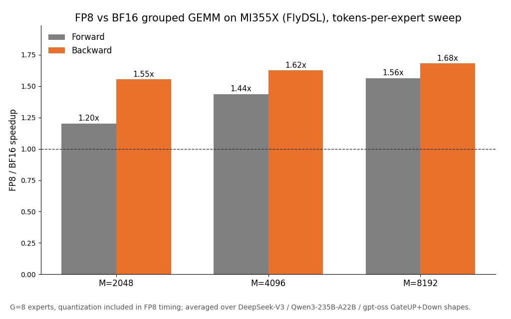
</p>

**图 2：AMD Instinct MI355X 上 kernel 级 FP8-vs-BF16 grouped GEMM 加速，按每专家 token 数 `M` 扫描，并在 DeepSeek-V3 / Qwen3-235B-A22B / gpt-oss 专家 shape 上取平均；FP8 计时已计入量化开销。**

前向加速随 `M` 增大而提升 —— 从 `M`=2048 的约 1.2× 提升到 `M`=8192 的约 1.6×，因为此时 GEMM 已经大到足以掩盖 Primus 已尽量压低的 cast/amax 开销 —— 而反向则稳定在约 1.5–1.7×。在训练相关的 token 数下，FP8 grouped GEMM 的加速真实且可观。

为了给这些 kernel 在业界坐标系中定位，我们在代表性的 Llama 式 dense shape 与 DeepSeek-V3 / Qwen3-235B-A22B / Kimi-K2 专家 shape 上，把端到端的量化 dense 与 grouped GEMM（计时含量化，正确性用 output/gradient SNR 校验）与 NVIDIA B200/GB200 的 TransformerEngine 基线做对比。在这些 shape 上，MI355X 总体持平：dense GEMM 在两种精度下基本打平，grouped GEMM 在前向领先（得益于访存受限的 `Down` 投影），反向接近持平，主要剩余差距在大 `N` 的 `GateUP` 权重梯度上。

<table>
  <tr>
    <td>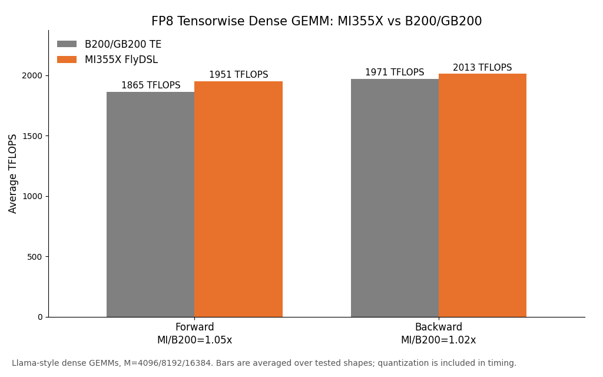</td>
    <td>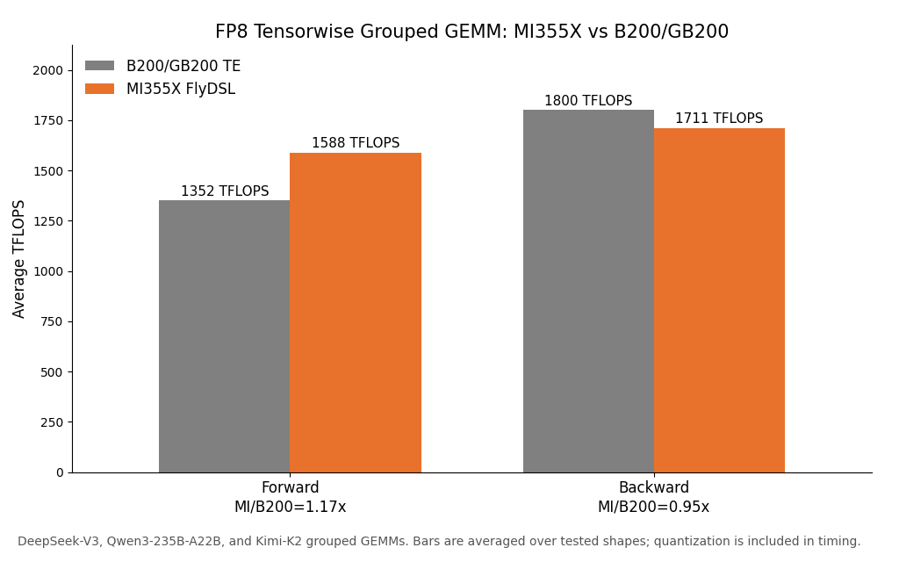</td>
  </tr>
  <tr>
    <td>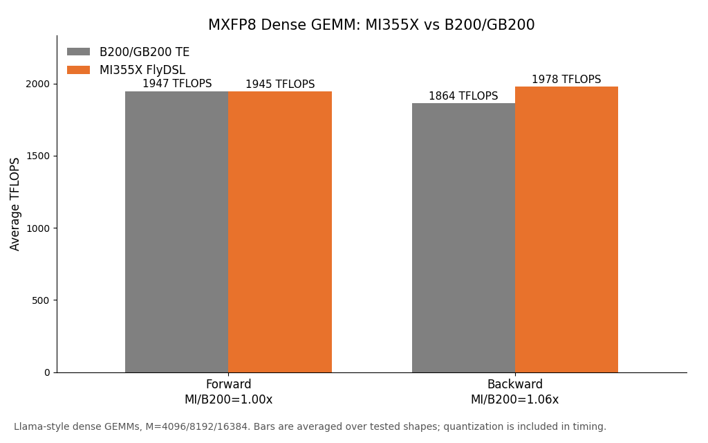</td>
    <td>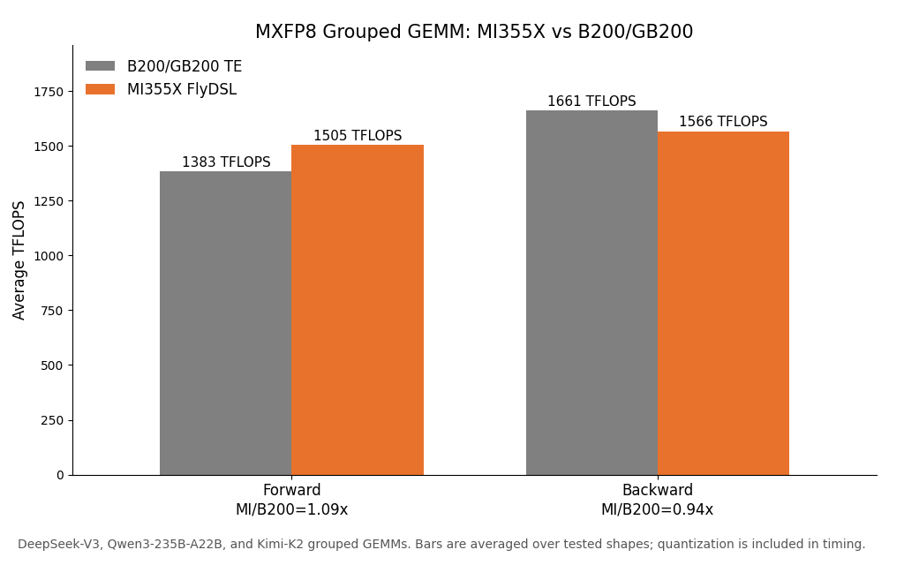</td>
  </tr>
</table>

**图 3：AMD Instinct MI355X 与 NVIDIA B200/GB200（TE）的 GEMM 吞吐对比 —— FP8 tensorwise（上）与 MXFP8（下），dense（左）与 grouped（右），含前向与反向，在所测 shape 上取平均。**

这里的经验是：低精度不仅仅是切换数据类型 —— 对 MoE 而言，布局（layout）与 grouped 调度和量化 recipe 同等重要。消除前向的 transpose 开销、并对每种 grouped shape 做 autotune，能把看似落后的前向变成领先；而 MXFP8 在同一执行路径之上叠加更细粒度的 scaling，同时仍与 B200/GB200 基线保持竞争力。

### MoE megakernel

<!---
负责人 / 待补充：Xiaoming Peng、Zhen Huang。发布前仍待确认：
  - 确认下方端到端数字可以公开。它们是实测而非推算（8×MI355X、DeepSeek-V3
    4 层 + MTP、EP8、gbs 512、50 步），但属于减层代理配置，不是完整的 61 层训练。
  - 决定对外暴露多少 AMD 专有实现细节（DTOLDS/AGPR/wave specialization）。
  - 图 4 是用代码画的示意图（.ab/gen_megakernel_diagram.py），各阶段的宽度只是示意，
    并非实测的分阶段耗时。若有可公开的 profiling 时间线，请替换。
--->

专家 dispatch 与 combine 是让 MoE 层区别于 dense 层的两项开销，而它们都是通信。本节要做的，就是拆掉这部分通信与它所喂给的专家计算之间的边界。

#### 今天的 MoE 层是怎么执行的

一个 MoE 层是由八个左右算子组成的链条。router 为每个 token 打分并选出 top-k 专家；一次 permutation 把 token 按专家顺序聚拢；一次 all-to-all **dispatch** 把每个 token 发往持有其专家的 rank；两个 grouped GEMM（**FC1** gate/up 与 **FC2** down）以及夹在中间的 **SwiGLU** 完成专家计算；一次 all-to-all **combine** 把结果送回；最后的 unpermute-and-scale 把 top-k 的贡献归约回每个 token。

上述每个阶段都是独立的 kernel。图 4 的上半部分展示了由此带来的后果。

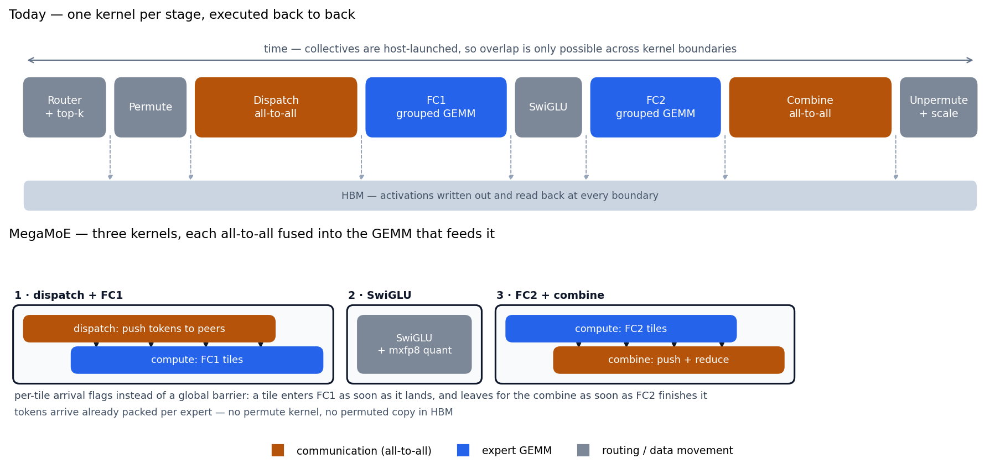

**图 4：MoE 层 dataflow。上：今天的做法，每个阶段一个 kernel，每个边界都要走一次 HBM 往返。下：MegaMoE，三个 kernel，每次 all-to-all 都被融进喂给它的那个 grouped GEMM 中，以 tile 粒度重叠。** _（示意图；各阶段宽度为示意，非实测分阶段耗时）_

#### 问题：通信与计算无法重叠

这一结构带来两项开销，而且都不是「把某个 kernel 做快」所能解决的。

**通信与计算被串行化。** 集合通信库由 host 发起、以 kernel 为粒度：dispatch kernel 占住设备、跑完，之后 FC1 kernel 才被 launch。Profiling 显示 MoE 前向大致被 all-to-all 通信与专家计算二分，因此当二者分处不同 kernel 时，整层大约有一半时间矩阵核心是空闲的。跨 kernel 边界的粗粒度重叠 —— 把下一个 microbatch 的通信藏到当前 microbatch 的计算后面 —— 能挽回一部分，但它无法把某个 tile 自己的 dispatch 与它自己的 GEMM 重叠起来。

**每一次 kernel 边界都是一次 HBM 往返。** permutation 写出一份重排后的 token 副本；FC1 把激活写出去，再由 SwiGLU 读回来；FC2 写出结果，combine 又读一遍。在 DeepSeek-V3 的专家粒度下 —— 256 个专家、top-8 路由 —— 整层是一条由相对小算子组成的长链，算子**之间**的访存量与 GEMM 本身所需的访存量处在同一量级。

所以真正的收益点不是更快的 dispatch 或更快的 GEMM，而是把它们放进同一个 kernel，让一方藏进另一方内部，并让中间结果根本不落 HBM。

#### 我们的做法：把每次 all-to-all 融进喂给它的 GEMM

关键一步并不是把整层塌缩成一个 kernel，而是把每次 all-to-all 放进生产或消费其数据的那个 grouped GEMM **内部**，让通信有东西可藏。**MegaMoE** 用三个 kernel 做到这一点，如图 4 下半部分所示：

1. **dispatch + FC1。** 入向 all-to-all 与 FC1 grouped GEMM 共享一个 kernel。CU grid 在 dispatch 与 compute 两个角色之间切分，于是 token 持续从对端 rank 流入的同时，矩阵核心已经在处理先落地的 tile。
2. **SwiGLU。** 中间的一个小 kernel，同时对自身输出做量化，使 MXFP8 的 cast 不必成为一次单独的激活遍历。
3. **FC2 + combine。** FC2 grouped GEMM 与出向 all-to-all 共享一个 kernel：GEMM 的 epilogue 把每个算完的 tile 推给它的归属 rank，归约在那里完成，于是结果是「边产出边发走」，而不是等整个 GEMM 结束。

反向依照 dispatch/combine 的对偶关系镜像这一结构 —— `dispatch(dy)` 与 FC2 的数据梯度 GEMM 融合，FC1 的数据梯度与 combine 及归约融合 —— 另加两个变长 K 的权重梯度 kernel。

有两个性质让重叠真正生效。其一，在每个融合 kernel 内部，CU grid 按角色切分，通信 workgroup 推进的同时，compute workgroup 在同一设备上运行 MFMA GEMM。其二，二者之间不设全局 barrier，而是用 per-tile 的到达标志：tile 一落地 compute 就能开始，tile 一算完就能立刻发往 combine —— 正是这一点把通信延迟变成了 GEMM 可以掩盖的东西，而不是必须等待的东西。这些 kernel 使用 [FlyDSL](https://github.com/ROCm/FlyDSL) 编写，并映射到 CDNA3/CDNA4（gfx942/gfx950）。

对用户而言，这一切只是一个 feature flag（`use_turbo_mega_moe`）加一个精度开关（`turbo_mega_moe_precision: bf16 | mxfp8`）：MegaMoE 整体替换 Megatron 的 MoE 层，由 router 直接喂给融合算子。

#### Kernel 级性能

单独测量时，在 DeepSeek-V3 专家 shape 下（H=7168、I=2048、256 专家、top-8、EP8、每 rank 8192 token），融合层的表现如下：

| Pass | BF16 | MXFP8 | 加速 |
|---|---|---|---|
| 前向 | 6.96 ms | 5.18 ms | 1.34× |
| 反向 | 13.34 ms | 8.40 ms | 1.59× |
| **前向 + 反向** | **19.94 ms** | **13.21 ms** | **1.51×** |

反向获益最大，而这恰恰重要，因为反向本身也是整层中更大的那一半。在刻意构造的不均衡路由下该比值保持不变，说明加速并不依赖于各专家收到相同数量的 token。

#### 端到端训练性能

Kernel 级的收益只有在真实训练 step 中存活下来才有意义。我们训练 DeepSeek-V3（4 层 + MTP，单节点 8×MI355X 上 EP8，global batch 512，50 次迭代），只替换 MoE 实现：在每种精度内，两次运行仅相差一个 Megatron 参数，attention、optimizer、数据与随机种子全部固定。

| 精度 | MoE 层 | ms / step | 单卡 TFLOP/s | 加速 |
|---|---|---|---|---|
| BF16 | DeepEP dispatcher + grouped GEMM | 9540 | 841 | — |
| BF16 | **MegaMoE** | **8817** | **910** | **1.082×** |
| MXFP8 | DeepEP dispatcher + grouped GEMM | 8432 | 951 | — |
| MXFP8 | **MegaMoE** | **7508** | **1069** | **1.123×** |

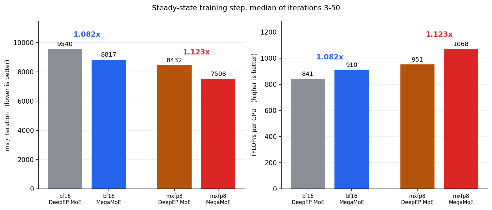

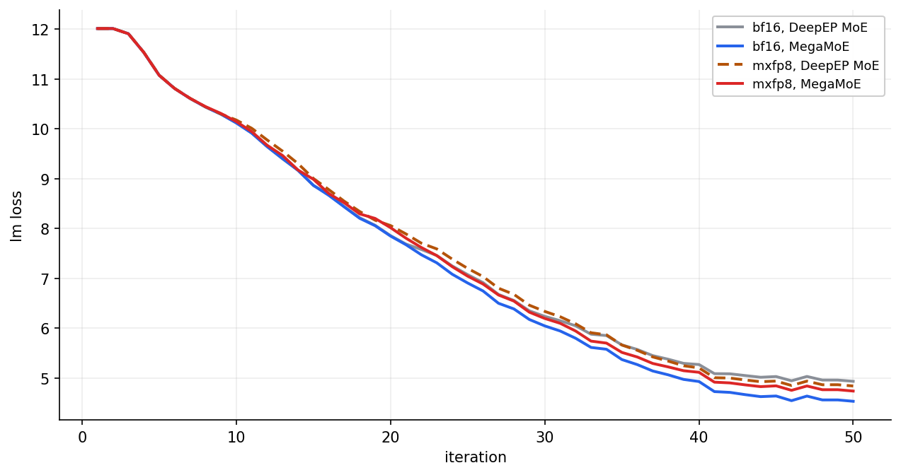

**图 5：MegaMoE 在 DeepSeek-V3（4 层 + MTP）上的端到端表现，8×MI355X、EP8、global batch 512。上：稳态 step 时间与吞吐，取第 3–50 次迭代的中位数。下：50 次迭代的训练 loss。**

step 级的收益必然小于 kernel 上实测的 1.51× —— MoE 层只是一个训练 step 的一部分 —— 但它确实活了下来：把单次调用的节省按一个 step 中的层数与 microbatch 数乘开，与实测的 step 时间差距落在 4% 以内。值得注意的是，**融合与低精度是叠乘的**：MegaMoE 在 MXFP8 下（1.123×）比在 BF16 下（1.082×）更值钱，因为把其余部分量化之后，MoE 在整个 step 中的占比反而提高了。融合同时降低了显存峰值 —— MXFP8 这一组是 142.4 GiB vs 150.1 GiB —— 因为 permute 后的 token 缓冲区从未被真正物化。

图 5 中的 loss 曲线在整个运行过程中保持贴合，说明融合路径的训练行为与 dispatcher 路径一致；更长周期的验证仍在进行中。MegaMoE 目前仅支持 EP（TP=1）且为 dropless，DeepSeek-V3 上的全网 MXFP8 需要走 Turbo GEMM 路径（`use_turbo_gemm`、`use_turbo_grouped_gemm`）。

MegaMoE 已经从研究原型毕业为一个带 feature flag 的 Primus-Turbo 算子，支持 MXFP8 专家权重与完整反向。我们正在把它扩展到单节点之外，并覆盖其余的 MoE 层变体。

---

## Time-to-Train：256-1024 GPU 上的 DeepSeek-V3

kernel 与框架特性都只是手段。用户真正衡量的是 time-to-train：在真实规模下，一次完整训练端到端要花多长时间。本节是旗舰案例 —— Megatron-LM 后端上的 DeepSeek-V3。在这里，真正的约束不是 GEMM 吞吐，而是**显存**；要做的事情，是把显存花在正确的地方。

参考配方为 [`examples/moe_package/run_deepseek_v3_pretrain_mi355x.sh`](https://github.com/AMD-AGI/Primus/blob/main/examples/moe_package/run_deepseek_v3_pretrain_mi355x.sh)：

| 配置项 | 取值 |
|---|---|
| 模型 | 61 层（3 dense + 58 MoE）、256 个路由专家、top-8、MLA |
| 并行 | TP1 / PP16 / VPP2 / EP8 |
| Batch | MBS 2、序列长度 4096、global batch size 128 × 节点数 |
| 精度 | FP8 |
| 实测规模 | 32 至 128 节点（256 至 1024 张 MI355X） |

该配方同时启用了 DeepEP dispatch（`turbo_deepep_num_cu: 80`）、带梯度规约与参数 all-gather 重叠的分布式优化器，以及前文介绍的 precision-aware optimizer、融合 cross-entropy/RoPE、`pp_warmup`、manual GC 与 NUMA 绑定。

下面所有数字都遵循两条约定：

- global batch size 随节点数等比放大，因此每次迭代的 micro-batch 数在任何规模下都保持 128，只有数据并行宽度在增长。
- 迭代时间只在同一规模内可比。所有吞吐比值都是与**同一规模**下的基线相比，取前几十个迭代测得。

### 第一步：把短的流水线 stage 放在显存峰值处

PP16 配合 VPP2 为 61 个 decoder 层提供 32 个虚拟 stage，因此有三个 stage 只放 1 层而不是 2 层。其中两个位置是被强制的 —— PP0 的首个 stage 还要承载 embedding，PP15 的末个 stage 要承载 loss —— 于是只剩下恰好一个自由选择。

Megatron 的默认布局把这个自由名额给了 PP15，而这是错的 rank：

- 在 1F1B 下，越靠前的 rank 持有越多在途（in-flight）激活，最后一个 rank 最少。
- 因此显存峰值出现在 PP1，即第一个**被完全填满**的 rank。
- 32 节点实测：PP1 占用达 HBM 的 88%，而 PP15 只有 23% —— 在名义工作量相同的各 rank 之间存在 64 个百分点的落差。

Primus 把布局以字符串形式暴露出来，因此把那个自由的短 stage 从 PP15 挪到 PP1 只是一行改动：

```text
默认:  Et|(tt|)*14,t|(tt|)*15,tL
调优后: Et|t|(tt|)*29,tL
```

两者都放下了全部 61 个 decoder 层，差异只在两个 rank 上：

| PP rank | 默认（VPP0 / VPP1） | 调优后（VPP0 / VPP1） |
|---|---|---|
| 0 | `E` + 1 层 / 2 层 | `E` + 1 层 / 2 层 |
| 1 | 2 层 / 2 层 | **1 层** / 2 层 |
| 2–14 | 2 层 / 2 层 | 2 层 / 2 层 |
| 15 | **1 层** / 1 层 + `L` | 2 层 / 1 层 + `L` |

显存曲线本身拉平并不是目的。它在峰值 rank 上腾出的余量，才是买下一步的本钱：更少的 recompute。

### 第二步：只在压力所在之处做 recompute

默认策略（`--recompute_num_layers 1 --recompute_method block`）会在每个虚拟 stage 中重算一层 —— 61 层里的 32 层 —— 而不管某个 rank 是否真的缺显存。Primus 转而接受一个显式的全局层 ID 列表，让 recompute 精确落在真正需要的位置：

```bash
--recompute_layer_ids "0,1,2,4,6,8,10,12,14" --recompute_granularity full
```

这个列表是对照实测显存曲线选出来的，遵循一个循环：

1. dump 每个 rank 的显存与流水线时序（`--dump_pp_data`，用 [`tools/visualization/pp_vis/vis.py`](https://github.com/AMD-AGI/Primus/blob/main/tools/visualization/pp_vis) 可视化）。
2. 找出仍有显存余量的 rank。
3. 把它们的层从 recompute 列表中去掉。
4. 重复，直到峰值 rank 逼近 HBM 上限。

**这个循环我们实际是怎么走的。** 不是手工走的。我们正在构建一个调优 agent，用它搜索配置空间 —— 合法的并行组合、流水线布局与 recompute 集合 —— 并以 Primus projection 工具（见下文）作为打分预言机（oracle），因此搜索的大部分过程不消耗集群时间。该 agent 仍在开发中，所以上面的布局字符串与下面的层 ID 列表都是**半自动**产物：agent 负责收缩搜索空间，最终选择由工程经验拍板。待其成熟后我们计划开源。

图 6 展示了该循环在两种规模下的起点与终点。

<table>
  <tr>
    <td>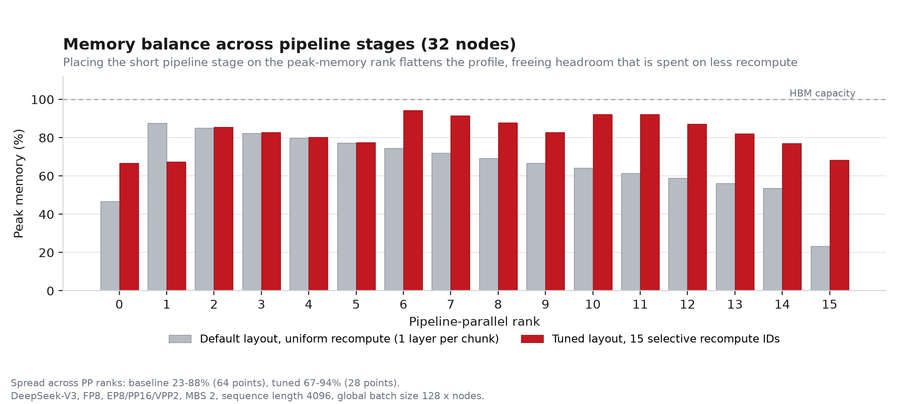</td>
  </tr>
  <tr>
    <td>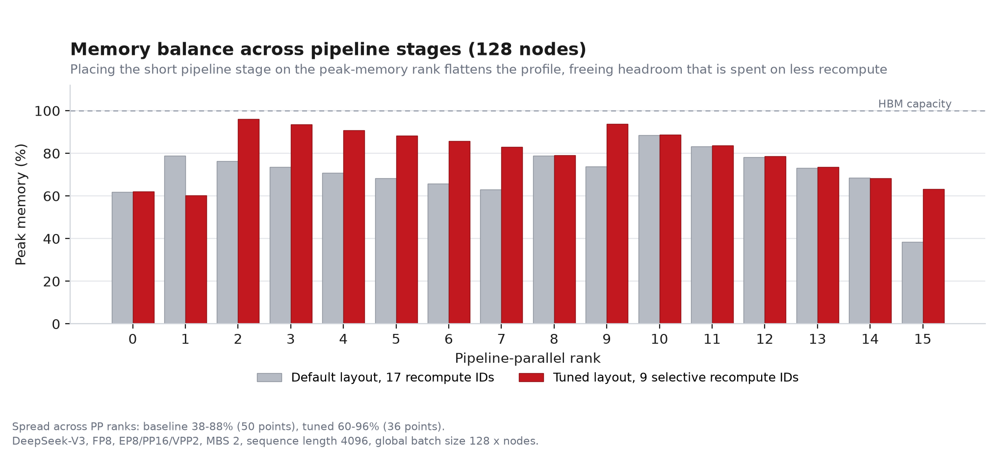</td>
  </tr>
</table>

**图 6：32 节点（上）与 128 节点（下）下各流水线 rank 的显存峰值，默认配置 vs 调优布局 + 选择性 recompute。** 把曲线拉平，就是把闲置的 HBM 换成更小的 recompute 预算：32 节点的落差从 64 个百分点收窄到 28，128 节点从 50 收窄到 36。

### 第三步：逐规模重新调优，因为最优解会移动

**recompute 的层数是「规模」的属性，而不是「模型」的属性。** global batch size 随节点数增长，而每次迭代的 micro-batch 数固定不变，因此更大的训练拥有更宽的数据并行组。分布式优化器会把优化器状态与梯度缓冲区在这个更宽的组上切得更细，从而把静态显存还给每一张 GPU —— 而这些还回来的显存，正好买到更少的 recompute 层：

| 节点数 | 数据并行大小 | Recompute 层 ID | 重算层数 |
|---|---|---|---|
| 32 | 16 | `0,1,2,4,6,8,10,12,14,16,34,36,38,40,50` | 61 层中的 15 层 |
| 64 | 32 | `0,1,2,4,6,8,10,12,14,16,34,36` | 61 层中的 12 层 |
| 128 | 64 | `0,1,2,4,6,8,10,12,14` | 61 层中的 9 层 |

这个边界是陡峭的，而非渐变的。把 128 节点的列表再去掉一个 ID，变成 `0,1,2,4,6,8,10,12`，在 128 节点下仍能正常运行，但在 32 与 64 节点下都会 OOM —— 同样这八层，在宽数据并行组下留有余量，在窄的组下就会溢出。显式的 ID 列表让这种逐规模重调优的成本很低；而「统一层数」这种表达方式根本无法描述它。

### 收益如何

布局与 recompute 共同缩短了两种规模下的单步时间，而且收益随规模增大 —— 因为 recompute 预算缩小的速度快于流水线气泡增长的速度：

| 节点数 | 配置 | 迭代时间（秒） | 相对基线吞吐 |
|---|---|---|---|
| 32 | 默认布局，每虚拟 stage 重算 1 层 | 23.21 | 1.00x |
| 32 | 调优布局 + 15 个 recompute ID | 22.59 | **1.028x** |
| 128 | 默认布局，每虚拟 stage 重算 1 层 | 23.75 | 1.00x |
| 128 | 调优布局 + 9 个 recompute ID | 21.68 | **1.095x** |

图 7 用 128 节点上的流水线可视化解释了原因。

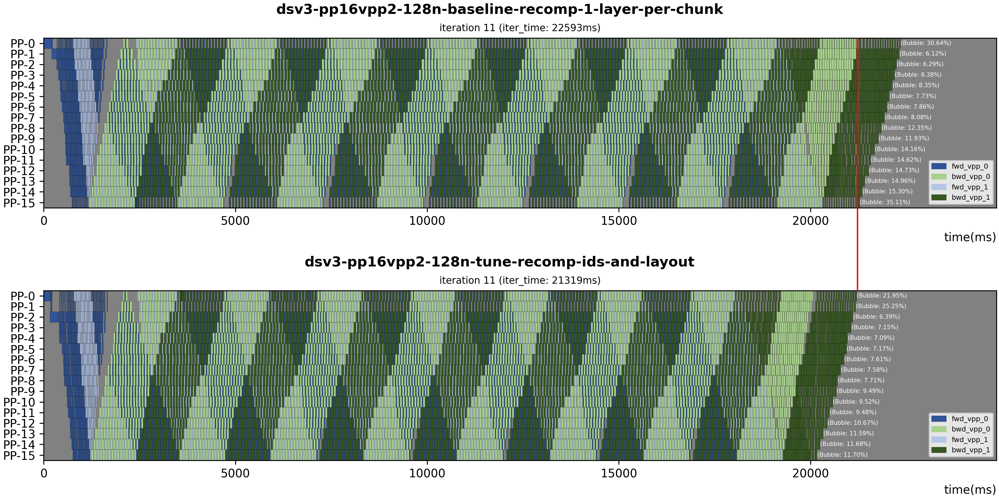

**图 7：128 节点上一次迭代的流水线调度** —— 默认配置（上）vs 调优布局与 recompute ID（下）。前向块为蓝色，反向块为绿色，气泡为灰色；每个 rank 的气泡占比标注在右侧。

从图中可以读出两件事：

- 两个边界 rank 的气泡率从 30.6% 与 35.1% 降到 22.0% 与 11.7%，采样到的迭代时间从 22.6 秒降到 21.3 秒。
- 有几个**中间** rank 在调优后反而报告了更高的气泡占比。由于重算层数从 32 降到 9，非气泡的工作量本身也变小了，因此同样的绝对气泡时间在更短的单步中占据了更大的比例。真正重要的指标是迭代时间，而不是气泡率。

**从 32 节点扩展到 128 节点。**

- **固定配置：** 128 节点保留了 32 节点单卡吞吐的 98.5% —— 在 GPU 数量增长 4 倍的情况下只损失 1.5%。
- **逐规模重新调优：** 128 节点达到 32 节点参考值的 104.1%。这并不是因为通信变便宜了，而是因为更宽的数据并行组释放出足够显存，把 recompute 从 15 层减到 9 层，省下的计算超过了额外的集合通信开销。

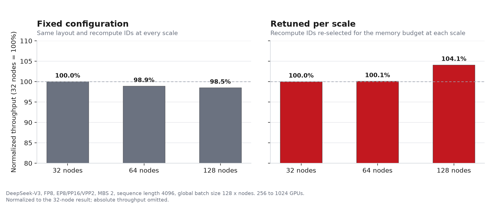

**图 8：AMD Instinct MI355X 上 DeepSeek-V3 从 32 到 128 节点的归一化单卡吞吐** —— 单一固定配置（左）vs 逐规模重选 recompute ID（右），两者均以 32 节点结果归一化。

### 哪些做法没有奏效

有两个被否掉的配置值得记录，因为它们说明这里的调优并不是「自由度越大越好」：

- **VPP1** 即便配上专门的布局与 recompute 调优，单步时间仍要多付 14–21%；而且在这套软件栈上，它必须关闭梯度规约/all-gather 重叠才能跑起来。
- **激进的非均匀布局**（每个虚拟 stage 放 1–3 层，按均衡显存来选）比 VPP2 基线慢 21%。它确实把显存拉平了，但同时把计算打散了；此时流水线只能以最慢的 stage 的速度运行。

每 stage 计算量的均衡是主导因素。只有在计算已经均衡之后，追求显存均衡才有意义。

### 1700 步不间断

短时 benchmark 无法说明一个 1024 GPU 的任务能否稳住，因此我们用调优后的 128 节点配置在真实 C4 数据上连续跑了 1700 步 —— 10 小时 37 分钟：

- **全程无中断。** 1024 GPU 上连续 1700 步：无重启、无失败 rank、无人工介入，也没有跳过任何一步。
- **单步时间稳定。** 中位数 22.08 秒，93.2% 的步落在中位数的 ±2% 以内。
- **不随时间劣化。** 用运行的前十分之一与最后十分之一对比，10.6 小时内漂移为 +1.8%。
- **偶发离群，而非趋势。** 约 2% 的步偏慢（最慢一步 89 秒），与周期性的 host 侧与网络干扰相符。
- **启动开销有界。** 第 1、2 步分别耗时 307 秒与 165 秒，用于惰性初始化与 kernel autotuning；从第 3 步起就已进入稳态。

长跑的中位数（22.08 秒）比前文短 benchmark 的单步时间（21.68 秒）高约 2%。这个差距正是上面的漂移，也是我们把 benchmark 与长跑数字分开报告、而不混在一起的原因。

---

## 小 MoE 模型：另一种瓶颈区间

<!---
负责人 / 待补充：Wei Huang。这项工作源自 MLPerf，但叙述应聚焦于 MoE 训练优化本身
与 B200 对比，而非 MLPerf 流程。发布前：
  - 确保 B200-vs-MI355X 的对比是同口径（相同模型配置、精度/FP8 recipe、patch 集合、
    多 rank 取平均）。只有在对比干净时才发布。
  - 替换 [X] 的 step 时间/吞吐占位符，并补上对比图。
注意：kernel 级的 MI355X-vs-B200 GEMM 对比在低精度一节；本节是端到端训练层面的对比。
请保持两者口径清晰，避免读者误以为 B200 参照被重复了一遍。
--->

上文的一切都受制于显存与集合通信。小 MoE 模型恰好相反：每层计算量不大，因此反而是框架开销、梯度规约以及归一化/激活 kernel 占主导。我们以一个 GPT-OSS 级别的 MoE 模型（32 个专家、top-4、8K 序列长度）在单个 8×MI355X 节点上为起点，调优出一组在这一区间内普遍适用的优化：

- **BF16 梯度规约**（`grad_reduce_in_bf16`）—— 这一区间里单项最大的 step 时间收益，降低通信量并释放可观显存。
- **调优的归一化 kernel** —— 一条快速的 RMSNorm 路径，避免了通用实现在该软件栈上出现的性能回退。
- **precision-aware optimizer 与显存调优** —— 让更大的 micro-batch 成为可能，从而提升硬件利用率。
- **融合 RoPE/attention 与 sync-free MoE 调优** —— 消除小 kernel 与 CPU 同步开销。

[低精度一节](#低精度专家-gemm)对比的是 MI355X 与 B200 在单个 GEMM kernel 层面的表现；本节则以 NVIDIA B200 作为同一小 MoE 训练配置下的端到端参照点。

<!---
负责人 / 待补充：Wei Huang。用最终、同口径的数字替换 [X]，并在
imgs/b200_comparison.png 补上对比图。
--->

AMD Instinct MI355X 达到 **[X]** ms/step（**[X]** TFLOP/s/GPU），相比之下 NVIDIA B200 为 **[X]** ms/step。 _（待作为同口径对比最终确认）_


**图 9：小 MoE 训练 step 时间 —— AMD Instinct MI355X vs NVIDIA B200** _（占位 —— 资源与数字待定）_

---

## 超越 Megatron-LM：JAX（MaxText）路径

<!---
负责人 / 待补充：Liying Li。本节总结的是现已发布的 JAX dropless-MoE 工作
（Primus-Turbo 的 JAX 前端中的 grouped GEMM + DeepEP，已集成进 ROCm MaxText fork）。
关于完整细节 —— FFI / custom-VJP 集成、内存墙分析，以及完整的吞吐/收敛表格 ——
请参阅文末链接的专门博客。
--->

Primus 还通过 [MaxText](https://github.com/ROCm/maxtext.git)（ROCm fork）在 JAX 后端上支持 MoE 训练，集成方式是一层薄的后端 adapter，驱动 MaxText 自身的训练循环。在这条路径上，MoE 效率首先来自 MaxText 原生的控制项 —— 块稀疏/grouped 的专家 matmul（`megablox` / `sparse_matmul`）、专家容量（`capacity_factor`），以及跨节点内/节点间 mesh 轴的 expert parallelism —— 并叠加 ROCm 调优过的 XLA 与 Transformer Engine 设置（latency-hiding scheduler、collective-combine 阈值、hipBLASLt/CK attention）。Primus 为 DeepSeek-V2、Mixtral、Qwen3-30B-A3B、Grok 等模型在 MI300X 与 MI355X 上都提供了开箱即用的 MoE 配置。

**dropless 的两难。** 在 JAX/MaxText 技术栈上，MoE 训练长期以来只能做一个并不理想的取舍。默认的 `dense_matmul` 路径通过固定每个专家的*容量*（`capacity_factor`）来让专家 shape 保持静态，并**丢弃**（drop）溢出的 token —— 快，但有损。忠实的 `sparse_matmul` 路径是**无丢弃（dropless）**的 —— 每个被路由的 token 都经由一个 ragged、按专家排序的 grouped matmul 抵达其专家 —— 但在纯 JAX 下它会撞上两堵内存墙：内置的 `jax.lax.ragged_dot` 专家 matmul 即便在每设备 batch size 为 1 时也会在约 444 GiB 处 OOM；而由于 `jax.jit` 追踪的是静态 shape，`ragged_all_to_all` 路由 shuffle 必须按最坏情况分配显存，在 DeepSeek-V3 671B 上会在约 242 GiB 处 OOM。因此，dropless 在生产规模下不可行。

**把两个 Primus-Turbo 原语带到 JAX。** [Primus-Turbo](https://github.com/AMD-AGI/Primus-Turbo) 通过 [XLA FFI](https://docs.jax.dev/en/latest/ffi.html) 把两个由 Composable Kernel（CK）支撑的原语暴露为一等的 JAX 算子，填补了这一空缺 —— 它们带有 `custom_vjp` 自动微分与 `shard_map` 分片规则，因此能与 FSDP 干净地组合：

- **Grouped GEMM（GMM）。** 一个单次启动（single-launch）的 kernel，覆盖 dropless 专家 FFN 所需的 ragged、变长 `M` 的 per-expert group（以及它的两个反向 grouped GEMM，含变长 `K` 的权重梯度情形）。它移除了 `ragged_dot` 的 matmul 内存墙，是让 dropless 首次变得可训练的关键。
- **DeepEP dispatch/combine。** 一个 token 感知的专家并行 all-to-all（dispatch 把每个 token 发到持有其所选专家的 rank；combine 反向回传并归约结果），节点内走 xGMI、节点间走 RDMA。由于其最坏情况的接收缓冲区是静态 shape，整个 MoE 前向在 `jax.jit` 下**默认即 sync-free**；而更精简的缓冲区管理把瞬时显存占用压低到足以夺回一档 batch size。

这两者通过两个配置开关 —— `use_turbo_grouped_gemm` 与 `use_turbo_deepep_dispatch` —— 接入 MaxText，配以精心设计的 custom-VJP fan-out/fan-in、组外（out-of-group）mask，以及每进程一次的 `setup()` 引导初始化；**开关关闭时零开销**，因此默认计算图逐字节（byte-for-byte）保持不变。

**结果。** 在 DeepSeek-V3 671B、8 节点 × 8 AMD Instinct MI355X（64 GPU、序列长度 4096、FSDP=8、bf16）上，grouped GEMM + DeepEP 的 dropless 路径：

- **在纯 JAX 跑不动的地方也能跑** —— grouped GEMM 移除了约 444 GiB 的专家 matmul 内存墙，DeepEP 更精简的 all-to-all（瞬时显存占用降低约 15%）夺回一档 batch size，可容纳每设备 batch size 8–9，而 `ragged_all_to_all` 的 dropless 路径在 8 时就 OOM。
- **最快的 dropless 方案** —— 每设备 batch size 8 时达到约 1180 tokens/s/device，在每一个可行的 batch size 上都优于 `ragged_all_to_all` 的 dropless 路径，并达到高容量（`capacity_factor=4`）dense 配置约 2× 的吞吐。
- **数值忠实，且相对 token dropping 达到 Pareto 占优** —— 在 2000 步的 C4 训练中，其 loss 与 `ragged_all_to_all` 的 dropless 路径相差在 0.004 以内，并收敛到低于每一个 capacity-factor 的 dense 配置（最终 loss 5.003，对比 `capacity_factor=1.25` 默认的 5.163 —— 改善 0.16 nat）；即便在真实数据上付出了路由不均带来的吞吐代价，它仍能在相同墙钟时间下达到更低的 loss。

<table>
  <tr>
    <td>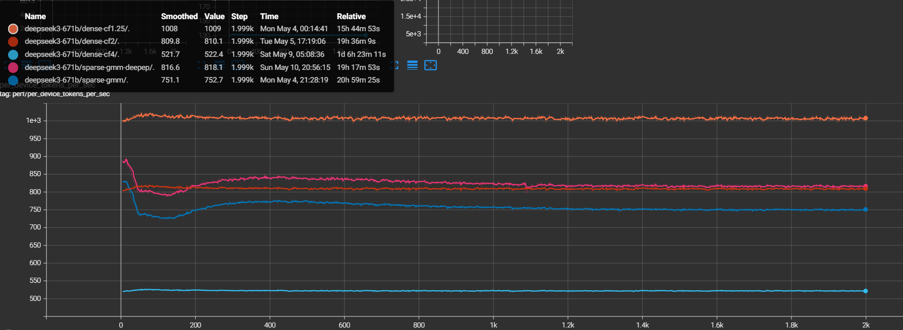</td>
    <td>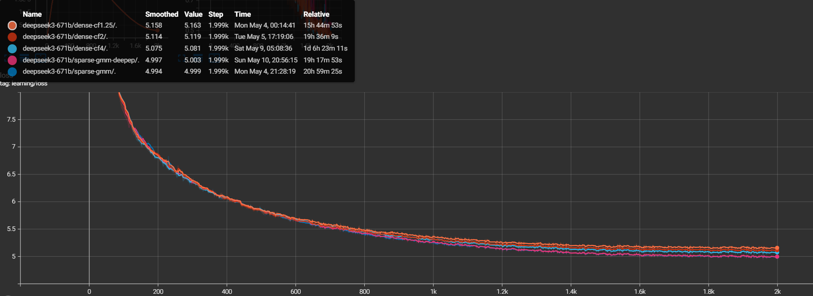</td>
  </tr>
</table>

**图 10：DeepSeek-V3 671B（8×8 MI355X、FSDP=8、bf16）上 JAX（MaxText）路径的 dropless MoE —— （左）grouped GEMM + DeepEP 的 dropless 配置相对 capacity-factor 丢弃与 `ragged_all_to_all` dropless 基线的每设备吞吐（TGS）；（右）相同配置的 C4 训练 loss 收敛曲线。**

关于完整细节 —— FFI / `custom_vjp` 集成、fan-out/fan-in 与组外 mask 的正确性细节，以及完整的吞吐与收敛表格 —— 请参阅专门的 [Dropless MoE Training in JAX with Primus-Turbo](https://rocm.blogs.amd.com/software-tools-optimization/maxtext-dropless-moe/README.html) 博客。

---

## 开跑之前先做预估：Primus Projection

上文的 DeepSeek-V3 案例本质上是一次配置搜索 —— 而把这样的搜索放在集群上跑，代价高昂。在 MoE 规模下，一次配置失误可能在排队数小时之后才 OOM，或者让集群大部分算力闲置。Primus 内置了一个 **projection** 工具，在投入任何 GPU 时间之前就回答「装得下吗？」与「能跑多快？」：

- **显存** —— 对参数、优化器状态与激活做解析式的单卡估算，其中包含在高专家数下占主导的、由 `topk` 放大的 MoE 激活占用。
- **性能** —— 在最少一张 GPU 上 benchmark 代表性的层，再用通信与流水线调度模型外推到多节点集群；此外还有一个完全不需要 GPU 的纯 CPU 仿真模式。

所有已发布的验证案例与实测吞吐的误差都在 10% 以内，其中 MoE 案例 —— 8 节点 Mixtral 8x22B、EP8 / PP4 / VPP2 —— 误差在 1.4% 以内。它同时也是前文提到的调优 agent 背后的打分预言机。完整介绍请参阅 [Primus Projection: Estimate Memory and Performance Before You Train](https://rocm.blogs.amd.com/software-tools-optimization/primus-projection/README.html)。

---

## 未来展望

<!--- 负责人 / 待补充：待定 —— 请与各负责人确认下面这些前瞻性条目。 --->

展望未来，我们正在推进以下几个方向：

- **将 MoE megakernel 产品化**，作为一个带 feature flag 的 Primus-Turbo 算子，支持 FP8/MXFP8 专家权重与多节点扩展。
- **补齐 FP8 的端到端差距**，进一步降低量化与 amax 规约开销，使 kernel 级的 FP8 加速能够完整转化为端到端吞吐。
- **更深度的通信/计算重叠**，横跨 dispatch、grouped GEMM 与流水线调度，服务于最大的 MoE 模型。
- **更好的后端对齐**，把 DeepEP/grouped-GEMM 级别的优化与更多 MoE 模型带到 JAX（MaxText）路径。
- **更广的模型覆盖**，跟进不断壮大的开源 MoE 家族。

---

## 致谢

<!--- 负责人 / 待补充：待定 —— 发布前敲定团队/个人致谢（格式参考第一篇 MoE blog：CK、aiter、AIG-Models、ROCm/DeepEP、rocSHMEM、mori 等团队，以及 Primus TAS 团队和本文贡献者）。 --->

我们感谢 ROCm 与 Primus 生态中协作的团队与个人 —— 包括 Composable Kernel、AITER、FlyDSL、ROCm/DeepEP 与 MaxText 等团队，以及 AMD AI Brain – Training at Scale（TAS）团队 —— 他们的贡献使这项工作成为可能。

---

## 免责声明

本文中的估算、预估与 benchmark 数字仅用于工程参考。结果取决于硬件配置、软件版本、
模型设置与负载特征，并可能随之变化。在被视为官方性能声明之前，这些数字应在目标系统
上独立复现。

第三方内容由其所有者直接授权给您，而非由 AMD 授权。所有链接的第三方内容均按
「原样」提供，不提供任何形式的保证。使用此类第三方内容完全由您自行决定，在任何情况下
AMD 均不对任何第三方内容承担责任。您需自行承担全部风险，并对因使用第三方内容而
可能产生的任何损害负全责。
