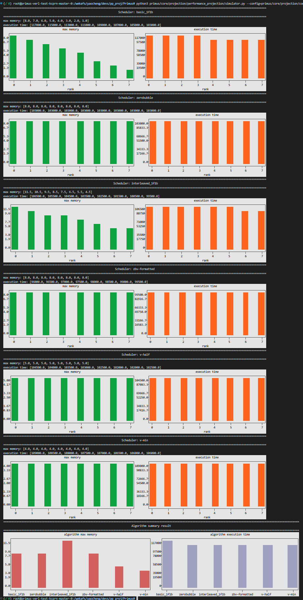
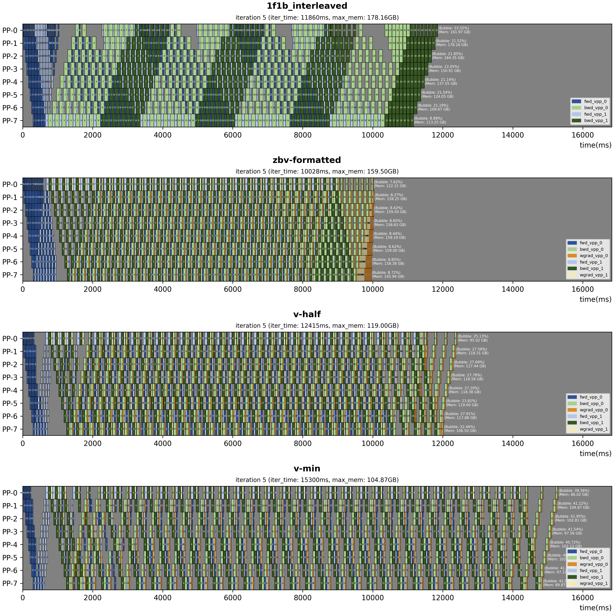
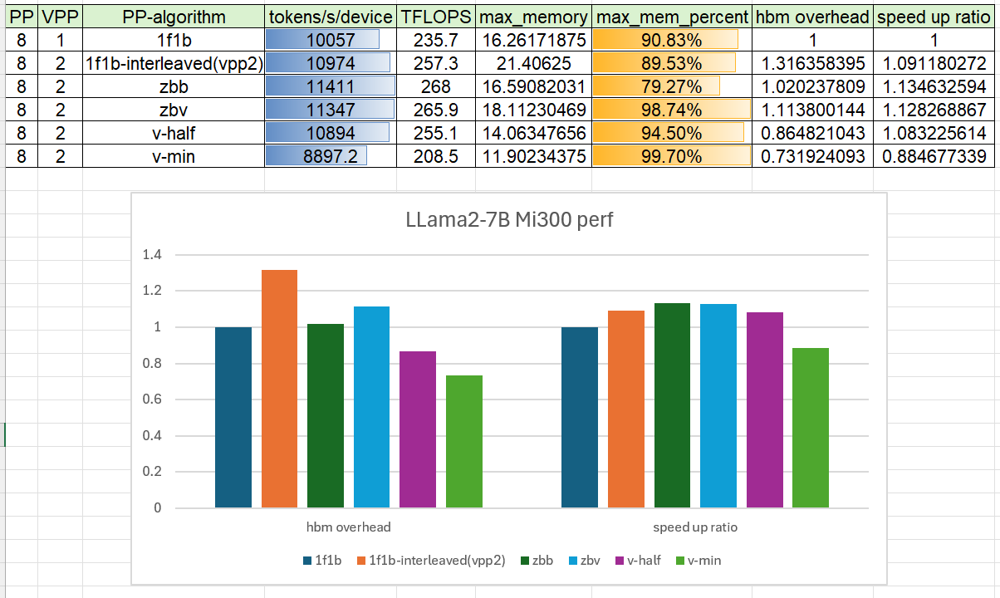
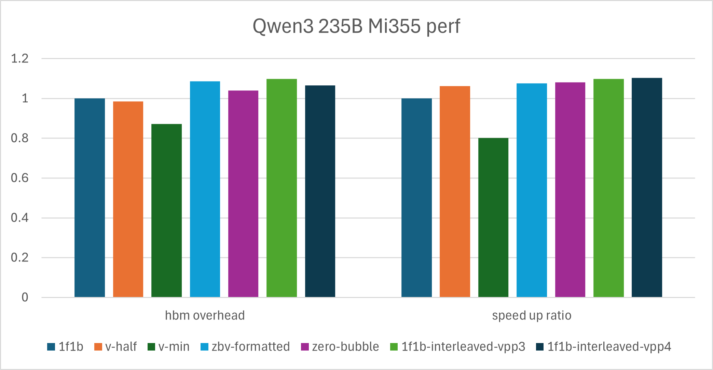

<!---
Copyright (c) 2025 Advanced Micro Devices, Inc. (AMD)

Permission is hereby granted, free of charge, to any person obtaining a copy
of this software and associated documentation files (the "Software"), to deal
in the Software without restriction, including without limitation the rights
to use, copy, modify, merge, publish, distribute, sublicense, and/or sell
copies of the Software, and to permit persons to whom the Software is
furnished to do so, subject to the following conditions:

The above copyright notice and this permission notice shall be included in all
copies or substantial portions of the Software.

THE SOFTWARE IS PROVIDED "AS IS", WITHOUT WARRANTY OF ANY KIND, EXPRESS OR
IMPLIED, INCLUDING BUT NOT LIMITED TO THE WARRANTIES OF MERCHANTABILITY,
FITNESS FOR A PARTICULAR PURPOSE AND NONINFRINGEMENT. IN NO EVENT SHALL THE
AUTHORS OR COPYRIGHT HOLDERS BE LIABLE FOR ANY CLAIM, DAMAGES OR OTHER
LIABILITY, WHETHER IN AN ACTION OF CONTRACT, TORT OR OTHERWISE, ARISING FROM,
OUT OF OR IN CONNECTION WITH THE SOFTWARE OR THE USE OR OTHER DEALINGS IN THE
SOFTWARE.
--->

# Primus-pipeline: A more flexible and scalable pipeline parallelism implementation

This blog covers a flexible pipeline parallelism implementation in the Primus Megatron-LM backend, which supports a full stack of zero-bubble algorithms including zerobubble/zbv/v-half/v-min, as well as traditional 1f1b and 1f1b-interleaved schedules. We also provide a full stack of simulation and performance tools to analyze pipeline scheduling algorithms in both theory and practice.

## Background

Pipeline parallelism is an efficient strategy for large language model pretraining. It partitions the transformer layers across devices, which is especially useful when the model is too large to fit on a single card.

1f1b and 1f1b-interleaved are two PP scheduling algorithms widely used in LLM training frameworks such as Megatron-LM and DeepSpeed. In recent years, several state-of-the-art pipeline parallelism methods have been proposed, such as the [zero-bubble algorithm](https://github.com/sail-sg/zero-bubble-pipeline-parallelism) by Sea AI Lab and [DualPipe/DualPipe-V](https://github.com/deepseek-ai/DualPipe) by the DeepSeek team, but they are not integrated into open-source LLM training frameworks mainly because the scheduling logic is fixed and hard to modify.

For example, in the Megatron-LM 1f1b-interleaved implementation, the PP schedule is depicted by three main loops: warm-up, 1f1b steady, and cooldown. The warm-up phase executes only forward passes, the steady phase executes one forward and one backward in order, and finally the cooldown phase executes the last minibatches' backward passes. Communication nodes are inserted inside the loop. In this case, if you want to add a new schedule such as zero-bubble or dual-pipe, you need to copy the three loops and modify their details, which can become long and complicated.

## Primus-pipeline

The key idea of Primus-pipeline is to separate pipeline scheduling logic from training execution, making it convenient to verify and implement new pipeline schedule algorithms. Our main contributions can be summarized in the following three points.

- Provide a flexible abstraction for PP scheduling algorithms and fully support many state-of-the-art algorithms, including 1f1b-interleaved and zero-bubble based schedules.

- Implement InputGrad/WeightGrad separation ops for GeMM and GroupGemm by redefining [Primus-Turbo](https://github.com/AMD-AGI/Primus-Turbo) ops.

- Provide simulation tools for each PP algorithm in both theory and practice, which clearly simulate and measure bubble rate and memory consumption under specific configs. 

### Schedule Design

Primus-pipeline patch and substite the Megatron-LM's `megatron.core.pipeline_parallel.get_forward_backward_func` function. The entrypoint of the schedule logic is at [PrimusPipelineParallelLauncher](https://github.com/AMD-AGI/Primus/blob/dev/yc/primus-pipe-blog/primus/backends/megatron/core/pipeline_parallel/primuspipe/pipeline_launcher.py)

Here are the steps to define and run a PP algorithm in Primus-pipeline.

1. **Create a ScheduleTable with ScheduleNodes**: For most PP algorithms, a schedule table containing schedule nodes can be defined given PP world size, virtual pipeline chunks per rank, and minibatches. 
  - **ScheduleNode**: Each step of the execution can be abstracted as a ScheduleNode including computation nodes such as FORWARD/BACKWARD/WGRAD and communication nodes such as RECV_FORWARD/SEND_FORWARD.
  - **PP Algorithms**: [pp-algorithms](https://github.com/AMD-AGI/Primus/tree/main/primus/core/pipeline_parallel/scheduler/algorithms)

2. **Bind the ScheduleNodes with their execution functions and args**: Each node in the schedule table is bound to its handler functions and runtime args. For example, Primus binds Megatron-LM backend functions in this code. [Megatron-LM backend binding](https://github.com/AMD-AGI/Primus/blob/main/primus/backends/megatron/core/pipeline_parallel/primuspipe/pipeline_launcher.py#L239-L272)

3. **Launch the ScheduleRunner**
After binding execution functions on the schedule table, it is launched by [ScheduleRunner](https://github.com/AMD-AGI/Primus/blob/main/primus/core/pipeline_parallel/scheduler/scheduler.py)


### Simulator and perf

To validate and compare performance of different PP algorithms, we offer tools that can perform projections without hardware and also observe and profile PP schedules in real runs.

#### 💻 Simulator

Given a `ScheduleTable`, the simulator estimates bubble rate, memory footprint, and timing based on a provided configuration without requiring physical devices. This enables rapid comparison of different schedule designs and iterative development before running full-scale experiments.

Below is an example demonstrating how to validate different PP algorithms using the configuration defined in [pp_simulation.yaml](https://github.com/AMD-AGI/Primus/blob/main/primus/core/projection/configs/pp_simulation.yaml). We also did lots of works for fine-grained projections with transformer layer performance metrics and various parallel strategies, please refer to the [projection readme](https://github.com/AMD-AGI/Primus/blob/main/docs/projection.md).

Execute the command below to run the simulation program. The tool will output performance metrics for different algorithms directly in the console. The data generated by simulator can be visualized by visualization tools introduced in the next section.

```bash
python3 primus/core/projection/performance_projection/simulator.py --config=primus/core/projection/configs/pp_simulation.yaml

```



#### 🔧 Perf & Visualization tools

Turn on the flag `dump_pp_data: True`; the Primus framework will dump forward and backward times for each minibatch execution. Use the [PP visualization tools](https://github.com/AMD-AGI/Primus/blob/main/tools/visualization/pp_vis/README.md) to visualize the PP schedule.

The time data generated by the simulator can also be visualized by this tool. Here are some examples generated by the visualization tools.

- **Simulation perf**

```bash
python3 tools/visualization/pp_vis/vis.py --config=primus/core/projection/configs/pp_simulation.yaml
```


- **Real training perf**



### Run with Megatron-LM backend

Most configs for using Primus-pipeline are defined in [primus_pipeline.yaml](https://github.com/AMD-AGI/primus-tiger-training-internal/blob/main/primus/configs/modules/megatron/primus_pipeline.yaml). Two key configs are `patch_primus_pipeline`, which enables the Primus-pipeline implementation to replace the original schedule logic in Megatron, and `pp_algorithm`, which specifies the PP scheduling algorithm to use.


Besides that, some configs conflict with Primus-pipeline, need to be config as listed below.

```yaml
overlap_grad_reduce: false
overlap_param_gather: false
no_persist_layer_norm: true
create_attention_mask_in_dataloader: false
gradient_accumulation_fusion: true

```

### PP schedule algorithm comparison

Our implementation primarily focuses on the zero-bubble family proposed by Sea AI Lab, including zerobubble/zbv/v-half/v-min. Note that post-validation is not currently supported, as it requires substantial optimizer modifications that are challenging to maintain across Megatron-LM versions.

The following table compares different PP scheduling algorithms under the assumption that forward, backward, and weight-grad operations have equal execution time:


| Algorithm        | VPP size | Bubble Rate               | Max Activation Memory | Communication Volume |
|------------------|----------|---------------------------|-----------------------|----------------------|
| 1f1b             | 1        | (p - 1) / (m + p -1)      | p                     | 1                    |
| 1f1b-interleaved | N        | (p - 1) / (m * N + p - 1) | p + (p - 1) / p       | N                    |
| ZeroBubble(ZB1P) | 1        | (p - 1) / 3 * (m + p -1)  | p                     | 1                    |
| ZBV-formatted    | 2        | (p - 1) / (p - 1 + 6 * m) | p                     | 2                    |
| V-half           | 2        | -                         | p / 2 + x             | 2                    |
| V-min            | 2        | -                         | p / 3 + x             | 2                    |

**Note:** V-half and V-min employ greedy algorithms and therefore lack closed-form bubble-rate formulas. Use the simulator to estimate their bubble rates.

**Notation:**
* `p`: number of pipeline stages
* `m`: number of minibatches
* `x`: constant term

### Experiments

We ran experiments to verify the performance of Primus-pipeline. Here we list results for [Llama2-7B](https://huggingface.co/meta-llama/Llama-2-7b) on 1 node with PP8 and the [Qwen3-235B](https://huggingface.co/Qwen/Qwen3-235B-A22B) MoE model with PP4 EP8.

#### llama2 7B verification

- Cluster with MI300, 1 node, PP8, Llama2-7B model

| PP | VPP | PP-algorithm | tokens/s/device | TFLOPS | max_memory | max_mem_percent | hbm overhead | speed up ratio |
|----|-----|-------------|----------------|--------|------------|-----------------|--------------|---------------|
| 8  | 1   | 1f1b        | 10057          | 235.7  | 16.26 | 90.83%         | 1            | 1             |
| 8  | 2   | 1f1b-interleaved(vpp2) | 10974 | 257.3 | 21.40 | 89.53% | 1.31 | 1.09 |
| 8  | 2   | zbb         | 11411          | 268    | 16.59 | 79.27% | 1.02 | 1.13 |
| 8  | 2   | zbv         | 11347          | 265.9  | 18.11 | 98.74% | 1.11 | 1.12 |
| 8  | 2   | v-half      | 10894          | 255.1  | 14.06 | 94.50% | 0.86 | 1.08 |
| 8  | 2   | v-min       | 8897.2         | 208.5  | 11.90 | 99.70% | 0.73 | 0.88 |




#### Qwen 235B verification

- Cluster with MI355, 4 nodes, PP4, EP8, Qwen-235B model.

| PP | VPP | PP-algorithm | tokens/s/device | TFLOPS | max_memory | max_mem_percent | hbm overhead | speed up ratio |
|----|-----|--------------|----------------|--------|------------|-----------------|--------------|---------------|
| 4  | 1   | 1f1b         | 2742.4         | 406    | 261.58     | 90.83%          | 1            | 1             |
| 4  | 2   | v-half       | 2912.9         | 431.2  | 257.84     | 89.53%          | 0.98         | 1.06          |
| 4  | 2   | v-min        | 2200.6         | 325.8  | 228.28     | 79.27%          | 0.87         | 0.80          |
| 4  | 2   | zbv-formatted | 2952.7        | 437.1  | 284.36     | 98.74%          | 1.09         | 1.08          |
| 4  | 1   | zero-bubble  | 2963.1         | 438.6  | 272.13     | 94.50%          | 1.04         | 1.08          |
| 4  | 3   | 1f1b-interleaved-vpp2 | OOM   | | | | | |
| 4  | 3   | 1f1b-interleaved-vpp3 | 3012.1 | 445.9 | 287.13 | 99.70% | 1.10 | 1.10 |
| 4  | 4   | 1f1b-interleaved-vpp4 | 3024.5 | 447.7 | 278.82 | 96.82% | 1.06 | 1.10 |




### Conclusions and Best Practice Guide

Based on the results above, we draw the following conclusions.

- Llama-based models show higher throughput and memory gains than MoE models, because the overall network has a larger GEMM footprint and higher activation memory.
- For large MoE cases in practice, 1f1b-interleaved reaches a higher throughput roofline than zero-bubble schedules, but it is harder to reduce memory usage. In memory-limited scenarios, v-half is a reasonable option.

Based on these conclusions, we recommend using zero-bubble based algorithms (zero-bubble / zbv / v-half / v-min) instead of 1f1b-interleaved in the following cases:

- A large share of GEMM/GroupedGEMM in the model: dense-layer-heavy models benefit more from splitting weight-grad and input-grad computation. Imbalanced time between the two phases tends to introduce extra bubbles.

- Memory is the bottleneck: 1f1b-interleaved offers limited ways to reduce memory consumption, while v-half and v-min provide practical options when memory is tight.

- Communication is inefficient: 1f1b-interleaved trades extra communication for lower bubble rates, and larger VPP increases communication volume. In most cases, p2p communication can be hidden by overlapping computation, but without AINIC or RDMA support, zbv/v-half/v-min have clearer advantages.

- Extreme partitioning limits: when the model cannot be split beyond VPP rank 2, zbv/v-half/v-min usually outperform 1f1b-interleaved.


## Future works

Primus-pipeline provides a flexible interface for future investigation and research on PP algorithms. Here are some potential topics we are working on, and we welcome contributions and ideas.

1. CPU offloading: Based on the schedule node design, it is easy to control offloading/reloading timing for different minibatches and model layers. We are adding offload logic to zbv/v-half/v-min algorithms.

2. More algorithms: Implement more state-of-the-art PP schedules like Dual-Pipe-V and investigate more efficient PP algorithms. Contributions are welcome.

3. Fine-grained overlap: In technical reports like DeepSeek-V3, PP schedules combine forward and backward passes of different minibatches and overlap computation and communication. We plan to explore similar fine-grained overlap strategies.


## Acknowledgments

We would like to express our sincere gratitude to the [SeaAI lab](https://sail.sea.com/) team and individuals for their invaluable contributions and collaboration, their expertise and support have been instrumental in advancing the progress of this project.

## Disclaimers

Third-party content is licensed to you directly by the third party that owns the
content and is not licensed to you by AMD. ALL LINKED THIRD-PARTY CONTENT IS
PROVIDED “AS IS” WITHOUT A WARRANTY OF ANY KIND. USE OF SUCH THIRD-PARTY CONTENT
IS DONE AT YOUR SOLE DISCRETION AND UNDER NO CIRCUMSTANCES WILL AMD BE LIABLE TO
YOU FOR ANY THIRD-PARTY CONTENT. YOU ASSUME ALL RISK AND ARE SOLELY RESPONSIBLE
FOR ANY DAMAGES THAT MAY ARISE FROM YOUR USE OF THIRD-PARTY CONTENT.