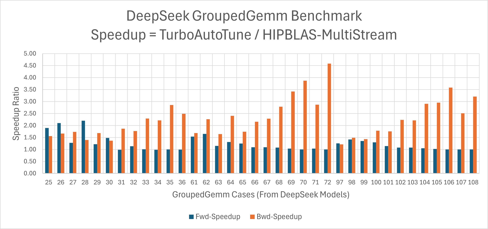
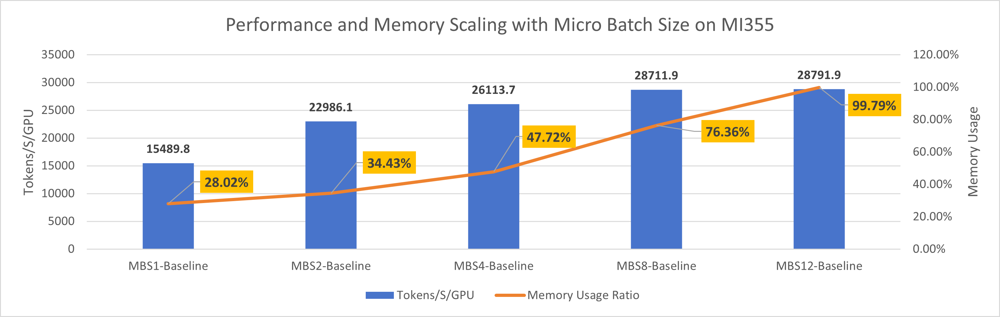
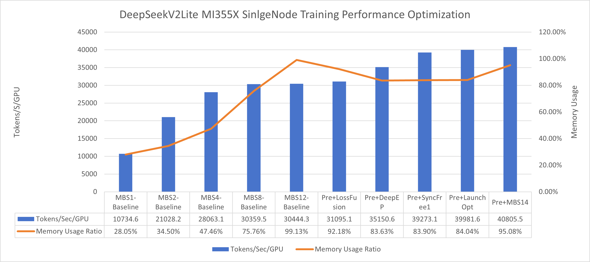
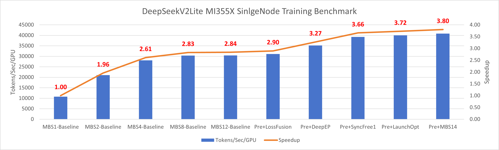
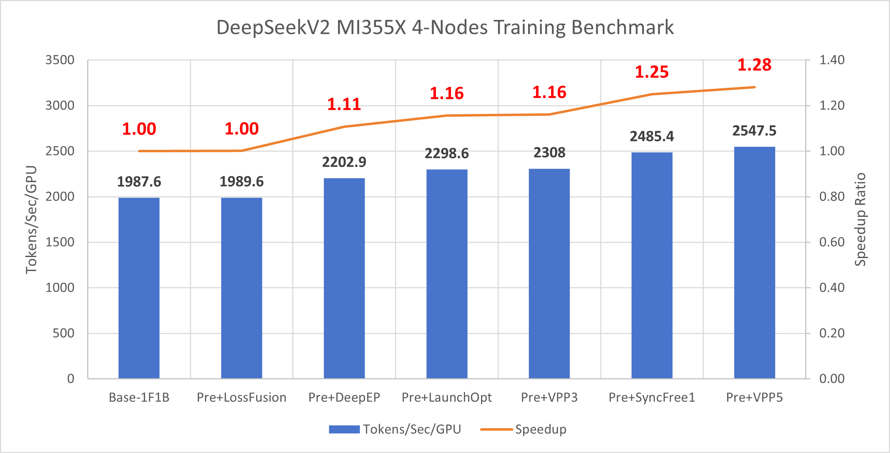
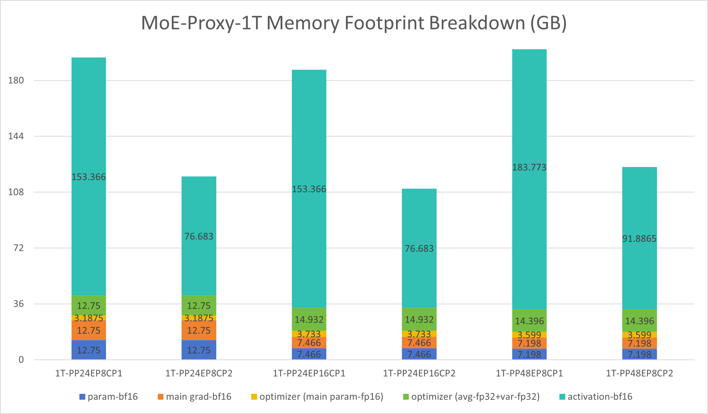
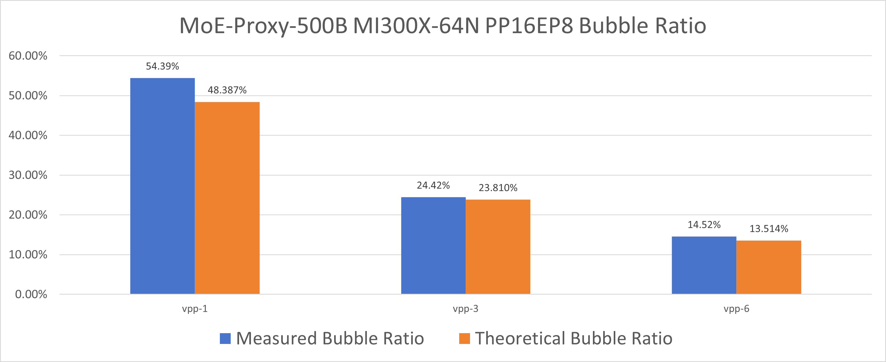
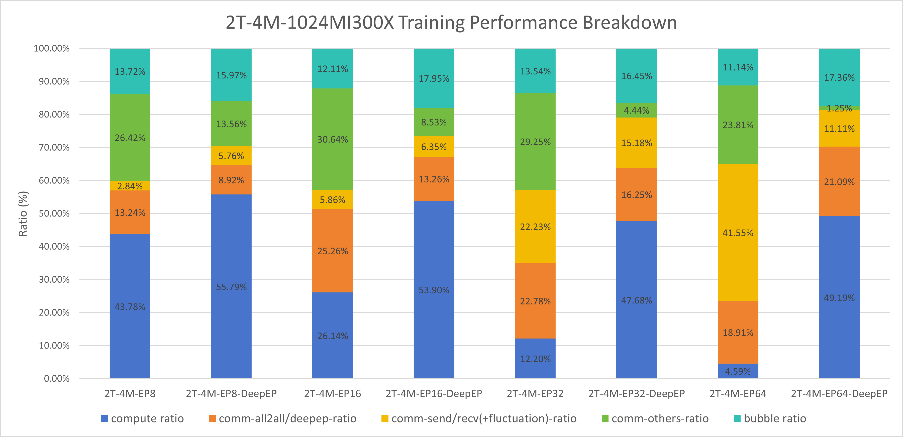
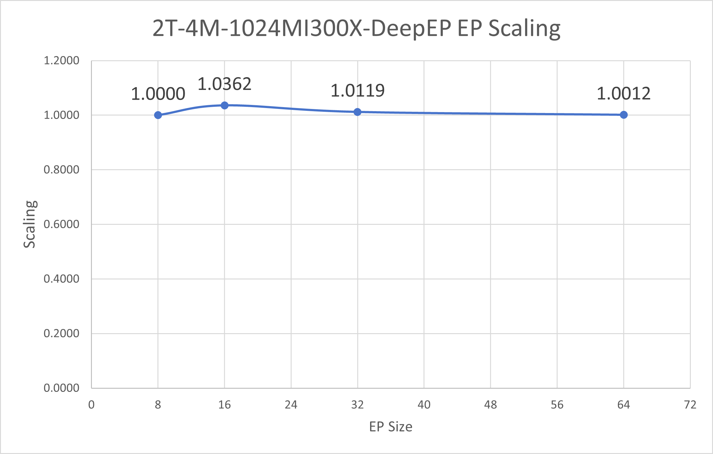

# MoE Training Best Practices on AMD GPUs

This document summarizes the best practices for training Mixture-of-Experts (MoE) models on AMD Instinct™ MI300-series GPUs and the ROCm ecosystem. It covers large-scale sparse model distributed training strategies, key performance bottlenecks, practical optimization techniques, and hands-on engineering tips specifically for AMD platforms. Whether you’re new to MoE distributed architectures or working to optimize trillion-parameter models for scalability and performance, this guide will help you identify typical bottlenecks and implement solutions to maximize efficiency on AMD GPUs.

## 1. MoE Model Overview

Mixture of Experts (MoE) is a model architecture designed to efficiently scale neural networks by routing inputs through a subset of specialized sub-models, or "experts." Each expert is a part of a larger ensemble and is trained to handle specific types of data or tasks. The architecture includes a gating mechanism that dynamically routes data to the most relevant experts based on the input, allowing only a few paths to be activated per input. This enables the model to maintain a large capacity while using fewer computational resources, as only a fraction of the model is used during inference. MoE models have shown success in massively increasing model capacity without proportionally increasing computation cost, proving effective in areas like natural language processing.

[] moe architecture

## 2. Representative Models

The mainstream MoE models today are DeepSeek-style architectures, spanning from 16B up to 200B+ parameters. Recently, even larger MoE models have started to appear in the open-source community. To keep pace, we also include 1T and 2T proxy models for evaluating how increasing model scale impacts memory footprint, performance, scalability, and corresponding optimization strategies. The table below summarizes the key model configurations for commonly used open-source DeepSeek models as well as large proxy models.

| Model | Total Params | Active Params | Notes |
| --- | --- | --- | --- |
| DeepSeek-v2-Lite  | 16B | 2.4B | `deepseek_v2_lite.yaml` |
| DeepSeek-v2 | 236B | 21B | `deepseek_v2.yaml` |
| DeepSeek-Proxy-1T   | 1T | 44B | `deepseek_proxy_1T.yaml` |
| DeepSeek-Proxy-2T   | 2T | 80B | `deepseek_proxy_2T.yaml` |

## 3. Profiling and Analysis Workflow

For performance analysis and bottleneck identification during MoE model training, we recommend the following workflow:

- **Step 1: Torch Profiler + TraceLens**
  Torch Profiler provides detailed runtime traces of operator execution time, memory usage, and GPU utilization during training. You can use `profile_step_start` and `profile_step_end` to precisely control the profiling window, making it easy to pinpoint bottlenecks and optimization opportunities.

- **Step 2: Detailed Bottleneck Analysis with TraceLen**
  [TraceLens](https://github.com/AMD-AGI/TraceLens/tree/main) is a Python tool designed to automate the analysis of trace files and deliver actionable performance insights, it's a specialized tool designed by AMD for fine-grained identification of performance bottlenecks such as communication stalls, unbalanced compute, or inefficient operator fusion. Its key features include:

    - **Hierarchical Performance Breakdown**: Visualize bottlenecks from a high-level GPU timeline down to individual operator and shape granularity.
    - **Roofline and Efficiency Analysis**: Quickly assess operation efficiency (TFLOP/s, memory bandwidth) and identify whether kernels are compute- or memory-bound.
    - **Multi-GPU Communication Diagnostics**: Separate pure communication time from synchronization, highlighting collective operation bottlenecks and bandwidth utilization.
    - **Trace Comparison & Diff**: Directly compare traces to measure optimization effects and identify regressions.
    - **Replay Generation**: Easily create minimal reproducers for any event, facilitating targeted debugging and kernel verification.
    - **Simple API**: Get started with ready-made scripts or extend functionality using a flexible Python interface.

- **Step 3: Memory Projection**
  Memory projection enables comprehensive VRAM usage analysis, identifying memory bottlenecks in the model. By projecting memory consumption across layers, optimizer states, and expert routing, it guides targeted adjustments to model structure, parallelization strategy, and memory optimizations for improved scaling efficiency.

- **Step 4: Pipeline Parallelism Visualization**
  Primus provides a built-in PP (pipeline-parallel) visualization tool [pp_vis](https://github.com/AMD-AGI/Primus/tree/main/tools/visualization/pp_vis) that helps diagnose and visualize pipeline-stage utilization across ranks. This tool is valuable for discovering pipeline bubbles or imbalances that limit throughput.

## 4. Baseline Bottleneck Highlights

Unlike dense models, MoE training introduces a unique challenge: the MoE layer juggles multiple experts and relies on routers to dispatch tokens dynamically. This added complexity opens the door to several performance pitfalls:

- **Grouped GEMM overhead**: Even with multi-stream tricks to overlap expert computations, timeline traces still show noticeable gaps—there's room to squeeze out more efficiency.

- **All-to-all communication**: The all-to-all collectives in MoE can eat up a surprisingly large chunk of runtime, especially once you scale beyond a single node with EP ≥ 8.

- **CPU sync & launch delays**: Profiling often reveals big gaps between kernels. The culprits? Lots of tiny ops plus CPU-side syncs that stall the launch queue.

- **Too many small kernels**: MoE layers are packed with fine-grained operators, which hammers the kernel launch path and bloats CPU overhead.

- **PP load imbalance**: Using `pp_vis`, we've spotted cases where uneven work across pipeline stages quietly drags down overall throughput.

- **Memory crunch**: GPU memory is always tight. Push it too far and you're forced into recomputation—burning extra FLOPs just to stay afloat.

## 5. Performance Optimizations

To tackle the MoE training bottlenecks outlined above (grouped GEMM inefficiency, all-to-all communication overhead, CPU sync & launch delays, pipeline imbalance, and memory pressure), we introduce the following optimizations:

### Feature 1 – Turbo Grouped GEMM
- Description: Primus-Turbo leverages fused CK (Composable Kernel) grouped GEMM to handle all experts in a single kernel launch, outperforming the traditional multi-stream approach that overlaps expert computations but still suffers from scheduling overhead.
  In addition, Primus-Turbo also supports selecting the fastest grouped GEMM backend for different kernels in the forward and backward passes, further boosting performance.
  The following bar chart compares the speedup of grouped GEMM after applying Primus-Turbo autotune versus the original multi-stream version. The benchmark was conducted on MI325x.

### Feature 2 – DeepEP Acceleration

- Description: DeepEP optimizes expert token dispatch in Mixture-of-Experts (MoE) models by significantly reducing redundant cross-node data movement required by traditional all-to-all communication. By leveraging GPU-based index calculation instead of CPU-side coordination, our adapted DeepEP implementation eliminates costly CPU-GPU synchronizations, enabling a fully sync-free pipeline. Built on open-source DeepEP and further tuned for Primus, this solution not only accelerates dispatch and router operations but also achieves higher scaling efficiency, especially critical for large-scale, multi-node training. DeepEP thus enables more efficient expert utilization, reduces communication bottlenecks, and paves the way for scalable, high-performance MoE training.

  This figure illustrates the key differences between DeepEP and standard all-to-all communication in MoE models. With DeepEP, redundant data transmission between GPUs is minimized by more intelligently routing tokens to experts, drastically reducing unnecessary cross-node data movement. As a result, DeepEP improves overall data transfer efficiency and leads to higher scalability and throughput during large-scale MoE training.

### Feature 3 – Sync-Free MoE
- Description: The dynamic shape of MoE (such as, required hip/cuda kernel results to allocate device memory) can lead to D2H synchronization and cause significant CPU overhead. This may increase device idle time and impose considerable performance impact on training, which becomes particularly noticeable when context-parallelism is enabled. We have eliminated all CPU synchronization throughout MoE pipeline—from Router to Dispatcher, Permutation, and GroupMLP —reducing the idle time. The sync-free MoE workflow is like this:

We provide Primus users with the `--turbo_sync_free_moe_stage` option, which supports four levels of sync-free MoE (from 0 to 3), summarized as follows:

| Level | Value | Description                                                                     |
|-------|-------|---------------------------------------------------------------------------------|
|  0    | Default | **Disable** sync-free MoE (standard, baseline implementation)                     |
|  1    |   1   | Remove synchronization for **Router** and **Permutation**                        |
|  2    |   2   | Remove synchronization for **Router**, **DeepEP**, and **GroupMLP**              |
|  3    |   3   | Remove **all** MoE synchronization (full sync-free pipeline)   :warning: **Note:** This mode will consume significantly more additional GPU memory. If you do not have enough memory available, it is recommended **not to use stage 3**.

Sync-Free-related function parameters or options  in Primus-Megatron MoE, as following:
- Router:
    - `fused_group_topk_routing_with_aux_score`: Primus-Megatron option to enable router fusion.
- DeepEP
   - `use_cuda_num_token_per_expert`: Turbo-DeepEP dispatch parameter to return `num_tokens_per_experts` by CUDA tensor
   - `num_worst_token`: Turbo-DeepEP dispatch parameter to eliminate notify-dispatch CPU busy-wait
- permuatation
   - `moe_permutation_fusion`: Primus-Megatron option to enable permutation fusion.
- groupmlp
   - `use_turbo_groupmlp`: Primus-Megatron option to use Turbo's GroupMLP which accepted CUDA `num_token_per_experts` as parameter.
   - `use_turbo_groupmlp_act`: Primus-Megatron option to use Turbo's activation which accepted CUDA `num_token_per_experts` as parameter.

### Feature 4 – 1F1B MoE Overlap

- Description: The 1F1B (1-Forward-1-Backward) overlap scheduling feature is designed to optimize the utilization of both compute and communication resources during MoE training. Traditionally, the communication of expert dispatch and aggregation (such as during all-to-all or DeepEP operations) occurs sequentially with respect to the forward and backward pass, resulting in idle compute or communication hardware for significant time periods. By leveraging 1F1B scheduling, the training interleaves the communication required for one micro-batch’s experts with the backward computation of a preceding micro-batch. This means that while the model is calculating backward gradients for micro-batch N-1, the expert tokens for micro-batch N are already being communicated, thus reducing pipeline stalls. F1B overlap is particularly beneficial at larger scales, where communication costs often dominate.

### Feature 5 – Arbitrary Pipeline Partition
- Description: This feature allows users to enforce a custom or manually designed pipeline partitioning scheme, rather than relying on default or automatic partitioning logic. By specifying an explicit pipeline layout, users can finely control how model layers are divided across pipeline stages. This approach can help to achieve an optimal balance between memory usage and compute efficiency tailored to specific hardware setups or model architectures. Manual pipeline partitioning is especially useful when trying to minimize memory bottlenecks, achieve more even stage workloads, or experiment with new partitioning strategies in large models. To use this functionality, specify your desired partition pattern in the configuration, ensuring that the pattern reflects the target balance between computational resources and available memory per device.

### Feature 6 – Recompute Selected Layers
- Description: Recomputes the first four transformer layers to save activation memory without enabling full recompute.
- Args:
  - `--recompute_layer_ids 0,1,2,3`
- Notes: Keep `RECOMPUTE_LAYERS` at `0` so this helper remains the only recompute knob.

### Feature 7 – Loss Fusion Helper
- Description: Modern LLMs often have massive vocab sizes, which makes the loss computation a memory hog. Loss fusion fuse the caculation into a single kernel, reduce both memory footprint and kernel overhead in one shot.

### Feature 8 – CPU Launch Optimization

- Description: In large-scale MoE model training, CPU kernel launch efficiency is critical due to the high number of operators. We optimize this from two aspects: (1) NUMA binding, which pinpoints each GPU process to its associated NUMA socket for improved memory and compute access; (2) increasing the kernel argument pool size in HIP runtime to raise the upper limit of concurrent kernel launches, preventing launch bottlenecks.
  - **NUMA binding usage**: Before running, set `export ENABLE_NUMA_BINDING=1` in Primus to pin each GPU process to its associated NUMA node, improving memory bandwidth utilization and training stability for large models.
  - **Increase HIP kernel argument pool size**: Set `export HSA_KERNARG_POOL_SIZE=12582912` to raise the maximum number of concurrent kernel launches in the HIP runtime, helping to alleviate launch bottlenecks during large-scale MoE training.

### Feature 9 – Manual GC Helper
- Description: Forces periodic host GC to mitigate long-running Python fragmentation on multi-day runs.
  In our training experiments with large-scale MoE models, we noticed that even with load balancing enabled, the performance of each iteration can still fluctuate noticeably. By enabling manual GC, these iteration time jitters are effectively eliminated, leading to more stable and consistent training performance. As a result, all subsequent benchmarking results in this guide are produced with manual GC enabled by default to ensure fair and reliable performance comparisons.

## 7. Model-Specific Optimization Guide

This section provides an overview and practical guidance for optimizing different DeepSeek model variants on Primus/AMD MI-series hardware. Each sub-section covers a specific model family like DeepSeek-V2-Lite, DeepSeek-V2, and ultra-large (1T+ parameters) models—with advice on configuration, baseline performance, bottleneck analysis, advanced tuning, and future directions.

---

### 7.1 DeepSeek-V2-Lite Optimization

#### 1. Model Overview and Configuration Files

DeepSeek-V2-Lite is a more memory and compute-efficient variant, designed for high-throughput pretraining. Typical sizes range from 80B to 180B parameters. In Primus, you can find its configs and pretrain scripts under:

| Variant | Total Params | Active Params | Transformer Layers |
| --- | --- | --- | --- |
| DeepSeek-V2-Lite | 16B | 2.4B | 27 |

- Model Config: `primus/configs/models/megatron/deepseek_v2_lite.yaml`
- Pretrain Script: `examples/moe_package/run_deepseek_v2_lite_pretrain_mi355x.sh`

#### 2. Baseline Performance Testing

AMD MI300/325/355 series GPUs offer very large memory pools. The easiest and most effective way to leverage this is to increase the micro batch size (mbs). For MoE models, the `EP` (expert parallel size) parameter enables scaling individual expert models across devices. For models exceeding 180B, you can further utilize pipeline parallelism (`PP`) to split the model, maximizing memory savings.

The following bar chart illustrates how increasing the micro-batch size (MBS) during DeepSeek-V2-Lite training on an AMD **MI355** GPU improves both throughput (tokens per second) and GPU memory utilization. By scaling up the MBS, you can achieve better hardware efficiency and model performance, within the limits of available memory resources.

#### 3. Performance Optimization

This section summarizes our key optimization strategies used to enhance DeepSeek-V2-Lite MoE model training on AMD MI-series hardware. Each method addresses a specific bottleneck, providing both stability and performance improvements:

1. **Manual Garbage Collection (GC) for Performance Stability**
   We observed that, during MoE training, iteration time can fluctuate significantly due to memory allocation behavior. By introducing manual garbage collection, we can stabilize the training process and reduce these time variations. As a result, all subsequent benchmarking results in this guide are based on runs with manual GC enabled by default.

2. **Loss Fusion to Optimize Memory Footprint**
   The memory consumed by the loss computation becomes substantial, primarily due to the extremely large vocabulary size. Employing loss fusion techniques reduces memory usage for this phase by approximately 7.4%, while also improving overall end-to-end training throughput.

3. **DeepEP Optimization for AllToAll Communication**
   AllToAll-based inter-device communication is a critical bottleneck, especially as token traffic and expert parallelism scale up. By incorporating DeepEP (Deep Expert Parallel) optimizations, we reduce redundant token data transfer, increase token movement efficiency, and significantly improve training performance.

4. **Sync-Free Mode to Resolve CPU D2H Synchronization Overheads**
   Profiling shows that CPU device-to-host (d2h) synchronizations in the MoE layers can induce large kernel launch latencies, preventing effective overlapping of communication and computation. Enabling sync-free mode eliminates these synchronizations, resulting in a well-overlapped, higher-performance kernel launch sequence.

5. **NUMA Binding for Improved CPU Affinity and Memory Access**
   On multi-socket (NUMA) systems, poor CPU thread placement can degrade throughput. Applying NUMA binding strategies ensures better CPU affinity, reduces memory latency, and boosts pipeline scheduling efficiency, further supporting high-throughput training.

6. **Micro-Batch Size (MBS) Scaling via Memory Savings from Prior Optimizations**
   The combined effect of the optimizations above has reduced the MBS=12 training run's peak memory usage from 99.79% to 84.28%. This memory headroom allows us to increase the micro-batch size to 14, unlocking additional throughput improvements and maximizing hardware utilization.

Each of these optimizations contributes incrementally to more stable, efficient, and scalable MoE training. We recommend applying them sequentially for best results.

Through stepwise optimization, we observe a clear and significant boost in end-to-end training performance. The figures below summarize the measured throughput improvements and memory utilization as each optimization feature is incrementally enabled.

**Figure 1**:
Cumulative throughput (tokens/s per GPU) and GPU memory usage after successively enabling key optimization features. Each bar represents the combined effect of all optimizations up to that point.

**Figure 2**:
Per-feature throughput (tokens/s) and speedup relative to baseline. This illustrates the acceleration contributed by each optimization as it is introduced.

---

### 7.2 DeepSeek-V2 Optimization

#### 1. Model Overview and Configuration Files

DeepSeek-V2 models scale up in size and complexity, and are optimized for maximum parallel throughput on MI-series hardware.

| Variant | Total Params | Active Params | Transformer Layers |
| --- | --- | --- | --- |
| DeepSeek-V2 | 236B | 21B | 60 |

- Model Config: `primus/configs/models/megatron/deepseek_v2.yaml`
- Pretrain Script: `examples/moe_package/run_deepseek_v2_pretrain_mi355x.sh`

#### 2. Performance Optimization

This section summarizes our key optimization strategies used to enhance DeepSeek-V2 MoE model training on AMD MI-series hardware. Each method addresses a specific bottleneck, providing both stability and performance improvements:

1. **Manual Garbage Collection (GC) for Performance Stability**
2. **Loss Fusion to Optimize Memory Footprint**
3. **DeepEP Optimization for AllToAll Communication**
5. **NUMA Binding for Improved CPU Affinity and Memory Access**
4. **Sync-Free Mode to Resolve CPU D2H Synchronization Overheads**
6. **Reducing Pipeline Bubble Ratio via Interleaved Pipeline Parallelism (Interleaved PP)**

Each of these optimizations contributes incrementally to more stable, efficient, and scalable MoE training. Additionally, we have observed that enabling VPP (Virtual Pipeline Parallelism) further enhances the effectiveness of sync-free mode. Through stepwise optimization, we observe a clear and significant boost in end-to-end training performance. The figures below summarize the measured throughput improvements and memory utilization on **MI355X** as each optimization feature is incrementally enabled.

**Figure 1**:
Per-feature throughput (tokens/s) and speedup relative to baseline. This illustrates the acceleration contributed by each optimization as it is introduced.

#### 3. Future Optimization Directions

- Explore deeper fusion between permute operations and DeepEP kernels.
- Investigate more effective scheduling to further overlap communication and computation.
- Continue tuning pipeline partition and recompute strategies for larger model fits.

---

### 7.3 Optimizing 1 Trillion+ Parameter Models

#### 1. Model Overview and Configuration Files

Models exceeding 1 trillion parameters push the boundaries of distributed training. Configuration typically requires combining all advanced parallelism and memory optimization techniques.

| Variant | Total Params | Active Params | Transformer Layers |
| --- | --- | --- | --- |
| DeepSeek-Proxy-1T | 1T | 44B | 96 |
| DeepSeek-Proxy-2T | 2T | 80B | 96 |

- Model Configs:
  - `primus/configs/models/megatron/deepseek_proxy_1T.yaml`
  - `primus/configs/models/megatron/deepseek_proxy_2T.yaml`
- Pretrain Script (example): `examples/moe_package/run_ultra_1T_pretrain.sh`

#### 2. Memory Projection

Memory projection is a crucial aspect when training ultra-large models. Without careful analysis of memory usage, a lot of time can be wasted endlessly adjusting model architecture or distributed training strategies just to fit the model in GPU memory.

We simulated distributed training of 1T and 2T parameter models on a 1K-GPU cluster, breaking down the memory footprint across different components: model parameters, gradients, activations, optimizer states, and the main param/grad used in mixed precision training. Our analysis revealed that, unlike smaller models, ultra-large models have a memory breakdown dominated by activations.

Below, you’ll find the memory usage charts for the 1T and 2T models, followed by our key takeaways.

---

**1T Model, 768 GPUs – Memory Usage Analysis**

- The largest memory consumer by far is activations.
  - Enabling CP2 (activation checkpointing) can reduce activation memory use by about half, saving ~76GB per GPU;
  - However, aggressive checkpointing may hurt performance.
- Increasing EP (expert parallelism) from 8 to 16 doesn't significantly lower memory consumption, but does add to all-to-all communication time.
- Raising PP (pipeline parallelism) from 24 to 48 also doesn’t substantially reduce memory use; instead, it increases pipeline ‘bubbles’ (idle time, e.g., vpp4 → vpp2) as well as more activation memory.
- **Conclusion:**
  - On MI300X, the most efficient config by memory projection is: PP24 EP8 CP2.
  - On MI355X, the most efficient config by memory projection is: PP24 EP8.

---

**2T Model, 768 GPUs – Memory Usage Analysis**

- Again, activations take up the most memory.
  - Enabling CP2 can halve activation memory usage, saving ~131GB per GPU;
  - But as before, this may come with some performance trade-offs.
- With CP2, the EP8 setting can’t fit in MI300X memory, but does fit on MI355X.
- Increasing EP from 8 to 16 doesn’t reduce memory; it just adds to all2all communication time.
- Increasing PP from 24 to 48 fails to help with memory either, but increases pipeline bubbles and activation memory.
- **Conclusion:**
  - On MI300X, the most effective config is PP24 EP16 CP2.
  - On MI355X, the optimal setup is PP24 EP8 CP2, taking advantage of larger DP sizes.

#### 3. Pipeline Bubble Projection and Insights

When scaling up to a large number of machines, the global batch size is often constrained. This means each iteration contains fewer microbatches—i.e., a lower gradient accumulation (GA). In the context of pipeline parallelism, this reduction leads to a higher pipeline bubble ratio, degrading overall training efficiency. However, employing the interleaved pipeline parallel (interleaved PP) algorithm allows us to significantly reduce bubbles, thereby maintaining usable efficiency.

**Let’s break down the calculation with an example:**

- Suppose we have 64 nodes, using the following distributed training configuration: PP=16, EP=8, global tokens=2 million, microbatch size=1.
- The effective GA is therefore:

  $$ GA = \frac{2M\ \text{tokens}}{4096\ \text{seq}} \Big/ \left(\frac{64 \times 8}{16}\right) \Big/ 1 = 16 $$

- If we use vanilla pipeline parallelism (VPP=1), the bubble ratio is:

  $$
  \text{bubbleratio} = \frac{\text{PP}-1}{\text{PP}-1 + GA \times VPP} = \frac{16-1}{16-1+16 \times 1} \approx 48.43\%
  $$

- Increasing interleaving to VPP=6,

  $$
  \text{bubbleratio} = \frac{15}{15+16 \times 6} \approx 13.51\%
  $$

  This is a substantial reduction.

To verify these observations, we conducted the tests on a 64-node setup. The measured bubble ratios closely matched our theoretical estimates, confirming the accuracy of this approach.

**In summary:** Utilizing interleaved pipeline parallelism (VPP) is an effective way to mitigate pipeline bubble overheads that emerge with large machine counts, thereby preserving computational efficiency for ultra-scale training.

#### 4. Optimizing the Inter-Node Token Dispatch and Combine

In our empirical studies, we found that as EP (Expert Parallelism) increases, the scalability of training degrades rapidly. Through detailed profiling and time breakdown analysis, we discovered that alltoall communication accounts for as much as 25%–30% of total training time. As a result, this part of the pipeline must be optimized using DeepEP, which can significantly improve communication efficiency and ensure good EP scaling performance. The specifics of our experiments are as follows:

We tested a 2T model on 1024 MI300X GPUs, comparing AllToAll and DeepEP across different EP sizes.

- As EP increases, AllToAll performance drops sharply and training efficiency suffers.
- DeepEP, on the other hand, demonstrates much better scalability and maintains nearly flat performance as EP grows.
- End-to-end, DeepEP delivers a 1.05× to 7.66× speedup over AllToAll.

---

The following figure shows the time breakdown for training, clearly illustrating how DeepEP reduces communication overhead:

---

The following curve shows end-to-end EP scaling when using DeepEP:

#### 4. Other MoE Optimizations

In ultra-large scale models, using **1F1B Overlap** (One-Forward-One-Backward overlapping) can further hide the communication overhead and improve training throughput. By interleaving the forward and backward passes, communication and computation can proceed concurrently, thus reducing idle time and increasing resource utilization.

Moreover, **fine-grained adjustment of pipeline parallel (PP) partitions** enables more balanced workload splitting. Carefully tuning the PP splits minimizes pipeline bubbles and waiting time between stages, leading to a smoother pipeline and better overall efficiency.

For recomputation (activation checkpointing), only specific pipeline stages perform recomputation, rather than having every virtual pipeline parallel (VPP) stage recompute identical layers, can reduce redundant work and further boost performance.

Together, these optimizations—1F1B overlap, fine-grained PP partitioning, and selective recomputation—are key strategies to maximize throughput and efficiency in trillion-parameter MoE model training.

## 8. References
- [Primus](https://github.com/AMD-AGI/Primus) training framework.
- AMD ROCm™ docs and Instinct™ MI300X/MI355X [performance benchmark guides](https://github.com/ROCm/MAD/blob/develop/benchmark/megatron_lm/README_primus.md).
- Training a model with [Primus](https://rocm.docs.amd.com/en/latest/how-to/rocm-for-ai/training/benchmark-docker/primus-megatron.html?model=primus_pyt_megatron_lm_train_llama-3.3-70b) and Megatron-LM.
- [Migrating workloads](https://rocm.docs.amd.com/en/latest/how-to/rocm-for-ai/training/benchmark-docker/previous-versions/megatron-lm-primus-migration-guide.html) to Primus (Megatron backend) from Megatron-LM.
