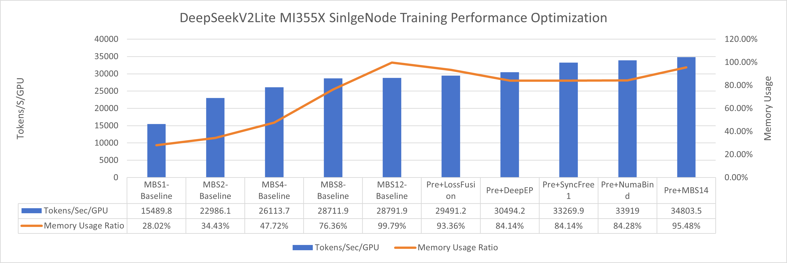
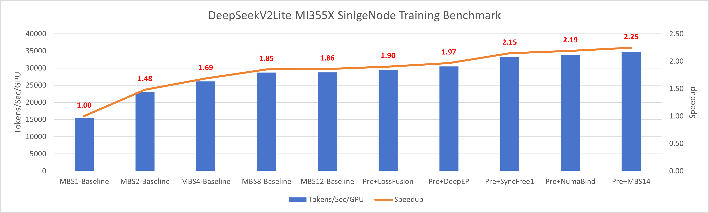

# MoE Training Best Practices on AMD GPUs

This document summarizes the best practices for training Mixture-of-Experts (MoE) models on AMD Instinct™ MI300-series GPUs and the ROCm ecosystem. It covers large-scale sparse model distributed training strategies, key performance bottlenecks, practical optimization techniques, and hands-on engineering tips specifically for AMD platforms. Whether you’re new to MoE distributed architectures or working to optimize trillion-parameter models for scalability and performance, this guide will help you identify typical bottlenecks and implement solutions to maximize efficiency on AMD GPUs.

## 1. MoE Model Overview

Mixture of Experts (MoE) is a model architecture designed to efficiently scale neural networks by routing inputs through a subset of specialized sub-models, or "experts." Each expert is a part of a larger ensemble and is trained to handle specific types of data or tasks. The architecture includes a gating mechanism that dynamically routes data to the most relevant experts based on the input, allowing only a few paths to be activated per input. This enables the model to maintain a large capacity while using fewer computational resources, as only a fraction of the model is used during inference. MoE models have shown success in massively increasing model capacity without proportionally increasing computation cost, proving effective in areas like natural language processing.

## 2. Representative Models

The mainstream MoE models today are DeepSeek-style architectures, spanning from 16B up to 671B parameters. Recently, even larger MoE models have started to appear in the open-source community. To keep pace, we also include 1T and 2T proxy models for evaluating how increasing model scale impacts memory footprint, performance, scalability, and corresponding optimization strategies. The table below summarizes the key model configurations for commonly used open-source DeepSeek models as well as large proxy models.

| Model | Total Params | Active Params | Notes |
| --- | --- | --- | --- |
| DeepSeek-Proxy-16B  | 16B | 2.4B | `deepseek_v2_lite.yaml` |
| DeepSeek-Proxy-236B | 236B | 21B | `deepseek_v2.yaml` |
| DeepSeek-Proxy-671B | 671B | 37B | `deepseek_v3.yaml` |
| DeepSeek-Proxy-1T   | 1T | 44B | `deepseek_proxy_1T.yaml` |
| DeepSeek-Proxy-2T   | 2T | 80B | `deepseek_proxy_2T.yaml` |


## 3. Profiling and Analysis Workflow

For performance analysis and bottleneck identification during MoE model training, we recommend the following workflow:

- **Step 1: Torch Profiler Trace Generation**
  Use the integrated Torch Profiler (`--use_pytorch_profiler`) during training to generate comprehensive traces capturing operator timings, GPU utilization, and kernel launches. Specify the profiling window using `profile_step_start`/`profile_step_end` to focus on particular training steps.

- **Step 2: Detailed Bottleneck Analysis with TraceLen**
  Analyze the profile traces with TraceLen, a specialized tool for fine-grained identification of performance bottlenecks such as communication stalls, unbalanced compute, or inefficient operator fusion. TraceLen can reveal both compile-time and runtime inefficiencies at different model scales.

- **Step 3: Pipeline Parallelism Visualization**
  Primus provides a built-in PP (pipeline-parallel) visualization tool that helps diagnose and visualize pipeline-stage utilization across ranks. This tool is valuable for discovering pipeline bubbles or imbalances that limit throughput.

## 4. Memory Breakdown (Placeholder)

> *TODO: Insert breakdown charts showing activation, optimizer state, and expert parameter footprints for each model class.*

## 5. Memory-Driven Distributed Strategy Differences (Table Placeholder)

| Model | Recommended Parallel Strategy (TP/PP/EP/VPP) | Pipeline Layout / Notes |
| --- | --- | --- |
|  |  |  |
|  |  |  |
|  |  |  |

## 6. Baseline Bottleneck Highlights

- **CPU-sync-driven launch overhead**: Frequent H2D copy and related syncs slow expert activation; mitigate with NUMA binding and multi-stream launches.
- **All-to-all comm hotspots**: For EP ≥ 8, a2a dominates. Sync-Free Router, DeepEP, or a2a+p2p hybrids flatten the peak.
- **Grouped GEMM efficiency**: Large router top-k or imbalanced experts shrink GEMM batches and waste compute units; enabling Turbo Grouped MLP fuses batches to recover throughput.

## 7. Performance Optimizations

This section mirrors the `MoE_Features` defined in `examples/moe_package/run_deepseek_v2_lite_pretrain_mi355x.sh` (the same toggles are reused by the other MoE scripts). Each feature lists its intent along with the knobs that the script injects.

### Feature 0 – Baseline

- Description: Plain Megatron execution without extra Turbo kernels or overlap helpers.
- Args: _none injected_.
- Notes: Useful for sanity checks when other toggles regress stability or throughput.

### Feature 1 – Turbo Attention @xiaobo

- Description: Enables Primus Turbo attention kernels.
- Args:
  - `--enable_primus_turbo True` (first time this helper runs)
  - `--use_turbo_attention True`
- Notes: Safe to combine with every other feature.

### Feature 2 – Turbo Grouped MLP @kyle

- Description: Swaps in the Turbo grouped MLP implementation to fuse expert GEMMs.
- Args:
  - `--enable_primus_turbo True`
  - `--use_turbo_grouped_mlp True`

### Feature 3 – Loss Fusion Helper

- Description: Turns on fused cross-entropy kernels to shrink softmax + CE overheads.
- Args:
  - `--cross_entropy_fusion_impl te`
  - `--cross_entropy_loss_fusion True`

### Feature 4 – DeepEP Acceleration @huang zhen

- Description: Activates DeepEP kernels for router/a2a efficiency.
- Args:
  - `--enable_primus_turbo True`
  - `--use_turbo_deepep True`
  - `--turbo_deepep_num_cu 32`
  - `--turbo_deepep_use_comm_stream False`
  - `--moe_shared_expert_overlap False`
  - `--moe_router_dtype fp32`
- TODO: document CU recommendations for other EP sizes.

### Feature 5 – Sync-Free MoE (Stage 1) @ruibin

- Description: Uses sync-free router/permutation fusion for MI355-friendly layouts.
- Args:
  - `--enable_primus_turbo True`
  - `--turbo_sync_free_moe_stage 1`
- Notes: Stage-1 keeps overlap disabled to preserve determinism on MI355; MI300/MI325 configs can bump to stage 2 if desired.

### Feature 6 – 1F1B MoE Overlap @yuankai @lihuan

- Description: Overlaps expert communication with backward compute using 1F1B scheduling.
- Args:
  - `--overlap_moe_expert_parallel_comm True`
  - `--patch_moe_overlap False` (temporary workaround for known issue)
  - `--delay_wgrad_compute False`
  - `--moe_shared_expert_overlap False`
- TODO: revisit once the patch flag can be safely re-enabled.

### Feature 7 – Zero-Bubble Pipeline @yao cheng

- Description: Applies the zero-bubble virtual-pipeline schedule. References:
  - `primus/backends/megatron/core/pipeline_parallel/zerobubble/README.md`
  - `primus/configs/modules/megatron/zero_bubble.yaml`
- Required flags:
```
overlap_grad_reduce: false
overlap_param_gather: false
no_persist_layer_norm: true
create_attention_mask_in_dataloader: false
gradient_accumulation_fusion: true
```
- PP strategy presets:

| strategy | `--num_virtual_stages_per_pipeline_rank` | `--patch_zero_bubble` | `--zero_bubble_v_schedule` | `--zero_bubble_v_schedule_mem_setup` |
| --- | --- | --- | --- | --- |
| `1f1b` | 1 | false | - | - |
| `vpp` | custom | false | - | - |
| `zb1p` | 1 | true | false | - |
| `zbv` | 2 | true | true | zb |
| `v-half` | 2 | true | true | half |
| `v-min` | 2 | true | true | min |

### Feature 8 – Arbitrary Pipeline Partition

- Description: Forces a manually curated pipeline layout (e.g., `Et|(tt|)*6L`) to balance memory/compute.
- Args:
  - `--pipeline_model_parallel_layout Et|(tt|)*6L` (commented patterns in the script show other options)
- Notes: Still experimental; expect to tune per model depth.

### Feature 9 – Recompute Selected Layers @liying

- Description: Recomputes the first four transformer layers to save activation memory without enabling full recompute.
- Args:
  - `--recompute_layer_ids 0,1,2,3`
- Notes: Keep `RECOMPUTE_LAYERS` at `0` so this helper remains the only recompute knob.

### Feature 10 – CPU NUMA Binding Helper

- Description: Binds processes to NUMA domains on multi-socket systems, reducing HSA kernarg traffic.
- Optimization principle: *TBD*
- Args / Env:
  - `export ENABLE_NUMA_BINDING=1`
  - `export HSA_KERNARG_POOL_SIZE=12582912`

### Feature 11 – Manual GC Helper

- Description: Forces periodic host GC to mitigate long-running Python fragmentation on multi-day runs.
- Args:
  - `--manual_gc True`
  - `--manual_gc_interval 1`
- Notes: Only needed when `train_iters` is large or the allocator starts spiking host memory.


### TODO
AINIC, cp, hw_queue, manual gc (stability), fused crossentropy, aware-optimizer, 1f1b overlap+recompute?


## 7. Model-Specific Optimization Guide

This section provides an overview and practical guidance for optimizing different DeepSeek model variants on Primus/AMD MI-series hardware. Each sub-section covers a specific model family—DeepSeek-Proxy-16B, DeepSeek-Proxy-236B, DeepSeek-Proxy-671B, and ultra-large (1T+ parameters) models—with advice on configuration, baseline performance, bottleneck analysis, advanced tuning, and future directions.

---

### 7.1 DeepSeek-Proxy-16B Optimization

#### 1. Model Overview and Configuration Files

DeepSeek-Proxy-16B is a more memory- and compute-efficient variant, designed for high-throughput pretraining. Typical sizes range from 80B to 180B parameters. In Primus, you can find its configs and pretrain scripts under:

| Variant | Total Params | Active Params | Transformer Layers |
| --- | --- | --- | --- |
| DeepSeek-Proxy-16B | 16B | 2.4B | 27 |

- Model Config: `primus/configs/models/megatron/deepseek_v2_lite.yaml`
- Pretrain Script: `examples/moe_package/run_deepseek_v2_lite_pretrain_mi355x.sh`

#### 2. Baseline Performance Testing

AMD MI300/325/355 series GPUs offer very large memory pools. The easiest and most effective way to leverage this is to increase the micro batch size (mbs). For MoE models, the `EP` (expert parallel size) parameter enables scaling individual expert models across devices. For models exceeding 180B, you can further utilize pipeline parallelism (`PP`) to split the model, maximizing memory savings.

The following bar chart illustrates how increasing the micro-batch size (MBS) during DeepSeek-Proxy-16B training on an AMD MI355 GPU improves both throughput (tokens per second) and GPU memory utilization. By scaling up the MBS, you can achieve better hardware efficiency and model performance, within the limits of available memory resources.


#### 3. Bottleneck Analysis

Perform a time breakdown analysis to identify performance bottlenecks (e.g., compute bound vs. communication bound). Use profiling tools to collect metrics such as compute time, comm time, and idle time.

| Test Name | Compute Time | Comm Time | Idle Time | Misc Time |
|-----------|--------------|-----------|-----------|-----------|
|           |              |           |           |           |
|           |              |           |           |           |

*Table left blank for future data entry.*

#### 4. Performance Optimization

This section summarizes our key optimization strategies used to enhance DeepSeek-Proxy-16B MoE model training on AMD MI-series hardware. Each method addresses a specific bottleneck, providing both stability and performance improvements:

1. **Manual Garbage Collection (GC) for Performance Stability**
   We observed that, during MoE training, iteration time can fluctuate significantly due to memory allocation behavior. By introducing manual garbage collection, we can stabilize the training process and reduce these time variations. As a result, all subsequent benchmarking results in this guide are based on runs with manual GC enabled by default.

2. **Loss Fusion to Optimize Memory Footprint**
   The memory consumed by the loss computation becomes substantial, primarily due to the extremely large vocabulary size. Employing loss fusion techniques reduces memory usage for this phase by approximately 7.4%, while also improving overall end-to-end training throughput.

3. **DeepEP Optimization for AllToAll Communication**
   AllToAll-based inter-device communication is a critical bottleneck, especially as token traffic and expert parallelism scale up. By incorporating DeepEP (Deep Expert Parallel) optimizations, we reduce redundant token data transfer, increase token movement efficiency, and significantly improve training performance.

4. **Sync-Free Mode to Resolve CPU D2H Synchronization Overheads**
   Profiling shows that CPU device-to-host (d2h) synchronizations in the MoE layers can induce large kernel launch latencies, preventing effective overlapping of communication and computation. Enabling sync-free mode eliminates these synchronizations, resulting in a well-overlapped, higher-performance kernel launch sequence.

5. **NUMA Binding for Improved CPU Affinity and Memory Access**
   On multi-socket (NUMA) systems, poor CPU thread placement can degrade throughput. Applying NUMA binding strategies ensures better CPU affinity, reduces memory latency, and boosts pipeline scheduling efficiency, further supporting high-throughput training.

6. **Micro-Batch Size (MBS) Scaling via Memory Savings from Prior Optimizations**
   The combined effect of the optimizations above has reduced the MBS=12 training run's peak memory usage from 99.79% to 84.28%. This memory headroom allows us to increase the micro-batch size to 14, unlocking additional throughput improvements and maximizing hardware utilization.

Each of these optimizations contributes incrementally to more stable, efficient, and scalable MoE training. We recommend applying them sequentially for best results.

Through stepwise optimization, we observe a clear and significant boost in end-to-end training performance. The figures below summarize the measured throughput improvements and memory utilization as each optimization feature is incrementally enabled.

**Figure 1**:
Cumulative throughput (tokens/s per GPU) and GPU memory usage after successively enabling key optimization features. Each bar represents the combined effect of all optimizations up to that point.


**Figure 2**:
Per-feature throughput (tokens/s) and speedup relative to baseline. This illustrates the acceleration contributed by each optimization as it is introduced.


---

### 7.2 DeepSeek-Proxy-236B Optimization

#### 1. Model Overview and Configuration Files

DeepSeek-Proxy-236B models scale up in size and complexity, and are optimized for maximum parallel throughput on MI-series hardware.

| Variant | Total Params | Active Params | Transformer Layers |
| --- | --- | --- | --- |
| DeepSeek-Proxy-236B | 236B | 21B | 60 |

- Model Config: `primus/configs/models/megatron/deepseek_v2.yaml`
- Pretrain Script: `examples/moe_package/run_deepseek_v2_pretrain_mi355x.sh`

#### 2. Baseline Performance Testing

Memory scaling via higher mbs and expert/model partitioning (`EP`, `PP`) is even more critical for these larger models. Start with the largest mbs that fits within memory, and iteratively tune parallelism parameters.

*(Insert chart — to be added: MB Size vs. Performance for DeepSeek-Proxy-236B)*

#### 3. Bottleneck Analysis

Time breakdown—profile compute, communication, and idle periods to guide optimization.

| Test Name | Compute Time | Comm Time | Idle Time | Misc Time |
|-----------|--------------|-----------|-----------|-----------|
|           |              |           |           |           |

#### 4. Performance Optimization

(Insert plot: "DeepSeek-Proxy-36B Optimization Features vs. Tokens/s")

| Optimization Feature            | Tokens/s/GPU | Memory (GB) |
|---------------------------------|--------------|-------------|
| Baseline                        |              |             |
| Turbo Attention                 |              |             |
| Grouped GEMM/MLP Fusion         |              |             |
| DeepEP                          |              |             |
| NUMA Binding                    |              |             |
| (others as relevant)            |              |             |

#### 5. Future Optimization Directions

- Explore deeper fusion between permute operations and DeepEP kernels.
- Investigate more effective scheduling to further overlap communication and computation.
- Develop adaptive expert assignment for improved MoE load balancing.
- Continue tuning pipeline partition and recompute strategies for larger model fits.
- Enable automatic tuning of hw queues and memory pools.

---

### 7.3 DeepSeek-Proxy-671B Optimization

#### 1. Model Overview and Configuration Files

DeepSeek-Proxy-671B introduces further architectural improvements, leveraging increased parameter and expert counts. Typically used for experiments over 250B parameters.

| Variant | Total Params | Active Params | Transformer Layers |
| --- | --- | --- | --- |
| DeepSeek-Proxy-671B | 671B | 37B | 61 |

- Model Config: `primus/configs/models/megatron/deepseek_v3.yaml`
- Pretrain Script: `examples/moe_package/run_deepseek_v3_pretrain_mi325x.sh`

#### 2. Baseline Performance Testing

Utilize larger mbs, aggressive expert and pipeline partitioning. The MI325X platform especially allows for maximizing GPU memory utilization.

*(Insert chart — MB Size vs. Memory/Throughput for DeepSeek-Proxy-671B)*

#### 3. Bottleneck Analysis

As above; perform time breakdown. For DeepSeek-Proxy-671B, communication overheads can dominate and may require additional tuning.

| Test Name | Compute Time | Comm Time | Idle Time | Misc Time |
|-----------|--------------|-----------|-----------|-----------|
|           |              |           |           |           |

#### 4. Performance Optimization

(Insert plot: Feature Impact on V3 performance metrics)

| Optimization Feature            | Tokens/s/GPU | Memory (GB) |
|---------------------------------|--------------|-------------|
| Baseline                        |              |             |
| Turbo Attention                 |              |             |
| Loss Fusion                     |              |             |
| Manual GC                       |              |             |
| (others as relevant)            |              |             |

#### 5. Future Work

- Explore deeper fusion between permute operations and DeepEP kernels.
- Investigate more effective scheduling to further overlap communication and computation.
- Develop adaptive expert assignment for improved MoE load balancing.
- Continue tuning pipeline partition and recompute strategies for larger model fits.
- Enable automatic tuning of hw queues and memory pools.

---

### 7.4 Optimizing 1 Trillion+ Parameter Models

#### 1. Model Overview and Configuration Files

Models exceeding 1 trillion parameters push the boundaries of distributed training. Configuration typically requires combining all advanced parallelism and memory optimization techniques.

| Variant | Total Params | Active Params | Transformer Layers |
| --- | --- | --- | --- |
| DeepSeek-Proxy-1T | 1T | 44B | 96 |
| DeepSeek-Proxy-2T | 2T | 80B | 96 |

- Model Configs:
  - `primus/configs/models/megatron/deepseek_proxy_1T.yaml`
  - `primus/configs/models/megatron/deepseek_proxy_2T.yaml`
- Pretrain Script (example): `examples/moe_package/run_ultra_1T_pretrain.sh`

#### 2. Baseline Performance Testing

Maximizing mbs is crucial, but will also require leveraging `EP`, `PP`, and possibly tensor parallel (`TP`) at high scales. Expect to build a custom configuration based on your hardware cluster.

*(Insert chart/figure: MB Size vs. HW Utilization in 1T+ Models)*

#### 3. Bottleneck and Memory Analysis

Both time and memory breakdowns become essential at this scale. Memory view is critically important for debugging OOM or suboptimal fits.

| Test Name | Compute Time | Comm Time | Idle Time | Misc Time |
|-----------|--------------|-----------|-----------|-----------|
|           |              |           |           |           |

*Below: (Insert memory breakdown analysis plot for 1T+ models)*

#### 4. Performance Optimization

(Insert combined plot: Optimization Steps vs. Throughput for 1T+ runs)

| Optimization Feature            | Tokens/s/GPU | Memory (GB) |
|---------------------------------|--------------|-------------|
| Baseline                        |              |             |
| Turbo Attention                 |              |             |
| Recompute/Selective Recompute   |              |             |
| NUMA Binding                    |              |             |
| GC and Memory Fragmentation Fix |              |             |

#### 5. Future Optimization Priorities

- Permute + DeepEP fusion kernels for both forward and backward passes.
- Research into even more efficient communication/computation pipelines.
- Scaling adaptive MoE gating for resource-aware load balancing.
- Software support for hardware-level memory compression.

---


## 8. Code and Reproduction

### 8.1 Key Files

- `examples/moe_package/run_deepseek_v3_pretrain_mi325x.sh`: Main training script that aggregates all toggles.
- `examples/megatron/configs/MI300X/deepseek_v3-pretrain.yaml`: Experiment entry point referencing a model YAML.
- `primus/configs/models/megatron/*.yaml`: Definitive source for model size, depth, and expert settings.

### 8.2 Script Usage

1. Adjust `MoE_Features`, parallel sizes, profiling, and MTP settings as needed.
2. Prepare a ROCm/MI300X environment (Docker image referenced near the top of the script).
3. Run `bash examples/moe_package/run_deepseek_v3_pretrain_mi325x.sh`. Logs and exported configs land under `./output/<team>/<user>/<exp_name>/`.

## 9. References

- DeepSeek family Hugging Face pages for public configs and parameter counts.
- AMD ROCm™ docs and Instinct™ MI300 performance tuning guides.
- Primus repository Megatron configs and READMEs (continuously updated best practices).
