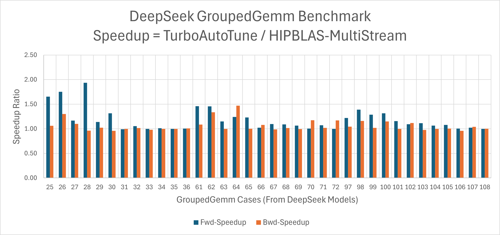
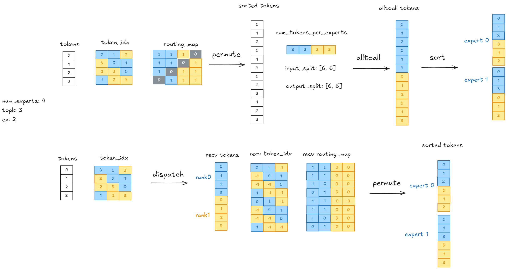
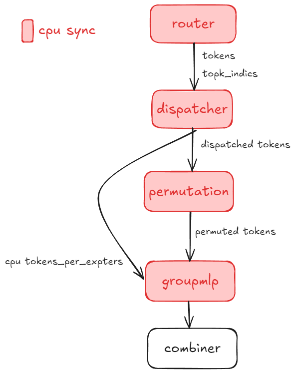
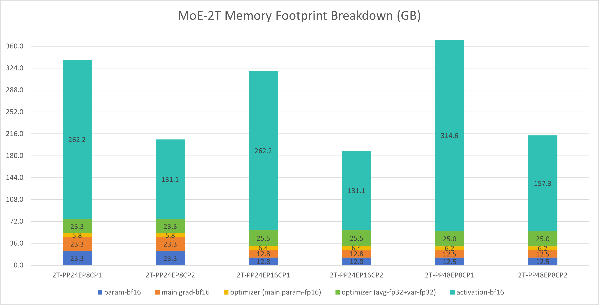
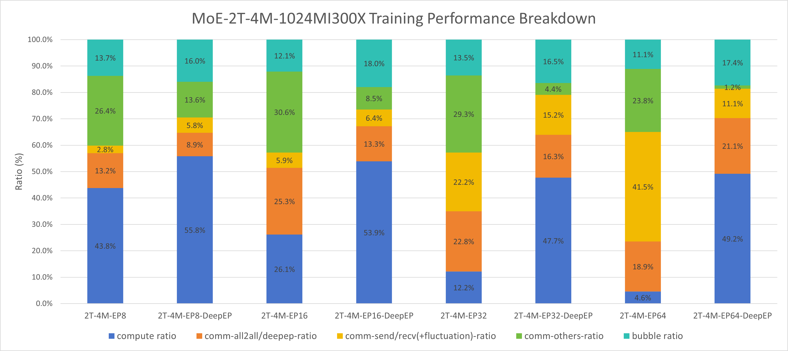
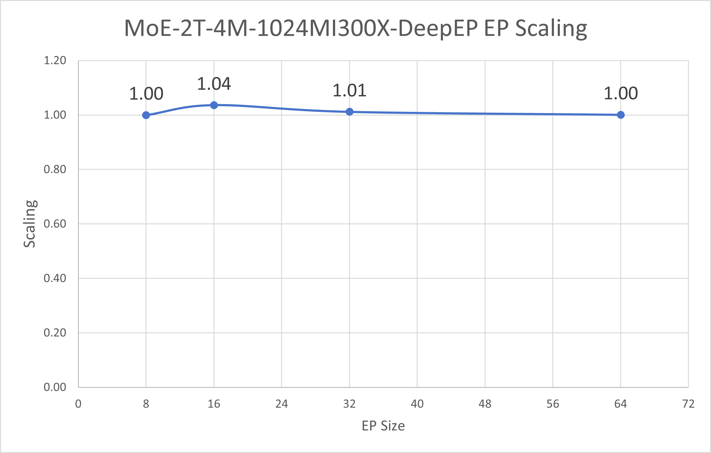

<!---
Copyright (c) 2025 Advanced Micro Devices, Inc. (AMD)

Permission is hereby granted, free of charge, to any person obtaining a copy
of this software and associated documentation files (the "Software"), to deal
in the Software without restriction, including without limitation the rights
to use, copy, modify, merge, publish, distribute, sublicense, and/or sell
copies of the Software, and to permit persons to whom the Software is
furnished to do so, subject to the following conditions:

The above copyright notice and this permission notice shall be included in all
copies or substantial portions of the Software.

THE SOFTWARE IS PROVIDED "AS IS", WITHOUT WARRANTY OF ANY KIND, EXPRESS OR
IMPLIED, INCLUDING BUT NOT LIMITED TO THE WARRANTIES OF MERCHANTABILITY,
FITNESS FOR A PARTICULAR PURPOSE AND NONINFRINGEMENT. IN NO EVENT SHALL THE
AUTHORS OR COPYRIGHT HOLDERS BE LIABLE FOR ANY CLAIM, DAMAGES OR OTHER
LIABILITY, WHETHER IN AN ACTION OF CONTRACT, TORT OR OTHERWISE, ARISING FROM,
OUT OF OR IN CONNECTION WITH THE SOFTWARE OR THE USE OR OTHER DEALINGS IN THE
SOFTWARE.
--->

# [MoE Training Best Practices on AMD GPU](https://rocm.blogs.amd.com/software-tools-optimization/primus-moe-package/README.html)

This blog covers best practices for training Mixture-of-Experts (MoE) models on AMD Instinct™ MI300/MI355-series<sup>[a]</sup> GPUs with the ROCm ecosystem. Whether you're new to MoE distributed architectures or optimizing trillion-parameter models, this guide will help you identify bottlenecks and maximize efficiency on AMD hardware.

You'll learn about:
- Large-scale sparse model distributed training strategies
- Key performance bottlenecks and how to diagnose them
- Practical optimization techniques for AMD platforms

All feature demonstrations and benchmarking results in this guide have been evaluated using Primus as the foundation. [Primus/Primus-LM](https://github.com/AMD-AGI/Primus) is a highly flexible and high-performance framework purpose-built for large-scale foundation model training and inference on AMD GPUs. As the training framework layer of the Primus ecosystem, Primus-LM collaborates with components such as [Primus-Turbo](https://github.com/AMD-AGI/Primus-Turbo/) (high-performance operators) and [Primus-SaFE](https://github.com/AMD-AGI/Primus-SaFE) (stability and compatibility infrastructure) to deliver a comprehensive, scalable, and production-ready solution for state-of-the-art large model development.

For more information, including configuration examples and advanced optimizations, please refer to the official [Primus documentation](https://rocm.docs.amd.com/en/latest/how-to/rocm-for-ai/training/benchmark-docker/primus-megatron.html)<sup>[b]</sup> and [GitHub repository](https://github.com/AMD-AGI/Primus).

---

## MoE Model Overview

Mixture of Experts (MoE) is an architecture that efficiently scales neural networks by routing inputs through specialized sub-models called "experts." Instead of activating the entire model for every input, a gating mechanism dynamically selects the most relevant experts, allowing only a fraction of the network to process each token.

**Key benefits:**
- **Large capacity with efficient compute**: Maintain billions of parameters while using only a subset during inference.
- **Specialized expertise**: Each expert learns to handle specific patterns in the data.
- **Cost-effective scaling**: Increase model size without proportionally increasing computation.

MoE models have proven highly effective in natural language processing and are increasingly used for massively scaled language models.

---

## Representative Models

Most modern open-source MoE models follow DeepSeek-style<sup>[c]</sup> architectures, ranging from 16B to 200B+ parameters. To evaluate how increasing scale impacts memory, performance, and optimization strategies, we also include 1T and 2T MoE models.

The configurations for these representative models are summarized in Table 1 below, which shows the total parameter count, active parameters, and corresponding configuration file names:

**Table 1: Representative MoE model configurations with parameter counts and configuration files**

| Model | Total Params | Active Params | Notes |
| --- | --- | --- | --- |
| DeepSeek-v2-Lite | 16B | 2.4B | `deepseek_v2_lite.yaml` |
| DeepSeek-v2 | 236B | 21B | `deepseek_v2.yaml` |
| MoE-1T | 1T | 44B | `moe_1T.yaml` |
| MoE-2T | 2T | 80B | `moe_2T.yaml` |

---

## Profiling and Analysis Workflow

To identify performance bottlenecks during MoE training, we recommend this workflow:

### Step 1: Torch Profiler

Torch Profiler provides comprehensive runtime traces that record operator execution times, memory consumption, and GPU utilization, enabling fine-grained visibility into your training workload. After generating a trace with Torch Profiler, you can load it into [https://ui.perfetto.dev/](https://ui.perfetto.dev/) for interactive timeline analysis. This web-based tool allows you to examine system-level bottlenecks—such as CPU/GPU overlap, kernel scheduling, kernel launch delays, and idle gaps—and to inspect the performance characteristics of individual kernels. For more systematic or in-depth analysis, especially when you need hierarchical breakdowns and optimization recommendations, you can further utilize AMD's TraceLens tool (introduced in the following section).

### Step 2: Detailed Bottleneck Analysis with TraceLens

[TraceLens](https://github.com/AMD-AGI/TraceLens/tree/main) is an AMD-developed Python tool that automates trace analysis and delivers actionable insights. Key features include:

- **Hierarchical Performance Breakdown**: Visualize bottlenecks from high-level GPU timelines down to individual operators
- **Roofline and Efficiency Analysis**: Assess operation efficiency (TFLOP/s, memory bandwidth) and identify compute vs. memory-bound kernels
- **Multi-GPU Communication Diagnostics**: Separate communication time from synchronization, highlighting collective operation bottlenecks
- **Trace Comparison & Diff**: Compare traces to measure optimization impact and identify regressions
- **Replay Generation**: Create minimal reproducers for targeted debugging and kernel verification
- **Simple API**: Get started quickly with ready-made scripts or extend it with a flexible Python interface

### Step 3: Memory Projection

[Memory projection](https://github.com/AMD-AGI/Primus/blob/main/primus/cli/subcommands/projection.py) provides comprehensive VRAM usage analysis across layers, optimizer states, and expert routing. This guides targeted adjustments to model structure, parallelization strategy, and memory optimizations for better scaling efficiency.

### Step 4: Pipeline Parallelism Visualization

Primus includes a built-in pipeline parallelism visualization tool [pp_vis](https://github.com/AMD-AGI/Primus/tree/main/tools/visualization/pp_vis) that helps diagnose pipeline-stage utilization across ranks. Use this tool to discover pipeline bubbles or imbalances that limit throughput.

---

## 4. Baseline Bottleneck Highlights

Unlike dense models, MoE training introduces unique challenges. The MoE layer juggles multiple experts and relies on routers to dispatch tokens dynamically. This complexity creates several performance pitfalls:

- **Grouped GEMM overhead**: Even with multi-stream tricks to overlap expert computations, timeline traces show noticeable gaps with room for improvement

- **All-to-all communication**: These collectives can consume a large chunk of runtime, especially when scaling beyond a single node with EP ≥ 8

- **CPU sync & launch delays**: Profiling often reveals large gaps between kernels caused by numerous small operations and CPU-side synchronizations that stall the launch queue

- **Too many small kernels**: MoE layers contain many fine-grained operators, which stress the kernel launch path and increase CPU overhead

- **Pipeline load imbalance**: Using `pp_vis`, we've identified cases where uneven work distribution across pipeline stages quietly degrades overall throughput

- **Memory pressure**: GPU memory is always constrained. Pushing too hard forces recomputation, burning extra FLOPs just to fit the model

---

## 5. Performance Optimizations

To address the MoE training bottlenecks above, we've developed the following optimizations:

### Feature 1: Turbo Grouped GEMM

**Description**: Primus-Turbo uses fused CK (Composable Kernel) grouped GEMM to process all experts in a single kernel launch, outperforming the traditional multi-stream approach that still suffers from scheduling overhead.

Primus-Turbo also supports selecting the fastest grouped GEMM backend for different kernels in forward and backward passes, further boosting performance.

As shown in Figure 1 below, we compared the performance of Primus-Turbo's optimized grouped GEMM implementation against the original multi-stream version on MI325x hardware. The results demonstrate significant speedup across different batch sizes and expert configurations:



**Figure 1: Grouped GEMM speedup comparison after Primus-Turbo autotune versus original multi-stream implementation (benchmarked on MI325x)**

---

### Feature 2: DeepEP<sup>[d]</sup> Acceleration

**Description**: DeepEP optimizes expert token dispatch by significantly reducing redundant cross-node data movement required by traditional all-to-all communication.

Key improvements:
- **GPU-based index calculation** instead of CPU-side coordination
- **Eliminates costly CPU-GPU synchronizations** for a fully sync-free pipeline
- **Higher scaling efficiency**, especially critical for large-scale, multi-node training

Built on open-source DeepEP and tuned for Primus, this solution accelerates dispatch and router operations while minimizing communication bottlenecks.

Figure 2 below illustrates the architectural differences between traditional AllToAll communication and DeepEP's optimized approach. The diagram shows how DeepEP minimizes redundant data transmission between GPUs by intelligently routing tokens to experts, reducing cross-node data movement and eliminating costly CPU-GPU synchronizations:



**Figure 2: DeepEP architecture showing optimized token routing to minimize redundant data transmission between GPUs**

---

### Feature 3: Sync-Free MoE

**Description**: The dynamic shapes in MoE (such as allocating device memory based on kernel results) can lead to device-to-host synchronization and significant CPU overhead. This increases device idle time and impacts training performance, especially when context parallelism is enabled.

We've eliminated all CPU synchronization throughout the MoE pipeline—from Router to Dispatcher, Permutation, and GroupMLP—reducing idle time.

Figure 3 below illustrates the sync-free MoE workflow, highlighting how compute and communication operations can proceed without CPU-GPU synchronization barriers. The diagram shows the optimized pipeline where Router, Dispatcher, Permutation, and GroupMLP stages operate in a fully asynchronous manner:



**Figure 3: Sync-Free MoE workflow showing asynchronous pipeline execution without CPU-GPU synchronization barriers**

Primus provides the `--turbo_sync_free_moe_stage` option with four levels (as detailed in Table 2 below):

**Table 2: Sync-Free MoE optimization levels showing progressive synchronization removal stages**

| Level | Value | Description |
|-------|-------|-------------|
| 0 | Default | **Disable** sync-free MoE (standard baseline implementation) |
| 1 | 1 | Remove synchronization for **Router** and **Permutation** |
| 2 | 2 | Remove synchronization for **Router**, **DeepEP**, and **GroupMLP** |
| 3 | 3 | Remove **all** MoE synchronization (full sync-free pipeline)<br>⚠️ **Warning:** This mode consumes significantly more GPU memory. Only use it if you have sufficient memory available. |

**Sync-Free related parameters in Primus-Megatron MoE:**

- **Router** (Level 1+):
  - `fused_group_topk_routing_with_aux_score`: Enable router fusion

- **Permutation** (Level 1+):
  - `moe_permutation_fusion`: Enable permutation fusion

- **DeepEP** (Level 2+):
  - `use_cuda_num_token_per_expert`: Return `num_tokens_per_experts` as a CUDA tensor
  - `num_worst_token`: Eliminate notify-dispatch CPU busy-wait

- **GroupMLP** (Level 2+):
  - `use_turbo_groupmlp`: Use Turbo's GroupMLP with CUDA `num_token_per_experts` parameter
  - `use_turbo_groupmlp_act`: Use Turbo's activation with CUDA `num_token_per_experts` parameter

---

### Feature 4: 1F1B A2A Overlap

**Description**: The 1F1B (1-Forward-1-Backward) a2a overlap scheduling optimizes both compute and communication resource utilization during MoE training.

Traditional approach: Communication for expert dispatch and aggregation (all-to-all or DeepEP) occurs sequentially with the forward/backward passes, leaving hardware idle.

**1F1B approach**: Interleaves communication for one micro-batch with the backward computation of the preceding micro-batch. While calculating backward gradients for micro-batch N-1, expert tokens for micro-batch N are already being communicated, reducing pipeline stalls. Specifically, one more forward pass is added in the warmup phase based on the vanilla interleaved-1f1b-pipeline parallelism so as to create independence between the forward pass and the subsequent backward pass in the steady 1f1b phase, keeping the same bubble rate and almost same peak memory. Then the computation and a2a communication can be overlapped between the adjacent forward pass and backward pass, contributing to the speedup of the 1f1b phase, which could be even faster by splitting the input gradient compute and the parameters gradient compute at larger scales where communication costs dominate.

As you can see in Figure 4 below, the diagram illustrates how compute and communication streams are overlapped in the 1F1B scheduling approach. The figure shows the timeline of forward passes, backward passes, and communication operations, demonstrating how communication for micro-batch N overlaps with the backward computation of micro-batch N-1:


**Figure 4: 1F1B A2A overlap scheduling showing interleaved communication and computation streams to reduce pipeline stalls**

---

### Feature 5: Arbitrary Pipeline Partition

**Description**: This feature allows custom or manual pipeline partitioning schemes instead of the default automatic partitioning. By specifying an explicit pipeline layout, you can finely control how model layers are divided across pipeline stages.

**Benefits**:
- Achieve an optimal balance between memory usage and compute efficiency
- Tailor partitioning to specific hardware setups or model architectures
- Minimize memory bottlenecks and achieve more even stage workloads
- Experiment with new partitioning strategies for large models

To use this feature, specify your desired partition pattern in the configuration, ensuring it reflects the target balance between computational resources and available memory per device.

---

### Feature 6: Recompute Selected Layers

**Description**: Recompute specific transformer layers to save activation memory without enabling full recomputation.

**Usage**:
```bash
--recompute_layer_ids 0,1,2,3
```

**Example**: Recomputes the first four transformer layers to save activation memory.

**Note**: Keep `RECOMPUTE_LAYERS` at `0` so this option remains the only recompute control.

---

### Feature 7: Loss Fusion Helper

**Description**: Modern LLMs often have massive vocabulary sizes, making loss computation memory-intensive. Loss fusion combines calculations into a single kernel, reducing both memory footprint and kernel overhead.

---

### Feature 8: CPU Launch Optimization

**Description**: In large-scale MoE training, CPU kernel launch efficiency is critical due to the high number of operators. We optimize this through:

**1. NUMA Binding**: Pins each GPU process to its associated NUMA socket for improved memory and compute access

**Usage**:
```bash
export ENABLE_NUMA_BINDING=1
```

This improves memory bandwidth utilization and training stability for large models.

**2. Increase HIP Kernel Argument Pool Size**: During MoE model training, a large number of operators require frequent kernel launches. If the HIP kernel launch argument pool size is insufficient, it can cause launch bottlenecks and stalls. To address this, we increase the kernel argument pool size to 12MB, which is sufficient to meet the requirements of most large-scale MoE model training workloads and helps ensure efficient and smooth kernel launches.

**Usage**:
```bash
export HSA_KERNARG_POOL_SIZE=12582912
```

---

### Feature 9: Manual GC Helper

**Description**: Forces periodic host garbage collection to mitigate long-running Python memory fragmentation on multi-day training runs.

In our experiments with large-scale MoE models, even with load balancing enabled, iteration time can fluctuate noticeably. Enabling manual GC effectively eliminates these jitters, leading to more stable and consistent training performance.

**Note**: All subsequent benchmarking results in this guide use manual GC enabled by default to ensure fair and reliable comparisons.

---

## Model-Specific Optimization Guide

This section provides practical guidance for optimizing different DeepSeek model variants on Primus/AMD MI-series hardware. Each subsection covers a specific model family with advice on configuration, baseline performance, bottleneck analysis, and advanced tuning.

---

### DeepSeek-V2-Lite Optimization

#### Overview and Configuration

[DeepSeek-V2-Lite](https://huggingface.co/deepseek-ai/DeepSeek-V2-Lite) is a memory and compute-efficient variant designed for high-throughput pretraining. Table 3 below provides the detailed model specifications:

**Table 3: DeepSeek-V2-Lite model specifications**

| Variant | Total Params | Active Params | Transformer Layers |
| --- | --- | --- | --- |
| DeepSeek-V2-Lite | 16B | 2.4B | 27 |

**Configuration files:**
- Model Config: [primus/configs/models/megatron/deepseek_v2_lite.yaml](https://github.com/AMD-AGI/Primus/blob/main/primus/configs/models/megatron/deepseek_v2_lite.yaml)
- Pretrain Script: [examples/moe_package/run_deepseek_v2_lite_pretrain_mi355x.sh](https://github.com/AMD-AGI/Primus/blob/main/examples/moe_package/run_deepseek_v2_lite_pretrain_mi355x.sh)

---

#### Baseline Performance Testing

AMD MI300X/MI355X series GPUs offer exceptionally large memory pools, making them ideal for scaling up micro-batch sizes (MBS) to maximize throughput and efficiency. Specifically, the MI300X features 192 GB of HBM3 memory per card with a peak memory bandwidth of approximately 5.325 TB/s, while the MI355X (part of the MI350 series) provides 288 GB of HBM3E memory per card with bandwidth up to 8 TB/s. The most effective way to leverage these substantial resources is to increase the micro-batch size (MBS).

**Scaling strategies:**
- **EP (Expert Parallel size)**: Enables scaling of individual expert models across devices
- **PP (Pipeline Parallelism)**: For models exceeding 180B, split the model to maximize memory savings

As shown in Figure 5 below, we evaluated the impact of increasing the micro-batch size (MBS) during DeepSeek-V2-Lite training on AMD **MI355X** hardware. The chart demonstrates a clear relationship between larger micro-batch sizes and improved throughput (tokens/s), while also showing the corresponding increase in GPU memory utilization:


**Figure 5: DeepSeek-V2-Lite MI355 batch size scaling showing throughput (tokens/s) and memory usage across different micro-batch sizes**

---

#### Performance Optimization

Our key optimization strategies for DeepSeek-V2-Lite on AMD MI-series hardware:

**1. Manual Garbage Collection (GC) for Performance Stability**

During MoE training, iteration time can fluctuate significantly due to memory allocation behavior. Manual garbage collection stabilizes the training process and reduces time variations. All subsequent benchmarks use manual GC enabled by default.

**2. Loss Fusion to Optimize Memory Footprint**

With extremely large vocabulary sizes, loss computation becomes memory-intensive. Loss fusion reduces memory usage for this phase while improving overall end-to-end throughput.

**3. DeepEP Optimization for AllToAll Communication**

AllToAll-based inter-device communication is a critical bottleneck as token traffic and expert parallelism scale up. DeepEP optimization reduces redundant token data transfer, increases efficiency, and significantly improves training performance.

**4. Sync-Free Mode to Resolve CPU D2H Synchronization Overheads**

Profiling shows that CPU device-to-host (D2H) synchronizations in MoE layers induce large kernel launch latencies, preventing effective overlapping of communication and computation. Sync-free mode eliminates these synchronizations, resulting in well-overlapped, higher-performance kernel launches.

**5. NUMA Binding for Improved CPU Affinity and Memory Access**

On multi-socket (NUMA) systems, poor CPU thread placement degrades throughput. NUMA binding ensures better CPU affinity, reduces memory latency, and boosts pipeline scheduling efficiency.

**6. Micro-Batch Size (MBS) Scaling via Memory Savings**

The combined optimizations above reduced peak memory usage from **99.79%** to **84.28%** for MBS=12 training runs. This memory headroom allows increasing micro-batch size to 14, unlocking additional throughput improvements and maximizing hardware utilization.

---

#### Results<sup>[1]</sup>

Figure 6 below presents the cumulative impact of each optimization feature on DeepSeek-V2-Lite training performance on **MI355X** hardware. The chart displays both the absolute throughput (tokens/s) achieved after applying each optimization and the corresponding speedup relative to the baseline configuration:


**Figure 6: DeepSeek-V2-Lite MI355 optimization results showing cumulative throughput (tokens/s) and speedup relative to baseline**

---

### DeepSeek-V2 Optimization

#### Overview and Configuration

[DeepSeek-V2](https://huggingface.co/deepseek-ai/DeepSeek-V2) models scale up in size and complexity, optimized for maximum parallel throughput on MI-series hardware. Table 4 below provides the detailed model specifications:

**Table 4: DeepSeek-V2 model specifications**

| Variant | Total Params | Active Params | Transformer Layers |
| --- | --- | --- | --- |
| DeepSeek-V2 | 236B | 21B | 60 |

**Configuration files:**
- Model Config: [primus/configs/models/megatron/deepseek_v2.yaml](https://github.com/AMD-AGI/Primus/blob/main/primus/configs/models/megatron/deepseek_v2.yaml)
- Pretrain Script: [examples/moe_package/run_deepseek_v2_pretrain_mi355x.sh](https://github.com/AMD-AGI/Primus/blob/main/examples/moe_package/run_deepseek_v2_pretrain_mi355x.sh)

---

#### Performance Optimization

Our key optimization strategies for DeepSeek-V2:

1. **Manual Garbage Collection (GC)** for performance stability
2. **Loss Fusion** to optimize memory footprint
3. **DeepEP Optimization** for AllToAll communication
4. **NUMA Binding** for improved CPU affinity and memory access
5. **Sync-Free Mode** to resolve CPU D2H synchronization overheads
6. **Interleaved Pipeline Parallelism (Interleaved PP)** to reduce pipeline bubble ratio

**Note**: We observed that enabling VPP (Virtual Pipeline Parallelism) further enhances the effectiveness of sync-free mode.

---

#### Results<sup>[2]</sup>

Figure 7 below presents the cumulative impact of each optimization feature on DeepSeek-V2 training performance on **MI355X** hardware. The chart displays both the absolute throughput (tokens/s) achieved after applying each optimization and the corresponding speedup relative to the baseline configuration:


**Figure 7: DeepSeek-V2 MI355 optimization results showing cumulative throughput (tokens/s) and speedup relative to baseline**

---

#### Future Optimization Directions

- Explore deeper fusion between permute operations and DeepEP kernels
- Investigate more effective scheduling to further overlap communication and computation
- Continue tuning pipeline partition and recompute strategies for larger model fits

---

### Optimizing 1 Trillion+ Parameter Models

#### Overview and Configuration

Models exceeding 1 trillion parameters push the boundaries of distributed training. Configuration typically requires combining all advanced parallelism and memory optimization techniques. Table 5 below provides the specifications for our ultra-large models:

**Table 5: 1T+ parameter MoE model specifications**

| Variant | Total Params | Active Params | Transformer Layers |
| --- | --- | --- | --- |
| MoE-1T | 1T | 44B | 96 |
| MoE-2T | 2T | 80B | 96 |

**Configuration files:**
- `primus/configs/models/megatron/moe_1T.yaml`
- `primus/configs/models/megatron/moe_2T.yaml`

---

#### Memory Projection

Memory projection is crucial when training ultra-large models. Without careful analysis, you can waste significant time adjusting model architecture or distributed training strategies just to fit the model in GPU memory.

We simulated distributed training of 1T and 2T parameter models on a 1024-GPU cluster, breaking down memory footprint across: model parameters, gradients, activations, optimizer states, and main param/grad used in mixed precision training.

**Key finding**: Unlike smaller models, ultra-large models have memory consumption dominated by activations.

---

**1T Model, 768 GPUs – Memory Usage Analysis**

Key observations:
- **Activations are the largest memory consumer**
  - Enabling CP2 (context parallelism) reduces activation memory by about half, saving ~76GB per GPU
  - However, aggressive checkpointing may hurt performance
- **Increasing EP** (8→16) doesn't significantly lower memory but adds all-to-all communication time
- **Raising PP** (24→48) doesn't substantially reduce memory; instead, it increases pipeline bubbles and activation memory

**Conclusions:**
- **MI300X optimal config**: PP24 EP8 CP2
- **MI355X optimal config**: PP24 EP8 (no checkpointing needed)

As shown in Figure 8 below, we present a detailed memory usage breakdown for the 1T model across different parallelism configurations on 768 GPUs. The chart shows memory consumption categorized by model parameters, gradients, activations, optimizer states, and mixed precision training overhead. This analysis clearly demonstrates that activations dominate memory usage and that context parallelism (CP2) provides the most effective memory savings:


**Figure 8: 1T model memory projection showing memory usage breakdown across different parallelism configurations on 768 GPUs**

---

**2T Model, 768 GPUs – Memory Usage Analysis**

Key observations:
- **Activations again dominate memory usage**
  - Enabling CP2 halves activation memory, saving ~131GB per GPU
  - Performance trade-offs may apply
- **With CP2**, EP8 doesn't fit on MI300X but works on MI355X
- **Increasing EP** (8→16) doesn't reduce memory, only adds all-to-all communication time
- **Increasing PP** (24→48) doesn't help with memory, but increases pipeline bubbles and activation memory

**Conclusions:**
- **MI300X optimal config**: PP24 EP16 CP2
- **MI355X optimal config**: PP24 EP8 CP2 (benefits from larger DP sizes)

As shown in Figure 9 below, we present a detailed memory usage breakdown for the 2T model across different parallelism configurations on 768 GPUs. Similar to the 1T model, the chart categorizes memory consumption by model parameters, gradients, activations, optimizer states, and mixed precision training overhead. The analysis demonstrates that activations remain the primary memory consumer, and context parallelism (CP2) continues to provide substantial memory savings even at this larger scale:



**Figure 9: 2T model memory projection showing memory usage breakdown across different parallelism configurations on 768 GPUs**

---

#### Pipeline Bubble Projection and Insights

When scaling to many machines, the global batch size is often constrained, meaning each iteration contains fewer microbatches (lower gradient accumulation, or GA). In pipeline parallelism, this leads to higher pipeline bubble ratios, degrading training efficiency.

**Solution**: Interleaved pipeline parallelism (Interleaved PP) significantly reduces bubbles and maintains efficiency.

**Example calculation:**

Suppose we have 64 nodes with the configuration: PP=16, EP=8, global tokens=2M, microbatch size=1.

Effective GA:

$$
GA = \frac{2M\ \text{tokens}}{4096\ \text{seq}} \div \left(\frac{64 \times 8}{16}\right) \div 1 = 16
$$

With vanilla pipeline parallelism (VPP=1), bubble ratio:

$$
\text{bubble ratio} = \frac{PP-1}{PP-1 + GA \times VPP} = \frac{16-1}{16-1+16 \times 1} \approx 48.43\%
$$

With interleaved pipeline (VPP=6), bubble ratio:

$$
\text{bubble ratio} = \frac{15}{15+16 \times 6} \approx 13.51\%
$$

This is a substantial reduction. We verified these calculations on a 64-node setup, and measured bubble ratios that closely matched the theoretical estimates. As shown in Figure 10 below, the chart compares the measured pipeline bubble ratios for different Virtual Pipeline Parallelism (VPP) configurations against the theoretical predictions. The results demonstrate excellent agreement between theory and practice, confirming that interleaved pipeline parallelism effectively reduces bubble overhead:


**Figure 10: Pipeline bubble ratio comparison between theoretical and measured values for different VPP configurations on 64-node setup**

**Summary**: Interleaved pipeline parallelism (VPP) effectively mitigates pipeline bubble overheads at large scales, preserving computational efficiency for ultra-scale training.

---

#### Optimizing Inter-Node Token Dispatch and Combine

In our studies, as EP (Expert Parallelism) increases, training scalability degrades rapidly. Through detailed profiling, we discovered that all-to-all communication accounts for **25%–30%** of total training time.

**Solution**: DeepEP optimization significantly improves communication efficiency and ensures good EP scaling performance.

**Experiment**: 2T model on 1024 MI300X GPUs, comparing AllToAll vs. DeepEP across different EP sizes.

**Results:**
- As EP increases, AllToAll performance drops sharply
- DeepEP demonstrates much better scalability and maintains nearly flat performance
- End-to-end, DeepEP delivers **1.05× to 7.66×** speedup over AllToAll

---

Figure 11 below presents a detailed time breakdown comparison between AllToAll and DeepEP communication strategies across different Expert Parallelism (EP) configurations on the 2T model with 1024 MI300X GPUs. The chart illustrates how DeepEP significantly reduces communication overhead as EP scales, maintaining more consistent performance compared to the traditional AllToAll approach:



**Figure 11: Time breakdown comparing AllToAll vs DeepEP communication strategies showing reduced communication overhead with DeepEP**

---

Figure 12 below demonstrates the end-to-end scalability of DeepEP across different EP configurations. The chart shows how DeepEP maintains strong performance scaling as Expert Parallelism increases, in stark contrast to AllToAll communication which degrades significantly:



**Figure 12: End-to-end EP scaling comparison demonstrating DeepEP's superior scalability across different Expert Parallelism configurations**

---

#### Other MoE Optimizations

**1F1B A2A Overlap**: In ultra-large models, One-Forward-One-Backward overlapping further hides communication overhead and improves throughput. By interleaving forward and backward passes, communication and computation proceed concurrently, reducing idle time. More details and corresponding experiments of popular LLMs like DeepSeek-V3 will be published in a tech blog soon.

**Fine-grained PP Partition Adjustment**: Carefully tuning pipeline parallel (PP) splits enables more balanced workload distribution, minimizing pipeline bubbles and waiting time between stages for smoother execution.

**Selective Recomputation**: Only specific pipeline stages perform recomputation rather than having every virtual pipeline parallel (VPP) stage recompute identical layers, reducing redundant work and boosting performance.

---

## Summary
This blog summarizes best practices for training MoE models on AMD GPUs. It covers a range of optimization strategies that can be applied during MoE training, including communication and pipeline parallelism improvements. Comprehensive performance analysis and benchmarking are provided for both common MoE models and two ultra-large models exceeding 1 trillion parameters. These practical guidelines are informed by real experimental results, ensuring their effectiveness in real-world scenarios. We believe these insights can help users achieve optimal performance when training MoE models on AMD GPU platforms.

---

## Acknowledgments

We would like to express our sincere gratitude to the following teams and individuals for their invaluable contributions and collaboration, their expertise and support have been instrumental in advancing the progress of this project.

**composable_kernel(CK) Team:**
Thomas Ning, Sami Remes, Shyh-Chyi Lin, Aviral Goel

**aiter Team:**
Curlas Huang, Shengnan Xu, Jim Guo, Dan Yao

**AIG-Models Team:**
Arthur Huang, Dong Li

**ROCm/DeepEP Team:**
Amir Akbarzadeh, Li Li

**rocSHMEM Team:**
Aurelien Bouteiller, Edgar Gabriel

**mori Team:**
Di Tian, Yutong Wu

---

## References

a. [AMD Instinct™ MI355X GPUs](https://www.amd.com/en/products/accelerators/instinct/mi350/mi355x.html): Official product page for the AMD MI355X accelerator cards used in all experiments in this guide.

b. [Megatron-LM](https://github.com/NVIDIA/Megatron-LM): Widely used framework for large-scale Transformer model training and MoE implementation, serving as a benchmark and comparison baseline.

c. [DeepSeek Hugging Face Model Definitions](https://huggingface.co/deepseek-ai): Pretrained DeepSeek models and associated configuration files.

d. [DeepEP Open Source Repository](https://github.com/deepseek-ai/DeepEP): High-performance open source MoE implementation, source code, and documentation for DeepEP.

---

## Endnotes

[1] Test Environment

DeepSeek-V2-Lite pretraining throughput (tokens/second/GPU) was tested with BF16 precision on a single MI355X node with a maximum sequence length of 4096 tokens. Server manufacturers may vary configurations, which can yield different results. Performance may also vary based on the use of the latest drivers and optimizations.

**AMD system configuration:**
- Dual AMD EPYC 9575F 64-core processor
- 8× AMD Instinct MI355X GPUs
- 2 NUMA nodes per socket
- Host OS: Ubuntu 22.04.5 LTS with Linux kernel 6.8.0-87-generic
- Host GPU driver: ROCm 7.1 + amdgpu 6.16.6
- VBIOS version: 00156977
- PyTorch 2.9.0
- AMD ROCm 7.1.0 software


[2] Test Environment

DeepSeek-V2 pretraining throughput (tokens/second/GPU) was tested with BF16 precision on 4 MI355X nodes (32 GPUs total) using a maximum sequence length of 4096 tokens. Server manufacturers may vary configurations, which can yield different results. Performance may also vary based on the use of the latest drivers and optimizations.

**AMD system configuration:**
- Dual AMD EPYC 9575F 64-core processor
- 32× AMD Instinct MI355X GPUs
- 2 NUMA nodes per socket
- Host OS: Ubuntu 22.04.5 LTS with Linux kernel 6.8.0-87-generic
- Host GPU driver: ROCm 7.1 + amdgpu 6.16.6
- VBIOS version: 00156977
- PyTorch 2.9.0
- AMD ROCm 7.1.0 software

---

## Disclaimers

Third-party content is licensed to you directly by the third party that owns the
content and is not licensed to you by AMD. ALL LINKED THIRD-PARTY CONTENT IS
PROVIDED “AS IS” WITHOUT A WARRANTY OF ANY KIND. USE OF SUCH THIRD-PARTY CONTENT
IS DONE AT YOUR SOLE DISCRETION AND UNDER NO CIRCUMSTANCES WILL AMD BE LIABLE TO
YOU FOR ANY THIRD-PARTY CONTENT. YOU ASSUME ALL RISK AND ARE SOLELY RESPONSIBLE
FOR ANY DAMAGES THAT MAY ARISE FROM YOUR USE OF THIRD-PARTY CONTENT.
