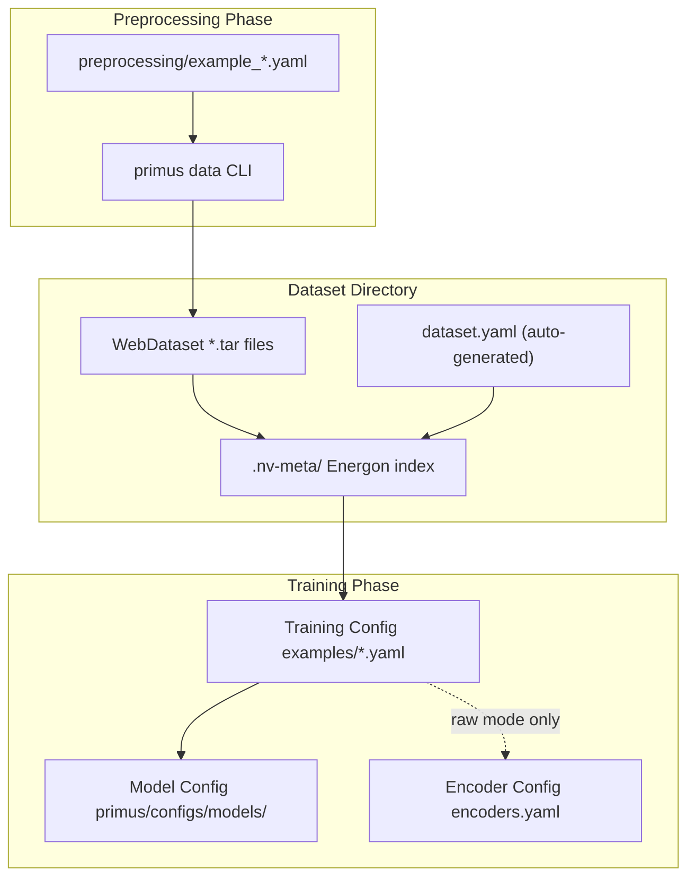

# Diffusion Data Configuration Guide

This directory contains configuration files for preparing and organizing datasets for Megatron-based diffusion model training in Primus.

## Directory Structure

```
primus/configs/data/megatron/diffusion/
├── README.md                    # This file
├── templates/                   # Dataset YAML templates
│   ├── dataset_preencoded.yaml  # Pre-encoded dataset configuration
│   ├── dataset_preencoded_numpy.yaml # Pre-encoded NumPy/MLPerf dataset configuration
│   ├── dataset_raw.yaml         # Raw dataset configuration
│   └── metadataset.yaml         # Multi-dataset mixing configuration
└── preprocessing/               # CLI preprocessing configuration examples
    ├── quickstart_pokemon.yaml  # Minimal quickstart (small HuggingFace dataset)
    ├── example_base.yaml        # Comprehensive example with all options
    ├── example_huggingface.yaml # HuggingFace dataset example
    ├── example_directory.yaml   # Local directory example
    ├── example_webdataset.yaml  # WebDataset input example
    ├── text_to_image_2m_10k.yaml # 10K subset of text-to-image-2M (1024px)
    └── mlperf_flux1.yaml        # MLPerf Flux1 streaming ingest configuration
```

## Quick Reference

### What Goes Where?

| File Type | Location | Purpose | When to Use |
|-----------|----------|---------|-------------|
| **Dataset Templates** | `templates/` | Define dataset structure | Auto-applied during finalization (or manually copy if using `--no-finalize`) |
| **Preprocessing Configs** | `preprocessing/` | Configure data preparation | Pass to `primus data` CLI commands |
| **Model Configs** | `primus/configs/models/` | Define model architecture | Reference in training configs |
| **Training Configs** | `examples/megatron/configs/MI300X/diffusion/` | Configure training runs | Main config for training scripts |
| **MLPerf Ingest Configs** | `preprocessing/` | Configure MLPerf streaming ingest | Pass to `primus data diffusion-ingest` |
| **Path Override** | Command line | Customize output location | Add `--output-dir /your/path` to any command |
| **Skip Finalize** | Command line | Skip automatic dataset setup | Add `--no-finalize` flag to skip finalization |

**Tip**: Finalization (creating `dataset.yaml`, running `energon prepare`, validation) runs automatically by default. Use `--no-finalize` to skip it.

---

## Docker Volume Mounting and Data Paths

When using `primus-cli direct --` commands inside containers, understanding Docker volume mounts is important for data persistence.

### Default Docker Setup

From [`tools/docker/start_container.sh`](../../../../tools/docker/start_container.sh):
```bash
DATA_PATH=${DATA_PATH:-"${PRIMUS_PATH}/data"}  # Default: ./data relative to repo
# Mounted as: -v "${DATA_PATH}:${DATA_PATH}"
```

**What this means:**
- **Default mount**: `<repo>/data` on host → `<repo>/data` (or `/workspace/Primus/data`) in container
- **Config file paths**: Use `/workspace/Primus/data/...` by default
- **Result**: Data automatically persists to your host machine's `data/` directory

### Using Default Paths (Recommended)

Config files already use the correct paths. Finalization runs automatically:

```bash
# Single command - data preparation + finalization + validation!
primus-cli direct -- data diffusion-encoded \
  --config primus/configs/data/megatron/diffusion/preprocessing/example_huggingface.yaml \
  --hf-token-file /path/to/.hf_token

# Data is saved to: /workspace/Primus/data/encoded_pokemon/ (persisted to host)
# Dataset is automatically indexed, validated, and ready for training!
```

Automatic finalization:
- Creates `.nv-meta/dataset.yaml` with `CrudeWebdataset` configuration
- Runs `energon prepare` to index the dataset
- Validates with Primus's custom validation (metadata, sample counts, API spot-check)
- No manual post-processing needed

### Easy Path Override

**Override any path using `--output-dir` flag:**

```bash
# Customize output location
primus-cli direct -- data diffusion-encoded \
  --config primus/configs/data/megatron/diffusion/preprocessing/example_huggingface.yaml \
  --hf-token-file /path/to/.hf_token \
  --output-dir /workspace/Primus/data/my_custom_output

# Or use a different mounted volume
primus-cli direct -- data diffusion-encoded \
  --config primus/configs/data/megatron/diffusion/preprocessing/example_huggingface.yaml \
  --hf-token-file /path/to/.hf_token \
  --output-dir /mnt/shared_storage/datasets/encoded
```

### Advanced: Using /data Paths

If you prefer to use `/data/...` paths (as shown in some examples):

```bash
# Set DATA_PATH before starting container
export DATA_PATH=/data

# Then start/restart container with new mount
# Now all /data/... paths will work as written
```

### Quick Comparison

| Approach | Command | Persistence | Notes |
|----------|---------|-------------|-------|
| **Default** | Use config as-is | ✅ Yes | Easiest, works immediately |
| **Override** | Add `--output-dir /path` | ✅ Yes (if path is mounted) | Flexible, per-command |
| **DATA_PATH** | `export DATA_PATH=/data` | ✅ Yes | Cleaner paths, requires setup |

---

## Dataset Templates (`templates/`)

These files define how Energon loads and processes your prepared datasets. With automatic finalization (the default), these templates are applied automatically -- you only need them for manual workflows or customization.

### [`dataset_preencoded.yaml`](templates/dataset_preencoded.yaml)

**Purpose**: Configure a pre-encoded dataset (contains VAE latents and text embeddings).

**When to use**: Production training (2-3x faster than raw mode).

**Usage** (automatic finalization handles steps 2-3):
```bash
# Single command -- finalization is automatic:
primus-cli direct -- data diffusion-encoded \
  --source-type directory \
  --input-dir /data/raw_images \
  --output-dir /workspace/Primus/data/encoded_dataset \
  --hf-token-file /path/to/.hf_token

# Use in training config:
# data:
#   dataset_path: /workspace/Primus/data/encoded_dataset

# Manual workflow (if using --no-finalize):
# 1. Copy template: cp templates/dataset_preencoded.yaml <output>/.nv-meta/dataset.yaml
# 2. Run indexing: energon prepare <output> --num-workers 8
```

### [`dataset_raw.yaml`](templates/dataset_raw.yaml)

**Purpose**: Configure a raw dataset (contains original images and captions).

**When to use**: Experimentation, rapid prototyping, when disk space is limited.

**Usage** (automatic finalization handles steps 2-3):
```bash
# Single command -- finalization is automatic:
primus-cli direct -- data diffusion-raw \
  --source-type directory \
  --input-dir /data/raw_images \
  --output-dir /workspace/Primus/data/raw_dataset

# Use in training config with encoder configs:
# data:
#   dataset_path: /workspace/Primus/data/raw_dataset
#   encoder_configs:
#     vae: {...}
#     t5: {...}
#     clip: {...}
```

### [`dataset_preencoded_numpy.yaml`](templates/dataset_preencoded_numpy.yaml)

**Purpose**: Configure an MLPerf pre-encoded numpy dataset (bfloat16 tensors stored as NumPy uint16 bytes).

**When to use**: Training with MLPerf Flux1 pre-encoded data ingested via `diffusion-ingest`.

**Sample keys**: `t5.bytes`, `clip.bytes`, `mean.bytes`, `logvar.bytes`, `.json`

**Usage**: Applied automatically by `diffusion-ingest` finalization. For manual use:
```bash
cp templates/dataset_preencoded_numpy.yaml <output>/.nv-meta/dataset.yaml
energon prepare <output> --num-workers 8
```

### [`metadataset.yaml`](templates/metadataset.yaml)

**Purpose**: Combine multiple datasets with different weights.

**When to use**:
- Mixing pre-encoded and raw datasets
- Combining multiple data sources
- Creating weighted train/val splits

**Usage**:
```bash
# 1. Prepare individual datasets first (pre-encoded and/or raw)

# 2. Copy and customize metadataset template
cp primus/configs/data/megatron/diffusion/templates/metadataset.yaml \
   /workspace/Primus/data/combined_dataset.yaml

# 3. Edit paths in combined_dataset.yaml to point to your datasets

# 4. Use in training config
# data:
#   dataset_path: /workspace/Primus/data/combined_dataset.yaml
```

---

## Preprocessing Configs (`preprocessing/`)

These files are passed to the `primus data` CLI commands to configure dataset preparation. They are **NOT copied to dataset directories**.

### [`quickstart_pokemon.yaml`](preprocessing/quickstart_pokemon.yaml)

**Purpose**: Minimal quickstart config for the Pokemon dataset (256px).

**Usage**:
```bash
primus-cli direct -- data diffusion-encoded \
  --config primus/configs/data/megatron/diffusion/preprocessing/quickstart_pokemon.yaml \
  --hf-token-file /path/to/.hf_token
```

### [`example_base.yaml`](preprocessing/example_base.yaml)

**Purpose**: Comprehensive example showing all available preprocessing options.

**Contents**: All configuration sections with inline documentation.

**Usage**:
```bash
primus-cli direct -- data diffusion-encoded \
  --config primus/configs/data/megatron/diffusion/preprocessing/example_base.yaml \
  --hf-token-file /path/to/.hf_token
```

### [`example_huggingface.yaml`](preprocessing/example_huggingface.yaml)

**Purpose**: Prepare a dataset from HuggingFace Hub.

**Usage**:
```bash
primus-cli direct -- data diffusion-encoded \
  --config primus/configs/data/megatron/diffusion/preprocessing/example_huggingface.yaml \
  --hf-token-file /path/to/.hf_token
```

### [`example_directory.yaml`](preprocessing/example_directory.yaml)

**Purpose**: Prepare a dataset from a local directory of images and captions.

**Usage**:
```bash
primus-cli direct -- data diffusion-encoded \
  --config primus/configs/data/megatron/diffusion/preprocessing/example_directory.yaml \
  --hf-token-file /path/to/.hf_token
```

### [`example_webdataset.yaml`](preprocessing/example_webdataset.yaml)

**Purpose**: Prepare a dataset from existing WebDataset tar files.

**Usage**:
```bash
primus-cli direct -- data diffusion-encoded \
  --config primus/configs/data/megatron/diffusion/preprocessing/example_webdataset.yaml \
  --hf-token-file /path/to/.hf_token
```

### [`text_to_image_2m_10k.yaml`](preprocessing/text_to_image_2m_10k.yaml)

**Purpose**: Prepare the 10K high-resolution subset (1024x1024) from the text-to-image-2M dataset.

**Usage**:
```bash
primus-cli direct -- data diffusion-encoded \
  --config primus/configs/data/megatron/diffusion/preprocessing/text_to_image_2m_10k.yaml \
  --hf-token-file /path/to/.hf_token
```

### [`mlperf_flux1.yaml`](preprocessing/mlperf_flux1.yaml)

**Purpose**: MLPerf Flux1 streaming ingest -- downloads pre-encoded Arrow files from MLCommons R2 and converts to Energon WebDataset tar shards.

**Datasets**: CC12M (train) and COCO (val), plus empty encodings for CFG dropout.

**Usage**:
```bash
primus-cli direct -- data diffusion-ingest \
  --config primus/configs/data/megatron/diffusion/preprocessing/mlperf_flux1.yaml

# Limit files for testing:
primus-cli direct -- data diffusion-ingest \
  --config primus/configs/data/megatron/diffusion/preprocessing/mlperf_flux1.yaml \
  --max-files 5
```

Note: `--hf-token-file` is only required when downloading gated models from HuggingFace (e.g., the default FLUX.1-dev). If using local encoder paths via `--model-path`, it can be omitted.

---

## Path Configuration Patterns

### Pattern 1: Default (Recommended)

Use config file paths as-is -- they work out of the box:

```bash
primus-cli direct -- data diffusion-encoded \
  --config primus/configs/data/megatron/diffusion/preprocessing/example_huggingface.yaml \
  --hf-token-file /path/to/.hf_token

# Output automatically goes to: /workspace/Primus/data/encoded_pokemon
# This persists to: <your-repo>/data/encoded_pokemon on host
```

### Pattern 2: Custom Path Override (Flexible)

Override output location for any command:

```bash
primus-cli direct -- data diffusion-encoded \
  --config primus/configs/data/megatron/diffusion/preprocessing/example_huggingface.yaml \
  --hf-token-file /path/to/.hf_token \
  --output-dir /workspace/Primus/data/custom_output

# Or use a different mounted volume
primus-cli direct -- data diffusion-encoded \
  --config primus/configs/data/megatron/diffusion/preprocessing/example_huggingface.yaml \
  --hf-token-file /path/to/.hf_token \
  --output-dir /mnt/shared_storage/datasets
```

### Pattern 3: DATA_PATH Environment Variable (Advanced)

Set `DATA_PATH` for cleaner paths:

```bash
# Before starting container
export DATA_PATH=/data

# Start/restart container (mounts /data)
# Now configs using /data/... will work as written
primus-cli direct -- data diffusion-encoded \
  --config primus/configs/data/megatron/diffusion/preprocessing/example_huggingface.yaml \
  --hf-token-file /path/to/.hf_token
```

### Verification

Check where your data was written:

```bash
# For default paths
ls -lh /workspace/Primus/data/encoded_pokemon/

# On host machine
ls -lh <your-repo>/data/encoded_pokemon/

# For custom paths
ls -lh /your/custom/path/
```

---

## Complete Workflow

### Pre-encoded Mode (Recommended for Production)

```bash
# Step 1: Prepare, finalize, and validate dataset (all automatic)
primus-cli direct -- data diffusion-encoded \
  --config primus/configs/data/megatron/diffusion/preprocessing/example_huggingface.yaml \
  --hf-token-file /path/to/.hf_token

# Output: /workspace/Primus/data/encoded_pokemon (persisted to host)
# Finalization (dataset.yaml + energon prepare + validation) runs automatically.

# Step 2: Configure training
# Edit examples/megatron/configs/MI300X/diffusion/flux_535m_pretrain.yaml:
# data:
#   dataset_path: /workspace/Primus/data/encoded_pokemon

# Step 3: Train
EXP=examples/megatron/configs/MI300X/diffusion/flux_535m_pretrain.yaml \
  bash examples/run_pretrain.sh
```

### Raw Mode (On-the-fly Encoding)

```bash
# Step 1: Prepare, finalize, and validate dataset (all automatic)
primus-cli direct -- data diffusion-raw \
  --config primus/configs/data/megatron/diffusion/preprocessing/example_directory.yaml

# Output: /workspace/Primus/data/raw_dataset (persisted to host)

# Step 2: Configure training with encoders
# Edit examples/megatron/configs/MI300X/diffusion/flux_535m_pretrain.yaml:
# data:
#   dataset_path: /workspace/Primus/data/raw_dataset
#   encoder_configs:
#     vae: { model_path: black-forest-labs/FLUX.1-dev, ... }
#     t5: { model_path: black-forest-labs/FLUX.1-dev, ... }
#     clip: { model_path: black-forest-labs/FLUX.1-dev, ... }

# Step 3: Train
EXP=examples/megatron/configs/MI300X/diffusion/flux_535m_pretrain.yaml \
  bash examples/run_pretrain.sh
```

### MLPerf Ingest Mode (Streaming Download + Conversion)

```bash
# Step 1: Download and convert MLPerf Arrow data to Energon WebDataset
# Downloads ~1.2 TB of pre-encoded data with minimal temporary disk usage.
primus-cli direct -- data diffusion-ingest \
  --config primus/configs/data/megatron/diffusion/preprocessing/mlperf_flux1.yaml

# Output: /workspace/Primus/data/mlperf_flux1/ (persisted to host)
# Finalization (dataset.yaml + energon prepare + validation) runs automatically.
# Pipeline supports resume -- re-run the same command to continue after interruption.

# Step 2: Point the training config at the prepared data.
# The MLPerf reproduction configs already set the required VAE normalization
# (vae_latent_mode: resample, vae_scale: 0.3611, vae_shift: 0.1159); just set
# data_path (or the PRIMUS_DIFFUSION_DATA_PATH env var) to /workspace/Primus/data/mlperf_flux1.

# Step 3: Train (MLPerf benchmark reproduction)
EXP=examples/megatron/configs/MI355X/diffusion/flux_12b_ddp_energon_schnell_resample_local_spec_fp8_mlperf.yaml \
  bash examples/run_pretrain.sh
```

**Output directory structure:**
```
mlperf_flux1/
├── train/              # CC12M shards (shard_000000.tar, ...)
├── val/                # COCO shards
├── empty_encodings/    # empty_t5_encodings.npy, empty_clip_encodings.npy
└── .nv-meta/           # Energon index + dataset.yaml (auto-generated)
```

**Pipeline features:**
- Parallel downloads with configurable worker threads (`max_workers`)
- Bounded disk usage via semaphore (`prefetch_depth` Arrow files on disk at once)
- Automatic retry with exponential backoff for HTTP 429/503 and MD5 mismatches
- Resume support -- re-run to skip already-completed shards
- Skip-and-log for individual file failures (`failed_files.json`)

---

## Configuration Hierarchy

Understanding how different configs relate to each other:



### Key Points:

1. **Preprocessing configs** -- Used once during data preparation
2. **Dataset templates** -- Auto-applied during finalization (or manually copied if using `--no-finalize`)
3. **Training configs** -- Main config file that references dataset path
4. **Model configs** -- Define architecture, referenced by training configs
5. **Encoder configs** -- Only needed for raw (on-the-fly) mode

---

## Common Patterns

### Pattern 1: Single Pre-encoded Dataset

```yaml
# Training config
data:
  dataset_path: /workspace/Primus/data/my_dataset/dataset.yaml  # Points to dataset_preencoded.yaml copy
  micro_batch_size: 2
  global_batch_size: 16
```

### Pattern 2: Mixed Pre-encoded + Raw

```yaml
# Copy and customize templates/metadataset.yaml
data:
  dataset_path: /workspace/Primus/data/mixed_dataset.yaml  # Points to customized metadataset.yaml
  encoder_configs:  # Needed for raw datasets
    vae: {...}
    t5: {...}
    clip: {...}
```

### Pattern 3: Multiple Pre-encoded Datasets

```yaml
# Use metadataset.yaml to combine
data:
  dataset_path: /workspace/Primus/data/combined.yaml  # Metadataset config
  # No encoder_configs needed if all datasets are pre-encoded
```

---

## File Formats

### Dataset YAML (in dataset directories)

```yaml
__module__: megatron.energon
__class__: CrudeWebdataset
subflavors:
  encoding: preencoded  # or 'raw' or 'preencoded_numpy'
# Optional filters and settings
```

**Encoding types:**
- `preencoded` -- Primus-encoded PyTorch `.pth` format (VAE latents + text embeddings)
- `preencoded_numpy` -- MLPerf NumPy uint16 format (bfloat16 as `.bytes` entries)
- `raw` -- Original images and captions (encoded on-the-fly during training)

### Metadataset YAML

```yaml
__module__: megatron.energon
__class__: Metadataset
splits:
  train:
    datasets:
      - weight: 0.8
        path: /path/to/dataset1/
      - weight: 0.2
        path: /path/to/dataset2/
```

### Preprocessing Config YAML

```yaml
source:
  type: huggingface  # or directory, webdataset
  # source-specific options
output:
  output_dir: /data/output
  shard_size: 1000
model:
  model_path: black-forest-labs/FLUX.1-dev
  batch_size: 8
```

---

## Additional Resources

### Documentation
- **Training Guide**: [`examples/megatron/diffusion/README.md`](../../../../examples/megatron/diffusion/README.md)
- **Energon Integration**: [`docs/backends/megatron/diffusion/energon_integration.md`](../../../../docs/backends/megatron/diffusion/energon_integration.md)
- **FP8 Training Guide**: [`docs/backends/megatron/diffusion/fp8_training.md`](../../../../docs/backends/megatron/diffusion/fp8_training.md)

### Related Configs
- **Encoder Configs**: [`primus/configs/models/megatron/diffusion/encoders.yaml`](../../models/megatron/diffusion/encoders.yaml)
- **Model Architecture**: [`primus/configs/models/megatron/diffusion/`](../../models/megatron/diffusion/)
- **Training Configs (MI300X)**: [`examples/megatron/configs/MI300X/diffusion/`](../../../../examples/megatron/configs/MI300X/diffusion/)
- **Training Configs (MI355X)**: [`examples/megatron/configs/MI355X/diffusion/`](../../../../examples/megatron/configs/MI355X/diffusion/)

---

## Troubleshooting

### "No such file or directory: dataset.yaml"

**Problem**: Training config references a dataset path that doesn't exist.

**Solution**: If you used `--no-finalize`, you need to manually copy the appropriate template from `templates/` to your dataset's `.nv-meta/` directory and run `energon prepare`. Otherwise, re-run preprocessing without `--no-finalize` (the default).

### "Unknown subflavor: encoding"

**Problem**: Old dataset.yaml format or missing subflavors field.

**Solution**: Use the updated templates from this directory (dataset_preencoded.yaml or dataset_raw.yaml).

### "Encoder not found" (raw mode)

**Problem**: Training with raw dataset but encoder_configs not specified.

**Solution**: Add encoder_configs to your training config or switch to pre-encoded mode.

### NaN loss with MLPerf data

**Problem**: Training on MLPerf-ingested data produces NaN or diverging loss.

**Solution**: Ensure your training config includes the required normalization constants:
```yaml
vae_latent_mode: resample
vae_scale: 0.3611
vae_shift: 0.1159
```
These are mandatory because `forward_step.py` unconditionally applies `vae_scale * (latents - vae_shift)` after resampling from mean/logvar.

### Missing mean/logvar keys in MLPerf data

**Problem**: Training errors about missing `mean` or `logvar` fields.

**Solution**: Verify your dataset's `.nv-meta/dataset.yaml` uses `encoding: preencoded_numpy` (not `preencoded`). The `preencoded_numpy` cooker expects `.bytes` keys while `preencoded` expects `.pth` keys.

### Preprocessing config not found

**Problem**: Trying to use old config paths that have been moved.

**Solution**: Use new paths:
- Old: `examples/megatron/diffusion/configs/data_preprocessing.yaml`
- New: `primus/configs/data/megatron/diffusion/preprocessing/example_base.yaml`

---

## Migration from Old Structure

If you have configs using old paths, update them:

| Old Path | New Path |
|----------|----------|
| `examples/megatron/diffusion/configs/preencoded_dataset.yaml` | `primus/configs/data/megatron/diffusion/templates/dataset_preencoded.yaml` |
| `examples/megatron/diffusion/configs/flux_dataset_preencoded.yaml` | `primus/configs/data/megatron/diffusion/templates/dataset_preencoded.yaml` |
| `examples/megatron/diffusion/configs/raw_dataset.yaml` | `primus/configs/data/megatron/diffusion/templates/dataset_raw.yaml` |
| `examples/megatron/diffusion/configs/flux_dataset_raw.yaml` | `primus/configs/data/megatron/diffusion/templates/dataset_raw.yaml` |
| `examples/megatron/diffusion/configs/metadataset.yaml` | `primus/configs/data/megatron/diffusion/templates/metadataset.yaml` |
| `examples/megatron/diffusion/data/test_pokemon_config.yaml` | `primus/configs/data/megatron/diffusion/preprocessing/example_huggingface.yaml` |
| `examples/megatron/diffusion/configs/data_preprocessing.yaml` | `primus/configs/data/megatron/diffusion/preprocessing/example_base.yaml` |

---

**Questions or issues?** See the main documentation or open an issue on GitHub.
