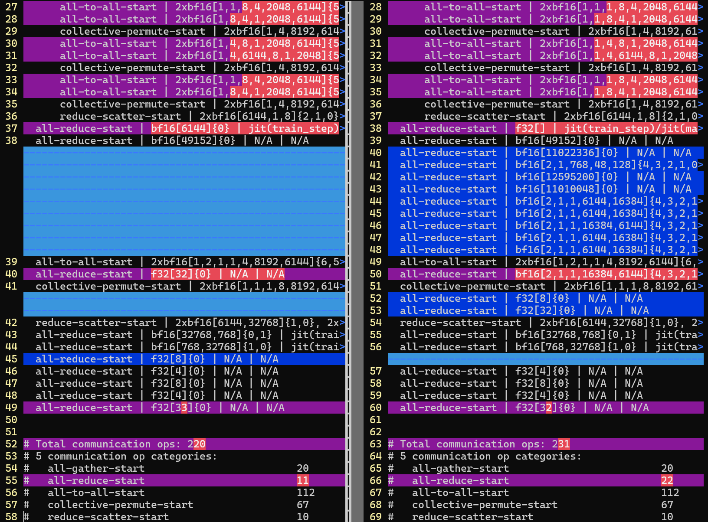
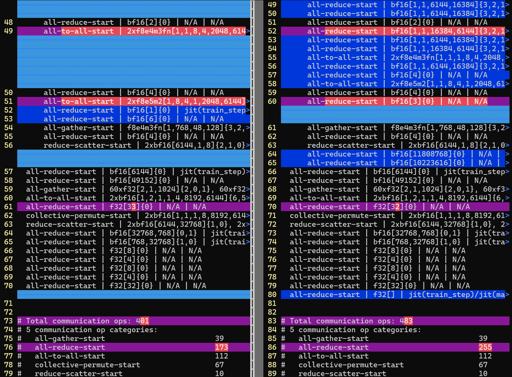

# IRLens

## IRLens_analyze_hlo_ir.py: HLO IR execution skeleton analyzer.

This tool parses an XLA HLO module text dump, starting from ENTRY, and prints a
hierarchical "execution skeleton" showing while-loops, conditionals, and
selected operation types (communication ops, computation ops, or both).

It strips away non-essential ops and keeps only the control-flow structure and
the relevant ops. All op_name metadata paths are printed in full.

```
USAGE:
    IRLens_analyze_hlo_ir.py <hlo_ir_dump.txt> [options]

OPTIONS:
    --op {all,communication,computation}
        Select which types of operations to display.
        all (default): show both communication and computation ops
        communication: show only communication ops (all-gather-start, reduce-scatter-start...)
        computation: show only computation ops (fusion kernels, custom-call GEMMs, etc.)

    --name
        Display result variable names and while loop names.

    --topology
        Display communication topology information such as replica_groups or
        source_target_pairs.

    --fusion-stats
        Show detailed fusion subtypes in the statistics summary (skeleton always
        shows the detailed subtype regardless).

EXAMPLES:
    # Show all ops in the skeleton (default)
    IRLens_analyze_hlo_ir.py hlo_ir_dump.txt

    # Show only communication ops (EXTREMELY USEFUL!!!)
    IRLens_analyze_hlo_ir.py hlo_ir_dump.txt --op communication

    # Show only computation ops
    IRLens_analyze_hlo_ir.py hlo_ir_dump.txt --op computation

    # Show name and topology fields
    IRLens_analyze_hlo_ir.py hlo_ir_dump.txt --name --topology

    # Break down fusion ops in statistics
    IRLens_analyze_hlo_ir.py hlo_ir_dump.txt --fusion-stats
```

## DEMO

You can run the following command:
```
./IRLens_analyze_hlo_ir.py examples/tiny-hlo.txt
```
The output may look like:
```
ENTRY %main.123:
  while i in range(10):
    %outer_loop.body:
      all-gather-start | f32[1024], f32[8192] | allgather_layer1 | /home/user/model.py:42
      while j in range(5):
        %inner_loop.body:
          reduce-scatter-start | f32[8192], f32[1024] | reduce_scatter_inner | /home/user/model.py:45
          all-reduce-start | f32[1024] | allreduce_inner | /home/user/model.py:47
      all-reduce-start | f32[8192] | allreduce_final | /home/user/model.py:50
      add | s32[] | N/A | N/A


# Total communication ops: 120
# 3 communication op categories:
#   all-gather-start                         10
#   all-reduce-start                         60
#   reduce-scatter-start                     50


# Total computation ops: 10
# 1 computation op categories:
#   add                                      10
```

## Showcase

A few real HLO IR files dumped from [MaxText](https://github.com/AI-Hypercomputer/maxtext) are provided in the [examples](examples/) directory.
You can analyze them with the following commands:
```
./IRLens_analyze_hlo_ir.py examples/debug-model.bf16.dcn-dp1_dcn-pp2_ici-ep8.jit_train_step.gfx950_gpu_after_optimizations.txt --op=communication > bf16-dp1.comm.txt
./IRLens_analyze_hlo_ir.py examples/debug-model.bf16.dcn-dp2_dcn-pp2_ici-ep8.jit_train_step.gfx950_gpu_after_optimizations.txt --op=communication > bf16-dp2.comm.txt
./IRLens_analyze_hlo_ir.py examples/debug-model.fp8.dcn-dp1_dcn-pp2_ici-ep8.jit_train_step.gfx950_gpu_after_optimizations.txt --op=communication > fp8-dp1.comm.txt
./IRLens_analyze_hlo_ir.py examples/debug-model.fp8.dcn-dp2_dcn-pp2_ici-ep8.jit_train_step.gfx950_gpu_after_optimizations.txt --op=communication > fp8-dp2.comm.txt

vimdiff bf16-dp1.comm.txt bf16-dp2.comm.txt
vimdiff fp8-dp1.comm.txt fp8-dp2.comm.txt
```
These diffs clearly highlight the **Data Parallel (DP) scaling behavior differences** currently in **MaxText** when using Pipeline Parallelism (PP) under `BF16` vs. `FP8`:
- With `BF16`, the gradient-reduction `all-reduce` ops are successfully hoisted **out of the backward pipelining loop**.

<p align="center"></p>

- With `FP8`, these `all-reduce` ops remain **inside the backward loop**, leading to significantly higher communication overhead.

<p align="center"></p>
